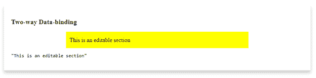
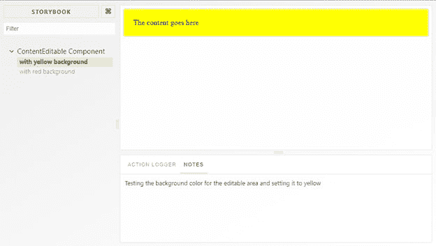
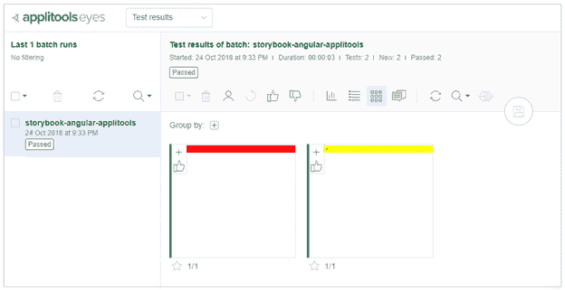
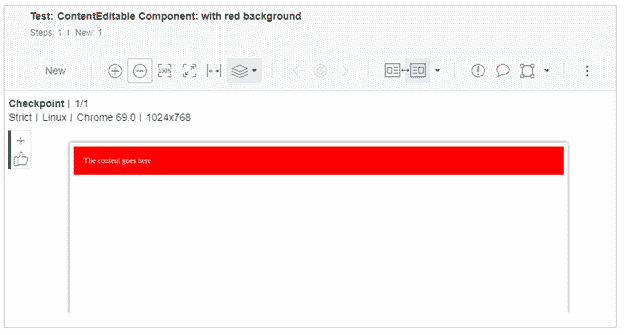
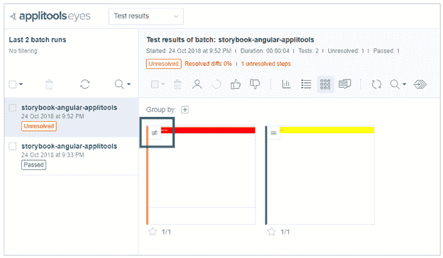
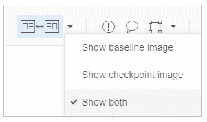

# 将故事书与 Angular 混合，并添加一些应用工具

> 原文：<https://dev.to/thisdotmedia/mixing-storybook-with-angular-with-a-sprinkle-of-applitools-33bl>

[](https://res.cloudinary.com/practicaldev/image/fetch/s--YRC8deKz--/c_limit%2Cf_auto%2Cfl_progressive%2Cq_auto%2Cw_880/https://cdn-images-1.medium.com/max/1600/1%2AQIVngeAg0WMqyb4wupevDw.jpeg)

为了更好地理解 appli tools story book SDK for Angular，我们将从头开始构建一个小型 Angular 应用程序，添加一些故事书故事，然后最后使用 Applitools SDK 执行可视化回归测试，以生成快照供我们查看和分析。

你可以通过点击链接[storybook-angular-appli tools](https://github.com/thisdot/storybook-angular-applitools)repo 在 GitHub 上找到这篇文章的源代码。

## 使用最新 CLI 创建 Angular 7 App

确保您安装了最新的 Angular CLI。在我的例子中，我将使用 Angular CLI v7.0.2。使用下面的 [npm](https://www.npmjs.com/) 命令创建一个新的 Angular 应用程序:

```
ng new storybook-angular-applitools 
```

## 
  
创建内容可编辑组件

我们将在本节中构建的 ContentEditable 组件包装了一个 HTML

element and adds an HTML attribute of [contenteditable=”true”](https://www.w3schools.com/tags/att_global_contenteditable.asp). The component implements the ControlValueAccessor so that the component can be used like any other Angular form control inside HTML forms.

```
<div contenteditable=”true”>This is an editable paragraph.</div> 
```

上面的 HTML 片段在浏览器中呈现为一个可编辑区域，用户可以单击并输入任何文本或 HTML。

创建一个新的组件文件，并将以下标记添加到**contenteditable.component.html**文件中:

```
<div 
 #container 
 [ngStyle]=”styles” 
 [innerHTML]=”contentValue” 
 (input)=”setContent($event)” 
 contenteditable=”true”>
 </div> 
```

接下来，将下面的代码添加到**content editable . component . ts**文件:

```
import { Component, ChangeDetectionStrategy, Input, forwardRef, OnChanges, SimpleChanges, ElementRef, Renderer2, ViewChild } from '@angular/core';
import { ControlValueAccessor, NG_VALUE_ACCESSOR } from '@angular/forms';

@Component({
  // tslint:disable-next-line:component-selector
  selector: 'editable',
  templateUrl: `./contenteditable.component.html`,
  styles: [],
  changeDetection: ChangeDetectionStrategy.OnPush,
  providers: [
    {
      provide: NG_VALUE_ACCESSOR,
      useExisting: forwardRef(() => ContentEditableComponent),
      multi: true
    }
  ],

})
export class ContentEditableComponent
  implements ControlValueAccessor, OnChanges {
  @ViewChild('container') container;
  private _styles: any;
  private _contentValue: any;

  propagateChange: (value: any) => void = () => {};

  @Input()
  set styles(style: any) {
    this._styles = style;
  }

  get styles(): any {
    return this._styles;
  }

  get contentValue(): any {
    return this._contentValue;
  }

  set contentValue(val: any) {
    if (this._contentValue !== val) {
      this._contentValue = val;
      this.propagateChange(val);
    }
  }

  writeValue(value: any) {
    if (value !== this._contentValue) {
      this.contentValue = value;
    }
  }

  registerOnChange(fn: (value: any) => void) {
    this.propagateChange = fn;
  }

  registerOnTouched(fn: () => void) {}

  setContent($event: any): void {
    // this._contentValue = $event.target.innerHTML;
    this.propagateChange($event.target.innerHTML);
  }

  ngOnChanges(changes: SimpleChanges): void {}
} 
```

该组件非常简单，并且遵循构建 ControlValueAccessor 的最佳实践。它定义了一个单独的 [@Input()](https://angular.io/api/core/Input) 属性，允许该组件的使用者控制其样式。

如果你想完全理解 ControlValueAccessor 在 Angular 中是如何工作的，看看 Max 的文章标题为[在 Angular](https://blog.angularindepth.com/never-again-be-confused-when-implementing-controlvalueaccessor-in-angular-forms-93b9eee9ee83) 中实现 ControlValueAccessor 时不要再混淆。

接下来，将以下 HTML 片段添加到**app.component.html**文件中:

```
<section class="section">
 <h2>Two-way Data-binding</h2>
 <editable name="editable2" [styles]="styles()" [(ngModel)]="content1"></editable>
 <pre>{ content1 | json }</pre>
</section> 
```

在 AppComponent 类中定义 **styles()** 方法:

```
styles() {
 return {
  "background-color": "yellow",
   margin: "10px auto",
  "max-width": "60%",
  "line-height": "25px",
  padding: "10px"
 };
} 
```

现在运行应用程序。您应该会在下面看到类似的内容。

[](https://res.cloudinary.com/practicaldev/image/fetch/s--DDuy0cg2--/c_limit%2Cf_auto%2Cfl_progressive%2Cq_auto%2Cw_880/https://cdn-images-1.medium.com/max/2000/1%2ApFhETPGvj9JNtRc4a_wVQg.png)

您可以开始在黄色的可编辑矩形中键入，您将看到您在下面键入的任何内容。

让我们换个方式，将故事书添加到应用程序中。

## 添加故事书包

我们需要将 Angular 的故事书添加到您的应用程序中。故事书网站为 Angular 提供了关于[故事书的详细安装指南。安装后，应用以下更改，以便 Storybook 可以在 Angular 7 应用程序中正确运行。](https://storybook.js.org/basics/guide-angular/)

打开**src/app/ts config . app . JSON**文件，确保 **exclude** 属性的值为:

```
"exclude": [
  "test.ts",
  "**/*.spec.ts",
  "stories"
 ] 
```

打开**。storybook/tsconfig.json** 文件并粘贴以下内容:

```
{
 "extends": "../src/tsconfig.app.json",
 "compilerOptions": {
    "types": [
    "node"
  ]
 },
 "exclude": [
    "../src/test.ts",
    "../src/**/*.spec.ts",
    "../projects/**/*.spec.ts"
 ],
 "include": [
    "../src/**/*",
    "../projects/**/*"
 ]
} 
```

## 创建并运行几个故事书故事

将以下故事书故事添加到位于**src/app/stories/index . stories . ts**的文件中:

```
storiesOf('ContentEditable Component', module)
 .add(
   'with yellow background',
   withNotes('Testing the background color for the editable area and setting it to yellow')(() => ({
     component: ContentEditableComponent,
     props: {
       styles: { 'background-color': 'yellow', 'padding': '20px' },
       ngModel: 'The content goes here',
       ngModelChange: action('ngModelChange')
     }
   }))
 )
 .add(
   'with red background',
   withNotes('Testing the background color for the editable area by setting it to red')(() => ({
     component: ContentEditableComponent,
     props: {
       styles: { 'background-color': 'red', 'color': '#fff', 'padding': '20px' },
       ngModel: 'The content goes here',
       ngModelChange: action('ngModelChange')
     }
   }))
 ); 
```

第一个故事用黄色背景呈现了 ContentEditable 组件。而第二个用**红色**背景渲染组件。

通过发出以下 CLI 命令，运行 Storybook 工具来查看和测试您的故事:

```
npm run storybook 
```

您应该能够看到类似这样的内容:

[](https://res.cloudinary.com/practicaldev/image/fetch/s--VKV02m0v--/c_limit%2Cf_auto%2Cfl_progressive%2Cq_auto%2Cw_880/https://cdn-images-1.medium.com/max/2000/1%2AEppbFXA4I1q3dM6pMJXygQ.png)

既然我们已经确定故事书故事已经建立并运行了，那么让我们设置 Applitools 来使用这些故事并运行我们的可视化自动化测试。

## 添加并运行 appli tools Storybook SDK for Angular

要将 appli tools story book SDK for Angular 添加到此应用程序，请发出以下 CLI 命令:

```
npm install @applitools/eyes.storybook --save-dev 
```

确保获取一个 [Applitool API 密钥](https://applitools.com/tutorials/storybook-angular.html#how-it-works)并将其存储在您的机器上。关于如何安装和运行 appli tools Storybook SDK for Angular 的完整教程，你可以查看这个链接: [Storybook Angular 教程](https://applitools.com/tutorials/storybook-angular.html#how-it-works)。

要运行故事书故事并将快照发送到 Applitools 服务器，请发出以下命令:

```
npx [eyes-storybook](https://github.com/applitools/eyes.storybook) 
```

该命令只需打开故事书故事，一个接一个地运行它们，然后将所有 DOM 快照发送到 Applitools 服务器。让我们看看 Applitools 测试管理器中的测试结果。

## 在 Applitools 测试管理器上查看测试结果

我们可以从 Applitools 测试管理器中看到我们刚刚运行的测试的结果。要访问 Applitools 测试管理器，导航至[https://www.applitools.com](https://www.applitools.com)。登录以进入仪表板。要详细了解 Applitools 测试管理器，您可以查看我关于 [Applitools 的文章——自动化可视化回归测试框架](https://medium.com/@thisdotmedia/applitools-the-automated-visual-regression-testing-framework-18ebada47977)

运行故事书测试的结果显示如下:

[](https://res.cloudinary.com/practicaldev/image/fetch/s--ZGyNBLvE--/c_limit%2Cf_auto%2Cfl_progressive%2Cq_auto%2Cw_880/https://cdn-images-1.medium.com/max/2000/1%2At_0-_CZHNtl4iibupPJ1eA.png)

测试管理器在左侧列出了测试运行或批次(由 Applitools 引用)。单击任何一个批处理都会显示应用程序中所有故事书故事的所有快照。

单击第一个快照(红色)以展开并详细查看:

[](https://res.cloudinary.com/practicaldev/image/fetch/s---rFgDjaC--/c_limit%2Cf_auto%2Cfl_progressive%2Cq_auto%2Cw_880/https://cdn-images-1.medium.com/max/2000/1%2Aw4SgCd5rQzbwCR7bYsDG3g.png)

丰富的工具箱可用于放大/缩小快照，并将该快照与之前拍摄的任何快照进行比较，称为[基线](https://help.applitools.com/hc/en-us/articles/360007188691-What-is-a-baseline-and-how-is-a-baseline-created-)。在这种情况下，因为这是我们第一次运行这些故事，所以不会设置任何基线。因此，Applitools 测试管理器将这些快照设置为即将到来的回归测试周期的基线。

接下来，我们将模拟在我们的一个组件中进行可视化回归时会发生什么。为了最容易地做到这一点，我们将更改我们的一个故事书故事，以不同于我们之前拍摄的基线图像的方式呈现我们的组件。然后，当我们重新运行可视化测试时，我们应该会看到一个需要解决的差异。

为此，让我们假设上面红色背景中名为**的故事的 **ngModel** 值已经更改，现在显示如下:** 

```
.add(
  'with red background',
  withNotes('Testing the background color for the editable area by setting it to red')(() => ({
    component: ContentEditableComponent,
    props: {
      styles: { 'background-color': 'red', 'color': '#fff', 'padding': '20px' },
      ngModel: 'The red content goes here',
      ngModelChange: action('ngModelChange')
    }
  }))
 ) 
```

现在运行这个命令:

```
npx eyes-storybook 
```

每次运行该命令时，它都会给出详细的测试结果。检查以下结果:

使用@applitools/eyes.storybook 版本 2.1.9。

```
√ Storybook was started
√ Reading stories
√ Done 2 stories out of 2

[EYES: TEST RESULTS]:

ContentEditable Component: with yellow background [1024x768] — Passed

ContentEditable Component: with red background [1024x768] — Failed 1 of 1

A total of 1 difference was found.

See details at [https://eyes.applitools.com/app/test-results/00000251861893628194?accountId=D9XKRBVuYUmBxXpWWWsB3g~~](https://eyes.applitools.com/app/test-results/00000251861893628194?accountId=D9XKRBVuYUmBxXpWWWsB3g~~)

Total time: 36 seconds 
```

正如所料，运行第二个故事失败了，因为我们更改了最初显示在 ContentEditable 组件中的内容。测试结果输出为您提供了一个在线检查差异的链接。点击链接，直接在 Applitools 测试管理器中打开问题:

[](https://res.cloudinary.com/practicaldev/image/fetch/s--aLHgL5Mv--/c_limit%2Cf_auto%2Cfl_progressive%2Cq_auto%2Cw_880/https://cdn-images-1.medium.com/max/2000/1%2Av3fmPie91oW75Xvc59PJKg.png)

新批次显示在左侧，状态为**未解决**。未解决的状态表明 Applitools 测试管理器发现了两次测试运行之间的差异。这将需要您的输入来解决差异。要么批准该差异并创建新基线，要么拒绝该差异以保留原始基线。

注意上面的蓝色方块表示**不等于**符号。这意味着第二次快照测试运行与第一次测试运行快照(基线)有一些不同。单击第一个快照可以发现两个快照之间的差异。当前的和基线的。内容上的差异用蓝色突出显示。您还可以通过选择以下两项来比较新快照和基线:

[](https://res.cloudinary.com/practicaldev/image/fetch/s--HNHfx-Ad--/c_limit%2Cf_auto%2Cfl_progressive%2Cq_auto%2Cw_880/https://cdn-images-1.medium.com/max/2000/1%2A79K8ehcwVaxO_LPuLWM-OQ.png)

这应该会并排显示两者，并为您突出显示所有差异。您可以在 Applitools 测试管理器上花更多的时间来探索为您提供的所有丰富的特性，以便在运行故事测试时进行彻底的分析。

## 结论

这篇文章触及了如何在一个应用程序中将 Storybook 和 Angular 结合在一起的表面。通过 appli tools story book SDK for Angular，您可以通过运行 Storybook stories 来提供自动化的可视化 UI 测试，并生成快照，然后将这些快照发送到 Applitools AI 服务器进行比较和分析，并为您准备测试结果。

您可以通过在 [GitHub](https://github.com/bhaidar/storybook-angular-applitools.git) 上克隆存储库来获取本文的代码。

*这篇文章是由[比拉勒·海达尔](https://www.twitter.com/bhaidar)写的，他是[这个圆点](http://thisdot.co/labs)的导师。*

需要 JavaScript 咨询、指导或培训帮助吗？在 [This Dot Labs](//thisdot.co) 查看我们的服务列表。