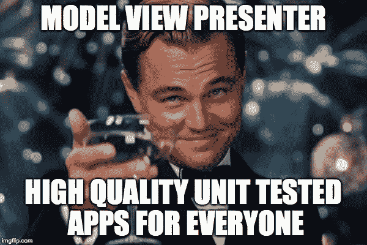

# iOS 上的模型视图演示者:不要再找借口了，写你的单元测试吧

> 原文：<https://dev.to/chicio/model-view-presenter-on-ios-no-more-excuses-write-your-unit-test-4cki>

在这篇文章中，我将讨论 model view presenter 架构模式，以及在开发 iOS 应用程序时，它如何改进您的单元测试和 TDD 工作流程。

iOS 应用中的单元测试在某种程度上是“硬”的。iOS 上默认实现的架构模式是[模型视图控制器](https://en.wikipedia.org/wiki/Model%E2%80%93view%E2%80%93controller)。这种架构为您提供了 UI 和业务逻辑之间的清晰分离。
问题在于，大多数时候你不得不与“大规模视图控制器”斗争，它们是模型和大量 UI/视图代码之间的粘合剂，因此不容易测试。这基本上意味着大多数时候[表现逻辑](https://en.wikipedia.org/wiki/Presentation_logic)，即业务模型如何在用户界面中显示给用户，是以错误的方式测试的，或者最糟糕的是它没有被测试。

这就是[模型视图演示者](https://en.wikipedia.org/wiki/Model%E2%80%93view%E2%80%93presenter)能够拯救我们的地方。在这个架构模式中，所有的*表示逻辑都从视图控制器转移到一个新的组件——表示器*。这意味着它将管理*模型对象*来检索数据，然后准备由*视图显示，这将是我们的视图控制器*。该界面成为被动界面，只负责在特定的平台用户界面组件中显示演示者返回的数据。通过这种方式，表示器是一个没有任何平台特定依赖性的组件，它只在视图和其他模型对象上工作，在构造时注入。通过这种方式，所有的依赖都可以被模仿，你可以对基本上所有的东西进行单元测试！！☺️
！😁我们将创建一个简单的应用程序，在一个`UITableView`中显示产品列表。点击一个单元格，显示产品详细信息。如果在检索产品时出现错误，或者当产品不包含显示其详细信息所需的所有数据时，将显示错误。

我们将使用[测试驱动开发](https://en.wikipedia.org/wiki/Test-driven_development)技术开发这个应用程序，我将展示为每个实现的类创建的单元测试。这些单元测试也将使用[“给定-然后-当”](https://en.wikipedia.org/wiki/Given-When-Then)结构编写，通常用于[行为驱动开发](https://en.wikipedia.org/wiki/Behavior-driven_development)。即使与本文无关，我也喜欢这种编写单元测试的方式，因为它们更具表现力，所以我将在我的所有代码中使用它。下面你可以找到我们想要实现的样机。

[](/asseimg/posts/mockup-model-view-presenter.jpg)

让我们首先创建一个用于描述我们产品的`Product`结构。每个产品将由一个名称、一个描述和一个图像(由其名称识别):

```
public struct Product {
    let name: String
    let description: String
    let image: String

    public init(name: String, description: String, image: String) {
        self.name = name
        self.description = description
        self.image = image
    }
} 
```

Enter fullscreen mode Exit fullscreen mode

将使用[存储库](https://martinfowler.com/eaaCatalog/repository.html)来检索产品对象。首先我们需要定义一个`Repository`协议。一般来说，我们将尝试为所有的类定义一个协议，这样我们就可以使用抽象(而不是具体的实现)来获得类之间的最高解耦。最后但并非最不重要的(也许是最重要的)通过使用协议，我们将能够在单元测试中生成一些组件的模拟/间谍。

```
public protocol Repository {
    func get(finish: @escaping ([Product]?) -> Void)
} 
```

Enter fullscreen mode Exit fullscreen mode

在我们的例子中，存储库不会从真实的数据源或使用服务来检索数据。所有数据都将从存储库中的本地阵列中检索。这是我们知识库的最终实现:

```
public class ProductsRepository: Repository {

    public func get(finish: @escaping ([Product]?) -> Void) {
        DispatchQueue.main.asyncAfter(deadline: .now() + .milliseconds(3000)) {
            let products = [
                Product(name: "Car", description: "A beautiful car", image: "car"),
                Product(name: "Book", description: "", image: "book")
            ]
            finish(products)
        }
    }
} 
```

Enter fullscreen mode Exit fullscreen mode

即使超出了我们的范围，您也可以在下面找到我们的`ProductsRepository`的单元测试。它们很有趣，因为你可以找到一个带有期望的单元测试的例子(这是迟早要讨论的另一件事😜).

```
class ProductsRepositoryTests: XCTestCase {
    private var productsRepository: ProductsRepository!

    func testProductsRetrieved() {
        givenAProductsRepository()
        whenTheRepositoryTryToRetrieveProducts { [unowned self] products, repositoryExpectation in
            self.thenTheProductsListIsRetrieved(products: products,
                                                expectation: repositoryExpectation)
        }
        thenTheRepositoryFinishedToTryToRetrieve()
    }

    private func givenAProductsRepository() {
        productsRepository = ProductsRepository()
    }

    func whenTheRepositoryTryToRetrieveProducts(finish: @escaping ([Product]?, XCTestExpectation) -> Void) {
        let repositoryExpectation = expectation(description: "RepositoryExpectation")
        productsRepository.get { products in
            finish(products, repositoryExpectation)
        }
    }

    private func thenTheProductsListIsRetrieved(products: [Product]?, expectation: XCTestExpectation) {
        XCTAssertNotNil(products)
        XCTAssertTrue(products!.count > 0)
        expectation.fulfill()
    }

    private func thenTheRepositoryFinishedToTryToRetrieve() {
        waitForExpectations(timeout: 10) { error in
            if let error = error {
                XCTFail("Repository finish() not called: \(error)")
            }
        }
    }
} 
```

Enter fullscreen mode Exit fullscreen mode

现在是时候开发我们的`ProductsPresenter`演示者了。它将需要一个视图，它将把真正的用户界面操作
和存储库委托给这个视图来检索产品数据。它将负责管理:

*   **在**中查看`onStart()`的开始方法。在这个方法中，我们将不得不更新视图以显示加载状态(这将是视图实现中的一个`UIActivityIndicator`),然后尝试从存储库中检索产品并在视图上显示它们，如果一切顺利的话。如果出现问题，在视图上显示错误消息。在任何情况下，它还需要在检索操作完成后隐藏加载状态。
*   **中的显示细节动作`onSelected(product: Product)`方法。在这个方法中，我们必须检查所有的产品数据是否正确，在我们的例子中，这意味着产品必须有一个有效的产品。如果有效，在视图中显示它的详细信息，否则显示错误消息。**

 **我们从定义协议`ProductView`开始，它包含了我们的演示者将要使用的视图的所有有效操作:

```
public protocol ProductsView: class {
    func showLoadingStatus()
    func hideLoadingStatus()
    func show(title aTitle: String)
    func show(products: [Product])
    func showErrorWith(message: String)
    func showDetailFor(product: Product)
} 
```

Enter fullscreen mode Exit fullscreen mode

现在我们准备好继续进行`ProductsPresenter`实现:

```
public class ProductsPresenter {
    private unowned let productsView: ProductsView
    private let productsRepository: Repository

    public init(productsView: ProductsView, productsRepository: Repository) {
        self.productsView = productsView
        self.productsRepository = productsRepository
    }

    public func onStart() {
        productsView.show(title: "Products")
        productsView.showLoadingStatus()
        productsRepository.get { [unowned self] retrievedProducts in
            self.tryToShow(retrievedProducts: retrievedProducts)
            self.productsView.hideLoadingStatus()
        }
    }

    private func tryToShow(retrievedProducts: [Product]?) {
        if let products = retrievedProducts {
            productsView.show(products: products)
        } else {
            productsView.showErrorWith(message: "No products available")
        }
    }

    public func onSelected(product: Product) {
        if product.description != "" {
            productsView.showDetailFor(product: product)
        } else {
            productsView.showErrorWith(message: "Product without description")
        }
    }
} 
```

Enter fullscreen mode Exit fullscreen mode

在 TDD 中开发这样一个类很容易，因为我们可以模仿它的每一个依赖项，我们可以详细测试所有的表示流程。我们的演示者的单元测试如下所示。*你可以注意到，很多手工制作的模拟对象被使用，但这里没有报道(你会在本文最后报道的 Github 上的完整项目中找到它们)*。

```
class ProductsPresenterTests: XCTestCase {
    private var productsRepositoryWithProducts: ProductsRepositoryWithProductsSpy!
    private var productsRepositoryWithoutProducts: ProductsRepositoryWithoutProductsSpy!
    private var productsView: ProductsViewSpy!
    private var productPresenter: ProductsPresenter!

    func testOnStartWithProducts() {
        givenAProductsRepositoryWithProducts()
        givenAProductsView()
        givenAProductsPresenterWith(repository: productsRepositoryWithProducts)
        whenTheProductsPresenterStarts()
        thenTheTitleIsDisplayed()
        thenTheProductViewShowsLoadingStatus()
        thenTryToRetrieveProduct()
        thenTheProductViewHidesLoadingStatus()
        thenTheProductsViewShowsTheProducts()
    }

    func testOnStartWithoutProducts() {
        givenAProductsRepositoryWithoutProducts()
        givenAProductsView()
        givenAProductsPresenterWith(repository: productsRepositoryWithoutProducts)
        whenTheProductsPresenterStarts()
        thenTheTitleIsDisplayed()
        thenTheProductViewShowsLoadingStatus()
        thenTryToRetrieveProductFromEmptyRepository()
        thenTheProductViewHidesLoadingStatus()
        thenTheProductsViewShowsAnErrorMessage()
    }

    func testOnProductWithDescriptionSelected() {
        givenAProductsRepositoryWithProducts()
        givenAProductsView()
        givenAProductsPresenterWith(repository: productsRepositoryWithProducts)
        whenAProductWithDescriptionIsSelected()
        thenTheProductDetailIsShown()
    }

    func testOnProductWithoutDescriptionSelected() {
        givenAProductsRepositoryWithProducts()
        givenAProductsView()
        givenAProductsPresenterWith(repository: productsRepositoryWithProducts)
        whenAProductWithoutDescriptionIsSelected()
        thenTheProductsViewShowsAnErrorMessage()
    }

    private func givenAProductsRepositoryWithProducts() {
        productsRepositoryWithProducts = ProductsRepositoryWithProductsSpy()
    }

    private func givenAProductsRepositoryWithoutProducts() {
        productsRepositoryWithoutProducts = ProductsRepositoryWithoutProductsSpy()
    }

    private func givenAProductsView() {
        productsView = ProductsViewSpy()
    }

    private func givenAProductsPresenterWith(repository: Repository) {
        productPresenter = ProductsPresenter(productsView: productsView, productsRepository: repository)
    }

    private func whenTheProductsPresenterStarts() {
        productPresenter.onStart()
    }

    func whenAProductWithDescriptionIsSelected() {
        productPresenter.onSelected(product: Product(name: "Car",
                                                     description: "A beautiful car",
                                                     image: "car"))
    }

    func whenAProductWithoutDescriptionIsSelected() {
        productPresenter.onSelected(product: Product(name: "Car",
                                                     description: "",
                                                     image: "car"))
    }

    private func thenTheTitleIsDisplayed() {
        XCTAssertTrue(productsView.showTitleHasBeenCalled)
    }

    private func thenTryToRetrieveProduct() {
        XCTAssertTrue(productsRepositoryWithProducts.getHasBeenCalled)
    }

    private func thenTheProductViewShowsLoadingStatus() {
        XCTAssertTrue(productsView.showLoadingStatusHasBeenCalled)
    }

    private func thenTheProductViewHidesLoadingStatus() {
        XCTAssertTrue(productsView.hideLoadingStatusHasBeenCalled)
    }

    private func thenTheProductsViewShowsTheProducts() {
        XCTAssertTrue(productsView.showProductsHasBeenCalled)
    }

    private func thenTryToRetrieveProductFromEmptyRepository() {
        XCTAssertTrue(productsRepositoryWithoutProducts.getHasBeenCalled)
    }

    private func thenTheProductsViewShowsAnErrorMessage() {
        XCTAssertTrue(productsView.showsErrorMessageHasBeenCalled)
    }

    private func thenTheProductDetailIsShown() {
        XCTAssertTrue(productsView.showDetailForProductHasBeenCalled)
    }
} 
```

Enter fullscreen mode Exit fullscreen mode

很容易看出，我们的演示者的单元测试描述了整个演示流程。这基本上意味着我们的单元测试是我们表示逻辑的文档。酷！！！！😎现在下一个大问题是:谁来实现我们的`ProductsView`协议？正如我们在介绍中所说的，我们的视图控制器成为模型视图呈现器架构中的视图。它们充当被动的特定于平台的用户界面组件更新程序。这意味着我们的协议将在`ProductsViewController`之前实现。它有责任在适当的时候发起`ProductsPresenter`行动，实现所有真正被动的用户界面更新操作。
特别是，我们将在`viewDidLoad`和`onSelected(product: Product)`中调用我们的`onStart()` presenter 方法，当点击一个产品单元格时，这意味着已经选择了一个产品。最终的实现将是:

```
class ProductsViewController: UIViewController, UITableViewDataSource, UITableViewDelegate, ProductsView {
    @IBOutlet weak var productsTableView: UITableView!
    @IBOutlet weak var productsLoadingView: UIView!
    @IBOutlet weak var productsActivityIndicator: UIActivityIndicatorView!
    private var productsList: [Product]!
    private var productSelected: Product!
    private var productsRepository: ProductsRepository!
    private var productsPresenter: ProductsPresenter!

    override func viewDidLoad() {
        super.viewDidLoad()
        initializeDependencies()
        productsPresenter.onStart()
    }

    private func initializeDependencies() {
        productsList = []
        productsRepository = ProductsRepository()
        productsPresenter = ProductsPresenter(productsView: self, productsRepository: productsRepository)
    }

    //MARK: ProductsView

    public func show(title aTitle: String) {
        title = aTitle
    }

    public func showLoadingStatus() {
        productsActivityIndicator.startAnimating()
        productsLoadingView.isHidden = false
    }

    public func hideLoadingStatus() {
        productsActivityIndicator.stopAnimating()
        productsLoadingView.isHidden = true
    }

    public func show(products: [Product]) {
        productsList = products
        productsTableView.reloadData()
    }

    public func showErrorWith(message: String) {
        let alert = UIAlertController(title: "Error", message: message, preferredStyle: .alert)
        alert.addAction(UIAlertAction(title: "Ok", style: .default, handler: { [unowned self] action in
            self.dismiss(animated: true, completion: nil)
        }))
        present(alert, animated: true, completion: nil)
    }

    public func showDetailFor(product: Product) {
        productSelected = product
        performSegue(withIdentifier: "ShowProductDetail", sender: nil)
    }

    //MARK: Segue

    override func prepare(for segue: UIStoryboardSegue, sender: Any?) {
        if let productDetailViewController = segue.destination as? ProductDetailViewController {
            productDetailViewController.product = productSelected
        }
    }

    //MARK: UITableView Datasource

    func tableView(_ tableView: UITableView, numberOfRowsInSection section: Int) -> Int {
        return productsList.count
    }

    func tableView(_ tableView: UITableView, cellForRowAt indexPath: IndexPath) -> UITableViewCell {
        let cell = tableView.dequeueReusableCell(withIdentifier: "ProductCell", for: indexPath)
        cell.textLabel?.text = productsList[indexPath.row].name
        return cell
    }

    //MARK: UITableView Delegate

    public func tableView(_ tableView: UITableView, didSelectRowAt indexPath: IndexPath) {
        productsPresenter.onSelected(product: productsList[indexPath.row])
    }
} 
```

Enter fullscreen mode Exit fullscreen mode

您不需要对控制器进行单元测试:表示器单元测试确保我们的表示逻辑是预期的那个
。视图控制器只更新 iOS 特定的用户界面组件(我们希望苹果为我们测试过)😏).
以我们开发这个组件的同样方式，我们可以通过首先定义一个`ProductDetailView` :
来实现我们的产品细节

```
public protocol ProductDetailView: class {
    func show(title aTitle: String)
    func show(product: Product)
    func showErrorWith(message: String)
} 
```

Enter fullscreen mode Exit fullscreen mode

然后是我们的`ProductDetailPresenter`展示员，负责检查是否收到了要展示的有效产品:

```
public class ProductDetailPresenter {
    private unowned let productDetailView: ProductDetailView
    private let product: Product?

    public init(productDetailView: ProductDetailView, product: Product?) {
        self.productDetailView = productDetailView
        self.product = product
    }

    public func onStart() {
        productDetailView.show(title: "Product")
        if let product = product {
            productDetailView.show(product: product)
        } else {
            productDetailView.showErrorWith(message: "Product not valid")
        }
    }
} 
```

Enter fullscreen mode Exit fullscreen mode

其单元测试将是:

```
class ProductDetailPresenterTests: XCTestCase {
    private var productDetailPresenter: ProductDetailPresenter!
    private var productDetailView: ProductDetailViewSpy!

    func testShowDetailOfAProduct() {
        givenAProductDetailView()
        givenAProductDetailPresenterWith(product: Product(name: "aProduct",
                                                          description: "aDescription",
                                                          image: "image"))
        whenThePresenterStarts()
        thenTheTitleIsDisplayed()
        thenTheProductDetailIsShown()
    }

    func testShowDetailOfAnInvalidProduct() {
        givenAProductDetailView()
        givenAProductDetailPresenterWith(product: nil)
        whenThePresenterStarts()
        thenTheTitleIsDisplayed()        
        thenAnErrorMessageIsDisplayed()
    }

    private func givenAProductDetailView() {
        productDetailView = ProductDetailViewSpy()
    }

    private func givenAProductDetailPresenterWith(product: Product?) {
        productDetailPresenter = ProductDetailPresenter(productDetailView: productDetailView, product: product)
    }

    private func whenThePresenterStarts() {
        productDetailPresenter.onStart()
    }

    private func thenTheTitleIsDisplayed() {
        XCTAssertTrue(productDetailView.showTitleHasBeenCalled)
    }

    private func thenTheProductDetailIsShown() {
        XCTAssertTrue(productDetailView.showProductHasBeenCalled)
    }

    private func thenAnErrorMessageIsDisplayed() {
        XCTAssertTrue(productDetailView.showErrorHasBeenCalled)
    }
}

....

class ProductDetailViewSpy: ProductDetailView {
    private(set) var showTitleHasBeenCalled: Bool = false
    private(set) var showProductHasBeenCalled: Bool = false
    private(set) var showErrorHasBeenCalled: Bool = false

    func show(title aTitle: String) {
        showTitleHasBeenCalled = true
    }

    func show(product: Product) {
        showProductHasBeenCalled = true
    }

    func showErrorWith(message: String) {
        showErrorHasBeenCalled = true
    }
} 
```

Enter fullscreen mode Exit fullscreen mode

最后，我们的`ProductDetailViewController`是这个应用程序部分的视图控制器:

```
class ProductDetailViewController: UIViewController, ProductDetailView {
    @IBOutlet weak var nameLabel: UILabel!
    @IBOutlet weak var descriptionLabel: UILabel!
    @IBOutlet weak var imageView: UIImageView!
    var product: Product!
    private var productDetailPresenter: ProductDetailPresenter!

    override func viewDidLoad() {
        super.viewDidLoad()
        initializeDependencies()
        productDetailPresenter.onStart()
    }

    private func initializeDependencies() {
        productDetailPresenter = ProductDetailPresenter(productDetailView: self, product: product)
    }

    //MARK: ProductDetailView

    public func show(title aTitle: String) {
        title = aTitle
    }

    public func show(product: Product) {
        nameLabel.text = product.name
        descriptionLabel.text = product.description
        imageView.image = UIImage(named: product.image)
    }

    public func showErrorWith(message: String) {
        let alert = UIAlertController(title: "Error", message: message, preferredStyle: .alert)
        alert.addAction(UIAlertAction(title: "Ok", style: .default, handler: { [unowned self] action in
            self.dismiss(animated: true, completion: nil)
        }))
        present(alert, animated: true, completion: nil)
    }
} 
```

Enter fullscreen mode Exit fullscreen mode

是的，你做到了！！你在这个永无止境的帖子的末尾😆！！现在你可以开始创建你的高质量单元测试应用了😌。
关于上述实现的最后一个注意事项:**`ProductsPresenter`的`productsView`属性和`ProductDetailPresenter`的`productDetailView`属性必须是`unowned`或`weak`，以避免呈现者和控制器之间的保持循环。**

[](https://res.cloudinary.com/practicaldev/image/fetch/s--73XZzc19--/c_limit%2Cf_auto%2Cfl_progressive%2Cq_auto%2Cw_880/https://www.fabrizioduroni.it/asseimg/posts/model-view-presenter-ios.jpg)

是时候在你的项目中亲自尝试一下了。如果你想查看完整的项目代码，你可以查看这个 Github 库。

*原载于[https://www . fabrizioduroni . it](https://www.fabrizioduroni.it/2017/08/11/model-view-presenter-architecture-ios-swift-unit-test.html)2017 年 8 月 11 日。***