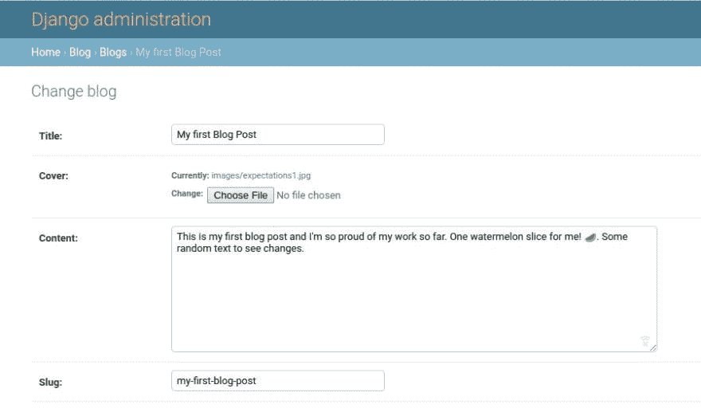
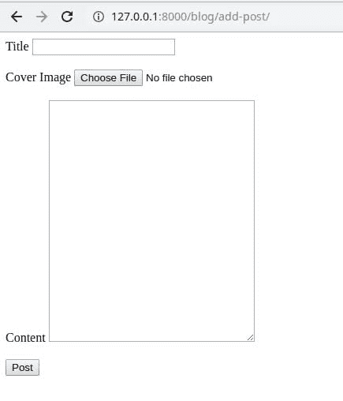
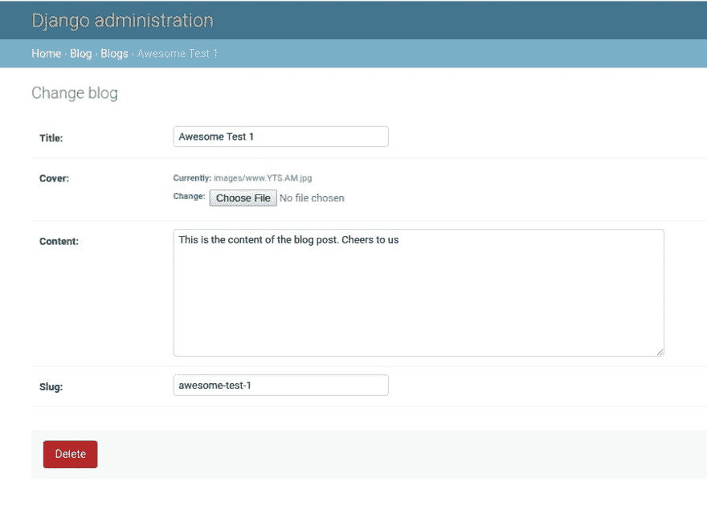

# 模型、视图、模板-第 5 课

> 原文：<https://dev.to/jonathanfarinloye/models-views-templates-lesson-5-266n>

1.  [简介](#introduction)
2.  [模板到视图到模型](#t-v-m)
3.  [从模型中显示](#displaying-from-models)

## 简介

在上一篇文章中，我们讨论了如何在我们的博客应用程序中创建博客模型。这个模型包含一个标题、一个封面图像、一个日期字段、一个内容字段和一个 slug 字段。在所有这些字段中，我们将处理标题、封面图像和内容字段，并与之进行交互。我们还将设置日期字段自动设置为我们的博客帖子的最后更新日期，并根据标题自动设置 slug。我认为这是一个很好的开始。🤔

移动到您的 ***blog/models.py*** 文件，编辑名为 ***raw_date*** 的字段。还将 ***保存*** 函数添加到该类中。

```
# blog/models py from django.template.defaultfilters import slugify # a django module to take care of creating slugs class Blog(models.Model):
...
    raw_date = models.DateTimeField(auto_now=True)
...
    def save(self, *args, **kwargs):
        self.slug = slugify(self.title)
        return super(Blog, self).save(*args, **kwargs)
... 
```

> 当参数 **auto_now** 设置为 **True** 时，每次编辑和保存模型时，自动将日期设置为最新日期。
> 还要注意，我们添加的函数必须命名为 **save** 才能工作，因为它扩展了原来内置的 save 函数。

不要忘记 ***进行迁移*** 和 ***迁移*** 您的更改。请随意测试它，以确保它的工作。如果您检查管理站点，您将再也找不到日期字段。这是因为它是自动设置的。

<figure>[](https://res.cloudinary.com/practicaldev/image/fetch/s--JWKxaBb_--/c_limit%2Cf_auto%2Cfl_progressive%2Cq_auto%2Cw_880/https://thepracticaldev.s3.amazonaws.com/i/ftc9swldsdshi52f979f.jpg) 

<figcaption>枣被一只饥饿的松鼠吃掉了🐿️</figcaption>

</figure>

## 模板到视图到模型

不要被长标题搞糊涂了。其实没那么严重😉。或者是🤔？开玩笑的。更严重的是，我们的主要目标是允许从前端创建博客帖子，为此，我们基本上只需要一个表单，其中包含我们创建的模型的字段，自动填充的字段除外(我要说的是填充字段)。所以我们需要创建一个 HTML 文件来保存表单(我们现在真的不关心样式了。不过，你可以随心所欲地设计自己的风格。

移动到你的 ***博客*** 应用，如果你还没有的话，创建一个 ***模板*** 目录。接下来，创建一个文件，我将它命名为 mine ***add-blog*** 。于是，***blog/templates/add-blog . html***。让我们转到我们的 ***views.py*** 并为我们的添加博客页面创建函数。

```
...
# blog/views.py from django.shortcuts import render, redirect
...
def add_blog_post(request):
    return render(request, 'add-blog.html') 
```

> 现在，我们只是返回 html 文档

我们需要在博客应用程序中创建一个 ***urls.py*** 文件，并将该文件链接到主***URLs . py******awesome***目录中。

```
# blog/urls.py from django.urls import path
from . import views

urlpatterns = [
    path('add-post/', views.add_blog_post, name='add-a-post')
 ] 
```

在 ***牛逼/urls.py***

```
# awesome/urls.py ...
from django.urls import path, include
...
    path('counts/', views.counter, name='count-vowels'), # Don't forget this comma
    path('blog/', include('blog.urls'))
... 
```

> 新行在识别的 URL 中包含 blog/urls.py 文件。

现在，回到 html 文件并创建表单。

```
<!-- blog/templates/add-blog.html -->
...
<form action="" method="POST" enctype="multipart/form-data">
    
    <label for="title-field">Title</label>
    <input id="title-field" name="title" type="text">
    <br><br>
    <label for="cover">Cover Image</label>
    <input id="cover" name="cover-image" type="file">
    <br><br>
    <label for="blog-content">Content</label>
    <textarea id="blog-content" rows="20" cols="30" name="content"></textarea>
    <br><br>
    <input type="submit" value="Post">
</form>
... 
```

> 不要忘记包含您的 csrf_token，否则它将不起作用

<figure>[](https://res.cloudinary.com/practicaldev/image/fetch/s--mszSP3Zw--/c_limit%2Cf_auto%2Cfl_progressive%2Cq_auto%2Cw_880/https://thepracticaldev.s3.amazonaws.com/i/7r8sn8c3i2oh1hsi81wy.jpg) 

<figcaption>如果可以请文体。这东西太丑了。</figcaption>

</figure>

现在，转到 ***blog/views.py*** ，让我们对函数进行更改。

```
# blog/views,py ...
from .models import Blog
...
def add_blog_post(request):
    if request.method == 'POST':
        blog = Blog()
        blog.title = request.POST['title']
        blog.cover = request.FILES['cover-image']
        blog.content = request.POST['content']
        blog.save()
        return redirect('home')
    return render(request, 'add-blog.html') 
```

> 注意:这将从每个字段的名称中获取信息，这意味着如果您不为其命名，访问信息可能会很困难。

当我们运行 **blog.save()** 时，就会用给定的信息创建一篇博文。保存您的代码，并测试它。登录到管理站点并确认它已保存。

[](https://res.cloudinary.com/practicaldev/image/fetch/s--mN5BHv2C--/c_limit%2Cf_auto%2Cfl_progressive%2Cq_auto%2Cw_880/https://thepracticaldev.s3.amazonaws.com/i/pcqyjsbrkxw3pgrrktg8.jpg)

[](https://res.cloudinary.com/practicaldev/image/fetch/s--iVhSASXT--/c_limit%2Cf_auto%2Cfl_progressive%2Cq_auto%2Cw_880/https://thepracticaldev.s3.amazonaws.com/i/1hnx0v358k0vhye8n2ob.jpg)

## 从模型中显示

目前，当一篇博客文章被创建时，我们将用户重定向到主页。不太理想。然而，我们希望将用户重定向到一个列出所有帖子的页面。为此，我们需要一个页面、一个函数和一个新的 url 条目。

***博客/views.py***

```
# blog/views.py ...
def all_posts(requests):
    posts = Blog.objects.all()
    return render(requests, {'all-posts': posts})
... 
```

***blog/templates/all-posts . html***

```
<!-- blog/templates/all-posts.html -->
...
<body>

    <h3>{{ post.title }}</h3>
    {{ post.date }}
    <br>
    {{ post.content }}
    <hr>

</body>
... 
```

***blog/urls.py***

```
# blog/urls.py ...
urlpatterns = [
    path('add-post/', views.add_blog_post, name='add-a-post'),
    path('all-posts', views.all_posts, name='all-posts')
 ]
... 
```

这是所做的所有更改及其各自的文件。就像这样，我们能够在前端访问和显示我们的博客文章。

我希望你在空闲时间扩展博客模式。尝试使用 ManytoMany 字段添加类别。我们将扩展模型，可能很快会处理用户账户。

需要注意的一点是，在 Django 中还有其他处理表单的方法。这是一种方式，但不是唯一的方式。随意检查其他方法，也可以尝试一下。🦉。注意安全。友善点。祝你愉快。