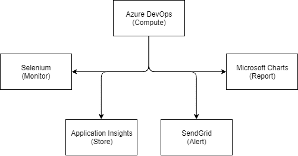
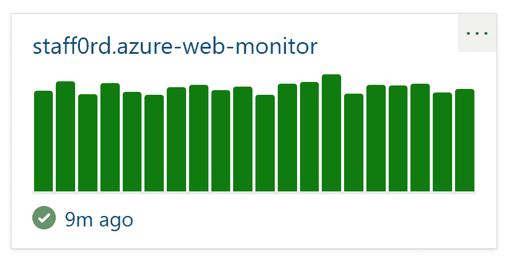
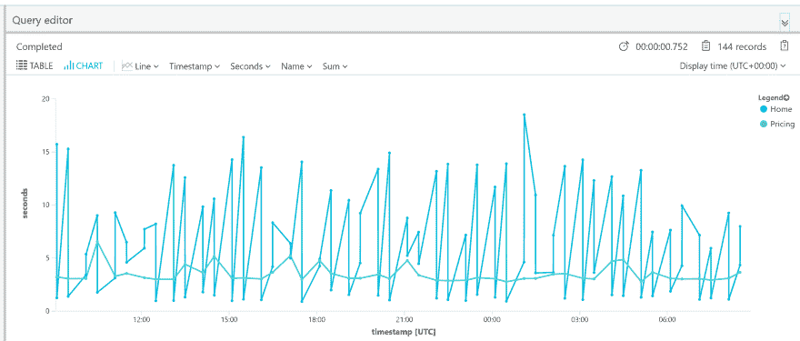
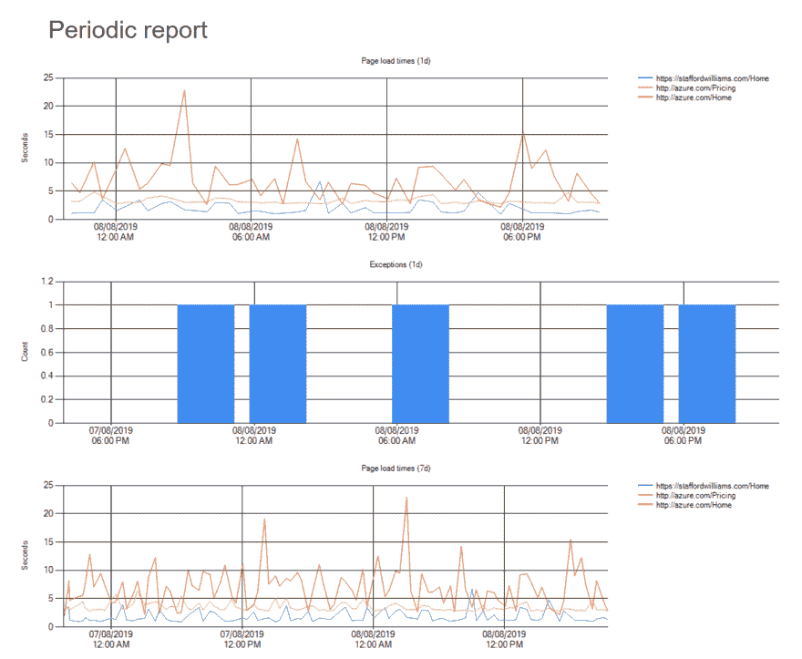

# 用 Azure 免费监控网络

> 原文：<https://dev.to/staff0rd/monitoring-the-web-with-azure-for-free-198b>

随着[Visual Studio 和 Azure](https://devblogs.microsoft.com/devops/cloud-based-load-testing-service-eol/) 中的多步 web 测试被弃用，我们现在可以使用什么方法来监控 Web 属性，尤其是如果我们不拥有它们的话？在这篇文章中，我将提出并演示如何利用 Azure 为我们提供一个零成本的解决方案。

## 多步 Web 测试弃用

[在这里宣布](https://devblogs.microsoft.com/devops/cloud-based-load-testing-service-eol/)，这一弃用意味着 Visual Studio 2019 Enterprise 将是 Visual Studio 支持多步 Web 测试项目的最后一个版本，[目前还没有对](https://github.com/MicrosoftDocs/azure-docs/issues/26050#issuecomment-468814101)进行替换。考虑到这些测试只基于 HTTP(没有 Javascript ),而且价格也很合理，例如 [West US 2 / AUD pricing](https://azure.microsoft.com/en-au/pricing/details/monitor/) 如下所示，这个企业专用特性并不令人羡慕。

| 特征 | 包括免费单元 | 价格 |
| --- | --- | --- |
| 多步骤 web 测试 | 没有人 | 每月每项测试 13.73 美元 |
| Ping web 测试 | 无限的 | 自由的 |

## 更好的解决方案

我正在寻找一个更现代的解决方案，其功能集比多步 Web 测试更强大。我们将使用 Azure 来托管它，如果我们使用最低限度，那么这个解决方案可以完全免费。每月只需几美分，我们就可以添加额外的功能，以符合监控可能不属于我们自己的网络属性的想法。

[](https://res.cloudinary.com/practicaldev/image/fetch/s--stJgJmFd--/c_limit%2Cf_auto%2Cfl_progressive%2Cq_auto%2Cw_880/http://staffordwilliams.com/assets/azure-for-free/Architecture.png%23center)

这个解决方案在 GitHub 上完全[开源](https://github.com/staff0rd/azure-web-monitor)和[免费。如果你有如何改进这个解决方案的想法，请](https://github.com/staff0rd/azure-web-monitor)[告诉我](https://github.com/staff0rd/azure-web-monitor/issues)！

## 浏览器自动化

为了解决监控可用性、请求次数以及我们的单页面应用程序是否正确执行 javascript 的核心需求，我们将使用 [Selenium](https://www.seleniumhq.org/) 。我们用[来控制。net core](https://dotnet.microsoft.com/download/dotnet-core) ，使用普通的老式 [mstest](https://docs.microsoft.com/en-us/dotnet/core/tools/dotnet-test) ，我们(或者更可能是我们的自动化)可以用`dotnet test`轻松运行它。

关于用 Selenium 编写测试有大量的指南，在使用 Selenium 时使用页面对象模型方法是一个很好的实践。[我写的一个例子](https://github.com/staff0rd/azure-web-monitor/blob/master/src/AzureWebMonitor.Test/AzureDotCom_AzureSignalR.cs)加载，导航到定价页面，并使用[should ly](https://github.com/shouldly/shouldly)测试一些断言。

我将 [ChromeDriver](https://chromedriver.chromium.org/) 与 Selenium 一起使用，我们可以向其传递进一步的参数，例如，[避免跟踪像 google analytics](https://github.com/staff0rd/azure-web-monitor/blob/master/src/AzureWebMonitor.Test/WebDriverHelper.cs#L17-L18) 这样的集成，[运行 headless](https://github.com/staff0rd/azure-web-monitor/blob/master/src/AzureWebMonitor.Test/WebDriverHelper.cs#L19) 这样我们就可以在没有图形环境的 linux 虚拟机上运行它。

## 在云端运行

我需要一些东西来定期运行上述测试项目，而 [Azure DevOps](https://dev.azure.com) 是免费的答案，每月有 1800 分钟免费托管构建时间。我可以实现一个[构建管道](https://azure.microsoft.com/en-au/services/devops/pipelines/)，它将运行测试并通过电子邮件将结果发送给我。甚至还有一个仪表板小部件来显示我的测试在过去 20 次运行中的表现，包括运行时间以及是否有任何测试失败。

[](https://res.cloudinary.com/practicaldev/image/fetch/s--9k0tz74T--/c_limit%2Cf_auto%2Cfl_progressive%2Cq_auto%2Cw_880/http://staffordwilliams.com/assets/azure-for-free/dashboard.PNG%23center)

[构建管道配置](https://github.com/staff0rd/azure-web-monitor/blob/master/azure-pipelines.yml)非常简单。每当构建被触发时，托管的 linux 代理将运行以下步骤；

1.  安装点网核心 2.2
2.  恢复 nuget 包
3.  构建项目
4.  运行测试
5.  公布结果

调度构建也很简单，尤其是现在 Azure Pipelines 支持使用 cron 语法的[调度。每小时触发一次就像下面的代码片段一样简单。记住要设置`always: true`,这样无论源代码中没有提交任何更改，都会触发构建。](https://docs.microsoft.com/en-us/azure/devops/pipelines/build/triggers?view=azure-devops&tabs=yaml#scheduled-triggers) 

```
schedules:
- cron: '0 * * * *'
  displayName: Hourly build
  branches:
    include:
    - master
  always: true 
```

Cron 调度对 Azure Pipelines 来说是相当新的，在我最初的实现中被打破了。在修复过程中，我使用了[逻辑应用](https://azure.microsoft.com/en-au/services/logic-apps/)来安排构建。Logic Apps 已经包括一个 Azure DevOps 连接器和一个两步应用程序是所有需要的-一个定期循环和一个构建触发器。然而，既然 Cron 时间表已经固定，就不再需要逻辑应用程序方法了。

此外，Cron 计划只有在 Azure Devops 租户持续使用的情况下才是可靠的。[文档解释了](https://docs.microsoft.com/en-us/azure/devops/pipelines/build/triggers?view=azure-devops&tabs=yaml#my-build-didnt-run-what-happened)租户在所有人退出后进入休眠状态——如果你遇到这种情况，Logic Apps 方法将确保你的构建被触发。

## 存储数据

我们存储和查询将要收集的数据的一个好方法是使用[应用洞察](https://docs.microsoft.com/en-us/azure/azure-monitor/app/app-insights-overview)。通常我们会使用 [Application Insights SDK](https://docs.microsoft.com/en-us/azure/azure-monitor/app/asp-net-core) 来自动跟踪我们自己网站的数据——然而，当我们监控互联网上的其他网站时，我们将只包括[基础 API](https://www.nuget.org/packages/Microsoft.ApplicationInsights/) 并直接使用`TelemetryClient`。

我已经编写了 [ApplicationInsights.cs](https://github.com/staff0rd/azure-web-monitor/blob/master/src/AzureWebMonitor.Test/ApplicationInsights.cs) 作为对`TelemetryClient`的包装，它显示我们正在向 ApplicationInsights 发送可用性和异常遥测。将这与我们的 Selenium 测试和[配置工具键](https://github.com/staff0rd/azure-web-monitor/blob/master/src/AzureWebMonitor.Test/appsettings.json)集成在一起，就可以在 Azure 门户中查询我们的数据。

[](https://res.cloudinary.com/practicaldev/image/fetch/s--3FkIggTN--/c_limit%2Cf_auto%2Cfl_progressive%2Cq_auto%2Cw_880/http://staffordwilliams.com/assets/azure-for-free/appinsights.PNG%23center)

我们可以在门户中查看[到](https://docs.microsoft.com/en-us/azure/azure-monitor/app/pricing#limits-summary)90 天的数据，使用 [Kusto](https://docs.microsoft.com/en-us/azure/kusto/query/) 来查询和创建图表。我们还可以通过使用[应用洞察 REST API](https://dev.applicationinsights.io) 从外部查询数据，我们将在下面这样做以生成报告，这些报告将在达到[数据保留限制](https://docs.microsoft.com/en-us/azure/azure-monitor/app/pricing#limits-summary)之前对我们的进行快照。

## 通知和报警

我们希望收到两个关键事件的通知:

1.  测试失败和；
2.  当整个系统停止运行且没有监控时。

Azure DevOps 已经在通过电子邮件发送测试失败，但电子邮件的内容可以比这好得多。一旦所有测试完成，我们可以扩展现有的测试项目来构建失败的总结。更好的是，我们可以[使用 Selenium 在浏览器出现故障时抓取截图](https://github.com/staff0rd/azure-web-monitor/blob/master/src/AzureWebMonitor.Test/WebDriverHelper.cs#L39-L45)并且[将这些图片包含在电子邮件中](https://github.com/staff0rd/azure-web-monitor/blob/master/src/AzureWebMonitor.Test/ResultsEmailer.cs)。

如果我们的 Application Insights 实例在 x 分钟/小时内没有接收到任何新数据，我们可以检测到整个系统已经关闭。最初我使用了 [Azure Scheduler](https://azure.microsoft.com/en-au/services/scheduler/) 来完成这个任务，但是它已经被**弃用，并将在今年年底**退役。因此，Logic Apps 是我们的朋友，我们可以使用它来查询上面提到的同一个[应用洞察 REST API](https://dev.applicationinsights.io) ，并在我们没有检测到数据时发送电子邮件。

## 举报

我希望定期总结这些 web 属性的表现，这基本上是我们已经使用 Application Insights 生成的图表的快照。然而，Application Insights 目前不提供定期发送这些结果的方法，所以我们将[编写我们自己的](https://github.com/staff0rd/azure-web-monitor/tree/master/src/AzureWebMonitor.Report)。

为此，我们将使用[Application Insights REST API](https://dev.applicationinsights.io)获取原始遥测数据，并重新访问[微软。一个 WinForms 图表控件。NET Framework——生成与我们在门户中看到的结果非常相似的图表。我们会将这些图表导出到。png，在我们将要构建的 HTML 文件中引用它们，然后将它们附加到邮件消息中以便通过电子邮件发送。结果是一封 HTML 格式的电子邮件直接发送到我们的电子邮件客户端。](https://www.nuget.org/packages/Microsoft.Chart.Controls/)

[](https://res.cloudinary.com/practicaldev/image/fetch/s--sDMdOjlD--/c_limit%2Cf_auto%2Cfl_progressive%2Cq_auto%2Cw_880/http://staffordwilliams.com/assets/azure-for-free/report.png%23center)

## 电子邮件

在上面我已经提到了我们正在生成的电子邮件，但是我们需要一些东西来实际发送它们，例如我们的好朋友 SMTP。为了以超酷的免费价格提供这一功能，我们将使用 [SendGrid](https://sendgrid.com/) 让我们每天免费发送 100 封电子邮件——比我们需要的要多得多。

## 结论

这就结束了——我们已经看到，我们可以使用一系列 Azure 服务和集成来免费或以非常低的成本实现一个相当健壮的监控系统。然而，通过所描述的技术，我们可以扩展或(完全)改变这个解决方案，以满足我们在云中运行工作负载的任何需求。我希望这篇概述能给你一些启发或帮助你发现一些新的东西——如果你能想出一个改进的方法来实现上述内容或注意到任何错误，请[联系](https://twitter.com/staff0rd)！