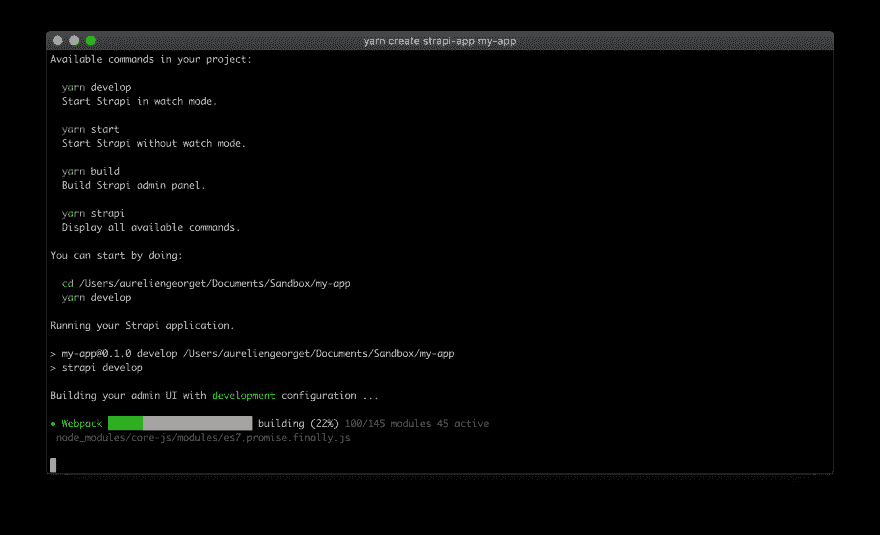
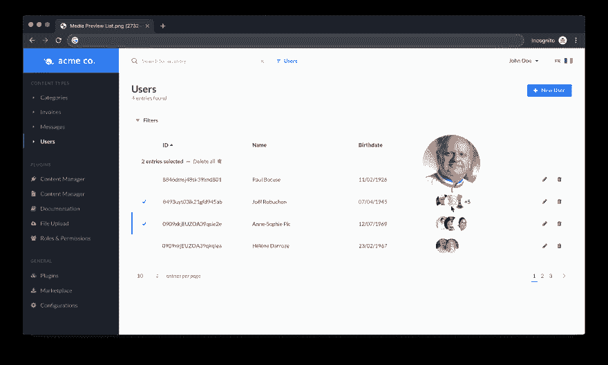

# 每月更新-2019 年 8 月

> 原文：<https://dev.to/strapi/monthly-update-august-19-1p02>

*作者[奥雷连·乔治特](https://twitter.com/aureliengeorget)。*

就在几周前，我写了第一篇[月度更新](https://blog.strapi.io/monthly-update-july-2019/)，其中我解释了 Strapi 在未来几个月的愿景和路线图。如果你还没有机会，我推荐你读一读😉！最终确定愿景和路线图是我们从[返回异地](https://blog.strapi.io/the-strapi-team-offsite/)后采取的行动之一。

那么，这个月对 Strapi 来说什么最热门呢？

在我们开始之前，我想让你知道我们已经开了一个新的工作职位。我们正在寻找一位产品负责人加入我们。如果你感兴趣，或者你知道有人具备这方面的条件，请随时申请或与他人分享。不过有一个特殊性，这份工作的工作地点在巴黎，所以我们目前不能接受全职的远程职位。

让我们先来总结一下 Strapi 的新特性:

*   使用 create-strapi-app 生成一个新项目。
*   在项目生成期间开始使用 Strapi 的新日志。
*   Node.js v12 支持。
*   了解我们在组和可重复字段功能方面取得的进步。
*   新媒体预览介绍。

### create-strapi-app:一种生成应用的新方法

`create strapi app`是**官方支持的创建 Strapi 项目的方式。它提供了最简单的方法来生成应用程序，而不必全局安装 Strapi CLI。**

 **使用纱线创建命令:

```
yarn create strapi my-project 
```

或者使用 npx:

```
npx create-strapi-app my-project 
```

然后，按照提示的指示，您的项目将自动启动。简单对吗？！用 Strapi 生成应用程序是新推荐的方式。

### 更好的日志来拉平学习曲线

即使我们花了很大的力气定期改进文档，如果你根本不需要阅读它，那就更好了。项目的生成是解释用户在开始使用 Strapi 项目时需要知道的所有基本命令的大好时机。

[](https://res.cloudinary.com/practicaldev/image/fetch/s--ABC4TtH9--/c_limit%2Cf_auto%2Cfl_progressive%2Cq_auto%2Cw_880/https://thepracticaldev.s3.amazonaws.com/i/fn5kz8vsfs9to92vpge9.png)

测试版引入了很多变化，尤其是在如何使用 Strapi 开发项目方面。我们也在尽最大努力应用 JavaScript 社区指南。我们现在使用的是在`package.json`文件中可用的本地脚本，而不是由我们的 CLI 提供的全局命令。换句话说，我们建议你用`yarn start`代替`strapi start`。

### Node.js v12 支持

我们发现超过 25%的人面临着**安装问题**。经过一些数据分析，我们发现相当一部分用户已经在使用 Node.js 的最新版本。这对生态系统来说是个好消息！但是我们还不支持它。

> 我们现在自豪地宣布，Strapi 支持节点 v10 和 v12🎉。

如果你问数据是从哪里来的，我们在我们的文档中为这个主题写了一个专门的部分:[https://strapi . io/documentation/3 . 0 . 0-beta . x/advanced/usage-information . html](https://strapi.io/documentation/3.0.0-beta.x/advanced/usage-information.html)

### 分组和可重复字段更新

在上一篇博文中，我们披露了我们目前正在开发组和可重复字段特性。是时候**与您分享我们的进展了**。

*   ✅从内容类型生成器创建、编辑和删除组。
*   ❌将组与内容类型相关联。
*   ✅更新 API 以支持组上的 CRUD 操作。
*   🚧质量保证

我们计划在 8 月 2 日开始**最终 QA。然后，我们将在八月中旬**发布一个**预发布候选版本，供渴望在其他人之前发现该功能的人们使用。关于开发速度和发布日期，我们是准时的。组和可重复字段版本将包括布局存储的改进。**

[](https://res.cloudinary.com/practicaldev/image/fetch/s--oaovtiWh--/c_limit%2Cf_auto%2Cfl_progressive%2Cq_auto%2Cw_880/https://thepracticaldev.s3.amazonaws.com/i/kkk32p5tdpu1priplwdj.jpg)

1.  改善布局的存储。
2.  支持唯一约束和外键。
3.  保护对 API 的管理访问。

[更多详情请阅读之前的每月更新](https://blog.strapi.io/monthly-update-july-2019/)

分组和可重复字段特性将伴随着**的大量小改进**。

*   将改进**内容类型构建器**插件**导航**。
*   **布局管理系统**将**从零开始重建**。
*   **布局定制界面**将**比以往更加流畅**。
*   现在可以对关系字段(在内容管理编辑视图中)中显示的文本进行**定制。**
*   **数据库连接器**(书架&猫鼬)**将支持“多向”关系**(单向多对多关系)。
*   将引入名为“富文本”的**新字段类型，以便轻松地向内容类型添加富文本编辑器，如 HTML、Markdown 或类似 Word 的编辑器。**

### 直接从列表中可视化媒体

两个月前，我们进行了一项调查，列出了用户遇到的棘手问题。其中之一是**不能从列表视图**中看到媒体。事实上，问题是您不能在列表视图中显示任何类型的关系字段。只能显示静态字段，如文本、数字或布尔值。

我们的想法和用户研究带给我们**两个不同的用户故事:**

1.  查看我的用户的个人资料图片，使可视化搜索更容易。
2.  了解相关资产的概况，以避免进入条目的单一视图。

结果是创建了一个**新的可视组件**来可视化一个或多个具有缩放悬停效果的资产**以节省点击。**

[](https://res.cloudinary.com/practicaldev/image/fetch/s--z1fFe0F0--/c_limit%2Cf_auto%2Cfl_progressive%2Cq_auto%2Cw_880/https://thepracticaldev.s3.amazonaws.com/i/53f2b6c8cnnxeaef5bzr.png)

### 结论

您可能知道，我们的首要任务是让用户满意。我们把所有的精力都集中在解决一个又一个的痛点上。请随时给我们您对任何即将推出的功能的想法，我们迫不及待地想得到您的反馈！

下个月见👋**