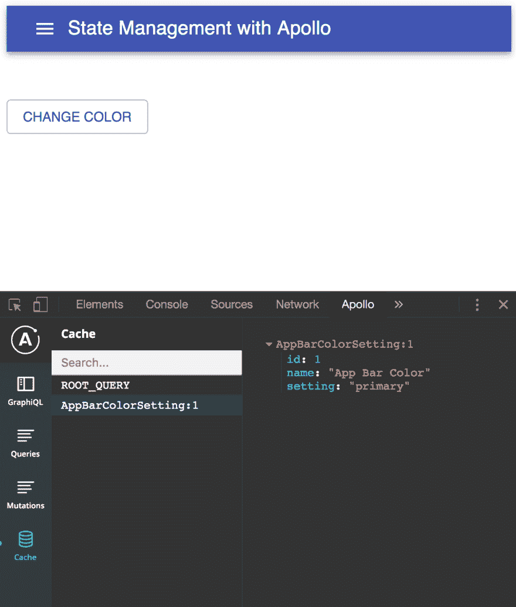
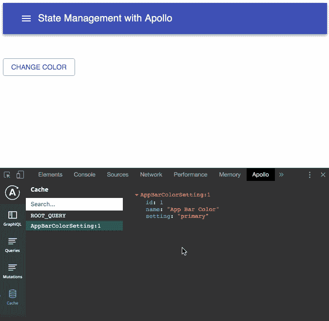

# 将 Redux: Apollo-Client 作为状态管理解决方案(带钩子🎉)

> 原文：<https://dev.to/mattdionis/move-over-redux-apollo-client-as-a-state-management-solution-with-hooks-10jc>

## 背景

在 [Circle](https://www.circle.com/) 的内部工具团队，我们最近通过引入 React 组件对一个遗留的 PHP 应用进行了现代化。就在这项计划开始后的几个月，我们已经在这个应用程序中使用了近 100 个 React 组件！😲

我们最近到达了一个点，我们发现自己正在寻求一个状态管理解决方案。请注意，在我们达到这一点之前，花了好几个月和几十个组件。状态管理通常是团队在需要之前就已经使用的工具。虽然将状态管理解决方案集成到应用程序中无疑会带来许多好处，但它也会带来复杂性，所以除非真正需要，否则不要使用它。

说到复杂性，关于典型的“go-to”状态管理解决方案， [Redux](https://redux.js.org/) 的一个抱怨是，它需要太多样板文件，并且很难立即投入运行。在这篇文章中，我们将看到一个更轻量级的解决方案，它带来了额外的好处，为那些选择使用它的人提供一些基本的 GraphQL 体验。

在 Circle 🛠团队，我们知道我们未来的堆栈包括 GraphQL。事实上，在理想的场景中，我们会在某个时候有一个公司范围的数据图，并通过 GraphQL 一致地访问和修改数据。然而，在短期内，我们只是在寻找一种低摩擦的方式来将 GraphQL 引入到堆栈中，并允许开发人员以一种低压力的方式将他们的注意力集中在这项技术上。GraphQL 作为一个客户端状态管理解决方案，使用了像 [apollo-client](https://github.com/apollographql/apollo-client) 这样的库，感觉这是一个完美的入门方式。让我们来看看这种方法的概念验证的高级实现！

## 配置客户端

首先，我们需要引入一些包:

```
yarn add @apollo/react-hooks apollo-cache-inmemory
apollo-client graphql graphql-tag react react-dom 
```

下面你会发现`index.js`在客户端上的全部内容。接下来我们将讨论客户端模式的具体部分:

```
import React from "react";
import ReactDOM from "react-dom";

import gql from "graphql-tag";
import { ApolloClient } from "apollo-client";
import { ApolloProvider } from "@apollo/react-hooks";
import { InMemoryCache } from "apollo-cache-inmemory";

import App from "./App";
import userSettings from "./userSettings";

const typeDefs = gql`
  type AppBarColorSetting {
    id: Int!
    name: String!
    setting: String!
  }
  type Query {
    appBarColorSetting: AppBarColorSetting!
  }
  type Mutation {
    updateAppBarColorSetting(setting: String!): AppBarColorSetting!
  }
`;

const resolvers = {
  Query: {
    appBarColorSetting: () => userSettings.appBarColorSetting
  },
  Mutation: {
    updateAppBarColorSetting: (_, { setting }) => {
      userSettings.appBarColorSetting.setting = setting;
      return userSettings.appBarColorSetting;
    }
  }
};

const client = new ApolloClient({
  cache: new InMemoryCache({
    freezeResults: true
  }),
  typeDefs,
  resolvers,
  assumeImmutableResults: true
});

const TogglesApp = () => (
  <ApolloProvider client={client}>
    <App />
  </ApolloProvider>
);

ReactDOM.render(<TogglesApp />, document.getElementById("root")); 
```

首先，我们定义`typeDefs`和`resolvers`。

`AppBarColorSetting`类型将具有必需的`id`、`name`和`setting`字段。这将允许我们通过 GraphQL 查询和突变来获取和改变应用程序栏的颜色！

```
type  AppBarColorSetting  {  id:  Int!  name:  String!  setting:  String!  } 
```

接下来，我们定义了`Query`类型，这样我们就可以获取`appBarColorSetting` :

```
type  Query  {  appBarColorSetting:  AppBarColorSetting!  } 
```

最后，你猜对了，我们需要定义`Mutation`类型，这样我们就可以更新`appBarColorSetting` :

```
type  Mutation  {  updateAppBarColorSetting(setting:  String!):  AppBarColorSetting!  } 
```

最后，我们设置我们的客户。通常，您会发现自己用一个`link`属性实例化了`ApolloClient`。但是，既然我们增加了一个`cache`和`resolvers`，我们就不需要再增加一个`link`。然而，我们确实添加了一些看起来不熟悉的属性。从 apollo-client 2.6 开始，您可以将一个`assumeImmutableResults`属性设置为`true`，让 apollo-client 知道您确信没有修改缓存结果对象。这可能会带来显著的性能提升。为了增强不变性，您还可以将`freezeResults`属性添加到`inMemoryCache`中，并将其设置为`true`。在非生产环境中，在严格模式下改变冻结对象将抛出一个有用的异常。要了解更多信息，请阅读来自 [Ben Newman](https://twitter.com/benjamn) 的[*“Apollo Client 2.6 中的新功能”*](https://blog.apollographql.com/whats-new-in-apollo-client-2-6-b3acf28ecad1) 帖子。

```
const client = new ApolloClient({
  cache: new InMemoryCache({
    freezeResults: true
  }),
  typeDefs,
  resolvers,
  assumeImmutableResults: true
}); 
```

就是这样！现在，只需将这个`client`传递给`ApolloProvider`，我们就可以编写我们的查询和变异了！🚀

```
const TogglesApp = () => (
  <ApolloProvider client={client}>
    <App />
  </ApolloProvider>
); 
```

## 查询客户端数据

我们现在将使用 GraphQL 查询我们的客户端缓存。注意，在这个概念验证中，我们简单地定义了 JSON blob 中的`userSettings`的初始状态:

```
{  "appBarColorSetting":  {  "id":  1,  "name":  "App Bar Color",  "setting":  "primary",  "__typename":  "AppBarColorSetting"  }  } 
```

*注意需要用`__typename`属性定义类型。*

然后，我们在自己的`.js`文件中定义查询。您可以选择在调用查询的同一个文件中定义它，或者甚至在一个`.graphql`文件中定义它。

```
import gql from "graphql-tag";

const APP_BAR_COLOR_SETTING_QUERY = gql`
  query appBarColorSetting {
    appBarColorSetting @client {
      id
      name
      setting
    }
  }
`;

export default APP_BAR_COLOR_SETTING_QUERY; 
```

关于这个查询，需要注意的最重要的事情是使用了`@client`指令。我们只需要将它添加到`appBarColorSetting`查询中，因为它是特定于客户端的。接下来让我们看看如何调用这个查询:

```
import React from "react";
import { useQuery } from "@apollo/react-hooks";

import AppBar from "@material-ui/core/AppBar";
import Toolbar from "@material-ui/core/Toolbar";
import Typography from "@material-ui/core/Typography";
import IconButton from "@material-ui/core/IconButton";
import MenuIcon from "@material-ui/icons/Menu";

import SettingsComponent from "./components/SettingsComponent";
import APP_BAR_COLOR_SETTING_QUERY from "./graphql/APP_BAR_COLOR_SETTING_QUERY";

function App() {
  const { loading, data } = useQuery(APP_BAR_COLOR_SETTING_QUERY);

  if (loading) return <h2>Loading...</h2>;
  return (
    <div>
      <AppBar position="static" color={data.appBarColorSetting.setting}>
        <Toolbar>
          <IconButton color="inherit" aria-label="Menu">
            <MenuIcon />
          </IconButton>
          <Typography variant="h6" color="inherit">
            State Management with Apollo
          </Typography>
        </Toolbar>
      </AppBar>
      <SettingsComponent
        setting={
          data.appBarColorSetting.setting === "primary"
            ? "secondary"
            : "primary"
        }
      />
    </div>
  );
}

export default App; 
```

*注意:我们在这个应用中使用 [Material-UI](https://material-ui.com/) ，但是很明显 UI 框架的选择取决于你。*🤷‍♂️

```
const { loading, data } = useQuery(APP_BAR_COLOR_SETTING_QUERY); 
```

我们展示了一个基本的加载指示器，然后使用传递给属性`color`的`data.appBarColorSetting.setting`来呈现应用程序栏。如果您使用的是 Apollo 客户端开发工具，您将能够清楚地看到缓存中的数据。

[](https://res.cloudinary.com/practicaldev/image/fetch/s---B3z8BN3--/c_limit%2Cf_auto%2Cfl_progressive%2Cq_auto%2Cw_880/https://thepracticaldev.s3.amazonaws.com/i/0w9nz0yedvosgxanxev4.png)

## 变更客户端数据并更新缓存

您可能已经注意到了我们的`App`组件中的这段代码。这只是基于当前值替换了`setting`的值，并将其传递给我们的`SettingsComponent`。接下来我们将看看这个组件以及它是如何触发 GraphQL 突变的。

```
<SettingsComponent
  setting={
    data.appBarColorSetting.setting === "primary" ? "secondary" : "primary"
  }
/> 
```

首先，让我们来看看我们的突变:

```
import gql from "graphql-tag";

const UPDATE_APP_BAR_COLOR_SETTING_MUTATION = gql`
  mutation updateAppBarColorSetting($setting: String!) {
    updateAppBarColorSetting(setting: $setting) @client
  }
`;

export default UPDATE_APP_BAR_COLOR_SETTING_MUTATION; 
```

同样，请注意客户端`updateAppBarColorSetting`变异使用了`@client`指令。这种变化非常简单:传入一个必需的设置字符串并更新设置。

下面你会发现我们的`SettingsComponent`中的所有代码都利用了这个突变:

```
import React from "react";
import { useMutation } from "@apollo/react-hooks";

import Button from "@material-ui/core/Button";

import UPDATE_APP_BAR_COLOR_SETTING_MUTATION from "../graphql/UPDATE_APP_BAR_COLOR_SETTING_MUTATION";
import APP_BAR_COLOR_SETTING_QUERY from "../graphql/APP_BAR_COLOR_SETTING_QUERY";

function SettingsComponent({ setting }) {
  const [updateUserSetting] = useMutation(
    UPDATE_APP_BAR_COLOR_SETTING_MUTATION,
    {
      variables: { setting },
      update: cache => {
        const data = cache.readQuery({
          query: APP_BAR_COLOR_SETTING_QUERY
        });

        const dataClone = {
          ...data,
          appBarColorSetting: {
            ...data.appBarColorSetting,
            setting
          }
        };

        cache.writeQuery({
          query: APP_BAR_COLOR_SETTING_QUERY,
          data: dataClone
        });
      }
    }
  );
  return (
    <div style={{ marginTop: "50px" }}>
      <Button variant="outlined" color="primary" onClick={updateUserSetting}>
        Change color
      </Button>
    </div>
  );
}

export default SettingsComponent; 
```

我们想关注的这段有趣的代码如下:

```
const [updateUserSetting] = useMutation(
  UPDATE_APP_BAR_COLOR_SETTING_MUTATION,
  {
    variables: { setting },
    update: cache => {
      const data = cache.readQuery({
        query: APP_BAR_COLOR_SETTING_QUERY
      });

      const dataClone = {
        ...data,
        appBarColorSetting: {
          ...data.appBarColorSetting,
          setting
        }
      };

      cache.writeQuery({
        query: APP_BAR_COLOR_SETTING_QUERY,
        data: dataClone
      });
    }
  }
); 
```

这里，我们使用 apollo/react-hooks `useMutation`钩子，向它传递我们的突变和变量，然后在 update 方法中更新缓存。我们首先从缓存中读取`APP_BAR_COLOR_SETTING_QUERY`的当前结果，然后将`appBarColorSetting.setting`更新为作为`prop`传递给该组件的设置，然后将更新后的`appBarColorSetting`写回`APP_BAR_COLOR_SETTING_QUERY`。注意，我们做的**不是**直接更新`data`对象，而是克隆它并在克隆中更新`setting`，然后将克隆的`data`对象写回缓存。这将触发我们的应用程序栏更新新的颜色！我们现在使用 apollo-client 作为客户端状态管理解决方案！🚀

[](https://res.cloudinary.com/practicaldev/image/fetch/s--mSyld_5t--/c_limit%2Cf_auto%2Cfl_progressive%2Cq_66%2Cw_880/https://thepracticaldev.s3.amazonaws.com/i/ge78pf8wcils29wk4wcx.gif)

## 外卖

如果你想进一步挖掘代码，可以在这里找到[code sandbox](https://codesandbox.io/s/eloquent-johnson-fym98)。诚然，这是一个非常人为的例子，但它显示了[利用 apollo-client 作为状态管理解决方案](https://www.apollographql.com/docs/react/essentials/local-state)是多么容易。这可能是向几乎没有 GraphQL 经验的团队介绍 GraphQL 和 Apollo 库和工具套件的一个很好的方式。一旦这个基础设施到位，扩展 GraphQL 的使用就很简单了。

我希望听到每个人的想法和反馈，我希望你能从这篇文章中学到一些有用的东西！