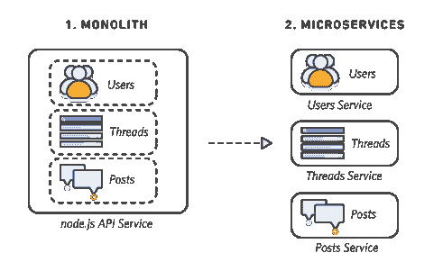
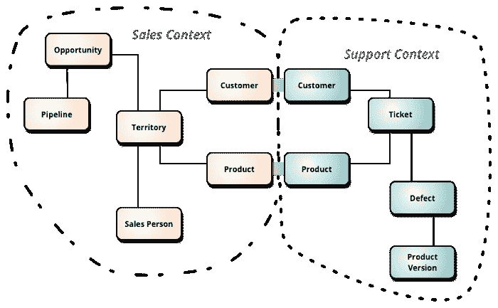
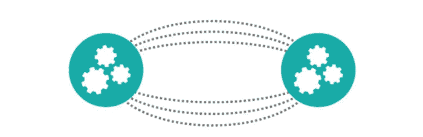

# 从整体服务转向微服务？什么、为什么以及如何设计微服务

> 原文：<https://dev.to/ektagarg/moving-from-monolithic-to-microservices-what-why-and-how-to-design-microservices-50g8>

**微服务**是一种将应用程序构建成松散耦合服务的风格。将一个服务作为一个整体来考虑，它在一个组织中扮演一个部门(技术、人力资源、销售、营销)的角色。每个服务都是系统的一个组成部分，可以单独开发、维护和扩展。每个模块支持一个特定的业务目标，并使用一个简单的、定义良好的接口与其他服务进行通信。关于微服务更令人兴奋的一点是，你可以用不同的编程语言编写不同的微服务，即多语言开发支持。

## 为什么要微服务，单片有什么不好？

有两种设计应用架构的方法:传统的单片和微服务

#### 单片进场

Monoliths 是作为一个单独的单元构建的，因此它们负责每一个可能的功能:处理 HTTP 请求、执行域/业务逻辑、数据库操作、后台处理、与客户端通信、处理认证等等。
正因为如此，即使系统中最小的变化也涉及到构建和部署整个应用程序。就像即使在你的应用中，需要改变一行代码，你也必须重新构建整个系统并进行部署，这需要很多时间
这不是唯一的问题——想想**扩展**。你必须运行这个整体的多个实例，即使你必须用特定的功能来扩展系统的一部分。

困难在于:

1.  缺乏创新
2.  难以扩展
3.  缺乏灵活性
4.  相互依赖紧密耦合系统

#### 微服务方案

一种将单个应用程序开发成一套小型服务的方法。—马丁·福勒 T3

当一个大型复杂的系统需要组件管理、扩展和单独开发时，就需要微服务。像网飞、优步这样的大型组织将其整体服务转换为微服务。微服务可以让你将大型应用分成不同的领域。通过分离职责，它们允许在单个服务上独立完成工作，而不影响其他服务上正在进行的工作。随着公司和其他需求的增长，您的应用程序也会增长。
微服务是我在上面提到的单块方法中每个困难的解决方案。

## 在考虑微服务的同时，应该有哪些设计上的考虑？

**CI/CD:** **持续集成和持续开发**是一种现代开发实践，它将开发与测试合并，允许开发人员协作构建代码，提交给主分支，并检查问题。这使得开发人员不仅可以构建他们的代码，还可以在任何环境类型中测试他们的代码，并尽可能多地在应用程序开发生命周期的早期捕捉错误。

**日志记录和跟踪:**为了了解**的性能**，行为，问题以及监控应用程序，您需要日志记录和跟踪。虽然您可以使用外部资源进行监控，但您只能获得**响应时间**信息和呼叫数量等，而不能洞察应用程序。因此对于记录信息，如开始时间、结束时间和执行的操作。在日志消息中包含外部请求 id。

**有界上下文:**有界上下文试图将我们复杂领域的边界定义为业务上下文。有界上下文很重要，因为它们允许我们定义一种在边界内共享和有效的无处不在的语言。**领域驱动设计**是一种以有界上下文为中心模式的架构模式。DDD 通过将大型模型分解成不同的有界环境来处理它们。

**控制延迟:** **延迟**是决定消费者满意度的服务质量的重要组成部分。微服务架构中的每个服务都需要一个网络调用。即使只有一次呼叫也会有延迟。当单个呼叫变得很多时，延迟就变得至关重要，因为延迟会随着流量的增加而增加。当服务负载增加时，延迟和响应时间的风险会增加。当服务在等待响应时，延迟会变得难以忍受，并且会在系统中造成网格锁。如果发生这种情况，整个系统将会出现灾难性的故障。
其他的网格锁可能由于循环调用而出现，在一个纯微服务架构中，任何服务都可以调用任何其他的微服务。当任何服务随后被某个下游服务调用时，这个调用堆栈可能会变成循环的。当这种情况发生时，延迟会更快成为问题，因为多个服务可能依赖于循环服务调用堆栈。当迁移到微服务架构时，您应该为网格锁定和延迟留出足够的时间。

**异步系统:**减少延迟的最佳策略之一是不要依赖纯粹的同步模型。利用设计良好的异步通信是维护系统健康的一种极好的方式。然而，异步通信并不容易。你需要做足够的工作来确保你的信息到达目的地。**事件驱动方法**是一种确保异步通信的方法。这种模式是讨论最多的，但肯定不是唯一的。在构建大型分布式系统时，**流数据平台**是一个非常强大的模式。通过利用这种系统，你可以做更多的事情，而对系统的整体压力更小。

**编排:**在微服务中，随着我们开始构建越来越复杂的逻辑，我们必须处理管理跨越单个服务边界的业务流程的问题。借助微服务，我们将比平时更快达到这一极限。我们可以遵循两种建筑风格:

1.  管弦乐编曲
2.  舞蹈编排

通过**编排**，我们依靠一个中央大脑来引导和驱动这个过程，就像管弦乐队中的指挥一样。

通过**编舞**，我们告知系统的每个部分它的工作，并让它解决细节，就像芭蕾舞中的舞者都找到自己的路并对周围的人做出反应。

如果您有任何见解，请在此回复！否则，我希望这篇文章帮助你回答了许多微服务和单片架构的问题，并开始在你的脑海中构建更多的微服务世界。敬请期待！