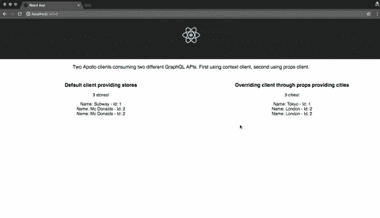
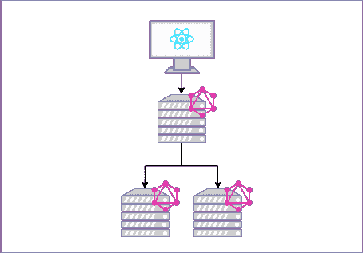

# React 中的多个 Apollo 客户端

> 原文：<https://dev.to/open-graphql/multiple-apollo-clients-in-react-3jhh>

> 这是一年后的回顾[阿波罗多个客户与 React？](https://medium.com/open-graphql/apollo-multiple-clients-with-react-b34b571210a5)。我花了点时间重写了一下，添加了社区实现建议，Apollo Federation 等等。那时我意识到我也可以在这里分享我浅薄的知识。

这篇快速的帖子解释了如何在同一个 React 应用程序中使用不同的 Apollo 客户端，但是最后，讨论了在处理多个 GraphQL APIs 时的其他方法。这并不是要以任何方式质疑 GraphQL 哲学😝！

我这样写是因为我发现自己在问，如何使用多个客户端从我的 React 应用程序中查询不同的 GraphQL APIs。事实证明，在 Apollo GitHub 项目中有很多问题，讨论**需求**并提出建议的实现。

> TL；DR:将任何一个 ApolloClient 实例作为道具传递给查询/变异/订阅组件都可以！检查:[https://github . com/peaonunes/Apollo-multiple-clients-example](https://github.com/peaonunes/apollo-multiple-clients-example)

下面列出了一些相关问题、讨论和建议的链接。一些旧的提议确实被合并了，并出现了旧的版本。然而，自 2.1 以来，使用 Apollo 客户机和查询的方法发生了很大的变化(变得更好了)。

*   [https://github.com/apollographql/react-apollo/pull/481](https://github.com/apollographql/react-apollo/pull/481)
*   [https://github.com/apollographql/react-apollo/issues/464](https://github.com/apollographql/react-apollo/issues/464)
*   [https://github.com/apollographql/react-apollo/issues/1588](https://github.com/apollographql/react-apollo/issues/1588)
*   [https://github.com/apollographql/react-apollo/pull/729](https://github.com/apollographql/react-apollo/pull/729)

* * *

## 为什么我们需要多个 Apollo 客户端？

[Apollo 客户端](https://github.com/apollographql/apollo-client)在初始化时只接受一个`client uri`，因此，它意味着一次只能与一个客户端一起使用。

```
import ApolloClient from "apollo-boost";

const client = new ApolloClient({
 uri: "https://48p1r2roz4.sse.codesandbox.io"
}); 
```

Enter fullscreen mode Exit fullscreen mode

因此，如果在 React 应用程序中，您需要从两个不同的 GraphQL 服务中检索数据，例如，您不能使用同一个`client`或 provider 实例。

具体到我的情况，我只是在寻找一种快速成功的实现方法，从两个 GraphQL APIs 中获取数据来验证解决方案。我并不太担心模式冲突，因为类型、缓存、状态(...)不会重叠。

在我的场景中，当在 Apollo 上查询 API 时，有一种切换客户端的方法是有意义的。但是在当前的方法中，您用`ApolloProvider`组件包装整个应用程序，该组件通过上下文传递应用程序的客户端。

```
import { ApolloProvider } from "react-apollo";
import ApolloClient from "apollo-boost";
import { render } from "react-dom";
import React from "react";

const client = new ApolloClient({
 uri: "https://48p1r2roz4.sse.codesandbox.io"
});

const App = () => (
 <ApolloProvider client={client}>
 <div>
 <h2>My first Apollo app 🚀</h2>
 </div>
 </ApolloProvider> );

render(<App />, document.getElementById("root")); 
```

Enter fullscreen mode Exit fullscreen mode

这实际上使得使用[查询组件](https://www.apollographql.com/docs/react/essentials/queries/)查询数据变得简单，但是这也意味着通过上下文提供的客户机是查询时唯一使用的。

### ⭐️第一解

我花了一些时间查看了许多问题和相关项目，结果发现有一种方法可以覆盖`Query`和`Mutation`组件的上下文客户端，通过 props 传递另一个客户端🎉 🎉！

> 2019 年 8 月更新:虽然他们已经改变了实现，但它仍然有效。[https://github . com/apollographql/react-Apollo/blob/master/packages/components/src/query . tsx # L17](https://github.com/apollographql/react-apollo/blob/master/packages/components/src/Query.tsx#L17)

```
 <Query client={anotherClient} query={query}>
 {({ data }) => (<div>{data.name}</div>)}
 </Query> 
```

Enter fullscreen mode Exit fullscreen mode

在[官方文档](https://www.apollographql.com/docs/react/essentials/get-started/)的任何部分都没有提到这个特性。事实上，我们可以将组件传递给任何客户端，他们会优先选择通过 props order 而不是通过 context 传递的组件。所以我们可以做:

```
// ...
const customClient = new ApolloClient({
  uri: "http://other-api/graphql"
});

const Dogs = ({ onDogSelected }) => (
  <Query query={GET_DOGS} client={customClient} >
    {({ loading, error, data }) => {
      if (loading) return "Loading...";
      if (error) return `Error! ${error.message}`;

      return (
        <select name="dog" onChange={onDogSelected}>
          {data.dogs.map(dog => (
            <option key={dog.id} value={dog.breed}>
              {dog.breed}
            </option>
          ))}
        </select>
      );
    }}
  </Query>
);
// ... 
```

Enter fullscreen mode Exit fullscreen mode

我已经实现了一个可运行的示例，它在这个存储库中使用了两个不同的客户端:[https://github . com/peaonunes/Apollo-multiple-clients-example](https://github.com/peaonunes/apollo-multiple-clients-example)

[](https://i.giphy.com/media/fLyBfKE6A4KKV9gQpa/giphy.gif)

尽管这种方法是可行的，但您应该记住，除非您将同一个缓存传递给客户端(这在模式冲突的情况下可能是一种风险)，否则您不会让 Apollo 特性同时应用于两个客户端，其他特性将由您自己管理。Apollo 的特性会受到影响，随着应用程序的增长，你的代码库会变得更厚，开发可能会更慢。

# 那么理想的方法是什么？

## 在前端解决问题

有些人在 medium 和 beyond 上找到了原始文章，讨论了他们提出的解决这个问题的实现方法。

### 社区实现

迈克尔·迪夫写了 [`react-apollo-multiple-clients`](https://www.npmjs.com/package/@titelmedia/react-apollo-multiple-clients) 一个打包程序，可以让你在客户端之间切换。它考虑了多个提供者，并为您提供了一个`HOC`组件，该组件接受一个客户端道具来切换到所需的客户端消费者。[讨论](https://medium.com/@dazlious/hey-rafael-your-approach-inspired-me-to-find-a-more-generic-solution-to-the-problem-at-hand-9714a47fabfd)

Paul Grieselhuber 在他的[帖子](https://www.loudnoises.us/next-js-two-apollo-clients-two-graphql-data-sources-the-easy-way/)中提出了一种方法，所有事情都通过一个客户端来完成，并允许你简单地切换上下文来选择客户端将发送请求的`uri`。你可以在这里关注讨论[。](https://medium.com/@paulgrieselhuber/while-this-looks-like-a-great-solution-for-data-from-multiple-graphql-sources-and-im-sure-works-4dc4da33d3cf)

### 客户端模式拼接

尽管支持服务器端，但很少看到有人试图在客户端解决问题，有些问题在客户端寻找或请求拼接，例如。

然而，公司 [Hasura](https://hasura.io) 指出了一种[客户端模式拼接](//blog.hasura.io/client-side-graphql-schema-resolving-and-schema-stitching-f4d8bccc42d2)的方法，它可能对您的情况足够了。

* * *

虽然我认为这些方法解决了问题，但我也认为随着应用程序的增长，它们会增加前端应用程序的复杂性。从我的角度来看，这项工作应该在后端完成，为所有不同的 API 提供一个独特的接口。

## 面向前端的网关

[API Gateway](https://microservices.io/patterns/apigateway.html) 是一种已知的模式，在我们这个“微服务繁荣”的时代越来越多地被采用。API 网关是服务和客户端之间的单一接口。

[](https://res.cloudinary.com/practicaldev/image/fetch/s--gFKKRsnV--/c_limit%2Cf_auto%2Cfl_progressive%2Cq_auto%2Cw_880/https://thepracticaldev.s3.amazonaws.com/i/zt7jy3nx55yz9wdm54xj.png)

在 GraphQL 领域，API 网关是连接不同 GraphQL APIs 的一种方式，这似乎也是一种共识。然而有时还不止这些，因为网关本身可以为其他 **REST** 和**RPC**API 创建一个 GraphQL 接口。

通过唯一的网关为不同的 API 提供服务的真正问题是如何管理和编排不同的模式。

### 模式拼接

阿波罗团队倡导的第一次尝试是[模式拼接](https://www.apollographql.com/docs/graphql-tools/schema-stitching/)。

> 模式拼接是从多个底层 GraphQL APIs 创建单个 GraphQL 模式的过程。

*   [下一代架构设计](https://blog.apollographql.com/the-next-generation-of-schema-stitching-2716b3b259c0)
*   [使用远程拼接的 NodeJS GraphQL 微服务](https://codeburst.io/nodejs-graphql-micro-services-using-remote-stitching-7540030a0753)

经过一段时间的开发和来自社区的反馈，这种方法被认为是脆弱的，现在被否决了。

### 阿波罗联邦

Apollo 最近推出了一个新概念来解决通过网关管理不同模式的问题，这个网关叫做 [Apollo Federation](https://blog.apollographql.com/apollo-federation-f260cf525d21) 。

> “Apollo Federation 是我们在微服务架构中实施 GraphQL 的解决方案。它旨在取代模式拼接，解决诸如协调、关注点分离和脆弱的网关代码等棘手问题。”詹姆斯·巴克斯利三世

他们之前已经发布了联邦规范，并且已经在一些语言中实现，例如 [apollo-gateway](https://github.com/apollographql/apollo-server/tree/master/packages/apollo-gateway) 。这个想法是有一个组成模式的网关，联合服务可以通过`keys`(就像主键一样)相互连接，并且它们还能够**扩展**类型。所有这些只是使用常规的 GraphQL 规范。

我建议花点时间看看下面的视频，花点时间尝试一下这种有前途的方法。

[https://www.youtube.com/embed/lRI0HfXBAm8](https://www.youtube.com/embed/lRI0HfXBAm8)
*阿波罗联邦——构建分布式图形的革命性架构*

我亲自尝试过，我看到一些公司正在研究基于这种新方法的解决方案。同样值得注意的是，对于管理认证/授权、网关应该有多灵活等其他讨论来说，存在一些挑战和空间。希望联盟能根据社区和公司的反馈不断发展。

## 结论

正如我之前提到的，这篇文章并不是质疑查询多个 GraphQL APIs 的正确方式，而是指出可能足以解决当今问题的方法。

我认为关于使用 API 网关和管理不同 GraphQL 模式的整个讨论才刚刚开始，社区将继续致力于更好的解决方案。

我非常乐意阅读建议并参与讨论，所以请在下面留下您的想法。