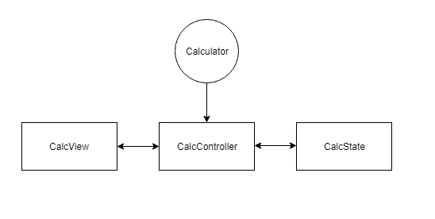

# “几乎”用普通 JS 编写的 MVC 计算器

> 原文：<https://dev.to/corvusetiam/mvc-calculator-in-almost-vanilla-js-2g94>

[](https://codesandbox.io/s/determined-fire-8lh4i?fontsize=14)

# 是给谁的？

*   Javascript ★★★☆☆
*   打字稿
*   HTML ★☆☆☆☆
*   CSS ★☆☆☆☆

# 一点点打字稿的爱情

首先，我应该解释一下我所说的“几乎”普通 JS 是什么意思。我指的是 Typescript，它是 webdev 中少有的好东西之一。

> 但是，但是...那不是香草 JS！？

已经够近了。别担心，我不会在纯类型中使用某种类型级别的魔法来实现 TicTacToe，我还不够疯狂，也不够聪明。如果你找的是爱写`angry Lisp`的人，长这样:
`Pick<ComponentProps<T>, Exclude<keyof ComponentProps<T>, 'key'`

一堆尖尖的括号。不，没有这种东西。只有半复杂的东西我们会用到枚举和类型注释。两者都非常易读，也很容易理解。

如果你从未见过 enum，这就是你如何用普通 JS
编写的

```
const Color = Object.freeze({
   RED : 0,
   GREEN : 1,
   BLUE : 2
}); 
```

上面加了一些`Object.freeze`。它们让我们更容易理解，你想要传递什么确切的值。弦乐已经过时了。说真的，字符串很慢，很难搜索。使用 enums Luke！。

类型注释看起来像这样:

```
function sum(a: number, b: number) : number { return a + b; } 
```

有什么意义？关键是，如果你把 string 传递给这个函数，typescript 编译器会对你生气，如果你想改变代码中的任何东西，它会在每一个错误上对你大喊大叫。

我不知道你怎么想，但是如果我搞砸了，我更喜欢编译器对我大喊大叫，因为否则这种混乱很可能会出现在我或你的浏览器中。

每个人都会犯错...而且 VS 代码里的 autocompletition 也太好了。

# 打字稿爱-关

现在，我们将需要设置一切...天啊。好吧，我只是在开玩笑。只需点击这篇博文顶部的这个大按钮。它会为你打开 [codesandbox.io](//codesandbox.io) 编辑器，非常酷。
它支持来自 Vs 代码的大部分内容(他们共享编辑器部件)，运行速度非常快，并且会使整个设置变得轻而易举。
如果出于某种原因，你不习惯使用这项服务，而更喜欢把所有东西都放在自己的机器上。

> (嘶，你是什么？一些穴居者？在这个时代，当我们在社交媒体上过度分享我们生活中的每一个细节时，我们所有的数据都在云上。
> )。别担心。我支持你！

您可以使用这些命令归档完全相同的内容。

> npm init
> npm 安装包裹生成器类型脚本
> tsc - init
> 包裹。/.超文本标记语言

每次你使用 NPM 的时候，都会出现这种情况，当你下载了半个互联网后，在你的浏览器中打开 localhost。对我来说是 [localhost:1234](https://dev.tolocalhost:1234)

现在打开你的 html 文件。它很可能是空的。
因为不是 HTML+CSS 教程就抄这个吧。

```
<html>
  <head>
    Parcel Sandbox
    <meta charset="UTF-8" />
  </head>

  <body>
    <style>
      .grid {
        display: grid;
        width: 300px;
        height: 300px;
        grid-template-rows: 90px 90px 90px 90px;
        grid-template-columns: 90px 90px 90px;
      }
    </style>
    <div id="app">
      <label for="calcValue">Value: </label>
      <input type="text" id="calcValue" />
      <button class="op" data-op="eq">=</button>
      <p>
        Current operator:
        <span id="currOp"></span>
      </p>
      <div class="grid">
        <button class="num">0</button>
        <button class="num">1</button>
        <button class="num">2</button>
        <button class="num">3</button>
        <button class="num">4</button>
        <button class="num">5</button>
        <button class="num">6</button>
        <button class="num">7</button>
        <button class="num">8</button>
        <button class="op" data-op="plus">+</button>
        <button class="num">9</button>
        <button class="op" data-op="minus">-</button>
      </div>
    </div>

    <script src="src/index.ts"></script>
  </body>
</html> 
```

但是我不知道...！

有几件事，我得解释一下。好了，开心了吧？

*   一切 CSS 和`display:grid` -只要去 CSS tricks[CSS 网格的完整指南](https://css-tricks.com/snippets/css/complete-guide-grid/)
*   属性-那些是用户定义属性。在 MDN 上有关于它们的很酷的指南。你可以用`html_element.dataset.op`在你的 JS 中访问它们，它们可以为你的应用保存一些状态和数据。
*   那是给你的包裹。它会自动检测并为您生成资源。它超级酷，速度也很快。比 webpack 更容易使用。

我使用类是为了非文体目的。如果你想让它完全符合犹太教规，只需把那些`num`和`op`类分别改成`data-attributes`。

# 时间开始，真实！

现在是做一些 JS 的时候了。但首先，我先说说设计。

[](https://res.cloudinary.com/practicaldev/image/fetch/s--LSBjayMf--/c_limit%2Cf_auto%2Cfl_progressive%2Cq_auto%2Cw_880/https://i.ibb.co/PrQ4W13/diagram.png)

这并不漂亮，但它解释了我打算做什么。
首先有`Calculator`，这是我们的切入点。

它加载出`application`。它负责创建我们的控制器。
这是 master 类，应该包含了所有的逻辑。

`CalculatorView`负责设置所有事件处理程序，用 DOM 进行样式化和可能的所有操作。

`CalculatorState`应该尽可能简单明了。让这些东西负责获取数据，将数据存储到本地存储器中是有意义的。
我是说一般的国家管理。它不应该有太多的逻辑。简单的更好！

为什么不直接放到一个类里呢？这种设计使得以后解开你的代码并扩展它变得更加容易。它也更容易阅读。缺点是，它更长，程序更少...

## 计算器 App

让我从最容易的部分开始。

```
 enum Op {
    Eq = 'eq',
    Minus = 'minus',
    Plus = 'plus'
};

function calculator_app() {
    //// setup view
    //// setup state
    ///  setup controller
}

calculator_app(); 
```

仅此而已。休息将在教室内进行。另外，我添加了 enum，它将代表所有按钮，而不是数字。目前我们只支持 3 个操作。

现在输入`View`

## 计算器视图

我将使用类。它们与 ES6 的大部分相同。你可以把它改成老派的功能和一堆原型。会完全一样的。我们不会在这里使用任何花哨的功能。

```
class CalculatorView { 
```

现在有一件事。我们需要为成员变量声明类型。
这些应该是不言自明的。
在`:`之前你有名字，在你的变量的类型之后。正如您可能已经猜到的，它们中的大多数是不同 DOM 元素的类型。这非常有用，因为稍后我们会看到很酷的自动完成功能。

这里唯一未知的是`CalcController`。这还没有定义，但是如果你记得那个小图，那是一个地方，一切都会发生。

```
 root: Element;
  controller?: CalcController;
  input: HTMLInputElement;
  current_op: HTMLParagraphElement; 
```

```
 constructor(root: Element) {
    this.root = root;
    this.input = this.root.querySelector("input#calcValue") as HTMLInputElement;
    this.current_op = this.root.querySelector(
      "#currOp"
    ) as HTMLParagraphElement;
  }

  init() {
    this.root.addEventListener("click", ev => this.click(ev));
  } 
```

一些初始化。没什么超级重要的。唯一让你觉得奇怪的是，我只为整个`CalcApp`设置了一个事件处理程序。
你可以为每个按钮设置相同的处理程序。坦白地说，我发现它更难阅读。
在这里，我依赖于一些并不总是被完全理解的东西，也许值得单独发布- [事件冒泡](https://developer.mozilla.org/en-US/docs/Learn/JavaScript/Building_blocks/Events#Bubbling_and_capturing_explained)从底层 DOM 元素到它们的父元素等等。

```
 click(ev: Event) {
    const target = ev.target as HTMLElement;
    if (target.classList.contains("num")) {
      this.controller.handle_digit(target.innerText);
    } else if (target.classList.contains("op")) {
      const op : Op = target.dataset.op;
      switch (op) {
        case Op.Minus:
        case Op.Plus:
          this.controller.handle_bin_op(op);
          break;
        case Op.Eq:
          this.controller.handle_eq();
          break;
      }
    }
  }

  set_current_op(op?: Op) {
    if ( op !== undefined ) {
       this.view.current_op.innerText = op.toString();
    }
  }

  set_input(inp: string) {
    this.view.input.value = state.input;
  }
} 
```

以及我们的事件处理程序。没什么复杂的。我使用`as`操作符将(`cast`)类型从默认的`EventTarget`更改为`HTMLElement`。
所有真正的工作都发生在控制器内部。

## 计算器状态

现在，是时候做另一个简单的组件了。只是这次有点小变化。

```
type State = {
  op?: Op;
  values: number[];
  input: string;
}; 
```

首先我们将定义新的类型化对象。小符号`?`告诉你，这个值可能是未定义的。
我们为什么需要它？在当下会更加明显。相信我。

```
class CalcState {
  controller?: CalcController;
  state: State;

  constructor() {
    this.state = {
      values: [],
      input: ""
    };
  }

  update_state(callback: (old: State) => State) {
    const state = callback({
      op: this.state.op,
      input: this.state.input,
      values: [...this.state.values]
    });

    this.state.values = state.values;
    this.state.op = state.op;
    this.state.input = state.input;

    this.controller.render(this.state);
  }
} 
```

在这里我们放置其余的状态类。为什么我要这样设计它？实现 MVC 模式的方法有很多。当然，我们可以继续使用 Java 风格的 getters 和 setters。坦白地说，那会更容易。我走了一条有点不同的路线。
为什么？因为这样更容易调试。你有更少的失败点，可以把你所有的检查放在一个地方。它让你尽可能简单地看待逻辑。在更复杂的应用程序中，View 将负责模板化，并将所有数据从状态推送给用户。

状态是你的数据。这是整个应用程序最重要的部分，即使它不会做太多。
每次，当你想改变状态时，你应该在回调中进行更新。
这也是一个原因，要制作附加的`State`式。

坦率地说，整个`CalcState`类可以是完全通用的，适用于任何类型的状态。
有一个重要的细节。

> 意大利面很棒...吃晚饭！

当你想改变什么在我们看来，你不应该直接调用它。国家甚至不应该知道你的观点。所有的交流都应该使用控制器，否则你可能会让意大利面之神非常生气。

## 计算器控制器

现在我们最大最复杂的类。
`CalcController`，一切运作的主谋。

```
class CalcController {
  view: CalcView;
  state: CalcState;
  handlers: OperationMap;
  constructor(state: CalcState, view: CalcView) {
    this.state = state;
    this.view = view;
    this.state.controller = this;
    this.view.controller = this;

    this.view.init();
  } 
```

首先进行一些初始化，并将控制器实例传递到状态和视图中。我们也初始化我们的视图。

```
 handle_bin_op(op: Op) {
    this.state.update_state(state => {
      state.op = op;
      if (state.input === "") {
        return state;
      }
      state.values.push(Number(state.input));
      state.input = "";
      console.log(state);
      return state;
    });
  }

  handle_digit(digit: string) {
    this.state.update_state(state => {
      if (state.input === "" || state.input === "0") {
        state.input = digit;
      } else {
        state.input = state.input + digit;
      }
      return state;
    });
  }

  handle_eq() {
    this.state.update_state(state => {
      if (state.values.length === 0) {
        return state;
      }

      if (state.input !== "") {
        state.values.push(Number(state.input));
      }

      const a = state.values.pop();
      const b = state.values.pop();
      console.log("%s %d %d", state.op, b, a);
      if (state.op === Op.Plus) {
        state.input = (a + b).toString();
      } else if (state.op === Op.Minus) {
        state.input = (b - a).toString();
      }
      return state;
    });
  } 
```

其余的逻辑。看，我们没有改变任何状态数据或直接查看数据。所有的东西都整齐地连接在一起。

```
 render(state: State) {
    this.view.set_current_op(state.op.toString())
    this.view.set_input(state.input);    
  }
} 
```

这是我们更新整个视图唯一地方。

## 有什么意义？

好的，我的反应为我做了所有的事情。它工作正常。我为什么需要这样的东西？

看看我们的状态是怎么实现的，我们的更新。React 在引擎盖下的工作方式类似。尝试在 React 中重新实现它。看，会有多像。当然，它将全部在一个类中，甚至在一个函数中。

事情是了解所有这些，你可能会更好地理解，没有单一的方法，你的反应/Vue/任何其他东西都不是魔术，对于小项目，你不需要所有这些。

我最近发现了一个非常酷的工具，甚至还写了一个简短的指南，叫做 Svelte。它超级酷，因为它将生成我在这里向你展示的大部分内容。写一点点修改的 JS，你会得到整个超级小的东西，而且是免费的。

我很想听听，你觉得我的文章怎么样。

干杯！