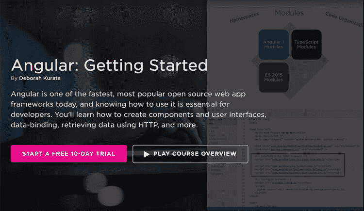
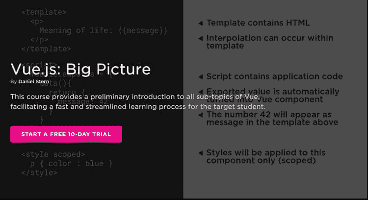
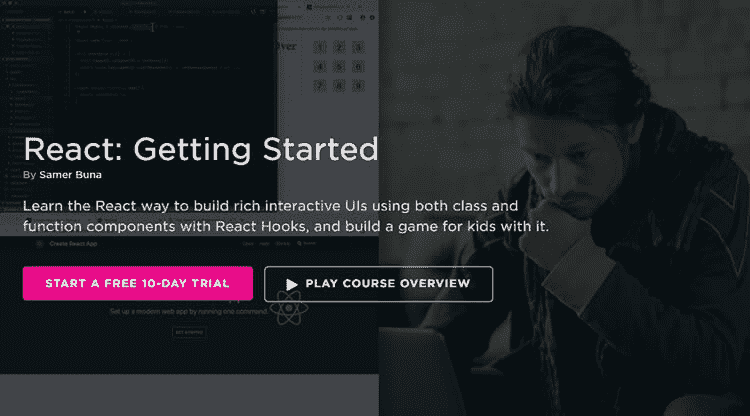
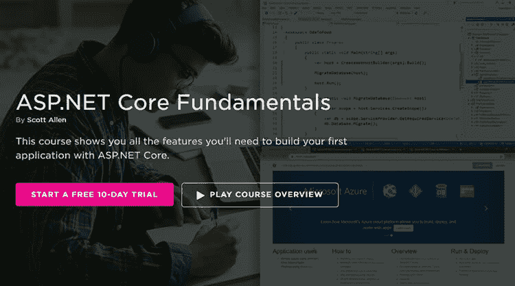
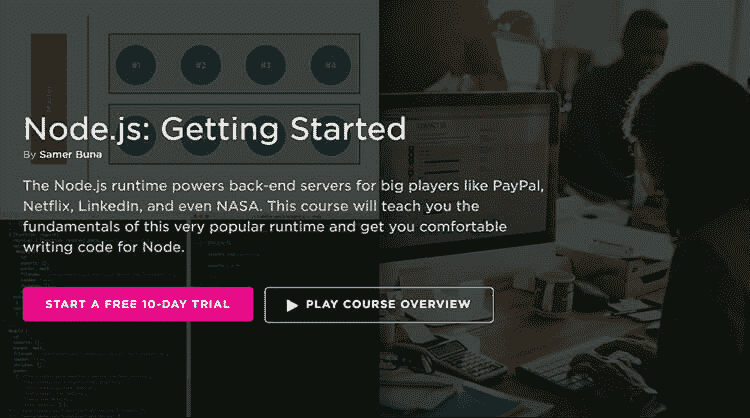
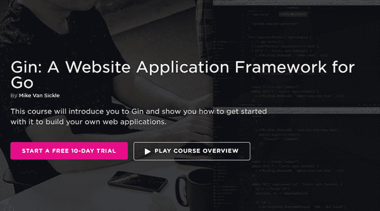
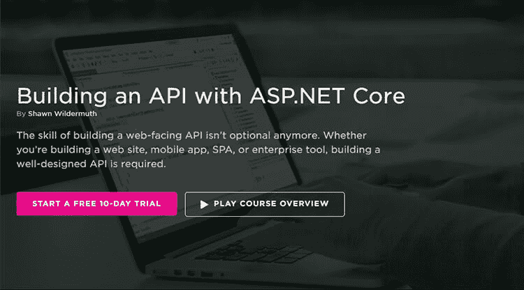
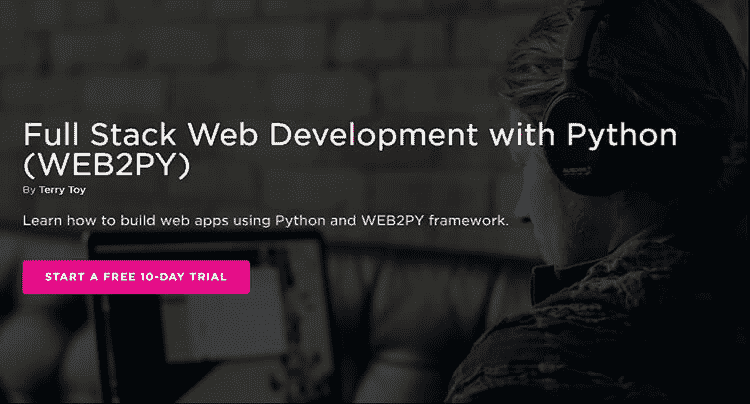
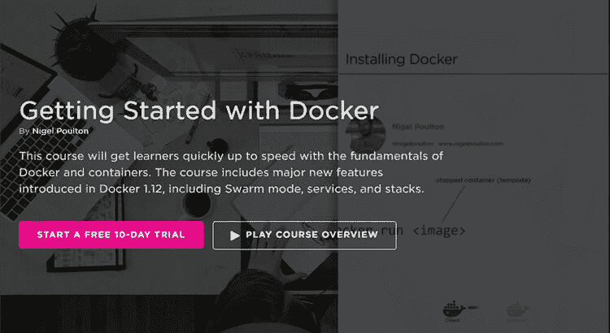
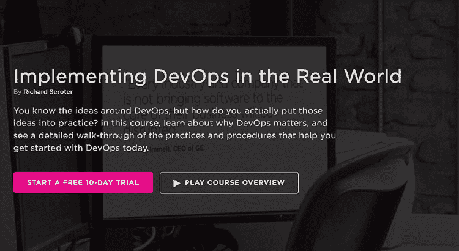

# 我最喜欢的 10 门网络开发课程

> 原文：<https://dev.to/pluralsight/my-10-favorite-web-development-courses-2ifg>

自从 2011 年我的经理建议我注册 Pluralsight 以来，我已经和他们一起上了很多课程。它在很多方面指导了我的职业生涯。我甚至在 2016 年[成为了 Pluralsight 作者](http://bit.ly/2lJ630g)。很多次我的工作流程都是“我需要学习 _ _ _ _ _ _ _ _***”而我的下一步是“我要上 _*** _______”的课程。以下是我这些年来参加的一些我最喜欢也最有帮助的课程。

* * *

## 1。角度:入门

我特别指出这一点，因为它对我有很大帮助。几年前，我计划构建的一个应用程序需要用 Angular 来构建。一个问题是:我是一名 C#开发人员，我不知道 Angular，但我必须领导这个项目。因此，我参加了这个课程，开始构建“有趣的”角度应用程序，并真正理解它。

从那以后 Angular 发生了很大的变化，这个课程也相应地更新了(不到一个月前)，所以我强烈建议你去看看。

### [现在就开始上棱角分明的入门课程吧！](http://bit.ly/2k1RW5S)

* * *

## 2。vue . js:大图片

我一直对 Vue.js 非常好奇，为什么人们这么喜欢它。这个课程让我对 Vue 有了很好的了解，我可以直接开始构建东西。这更多的是一门高水平的课程，也是 Vue 的一个很好的起点。

### [马上参加 Vue.js 大图课程吧！](http://bit.ly/2k1RW5S)

* * *

## 3。反应:开始

除非你一直生活在岩石下，你听说过 React，它有多棒。你现在就可以开始学习 React，如果你已经学过 React，有很多课程可以让你变得更高级。但这是开始的地方。

### [现在就参加 React:入门课程！](http://bit.ly/2m3rzx9)

* * *

## 4。ASP.NET 核心基本面

企业软件无处不在，比以往任何时候都更受欢迎。ASP.NET 核心应用程序非常适合它。如果你想成为企业的超级明星，这是一个绝佳的起点。

### [立即参加 ASP.NET 核心基础课程！](http://bit.ly/2lYLFsd)

* * *

## 5。Node.js:入门

节点是发展的未来，也是现在。不了解这一点，你就不可能成为一名有效的 web 开发人员，一旦你了解了这一点，你会感到更加强大。

如果你想变得更高级，有一个很好的[节点路径](http://bit.ly/2m3rSbh)可以让你达到精通。

### [立即参加 Node.js:入门课程！](http://bit.ly/2lEpLKL)

* * *

## 6。Gin:一个面向 Go 的网站应用框架

Golang 很棒，杜松子酒让它更棒。这是一个非常棒的框架，可以帮助你快速轻松地开发 web 应用程序。如果你想用 Golang 做网页开发，这个课程是必须的。

### [现在就把 Gin 框架拿来进行围棋课程吧！](http://bit.ly/2lIuA5D)

* * *

## 7。使用 ASP.NET 核心构建 API

我花了很多年来构建 ASP.NET web API，你所能构建的东西令人惊叹。现在你可以用。NET 核心并构建具有超快的性能的 API 和微服务。这是开始的地方。

### [现在就参加 ASP.NET 核心课程的构建 API 吧！](http://bit.ly/2lYMfWV)

* * *

## 8。使用 Python 的全栈 Web 开发(WEB2PY)

Python 是后端开发的绝佳选择。如果您想将 Python 用于您的 web 应用程序，这是您应该学习的课程。它向您展示了如何使用 Python 和 WEB2PY 框架构建 web 应用程序。很棒的东西。

### [马上参加 Python 全栈 Web 开发(WEB2PY)课程吧！](http://bit.ly/2lCpEPS)

* * *

## 9。Docker 入门

如果你要为 web 开发，你会使用 Docker。这并不像看起来那么难，本课程将帮助您为使用 Docker 做好准备。如果你已经使用了 Docker，并想获得更高级的课程，有大量的高级课程可供选择。

### [立即参加 Docker 入门课程！](http://bit.ly/2lGCbly)

* * *

## 10。在现实世界中实现 DevOps

现在每个人都是 DevOps 人。作为一名开发人员，您至少需要了解 DevOps 的基础知识，这是一个很好的起点。如果你已经有了一些 DevOps，有一整套课程可供你选择。

### [现在就参加现实世界中的实施 DevOps 课程吧！](http://bit.ly/2m3sYnp)

* * *