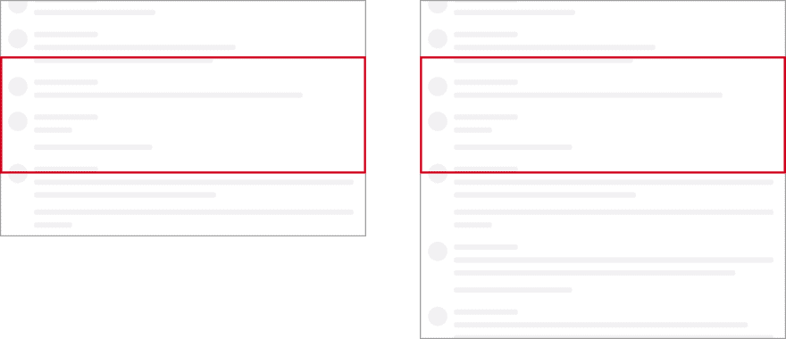
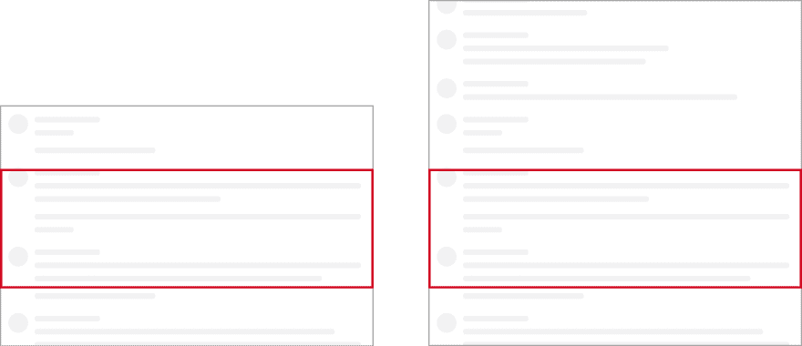

# 我写跨平台虚拟化列表的冒险经历

> 原文：<https://dev.to/calebmer/my-adventures-writing-a-cross-platform-virtualized-list-4l90>

我写了一个虚拟化列表！这真是一次冒险。

我正在开发一个跨平台的 React Native 应用程序，它也可以通过 [React Native Web](https://github.com/necolas/react-native-web) 在网络上运行。现有的虚拟化列表都不适合我想要构建的产品。不是 [`FlatList`](http://facebook.github.io/react-native/docs/0.59/flatlist) ，不是 [`react-window`](https://react-window.now.sh) 。

因此，正如一个人所做的，我写了自己的虚拟化列表。分叉反应在这个过程中自然发生。你可以在一个 [public gist](https://gist.github.com/calebmer/2a3bf40baa929115e7f985f876effb6f) 中看到最终的代码。

我将在这篇文章中描述我的整个冒险经历。通过我的经历，我希望能启发你控制你的代码。如果写一个虚拟化列表，或者其他任何东西，能让你的用户生活得更好，你应该去做！您不需要绑定到现有的库。你有权力在你认为合适的时候派生和修改依赖关系。不要害怕陌生的东西，如果有人写了一个虚拟化列表，那么没有理由你不能！

[](https://i.giphy.com/media/12vJgj7zMN3jPy/giphy.gif)

这是一个分为四部分的故事。

*   第 1 部分:产品
*   第 2 部分:当我意识到现有的虚拟化列表不起作用时…
*   第 3 部分:它如何工作
*   第 4 部分:派生本地反应

## 第一部分:产品

我正在开发一个 React Native Web/iOS/Android 应用，它基本上是一个论坛。一个论坛有帖子，然后人们可以在那个帖子上发表评论。

如果你是第一次阅读这篇文章，你会想要阅读第一条评论并向下滚动*到*。如果你在回复后赶上了讨论，你会想要阅读最新的评论并向上滚动*。*

 *所以我需要一个支持双向滚动的虚拟列表。我想到了，我相信，是一个新的用户界面模式:浏览列表！无限名单的姐妹。

在略读列表中，我们为列表中的所有项目预先分配空间。当用户滚动到列表中的某个位置时，我们在该位置加载项目。所以如果我在列表中滚动 50%,我会在列表的中间加载条目。如果我滚动到列表的末尾，我将加载列表末尾的项目。

这是网上的浏览列表。在手机上也是如此。

这些 gif 被减速，我在录制时添加了网络节流，这样你就可以真正看到渐进的加载行为。当你拿到它的时候，它真的很快很滑。

*   [**从上到下滚动**](https://calebmer.com/asseimg/my-adventures-writing-a-virtualized-list/scroll-down.gif)
*   [**从底部滚动到顶部**](https://calebmer.com/asseimg/my-adventures-writing-a-virtualized-list/scroll-up.gif)

正如您可能想象的那样，这个列表还允许您滚动到列表中的任意位置并四处移动。

## 第 2 部分:当我意识到现有的虚拟化列表不起作用时…

我第一次尝试使用 React Native 的 [`FlatList`](http://facebook.github.io/react-native/docs/0.59/flatlist) 。

这工作很好，我能够实现一个列表，你可以向下滚动，并在下面加载评论。这就是`FlatList`优化的目的。然而，我还需要在向上滚动*的同时跳到结尾并加载评论的能力！`FlatList`不适合这种情况。*

 *接下来我探索了 [`react-window`](http://react-window.now.sh) 。乍一看，库显然不行。为了`react-window`，你需要提前知道你所有物品的高度。因为我在一个帖子上做评论，所以我有办法知道物品的高度！

有一个 PR 开放给[为`react-window`](https://github.com/bvaughn/react-window/issues/6) 添加一个动态大小的虚拟化列表，但是它还没有被合并。

当列表中的项目滚动到视图中时，我需要增量加载它们，当项目加载时，我需要闪烁占位符。我不能用`FlatList`做这些，但我可以用未合并的`react-window`公关！然而，我需要一个能够在 React 原生 iOS 和 Android 上运行的解决方案。`react-window`仅指网络。

嗯，这意味着我需要编写自己的虚拟化列表。

## 第三部分:工作原理

我的虚拟化列表的工作方式是获取一篇文章的总条目数(在本例中是评论数),并获取所有评论的数组。我将这个数组表示为一个稀疏数组。这意味着数组中任何没有加载注释的位置都将是`undefined`。

```
type Props = {
  commentCount: number;
  comments: ReadonlyArray<CommentID | undefined>;
}; 
```

对于所有未加载的注释，我呈现了一个名为`<CommentShimmer>`的占位符组件。评论闪烁呈现灰色方框，看起来像是在交谈。不同的评论微光有不同的高度。我用大致类似于`commentShimmerHeight * commentCount`的代码测量了滚动视图的总高度。

我使用一种非常标准的虚拟化列表技术。同一个`react-window`用的:绝对定位。我添加了一个[滚动事件监听器](https://gist.github.com/calebmer/2a3bf40baa929115e7f985f876effb6f#file-postvirtualizedcomments-tsx-L239)，它计算屏幕上的评论。然后我使用[绝对定位](https://gist.github.com/calebmer/2a3bf40baa929115e7f985f876effb6f#file-postvirtualizedcomments-tsx-L772-L773)来确保评论被呈现在虚拟化列表中的正确位置。

所以每当用户滚动时，我:

*   确定要呈现哪些评论。
*   只呈现*那些评论，卸载任何屏幕外的评论。*
*   使用绝对定位在列表中定位呈现的注释。

这只在我知道列表中所有评论的大小时才有效。我知道未加载评论的高度，因为它们只是`<CommentShimmer>` s。然而，当一个评论加载时，它可能有一个完全不同的高度！

当一个评论加载时，我需要测量它。因为我使用 React Native，所以我必须异步测量。因此，当注释被加载但没有被测量时，我将`<CommentShimmer>`和`<Comment>`并排显示。用`opacity: 0`隐藏了`<Comment>`。一旦我们测量了`<Comment>`，我们就可以去掉`<CommentShimmer>`并更新列表的高度。

因此，任何注释都可能处于三种状态:

```
// State 1: Unloaded Comment
<>
  <CommentShimmer />
  {null}
</>

// State 2: Loaded but Unmeasured Comment
<>
  <CommentShimmer />
  <View style={styles.hidden} onLayout={handleCommentLayout}>
    <Comment />
  </View>
</>

// State 3: Loaded and Measured Comment
<>
  {null}
  <View style={null}>
    <Comment />
  </View>
</> 
```

你可以在`renderItem()`函数中看到这个[。](https://gist.github.com/calebmer/2a3bf40baa929115e7f985f876effb6f#file-postvirtualizedcomments-tsx-L767-L800)

## 第四部分:分叉反应原生

好的，在这一点上，这个列表是有效的，而且非常有效。然而，有几个我无法修复的错误。我不仅仅想要一个好的 T2 体验，我还想要一个完美的 T4 体验。这让我想到了 fork React Native，这样我就可以给`<ScrollView>`添加一个特性。

首先，让我描述一下这个 bug。

当滚动视图的内容调整大小时，平台(在这种情况下是 Web 或 iOS)需要确定新的滚动位置应该在哪里。通常，滚动位置以从滚动视图顶部开始滚动的像素数来度量。因此，当内容调整大小时，这个数字通常保持不变。请参见下图中的示例。

[](https://res.cloudinary.com/practicaldev/image/fetch/s--JPW1ryaV--/c_limit%2Cf_auto%2Cfl_progressive%2Cq_auto%2Cw_880/https://calebmer.com/asseimg/my-adventures-writing-a-virtualized-list/pin-window-to-top.png)

我们改变了滚动内容的大小，但是滚动窗口(红框)与滚动视图顶部的距离保持不变。

这在大多数情况下都能很好地工作，但是当用户从下到上滚动时就不行了。这是因为当我们加载大量注释时，虚拟化列表的大小会发生变化。我们在用户阅读内容的“上方”添加内容，将用户阅读的内容推出或拉出视窗。

相反，我们想要的是将滚动窗口固定在滚动视图的底部。因此，当我们添加新内容时，滚动窗口到滚动视图底部的距离保持不变。请参见下图，了解不同之处。

[](https://res.cloudinary.com/practicaldev/image/fetch/s--5mWgHe96--/c_limit%2Cf_auto%2Cfl_progressive%2Cq_auto%2Cw_880/https://calebmer.com/asseimg/my-adventures-writing-a-virtualized-list/pin-window-to-bottom.png)

所以我分叉 React Native 加了`pinWindowTo`道具。当设置为`pinWindowTo="top"`时，我们使用默认行为。当设置为`pinWindowTo="bottom"`时，它使用前一幅图像中描述的行为。

这是 iOS 上`ScrollView`组件的 Objective-C 代码中提交的重要部分[。](https://github.com/calebmer/react-native/commit/8874509405acda979d61504c53cfad4545cae458)

```
 // offset falls outside of bounds, scroll back to end of list
       newOffset.y = MAX(0, newContentSize.height - viewportSize.height);
     }
   }

+  if (![self.pinWindowTo isEqualToString:@"bottom"]) {
+    CGFloat oldOffsetBottom = oldContentSize.height - (oldOffset.y + viewportSize.height);
+    newOffset.y = newContentSize.height - viewportSize.height - oldOffsetBottom;
+  } 
   BOOL fitsinViewportX = oldContentSize.width <= viewportSize.width && newContentSize.width <= viewportSize.width;
   if (newContentSize.width < oldContentSize.width && !fitsinViewportX) {
     CGFloat offsetHeight = oldOffset.x + viewportSize.width; 
```

我目前还没有一个 Android 实现，这就是为什么我还没有把这个反馈给 React Native。与此同时，这对我很有用！

我还在我的 [React Native Web fork](https://github.com/calebmer/react-native-web/commits/master) 上实现了这个特性。

```
_pinWindowToBottom() {
  const element = this.getScrollableNode();

  const lastScrollTop = this._lastScrollTop;

  const lastScrollHeight = this._lastScrollHeight;
  this._lastScrollHeight = element.scrollHeight;

  const lastClientHeight = this._lastClientHeight;
  this._lastClientHeight = element.clientHeight;

  const lastScrollBottom = lastScrollHeight - (lastScrollTop + lastClientHeight);
  const nextScrollTop = element.scrollHeight - element.clientHeight - lastScrollBottom;

  element.scrollTop = nextScrollTop;
  this._lastScrollTop = nextScrollTop;
} 
```

我在我的 [React Native fork](https://github.com/calebmer/react-native/commits/0.59-stable) 中做的其他改变:

*   修复了 [React bug](https://github.com/facebook/react/issues/15732) 直到 React 和 React Native 发布新版本。
*   在滚动事件中发送 [iOS `adjustedContentInset`](https://developer.apple.com/documentation/uikit/uiscrollview/2902259-adjustedcontentinset?language=objc) ，因为这对于精确测量 iPhone X 上的“不安全区域”非常重要

我在我的 [React Native Web](https://github.com/calebmer/react-native-web/commits/master) fork 中做的其他更改:

*   在微任务中触发`onLayout`而不是`setTimeout()`，这样它会在下一次浏览器绘制之前触发。这对我的虚拟化列表双渲染策略非常重要！
*   移除不安全的生命周期方法，比如`componentWillReceiveProps`，这样我就可以在我的应用中启用 React 并发模式。

### 在防守中分叉

派生您的依赖项经常被恶意中伤，这是有充分理由的。如果没有足够的维护，您的分叉将落后于您的依赖项的最新版本。您将错过关键的错误修复和安全补丁！

当我分叉时，我非常小心，以确保未来有一个清晰的升级路径。

*   我只做小改动。更改应该只涉及几个文件，并且应该有很好的文档记录。
*   我只做我有理由期望有一天会合并到上游的变更。这样就有一条离开岔道的路。
*   我只会做一些我不希望被合并到那些没有积极维护的项目中的改变。

一旦我确信这种改变不会让未来的升级变得太难，我就放弃。然后我就有了向上游提出分叉变更的标准。

*   变更是否经过测试？
*   变更有记录吗？
*   我可以在生产应用程序中展示变更吗？
*   我可以向贡献者证明这种变化吗？

这是大量的工作，并减缓航运。对我来说，在 fork 上生活几个月并立即为用户修复 bugs】比让用户等待几个月以获得适当的开源版本更有价值。

开源最大的好处是它是开放的。你有权修改你的依赖关系。这是一种危险的力量，但如果你明智地使用它，你可以提供别人无法提供的出色的用户体验。

## 结论

作为开发人员，我们有如此多的工具来提供出色的用户体验。当你遇到一个特别棘手的问题时，不要害怕跳出框框思考。对我来说，写我自己的虚拟化列表是建立我想要的体验的最好方式。

也不要害怕分叉你的依赖。是的，它很危险，是的，如果你不小心的话，它会让你的生活变得更艰难，但是它也是一个非常强大的工具。认识到风险，并在适当的时候使用它。

我把我的虚拟化列表的代码放在一个要点中。我目前不打算把它变成一个可重用的开源组件。那不是我的目标。我的目标是为我的用户提供独特的体验。**