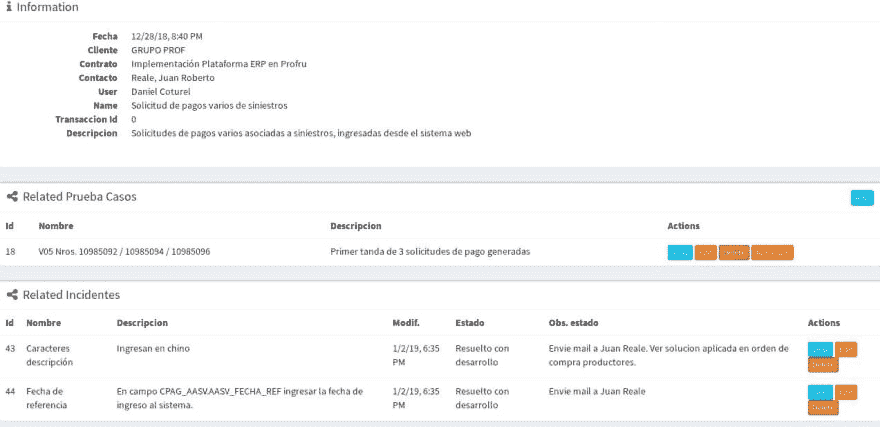

# 我测试文档的方法

> 原文：<https://dev.to/elcotu/my-approach-to-testing-documentation-3199>

大家好，

在过去的几周里，我一直在思考一个好的非自动化测试工作流程。主要是验收测试，因为我团队工作流程的很大一部分是在开发结束后和用户一起测试。所以，我有一个小的内部软件，我用它来跟踪客户的活动。要求，生活合同，门票等..几个月前，我开发了一个记录测试的地方。在那里，您记录客户、合同、客户对测试的责任、测试中的业务交易，然后您记录:

1.  测试中的测试用例
2.  检测到的与每个案例相关的问题

然后，问题有一个后续工作流程。

这是目前正在使用的，但我一直想知道这是不是一个好方法，因为它基本上是以结构化方式存储在关系数据库中的纯文本。

这是一个测试的小屏幕截图:

因此，正如我所说的，我想知道我是否可以改进这个记录，以便给它更多的结构，特别是为用户工作和我的业务提供验证的能力。因此，我将这种手工实践与自动化测试联系起来，并弄明白了这一点。

我没有在任何地方映射我的断言。所以，我认为正确的方法，或者至少是更好的方法是:

1.  每个测试仍然有关于客户、合同、客户对该测试的责任、测试中的业务交易的信息

2.  在测试设计的下一步中，您声明了反映测试接受标准的断言

3.  然后你开始记录每个测试用例。对于每个测试用例与断言的组合，您声明它是否通过

4.  如果一个测试案例和断言没有通过，那么你就增加了一个或者几个问题

我的想法是:

|  | 测试案例 1 | 测试案例 2 | 测试案例 3 |
| --- | --- | --- | --- |
| 断言 1 | -好的 | -好的 | -好的 |
| 断言 2 | -好的 | X | -好的 |
| 断言 3 | -好的 | -好的 | X |
| 断言 4 | -好的 | X | -好的 |

然后测试文档会列出检测到的问题。

你见过这样的东西吗？老实说，我开发了这个，但对于一个锅炉认证小企业，几年前。它在平板电脑上运行。现在我意识到模式对于软件实现是有用的。

你好，

附注:我不会说英语，所以如果这篇文章很难读懂，请告诉我，我会尽量让它更清楚。