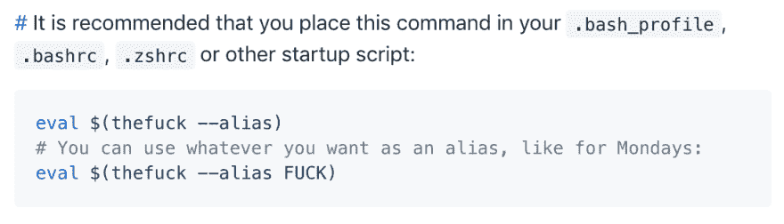
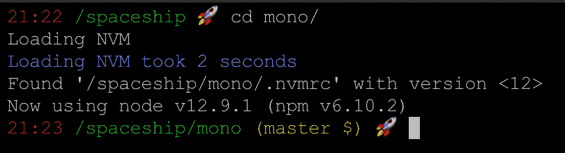

# 我的终端在拖延🙄

> 原文：<https://dev.to/omrilotan/my-bashrc-is-procrastinating-2p9o>

## 减少终端实例启动时间

我是一个性能和可观察性爱好者。我也极度不耐烦。这种特质的结合驱使我寻找方法来加速任何比绝对必要时间长一点点的过程。

### 为了提高效率，我让我的终端启动延迟了！

我希望我的终端只在需要的时候执行操作。我已经[测量了我的 bashrc 运行的一切](https://github.com/omrilotan/dotfiles)。所以我从我的 bashrc 中挑选了运行时间最长的脚本，并把它们转换成按需命令。

[](https://res.cloudinary.com/practicaldev/image/fetch/s--E1hvw-oU--/c_limit%2Cf_auto%2Cfl_progressive%2Cq_66%2Cw_880/https://raw.githubusercontent.com/omrilotan/dotfiles/master/dotfiles.gif%3Fv%3D2)

## **那个混蛋**

这个很简单。

[`thefuck`](https://github.com/nvbn/thefuck) 在纠正你之前的控制台命令方面非常出色，但是设置平均花费了我将近 700 毫秒。不可想象！

|  |
| --- |
| 来自[的故障文档](https://github.com/nvbn/thefuck#manual-installation) |

与其在终端实例启动时预先设置它，我更喜欢在需要时设置它。所以我设置了这个幂等函数:

```
function fuck {
    eval "$(thefuck --alias)"
    eval "fuck $@"
} 
```

Enter fullscreen mode Exit fullscreen mode

我第一次在实例中调用`fuck`时，它执行以下操作:

1.  用别名`fuck`设置按钮(覆盖该功能)。
2.  用所有传入的参数触发`fuck`。

因此，初始设置时间减少到 20 毫秒，随后按需使用时间达到 700 毫秒。第二次呼叫不会被击中。

## **nvm**

现在，我更经常使用 nvm，但是它花费了我超过 1.5 秒的时间。这也有点棘手——因为它加载的是一个环境，而不仅仅是一个命令。

我选择将这种等幂性添加到我使用的四个主要命令中:`node`、`npm`、`npx`、`nvm`——但是您可以轻松地添加更多。

每个命令都设置为:

1.  取消设置列表中的所有命令(加上 nvm_load 命令)
2.  加载完毕`nvm`
3.  使用所有参数调用原始命令

```
if [ -f ".nvmrc" ]; then
    # Load NVM if needed
    source "$HOME/.nvm/nvm.sh"
else
    # Set up NVM loaders
    nodecommands=(nvm npm npx node)
    function nvm_load {
        # Unset all node command decorators
        for nodecommand in "${nodecommands[@]}"; do eval "unset -f ${nodecommand}"
        done unset -f nvm_load
        if [[ -s "$HOME/.nvm/nvm.sh" ]]; then echo "Loading NVM"
            source "$HOME/.nvm/nvm.sh"
        else echo "Can't find nvm script"
        fi
    }
    # All node commands should load NVM first
    for nodecommand in "${nodecommands[@]}"; do eval "function ${nodecommand} { nvm_load; ${nodecommand}  \$@; }"
    done
fi 
```

Enter fullscreen mode Exit fullscreen mode

缺点是，除非您显式调用这些方法名中的一个，否则全局安装的 NPM 包不会工作。另一方面，如果有一个你经常使用的命令并且想加入聚会，你可以在列表中添加任何东西。

这就对了，NVM 减少到 80 毫秒，只在需要的时候占用你的时间。

既然默认情况下不包含 NVM，我们还需要在进入包含`.nvmrc`文件的目录时设置它。

```
cd() {
    dir=$@
    : ${dir:=~}

    builtin cd $dir
    if [ -f ".nvmrc" ]; then nvm use
    fi
} 
```

Enter fullscreen mode Exit fullscreen mode

[](https://res.cloudinary.com/practicaldev/image/fetch/s--2fitciem--/c_limit%2Cf_auto%2Cfl_progressive%2Cq_auto%2Cw_880/https://thepracticaldev.s3.amazonaws.com/i/e1u5cds40el50z6xmqp4.png)

* * *

你怎么想呢?加载终端实例时，是否有任何事情减缓了您的速度？