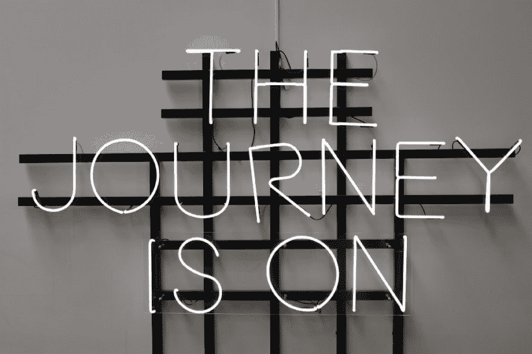

# 我的竞争性编程之旅:第 1 周

> 原文：<https://dev.to/siddhantdubey/my-competitive-programming-journey-week-1-19b9>

我喜欢编程。我喜欢竞争。我一直都是，我总是拥抱学习的快乐，这种快乐会因为竞争的感觉而增强。所以当我听说竞争性编程时，我欣喜若狂！这将详细描述我在竞争性编程世界中的旅程和进展。和我一起跳上编码列车，这将是一次有趣的旅程！

[https://medium . com/media/6f 0 c 111d 5d 11 ef 070594 e 20d 4c 348 a 09/href](https://medium.com/media/6f0c111d5d11ef070594e20d4c348a09/href)

这大概是一年前的事了，但我真的没有太当回事，直到今年夏天。我参加过一些在线竞赛，成绩相当不错。我甚至在 USACO(美国计算机奥林匹克竞赛)中获得了金牌，这是第二高的级别。在这 4-5 个月的时间里，我只是希望我不用做任何工作就能晋升，显然，这不是最好的主意。

### 什么是竞技编程？

竞争性编程是一项脑力运动。它由在一定时间内提出算法问题解决方案的个人或团队组成。一些比较著名的编程竞赛是 IOI(国际信息学奥林匹克竞赛)和 ACM-ICPC(计算机协会-国际大学生编程竞赛)。

### 我要用什么资源？

*教材:*[***Johan Sannemo***](https://www.csc.kth.se/~jsannemo/slask/main.pdf)算法解题原理

*文本编辑:* [***Visual Studio 代码***](https://code.visualstudio.com/)

*问题地点*:

*   
**   **   **

 ***### 这一周我做了什么？

好吧，这是你点击这篇文章的原因。请按照您自己的步调随意前进。

*   我浏览了课本的第一章和第二章，尽可能多地吸收了关于 C++的知识。
*   我学到了大多数竞争性编程问题是如何格式化的，以及如何切入问题的核心。
*   我在上面的问题网站上做了 50 道奇怪的题。
*   做了课本第二章的所有练习。

### **我学到了什么？**

*   C++程序的格式
*   如何将 basic 程序实现为 C++
*   Codeforces 竞赛的形式

这个星期我没有学到很多东西，因为它主要是对我已经知道的东西的复习课程，然而，下周看起来是一个完全不同的事情。

### 下周目标

1.  至少完成课本的第三章。
2.  Do 1 Codeforces 竞赛
3.  做 30 道 CSES 题
4.  做第三章关于凯特的所有练习。***