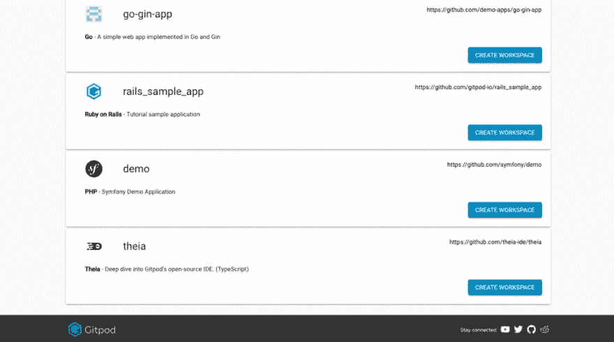
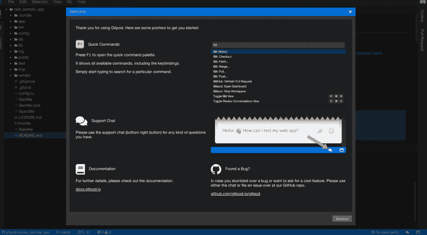
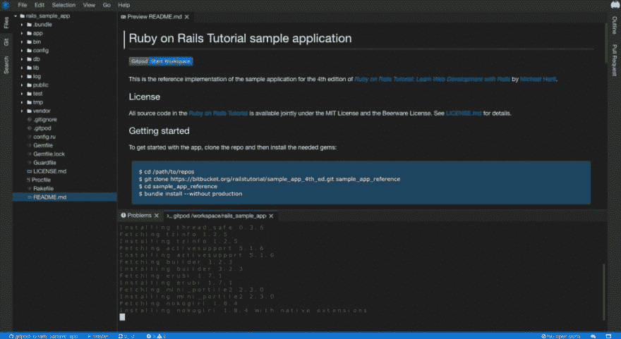

# 我使用 Gitpod Cloud IDE 的体验

> 原文：<https://dev.to/kevinhq/my-experience-with-gitpod-cloud-ide-11h2>

重要说明:Gitpod.io 不是 GitHub 的服务。他们是两家独立的公司。

截至目前，它仍处于公开测试阶段(所以没有价格)-根据他们的官方代表。Gitpod，据说是对 GitHub 的扩展，是一个在线集成开发环境(IDE)。所以基本上，它是一个云 IDE。

Gitpod 承诺为用户提供一个完全工作的开发环境。什么？另一个云 IDE？Gitpod 说它的目标不是取代桌面开发，因为承认吧，没有什么能打败老式的用户界面。

别担心，Gitpod 听到你说的了。它现在期待做的是通过 Gitpod 让 GitHub 更易访问。您不必使用仪表板来维护您的项目。Gitpod IDE 可以安全地存储您在 GitHub 上完成的任何工作。

那么，它在易用性、性能以及您在 IDE 中寻求的其他一切方面做得如何呢？

下面简单看一下。

它有一个非常合理的定价范围。他们说这不算太过分是真的。界面足够干净。这种体验正是我所需要的。问题和拉动式请求是该节目的明星。

它像其他第三方扩展一样支持 web 应用程序。

#### 1。它有一个非常合理的定价范围。

这可能是您在进入服务本身之前会遇到的一件事。注册后，Gitpod 将根据您的需求为您提供多种计划选择。价格从每个用户每月 7 美元到 21 美元不等。然而，好的一面是，你可以先选择免费计划，然后在决定长期使用该应用程序后升级。如果你也在一个团队中工作，也有一个适合你的组织的计划。

#### 2。他们说这不算太过分是真的。

Gitpod 的好处就是直奔主题。创建一个存储库是非常简单的。还有一个快速设置指南，你可以使用(以防万一你是那些刚刚开始编码的人之一)，这将帮助你开始你的文件。GitHub 没有忘记他们的桌面用户。如果你已经使用桌面版本很长时间了，你可以选择使用 GitHub 来设置你的文件。

#### 3。界面足够干净。

我是想要一个干净的用户界面的用户。所谓干净，我指的是白色背景，很少的颜色，易读的字体。按钮位于它们应该去的地方，有些按钮甚至有支持说明，以防你不熟悉它应该做什么。编码领域也将收到我的大拇指。如果你是编程新手，它的界面很像你在任何博客托管网站上看到的。

您可以使用“编辑新文件”选项卡下的一个窗口进行编码，并实时预览您所编写的内容。如果你把它和大多数桌面应用程序相比，它在界面上会有很大的不同。Gitpod 没有你通常在桌面版本中得到的所有烦人的仪表盘。总的来说，界面非常干净。

#### 4。这种经历正是我所需要的。

好的，首先要做的是创建一个工作空间。根据我的经验，用 Gitpod 启动一个新项目要比用我尝试过的其他任何云 ide 容易得多，因为后者需要其他信息，比如 Git 信息。所以基本上，Gitpod 会给你一个随时可用的工作空间，这样你就不必经历任何配置步骤。

不过，别担心。我知道作为编码人员，我们对每个项目都有不同的设置。Gitpod 完全支持这一点，它有一个过程来决定如何配置您的工作空间。

不是每个人都一样，但它会根据你需要的设置类型进行调整。

#### 5。问题和拉动式请求是该节目的明星。

我可以说问题和拉请求是 GitHub 上使用最多的特性之一。根据我的经历，我尝试从 Gitpod 仪表板页面上提供的一个问题开始工作。

我并不指望它是一个干净的石板或一个新的工作空间，但它是。已经有一个设置，我可以立即用来编码和测试。这就是问题请求部分的情况。

#### 6。它像其他第三方扩展一样支持 web 应用程序。

所以，它在云上，这意味着它存储在互联网上。但是在云中不仅仅是存储，你还可以在浏览器中编写代码。这是完全合乎逻辑的，因为作为程序员，我们在互联网上花了这么多时间，所以在网上冲浪的时候，还有什么更好的方式来带来你的工作呢，对吗？

像其他网络聚会应用一样，Gitpod 也通过扩展支持你的网站。Gitpod 表示，他们为用户添加了这个功能，只需点击一个按钮就可以创建一个工作区。

他们添加这一点是因为如果你不安装扩展，你将不得不键入一个前缀 GitHub URL 与 Gitpod.io#。跳过麻烦，只需添加它。它适用于我的 Chrome 浏览器，也支持 Firefox。微软 Edge、Safari 等没有消息。

我真诚地希望第一印象能持续下去，因为第一眼看上去，Gitpod 已经达到了我的期望，也符合它的要求。到目前为止，我还没有看到任何问题，我也在调查人们在网上使用它时是否遇到了问题...到目前为止，我发现了非常小的问题。

是的，当然，任何应用都会有问题，但 Gitpod 的好处是它有一个提供的解决方案，所以你可以马上解决它。使用 Gitpod 的人说，他们在审查时使用云 IDE 来编辑、编译和运行代码，这应该归功于它在云上运行的原因。

总的来说，有了所有这些特性，Gitpod 肯定值得一试。

下面是我从 Gitpod IDE 中截取的一些截图，尝试使用 Rails 示例应用程序。只需点击图片，在新标签页中查看大图。

## 更新

如果你打算使用他们的付费服务，你可以使用这个优惠券代码: **[KEVINHQ](https://kevinhq.com/gitpod)**

优惠券在认购 的前三个月内将认购价格降低 ***30%。***

来源:[一篇综述:Gitpod |值得一试吗？](https://kevinhq.com/a-review-of-gitpod-is-it-worth-to-try/)