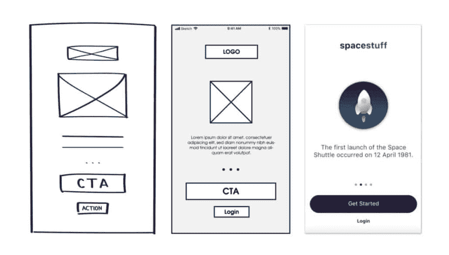

# 我对树屋 UX 赛道的体验

> 原文：<https://dev.to/johannarlee/my-experience-with-treehouse-s-ux-track-3m29>

几个月前，当我看到树屋提供 UX 曲目作为基本会员的一部分时，我就注册了。作为一名有抱负的 UX 工程师，我意识到我缺少的主要东西之一是关于 UX 设计过程的正式知识。我目前是一名自学成才的前端工程师，凭借良好的营销背景从头开始构建 ui。我对 A/B 测试和减少用户痛点略知一二。我的主要目标是填补设计中的一些空白，以及它如何融入我的日常职业。

这是一个自我指导的小视频课程系列，以设计的形式回顾了 UX 设计的所有事情，理解信息架构，设计模式，以及如何获得有用的用户反馈。每门课程都有小测验，但没有大作业要交。以下是我的三大要点:

## 开始低，变高(保真)

这听起来可能是显而易见的，但只要有可能，不要跳过设计 ui 和应用程序的低保真度线框阶段。我遇到过时间紧迫的情况，在问一个票/用户故事之外的问题之前，向我的项目经理提出最高级别的保真度(如果不是一个正常工作的 inVision 原型)似乎是最好的主意。从一个接近完成的设计开始的问题是，你的团队成员和其他利益相关者很容易在小的设计特征上分心(并最终停滞不前)；这可能会导致你需要从头开始。我学到的一个技巧是避免在你的线框中使用颜色。毕竟，颜色会引起[情绪反应](https://www.verywellmind.com/color-psychology-2795824)。

通过从布局的一般概念以及一切将如何与您的信息架构的其余部分一起工作开始，您更有可能获得实际的反馈，这将使您进入下一步，而不是从头开始。

## 将人的方面引入用户体验测试

在大学期间，我专注于社会研究和市场营销，这让我在定性和定量研究以及以调查和引导式采访的形式创建和分析用户反馈方面打下了相当坚实的基础。该专题介绍了一门课程，该课程特别有助于如何从早期阶段就获得用户对原型的反馈，以及如何分析生产中发现的趋势。也许对我来说，最有趣的收获是了解了[游击队可用性测试](https://usabilitygeek.com/guerrilla-usability-testing-how-to/)——这是一种包括在户外进行全面可用性测试的技术，就像在咖啡店里一样。当不严格地从分析中获取结果时，获得反馈不必非常正式，这一想法是我将来一定会带走的一种见解。

几乎每个人都会在某个时候遇到调查制作。我承认，除了一般的直觉之外，我有时会忽略一群人在生活中需要什么。调查是从人群中获得反馈的一种很好的方式，通常可以让你得到很好的人口统计信息和对你的产品有用的信息。开设一门课程，学习如何有效地混合封闭式和开放式问题，对于了解如何获得更广泛的反馈，而不仅仅是组织一个可用性测试小组，是非常有益的。

## 反馈是设计过程每个阶段的关键部分

这确实应该是一个*反馈在决策过程的每个阶段都至关重要*标题，但我们在这里谈论的是设计。很多时候，项目都是从宏大的、高层次的想法开始的。不足为奇的是，一个人(或一个团队)对这些想法的阐释需要来自各方的按摩，以实现符合用户需求的商业想法。在每一步都获得反馈将最大限度地减少导致糟糕的反馈和巨大的设计修改的大惊喜。

## 终审:4/5 星

总的来说，我发现这个课程很容易理解，对我的职业目标也很有用。毫无疑问，我最大的收获是我之前跳过了多少基本步骤，因为我认为有些事情是显而易见的。这条 UX 赛道对我来说是一个很好的选择，可以让我了解更多关于 UX 设计的知识，而不用报名参加真正的学位课程或训练营，因为我在传统的上课时间里没有太多的时间。如果你是一个设计新手，正在寻找一套自我指导的在线课程，这条路线可能适合你！