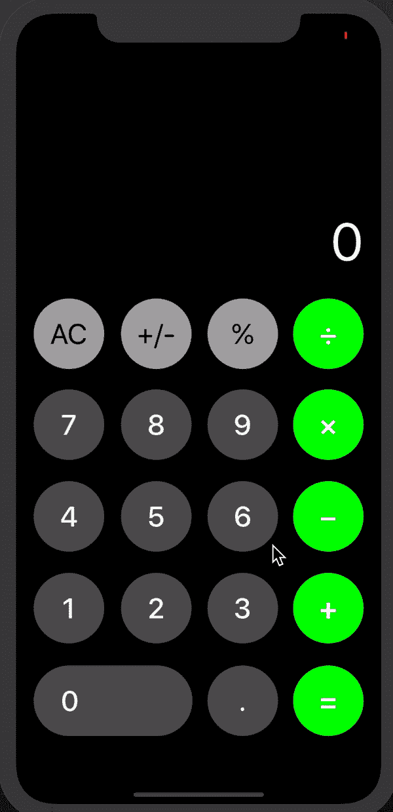

# 我的第一个应用

> 原文：<https://dev.to/casualty/my-first-app-1d38>

这是我搭建的第一个 app，感觉还不错。

[](https://res.cloudinary.com/practicaldev/image/fetch/s--A_PxCjvi--/c_limit%2Cf_auto%2Cfl_progressive%2Cq_66%2Cw_880/https://thepracticaldev.s3.amazonaws.com/i/nl3dp7v3vtnhuzh1uehi.gif)

### calculator view controller . swift

```
import UIKit

class CalculatorViewController: UIViewController {

    @IBOutlet weak var decimalButton: UIButton!

    @IBOutlet weak var subtractButton: UIButton!

    @IBOutlet weak var divideButton: UIButton!

    @IBOutlet weak var addButton: UIButton!

    @IBOutlet weak var multiplyButton: UIButton!

    @IBOutlet weak var equalsButton: UIButton!

    @IBOutlet weak var outputLabel: UILabel!

    @IBOutlet weak var clearButton: UIButton!

    @IBOutlet weak var previousAnswerLabel: UILabel!

    @IBOutlet weak var previousAnswerTitle: UILabel!

    @IBOutlet weak var copyButton: UIButton!

    var brain: CalculatorBrain?
    let xYValue = 0.75
    let durationTime = 0.15

    override func viewDidLoad() {
        super.viewDidLoad()
        previousAnswerLabel.text = nil
        previousAnswerTitle.text = nil
        brain = CalculatorBrain()
    }

    // MARK: - Action Handlers

    @IBAction func operandTapped(_ sender: UIButton) {
        UIButton.animate(withDuration: durationTime,
                         animations: {
                            sender.transform = CGAffineTransform(scaleX: CGFloat(self.xYValue), y: CGFloat(self.xYValue))
        },
                         completion: { finish in
                            UIButton.animate(withDuration: self.durationTime, animations: {
                                sender.transform = CGAffineTransform.identity
                            })
        })
        // Takes in the value of the operand tapped
        if let operandTapped = sender.titleLabel?.text {

            let buttonDoesntContainDecimal = !operandTapped.contains(".")
            let buttonContainsDecimalWithNoCurrentDecimal = operandTapped.contains(".") && !(outputLabel.text?.contains(".") ?? false)

            if buttonDoesntContainDecimal || buttonContainsDecimalWithNoCurrentDecimal {
                outputLabel.text = brain?.addOperandDigit(operandTapped)
            }
        }
    }

    @IBAction func operatorTapped(_ sender: UIButton) {
        UIButton.animate(withDuration: durationTime,
                         animations: { sender.transform = CGAffineTransform(scaleX: CGFloat(self.xYValue), y: CGFloat(self.xYValue))},
                         completion: { finish in
                            UIButton.animate(withDuration: self.durationTime, animations: {
                                sender.transform = CGAffineTransform.identity
                            })
        })
        // Takes in the value of the operator tapped
        if let operatorValueTapped = sender.titleLabel?.text {

            brain?.setOperator(operatorValueTapped)

        }
    }

    @IBAction func equalTapped(_ sender: UIButton) {
        UIButton.animate(withDuration: durationTime,
                         animations: {
                            sender.transform = CGAffineTransform(scaleX: CGFloat(self.xYValue), y: CGFloat(self.xYValue))
        },
                         completion: { finish in
                            UIButton.animate(withDuration: self.durationTime, animations: {
                                sender.transform = CGAffineTransform.identity
                            })
        })
        // Calculates the answer and sets it to the value 'answer'
        if let answer = brain!.calculateIfPossible() {
            copyButton.setTitleColor(.green, for: .normal)
            previousAnswerLabel.text = answer
            previousAnswerTitle.text = "Previous Answer"
            outputLabel.text = answer

        }

    }

    @IBAction func clearTapped(_ sender: UIButton) {
        UIButton.animate(withDuration: durationTime,
                         animations: {
                            sender.transform = CGAffineTransform(scaleX: CGFloat(self.xYValue), y: CGFloat(self.xYValue))
        },
                         completion: { finish in
                            UIButton.animate(withDuration: self.durationTime, animations: {
                                sender.transform = CGAffineTransform.identity
                            })
        })
        // Clears the calculation when tapped

        if outputLabel.text == "0" {
            clearTransaction()
            copyButton.setTitleColor(.black, for: .normal)
            previousAnswerTitle.text = nil
            previousAnswerLabel.text = nil
        }

        clearTransaction()
        outputLabel.text = "0"
    }

    // MARK: - Private

    private func clearTransaction() {

        // Clear calculation function
        brain = CalculatorBrain()

    }

    @IBAction func posNegButtonTapped(_ sender: UIButton) {
        UIButton.animate(withDuration: durationTime,
                         animations: {
                            sender.transform = CGAffineTransform(scaleX: CGFloat(self.xYValue), y: CGFloat(self.xYValue))
        },
                         completion: { finish in
                            UIButton.animate(withDuration: self.durationTime, animations: {
                                sender.transform = CGAffineTransform.identity
                            })
        })

        // Turns number negative or positive
        if var posNegNumber = Double(outputLabel.text ?? "") {
            posNegNumber = posNegNumber * -1.0
            outputLabel.text = String(posNegNumber)
            brain?.operand1String = String(posNegNumber)

        }
    }

    @IBAction func percentButtonTapped(_ sender: UIButton) {

        UIButton.animate(withDuration: durationTime,
                         animations: {
                            sender.transform = CGAffineTransform(scaleX: CGFloat(self.xYValue), y: CGFloat(self.xYValue))
        },
                         completion: { finish in
                            UIButton.animate(withDuration: self.durationTime, animations: {
                                sender.transform = CGAffineTransform.identity
                            })
        })
        // Divides by 100.0 (Double) to return the percentageNumber
        if var percentageNumber = Double(outputLabel.text ?? "") {
            percentageNumber = percentageNumber / 100.0
            outputLabel.text = String(percentageNumber)
            brain?.operand1String = String(percentageNumber)

        }
    }

    @IBAction func subtractButtonPressed(_ sender: Any) {

        // Set color for button pressed
        subtractButton.backgroundColor = .white
        subtractButton.setTitleColor(.black, for: .normal)

        // Set default colors back
        divideButton.backgroundColor = .green
        divideButton.setTitleColor(.white, for: .normal)
        multiplyButton.backgroundColor = .green
        multiplyButton.setTitleColor(.white, for: .normal)
        addButton.backgroundColor = .green
        addButton.setTitleColor(.white, for: .normal)
        equalsButton.backgroundColor = .green
        equalsButton.setTitleColor(.white, for: .normal)

    }

    @IBAction func divideButtonPressed(_ sender: Any) {

        // Set color for button pressed
        divideButton.backgroundColor = .white
        divideButton.setTitleColor(.black, for: .normal)

        // Set default colors back
        subtractButton.backgroundColor = .green
        subtractButton.setTitleColor(.white, for: .normal)
        multiplyButton.backgroundColor = .green
        multiplyButton.setTitleColor(.white, for: .normal)
        addButton.backgroundColor = .green
        addButton.setTitleColor(.white, for: .normal)
        equalsButton.backgroundColor = .green
        equalsButton.setTitleColor(.white, for: .normal)
    }

    @IBAction func multiplyButtonPressed(_ sender: Any) {

        // Set color for button pressed
        multiplyButton.backgroundColor = .white
        multiplyButton.setTitleColor(.black, for: .normal)

        // Set default colors back
        subtractButton.backgroundColor = .green
        subtractButton.setTitleColor(.white, for: .normal)
        divideButton.backgroundColor = .green
        divideButton.setTitleColor(.white, for: .normal)
        addButton.backgroundColor = .green
        addButton.setTitleColor(.white, for: .normal)
        equalsButton.backgroundColor = .green
        equalsButton.setTitleColor(.white, for: .normal)
    }

    @IBAction func addButtonPressed(_ sender: Any) {

        // Set color for button pressed
        addButton.backgroundColor = .white
        addButton.setTitleColor(.black, for: .normal)

        // Set default colors back
        subtractButton.backgroundColor = .green
        subtractButton.setTitleColor(.white, for: .normal)
        multiplyButton.backgroundColor = .green
        multiplyButton.setTitleColor(.white, for: .normal)
        divideButton.backgroundColor = .green
        divideButton.setTitleColor(.white, for: .normal)
        equalsButton.backgroundColor = .green
        equalsButton.setTitleColor(.white, for: .normal)
    }

    @IBAction func equalButtonPressed(_ sender: Any) {

        // Set color for button pressed
        equalsButton.backgroundColor = .white
        equalsButton.setTitleColor(.black, for: .normal)

        // Set default colors back
        subtractButton.backgroundColor = .green
        subtractButton.setTitleColor(.white, for: .normal)
        multiplyButton.backgroundColor = .green
        multiplyButton.setTitleColor(.white, for: .normal)
        addButton.backgroundColor = .green
        addButton.setTitleColor(.white, for: .normal)
        divideButton.backgroundColor = .green
        divideButton.setTitleColor(.white, for: .normal)
    }

    @IBAction func clearButtonPressed(_ sender: Any) {

        // Default all colors when clear button pressed
        equalsButton.backgroundColor = .green
        equalsButton.setTitleColor(.white, for: .normal)
        subtractButton.backgroundColor = .green
        subtractButton.setTitleColor(.white, for: .normal)
        multiplyButton.backgroundColor = .green
        multiplyButton.setTitleColor(.white, for: .normal)
        addButton.backgroundColor = .green
        addButton.setTitleColor(.white, for: .normal)
        divideButton.backgroundColor = .green
        divideButton.setTitleColor(.white, for: .normal)
    }

    @IBAction func copyButtonPressed(_ sender: Any) {
        outputLabel.text = previousAnswerLabel.text
        brain?.operand1String = previousAnswerLabel.text ?? ""
    }

} 
```

### 计算器 Brain.swift

```
import Foundation

enum OperatorType: String {
    case addition = "+"
    case subtraction = "−"
    case multiplication = "×"
    case division = "÷"
}

class CalculatorBrain {
    var operand1String = ""
    var operand2String = ""
    var operatorType: OperatorType?

    func addOperandDigit(_ digit: String) -> String {

        // Adds operand digit if nil
        if operatorType != nil {
            operand2String.append(digit)
            return operand2String
        } else {
            operand1String.append(digit)
            return operand1String
        }
    }

    func setOperator(_ operatorString: String) {

        // Sets the operator to it's rawValue
        operatorType = OperatorType(rawValue: operatorString)

    }

    func calculateIfPossible() -> String? {

        // Calculation for .addition, .subtraction, .multiplication, . division
                // Checking to see if oprand1String or operand2String are empty
        let numberFormatting = NumberFormatter()
        numberFormatting.usesGroupingSeparator = true
        numberFormatting.numberStyle = .decimal
        numberFormatting.locale = Locale.current

        if operand1String.isEmpty, operand2String.isEmpty, operatorType == nil {
            return "0"
        } else {
            var finalAnswer: String

            if let firstOperandNumber = Double(operand1String), let secondOperandNumber = Double(operand2String) {

                switch operatorType {
                case .addition? :
                    finalAnswer = String(firstOperandNumber + secondOperandNumber)
                case .subtraction? :
                    finalAnswer = String(firstOperandNumber - secondOperandNumber)
                case .multiplication? :
                    finalAnswer = String(firstOperandNumber * secondOperandNumber)
                case .division? :
                    if secondOperandNumber == 0 {
                        return "Nice try ;)"
                    } else {
                        finalAnswer = String(firstOperandNumber / secondOperandNumber)
                    }
                default :
                    return nil
                }

            } else {
                return nil

            }

            operand1String = finalAnswer
            operand2String = ""
            return finalAnswer
        }
    }

} 
```