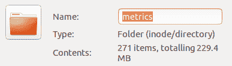
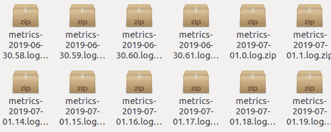
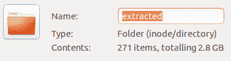

# 我的第一个没有 Hadoop 的纯 python 版本的 Map Reduce

> 原文：<https://dev.to/grozail/my-first-map-reduce-without-hadoop-in-pure-python-40hg>

# 前言

我在机器人公司(Rozum Robotics)工作。大部分时间我开发机器人和内部库的算法“内核”、公共 API([示例](https://github.com/rozum-robotics/pulse-api))或终端用户应用([示例](https://www.rcafe.biz/))。

这是我的第一篇帖子，欢迎批评:)

# 故事

长话短说:需要解析和分析相对大量的度量标准。当然，尽快。

动机:机器人被部署到生产中。软件版本稳定且经过测试，但有时机器人无法按预期执行任务。
为什么？我们不知道，这太可怕了。

最后，我们弄清楚发生了什么，并成功地修复了它。这是终端用户应用程序方面的错误。幸福的结局。

但是我想通过例子展示 Python 如何在这种情况下提供帮助。

# 输入

[](https://res.cloudinary.com/practicaldev/image/fetch/s--_wZTGAOs--/c_limit%2Cf_auto%2Cfl_progressive%2Cq_auto%2Cw_880/https://thepracticaldev.s3.amazonaws.com/i/mk3hho9grvz85kz8nbq9.png) 
[](https://res.cloudinary.com/practicaldev/image/fetch/s--zzKqHea2--/c_limit%2Cf_auto%2Cfl_progressive%2Cq_auto%2Cw_880/https://thepracticaldev.s3.amazonaws.com/i/k4oo0y0bse9ggupd0jr3.png) 
只是一些带有这样度量的 zip 文件:

```
2019-07-18 09:10:20.072 [metrics-consumer-broker-0] INFO  c.r.i.m.InLogMetricsStorageHandler - {
  "robotId": "D3E14103701D4FD7DE8B11DF7DB94723",
  "event": "DEVICE_HEARTBEAT",
  "timestamp": 1563441019902,
  "payload": {
    "device": 37,
    "state": "OPERATIONAL"
  }
}
2019-07-18 09:10:20.072 [metrics-consumer-broker-0] INFO  c.r.i.m.InLogMetricsStorageHandler - {
  "robotId": "D3E14103701D4FD7DE8B11DF7DB94723",
  "event": "DEVICE_HEARTBEAT",
  "timestamp": 1563441019912,
  "payload": {
    "device": 34,
    "state": "OPERATIONAL"
  }
} 
```

# 本该做些什么？管道！

1.  提取原始数据
2.  将原始数据转换成合适的数据类型
3.  过滤
4.  高阶事件恢复
5.  重新组合
6.  分析

它需要快速，热，肮脏的完成。对于这个任务，我相信`Python`，并没有失望。我们需要实现简单的 MapReduce。

" MapReduce 是一种数据处理作业，它将输入数据分割成独立的块，然后由 map 函数进行处理，然后通过将相似的数据集分组来进行缩减。"

快速搜索:`python data pipeline framework` - >
先在 Google[链接](https://github.com/pditommaso/awesome-pipeline)->搜索`python` - >看到一些我听说过的框架(Luigi，Airflow) - >太复杂- >搜索`lightweight` - > [Joblib](https://joblib.readthedocs.io/en/latest/) - >旅程开始！

# 代码

进口:

```
import glob
import zipfile
import re
import json
import time
import operator
import functools
import itertools
import joblib 
```

令人尴尬的并行助手的快捷方式:

```
def parallelize(func, arr):
    return joblib.Parallel(n_jobs=6)(joblib.delayed(func)(tgt) for tgt in arr) 
```

### 1)提取原始数据

```
def list_zip_targets():
    targets = glob.glob(RAW_DATA_GLOB)
    return sorted(targets)

def unzip_target(tgt):
    with zipfile.ZipFile(tgt, "r") as archive:
        archive.extractall("extracted")

def unzip_all():
    return parallelize(unzip_target, list_zip_targets()) 
```

中间输出:
[](https://res.cloudinary.com/practicaldev/image/fetch/s--qngrRSy---/c_limit%2Cf_auto%2Cfl_progressive%2Cq_auto%2Cw_880/https://thepracticaldev.s3.amazonaws.com/i/70nz63juv2cnyc6os89s.png)

### 2)将原始数据转换成合适的数据类型:

但是等等，正如您所看到的，日志文件不是“有效的”json。
首先我们需要提取 jsons——好的，让我们试试 regex。
每条记录都以“日期”开头——让我们使用它。
让我们开始我们的`parse_log`函数，我们将映射到每个日志

```
def make_json(entry):
    try:
        return json.loads(re.findall(r"-\s(\{.+\}\})", entry)[0])
    except:
        return None

def parse_log(tgt):
    with open(tgt, "r") as log:
        data = log.read()
        entries = data.replace("\n", "")
        entries = re.split(r"\d\d\d\d-\d\d-\d\d", entries)
        jsons = [make_json(e) for e in entries] 
```

### 3)过滤

有些记录可能是空的，所以:

```
 valid_jsons = [e for e in jsons if e is not None] 
```

我需要得到可能包含重要信息的记录。在我的例子中，这是关于“运行”和“构建”事件的信息:

```
def extract_runs_and_builds(entries):
    return [
        e
        for e in entries
        if "state" in e["payload"]
        and (
            e["payload"]["state"].lower() == "build"
            or e["payload"]["state"].lower() == "run_position"
        )
    ] 
```

### 4)高阶事件恢复

现在我们得到了我们感兴趣的记录。但是我们需要将每次运行与构建结合起来。如果“运行”成功——“构建”开始，但并不是每次运行都成功。

```
def zip_run_with_build(runs_and_builds):
    rb = runs_and_builds
    result = []
    for i, o in enumerate(rb):
        try:
            if o["payload"]["state"].lower() == "run_position":
                if rb[i + 1]["payload"]["state"].lower() == "build":
                    result.append({"run": o, "build": rb[i + 1]})
        except Exception:
            pass
    return result 
```

### 5)重组

我对每次运行进行了重新分组，并为每次独特的运行构建和收集了度量标准。

```
 def foldl(op, acc, arr):
    return functools.reduce(op, arr, acc)

def parse_log(tgt):
    with open(tgt, "r") as log:
        data = log.read()
        entries = data.replace("\n", "")
        entries = re.split(r"\d\d\d\d-\d\d-\d\d", entries)
        jsons = [make_json(e) for e in entries]
        valid_jsons = [e for e in jsons if e is not None]
        runs_and_builds = extract_runs_and_builds(valid_jsons)
        zipped = zip_run_with_build(runs_and_builds)
        metrics = {extract_key(z): [] for z in zipped}
        for z in zipped:
            built_poses = z["build"]["payload"]["builtPoses"]
            times = [b["deltaTimeMs"] for b in built_poses]
            metrics[extract_key(z)].append(
                {
                    "totalTime": foldl(operator.add, 0, times),
                    "timestamp": z["build"]["timestamp"],
                }
            )
        return metrics

def parallel_parsing():
    return parallelize(parse_log, list_log_targets()) 
```

所以我将解析器函数映射到 log_files。最后剩下的事情-减少。

```
if __name__ == "__main__":
    start = time.time()
    data = [d for d in parallel_parsing() if d]
    # reduce
    result = {}
    for d in data:
        for k, v in d.items():
            if k in result:
                result[k] += v
            else:
                result[k] = v
    with open("result.txt", "w") as f:
        f.write(json.dumps(result))
    dt = time.time() - start
    print(f"Finished in {dt}s") 
```

### 6)分析

是一个单独的故事，不是第一个帖子，也许下一个:)

# 结论

当时间变得重要时，Python 可以成为你的救星。这个脚本在我的机器上用 22 +- 0.5 秒处理 3 GB 的数据。
非并行版本同样的数据量需要 2 分钟。

最后，我想提一下另一个库，它的目标是操作和转换可索引数据(列表，数组，...) - [SeqTools](https://github.com/nlgranger/SeqTools) -看看吧，说不定哪天就能救你一命。

无论你在哪里，祝你有愉快的一天！快乐编码和解决问题！