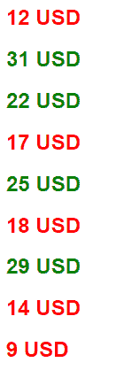
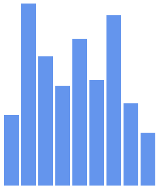

# 我使用 D3 的旅程

> 原文：<https://dev.to/vicradon/my-journey-using-d3-6pc>

所以，我最近决定探索 D3 库，当然，我用的是 freecodecamp。D3 听起来像是一个很棒的前端库，它可以让你从操作 DOM 元素到使用 SVG 和 Canvas 创建可视化效果。就我目前所见，这是一个很棒的图书馆。

要使用它，您需要做的就是从 CDN 中引用这个脚本，或者将它包含在您的项目中。只有一个脚本，没有配置。嗯，目前来说...

## 举个例子接着说

好了，你可以用这个库做的最基本的事情就是操作 DOM 元素

```
<body>
  <script>
    d3.select("body")
      .append("h1")
      .text("Hello D3");
  </script>
</body> 
```

Enter fullscreen mode Exit fullscreen mode

这里，我们使用 D3 的`select()`方法来选择 body 元素。然后向该节点添加一个 h1 节点和文本“Hello D3”。

一个更复杂的例子是

```
<body>
  <script>
    const dataset = [12, 31,22,17, 25, 18, 29, 14, 9];
    d3.select("body")
      .selectAll("h2")
      .data(dataset)
      .enter()
      .append("h2")
      .text("New Title")
  </script>
</body> 
```

Enter fullscreen mode Exit fullscreen mode

这里，库选择了`body`标签，并选择了其中的所有`h2`元素。然后它从名为`dataset`的数组中获取数据。然后，enter 方法将每个数组项输入到 DOM 树中，在这里，新的

## 标签被添加到被称为“新标题”的`innerText`中。这里，d3 实际上选择了尚不存在的元素，并根据数据向它们附加文本

## 能有多爽？

事实上非常酷。您可以使用 JS 函数、条件、回调将样式应用到元素。在这个简单的例子中，我们将根据值的大小有条件地添加样式。

```
<body>
  <script>
    const dataset = [12, 31, 22, 17, 25, 18, 29, 14, 9];

    d3.select("body").selectAll("h2") //h2 elements which don't exist yet
      .data(dataset)
      .enter()
      .append("h2")    //now they do
      .text((d) => (d + " USD"))
      .style("color", d => d < 20 ? "red" : "green")
  </script>
</body> 
```

Enter fullscreen mode Exit fullscreen mode

输出是...
[T3】](https://res.cloudinary.com/practicaldev/image/fetch/s--5a11Rp4---/c_limit%2Cf_auto%2Cfl_progressive%2Cq_auto%2Cw_880/https://thepracticaldev.s3.amazonaws.com/i/3bqbij7air2406epyege.PNG)

## 一个简单的条形图。

让我们使用数组中的数据和 CSS 样式创建一个简单的条形图

```
<style>
  .bar {
    width: 25px;
    height: 100px;
    margin: 2px;
    display: inline-block;
    background-color: cornflowerblue;
  }
</style>
<body>
  <script>
    const dataset = [12, 31, 22, 17, 25, 18, 29, 14, 9];

    d3.select("body").selectAll("div")
      .data(dataset)
      .enter()
      .append("div")
      .attr("class", "bar")
      .style("height", d => d * 10 + "px")
  </script>
</body> 
```

Enter fullscreen mode Exit fullscreen mode

在这里，发生了以下情况:

1.  `.attr()`为选定的 div 元素设置 HTML 属性，在本例中，该属性是`class`属性。
2.  基于 CSS 块中定义的类附加样式。
3.  style 方法中的回调设置高度并将其增加 10。这里使用的单位是像素。

下面是输出
[](https://res.cloudinary.com/practicaldev/image/fetch/s--i7aPVxuP--/c_limit%2Cf_auto%2Cfl_progressive%2Cq_auto%2Cw_880/https://thepracticaldev.s3.amazonaws.com/i/djn82l2rmbrr1x5ezis5.PNG)

所以你有它。这是一个非常简单的例子，可以让你使用这个非常棒的数据可视化库进行设置和运行。我会在未来使用 D3 发布更多的帖子。