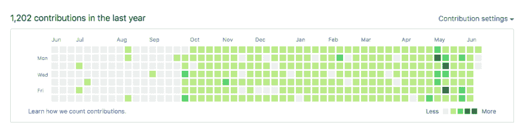

# 我在 11 个月 1200 多个小时内从 0 到开发的历程

> 原文：<https://dev.to/my_year_of_code/my-path-from-0-to-dev-in-11-months-and-1200-hours-110a>

大约 11 个月前，我设定了尽可能努力学习编程的目标，以评估这是否是适合我的职业转换。上周我接受了我的第一份开发工作！中间我花了很多时间学习 python，我注册了 [Launch Academy](https://launchacademy.com/) ，我学到了很多。这对我来说是一个非常大的项目。很难理解所有的新概念，很难保持动力和一致性，很难大胆地宣布我要辞职，然后开始学习新的职业，然后在新的领域找到工作。这真是一个巨大的考验。

我刚刚计算了一下我的学习时间，我对很多事情感到惊讶。把所有的会议都计算在一起真是让人头脑发麻——我不是做会计的料！我也很惊讶自己一路上忘记了多少事情。

从我开始这个项目(我的代码年)到得到一份工作，总共有 329 天。那段时间我花了 1287 个小时学习编码。其中只有 40%的时间是在校内的 launch academy 上，而校内的 launch 学期占了我自开学以来的 26%的时间。不出所料，在发布期间，我的日均得分大幅上升。从 3.2 小时/天增加到 6 小时/天，几乎翻了一番。这两个数字之低让我吃惊，但前 200 多天我仍然在全职工作。我认为平均工资如此之低的另一个原因是周末工作。我很少在周末工作超过 4 个小时，所以一周的漫长时光很快就过去了。不管这个数字是多少，在过去的 329 天里，我已经花了大量的时间来学习...

## 那么我学到了什么？

我学到了很多。

**我学到了一吨的技术技能:** react，rails，ruby，css，html，tdd，github，heroku，google maps api...

我学到了很多关于如何学习的知识:

*   如何找到资源
*   当你不确定某件事是什么时，如何继续工作
*   如何用别人能回答的方式提问
*   什么时候放下东西，一会儿再回来
*   如何接受有些事情现在知道并不重要，以及在哪里找到那条线。

**我学会了对周围的人有信心:**我的朋友和家人，我的同学，我的导师(还有过程@LaunchAcademy！)

我学会了感谢我所拥有的一切

*   世界上最好的妻子的爱和支持
*   经济能力(再次感谢美丽！)在找到工作之前采取行动，积累债务
*   许多朋友和朋友的朋友的帮助和鼓励，他们在我注册前帮助我了解@LaunchAcademy，并给了我如何在这个过程中生存的建议
*   许多善良的互联网陌生人停下他们的一天来回答我的一些随机问题，或者在 twitter 上发布一些有用的东西

我很幸运得到了这些机会。我非常感谢我这次冒险如此严密地按照计划进行。不是每个人都有这样的机会，也不是每个人都得到我的结果。我不认为这完全是我努力的结果，但我确实认为你越努力，你就越幸运。

想了解更多信息，你可以看看我的博客[myyearofcode.com](http://myyearofcode.com)，看看我在任何一天都学到了什么/挣扎了什么。

**方法论**——有几天我没有写博文，所以具体数值不得而知。通常这些都被算作 1 小时，因为我实际上只休了一天假，所以 1 小时是一个安全的最小值。该规则的例外情况是在启动学院的最后 2 周。我从黄昏工作到黎明，唯一不工作的时候是我睡觉或者和家人在一起的时候。在那些日子里，我平均了他们周围的日子。