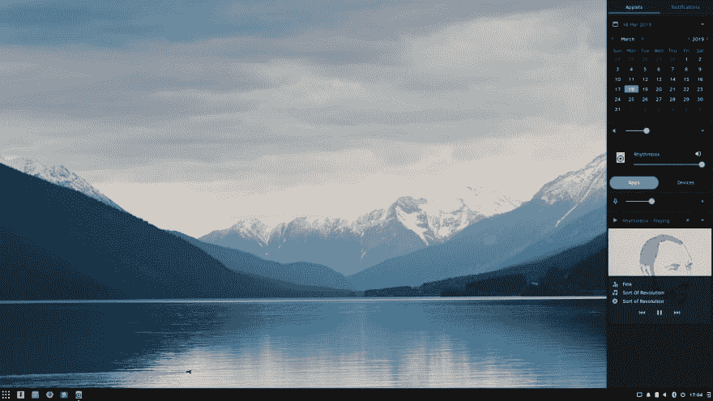
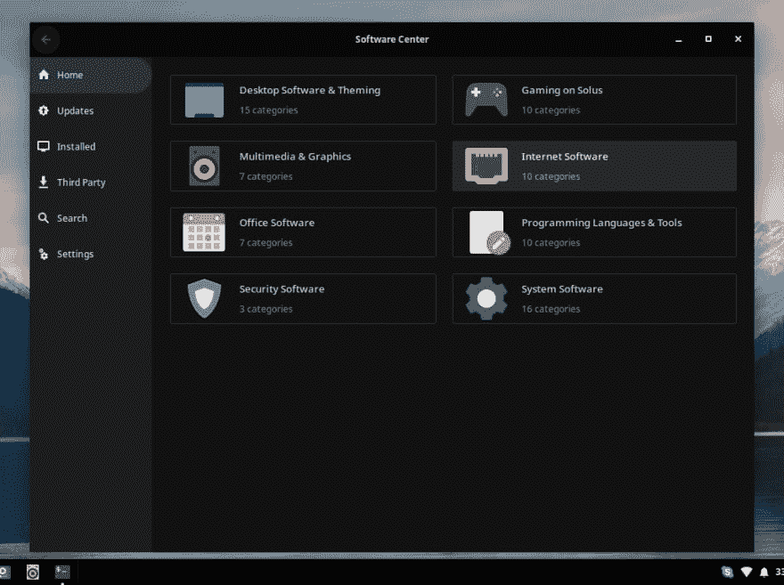

# 我个人对 Solus 的体验

> 原文：<https://dev.to/mattdark/my-personal-experience-with-solus-1i4a>

我最近在宏碁 Aspire E 11 上尝试了几个 GNU/Linux 发行版，这是我旅行时随身携带的笔记本电脑。4 年前买的时候自带 2 GB 内存，上个月升级到 4 GB。

三个月前，我在寻找一个非基于 Arch 的发行版来替代我使用了 6 年的操作系统。在一周内尝试了几个发行版后，我终于安装了 **[ArchLabs](https://archlabslinux.com/)** ，因为我尝试的操作系统都没有我预期的那样工作。

两周前，我决定用我不久前读到的 GNU/Linux 操作系统取代 **ArchLabs** 。它是一个独立的发行版，这意味着它的开发没有使用任何其他操作系统作为基础。它通过滚动发布模型接收更新。并且有三种不同的口味，**虎皮鹦鹉**、**侏儒**和**配偶**。

## 要求

Solus 4 Fortitude 是可用的最新版本，于 3 月 17 日发布。根据网站的下载部分，系统要求如下:

*   空白 DVD 或 2GB+ USB 驱动器。
*   最少 10GB 的可用磁盘空间。
*   2GB 内存，带来最佳体验。
*   64 位(x86_64)处理器

Solus Budgie 和 Solus Mate 的 ISO 图像大小为 1.4 GB，Solus GNOME one 为 1.5 GB。

## 安装

从 getsol.us/download 下载 ISO 镜像。

在没有光驱的宏碁 Aspire E 11 上，选择的安装方法是使用 USB 驱动器。

您可以使用 Rufus，Etcher 来准备安装 USB。如果您愿意，也可以使用 Linux 终端。

连接 USB 驱动器后，运行`lsblk`命令获取驱动器位置，它会给出类似如下的输出:

```
$ sudo lsblk
NAME                                       MAJ:MIN RM   SIZE RO TYPE  MOUNTPOINT
sda                                          8:0    0 111.8G  0 disk  
├─sda1                                       8:1    0 488.3M  0 part  
└─sda2                                       8:2    0 111.3G  0 part  
  └─luks-698963cb-b465-4cf7-b7bc-580000101069
                                           253:0    0 111.3G  0 crypt 
    ├─SolusSystem-Swap                     253:1    0   3.7G  0 lvm   
    └─SolusSystem-Root                     253:2    0 107.6G  0 lvm   /
sdb                                          8:16   1   7.2G  0 disk  
├─sdb1                                       8:17   1     2G  0 part  
└─sdb2                                       8:18   1     4M  0 part 
```

Enter fullscreen mode Exit fullscreen mode

USB 驱动器连接到哪里。要将 ISO 的内容写入 USB 驱动器，只需运行`dd`命令:

```
$ sudo dd if=Solus-4.0-Budgie.iso of /dev/sdb bs=1M;sudo sync; sudo eject /dev/sdb 
```

Enter fullscreen mode Exit fullscreen mode

Solus 支持 UEFI，因此您可以从 USB 驱动器启动，而无需在 BIOS 中禁用 UEFI。

启动安装介质后，您可以通过图形安装程序安装 Solus。

## 桌面

Solus 有三个版本，每个版本都默认安装了不同的桌面环境，Budgie，GNOME 和 Mate。在网站的 **[帮助中心](https://getsol.us/articles/software/)** 中有使用 eopkg 包管理器从 Linux 终端安装其他 DEs 如 Plasma 和 i3 的说明。

### 虎皮鹦鹉

<figure>

[](https://res.cloudinary.com/practicaldev/image/fetch/s--Up5JK8s7--/c_limit%2Cf_auto%2Cfl_progressive%2Cq_auto%2Cw_880/https://getsol.us/imgs/release-images/4.0/Budgie.jpg)

<figcaption>Solus Budgie. Source: [getsol.us/download](https://getsol.us/download)</figcaption>

</figure>

Budgie 是由 Solus 项目开发的桌面环境，它接受了来自 Manjaro、Ubuntu 和其他发行版的贡献，这些发行版都有 Budgie 版本。

在过去的 10 年里，我一直使用轻量级和极简主义的 DEs(桌面环境)和窗口管理器，比如 XFCE 和 i3。但我已经在联想 G480 上安装了 Manjaro Budgie 一年多了，这就是为什么我选择 Budgie 来安装 Solus。

我不是那种将桌面个性化的用户，因为我用电脑完成的大部分任务都是从 Linux 终端执行的。但是 Solus 上的 Budgie 桌面有几个我最喜欢的功能:

*   黑暗主题。它带有一个黑暗主题，可以从 Budgie 桌面设置应用程序中激活。
*   面板。位于底部，左上角有一个菜单，旁边是默认应用程序的图标，右上角有一个侧栏(称为 Raven ),可以访问一些小程序和通知，以及系统托盘。
*   夜灯。如果你在晚上使用电脑，推荐使用蓝光过滤器。

## 软件安装

Solus 的包管理器是基于 **PiSi** 的 **eopkg** ，这个包管理器是为 **Pardus** 开发的，这是一个基于 Debian 的发行版，得到了土耳其政府的支持。

作为一个从零开始构建的发行版，其库中可用的软件包数量是有限的，不像 Manjaro 这样基于 Arch 和 Arch 的发行版拥有 AUR。但它也支持 Flatpak 和 Snap 包。

如果你喜欢使用 GUI 应用程序来管理安装的软件，有一个软件中心，你可以通过菜单旁边的图标打开它。

<figure>[](https://res.cloudinary.com/practicaldev/image/fetch/s--ayQv5_Qw--/c_limit%2Cf_auto%2Cfl_progressive%2Cq_auto%2Cw_880/https://thepracticaldev.s3.amazonaws.com/i/rnalnpvodgs9d3dh4do7.png) 

<figcaption>软件中心</figcaption>

</figure>

### 基本命令

根据网站的**帮助中心**部分，以下是 eopkg 的基本命令。

*   安装软件:

```
$ sudo eopkg install firefox 
```

Enter fullscreen mode Exit fullscreen mode

*   卸载软件

```
$ sudo eopkg remove gimp 
```

Enter fullscreen mode Exit fullscreen mode

*   搜索

```
$ sudo eopkg search inkscape 
```

Enter fullscreen mode Exit fullscreen mode

*   更新

对于整个系统:

```
sudo eopkg upgrade 
```

Enter fullscreen mode Exit fullscreen mode

对于特定的包:

```
sudo eopkg upgrade firefox 
```

Enter fullscreen mode Exit fullscreen mode

更多信息[此处](https://getsol.us/articles/package-management/basics/en/)

### 第三者

Solus 有一个第三方存储库，它包含由于许可问题而无法包含在主存储库中的应用程序。

以下是该存储库中可用的一些应用程序的列表:

*   谷歌浏览器
*   用于 Linux 的 Skype
*   松弛的
*   Viber
*   Spotify
*   透明的
*   蜘蛛橡树
*   团队查看器
*   安卓工作室
*   基特克拉肯
*   皮查姆
*   崇高文本 3
*   Enpass

有关第三方存储库中可用应用程序的完整列表和安装说明，您可以访问帮助中心[此处](https://getsol.us/articles/software/third-party/en/)。

如你所见，Chromium(Chrome 所基于的开源浏览器)在这两个库中都不可用。

### 平袋

Solus 支持 Flatpak 包，你可以在[flatpak.org/setup](https://flatpak.org/setup)找到这个和其他发行版的安装说明。

我使用 **Zoom** ( [zoom.us](https://zoom.us/) )已经快两年了，我需要找到一种方法在 Solus 上安装它。它在主存储库中或第三方存储库中不可用。在 DuckDuckGo 上搜索后(是的，我没有在我的任何设备上使用谷歌作为我的搜索引擎)，我发现它是以 Flatpak 包的形式提供的。

Flatpak 还为以下应用提供了封装:

*   瘸子
*   书店老板
*   Spotify
*   洋泾浜
*   松弛的
*   Inkscape
*   网络电话

如果你想通过 Flatpak 找到其他可用的应用，请访问[flathub.org](https://flathub.org/)。

#### 设置

*   安装平板包装

```
$ sudo eopkg install flatpak xdg-desktop-portal-gtk 
```

Enter fullscreen mode Exit fullscreen mode

*   添加 Flathub 存储库

```
$ flatpak remote-add --if-not-exists flathub https://flathub.org/repo/flathub.flatpakrepo 
```

Enter fullscreen mode Exit fullscreen mode

*   重启你的系统

#### 基本命令

*   搜索

```
$ flatpak search zoom 
```

Enter fullscreen mode Exit fullscreen mode

*   安装软件

```
$ flatpak install flathub us.zoom.Zoom 
```

Enter fullscreen mode Exit fullscreen mode

*   卸载软件

```
$ flatpak uninstall us.zoom.Zoom 
```

Enter fullscreen mode Exit fullscreen mode

*   更新

```
$ flatpak --user update us.zoom.Zoom 
```

Enter fullscreen mode Exit fullscreen mode

更多信息参见 [Flatpak 命令参考](http://docs.flatpak.org/en/latest/flatpak-command-reference.html)

## 开发工具

这些天我写的大部分代码都是 Python 和 Rust。Solus 在安装后默认安装了 Python。它在仓库里还有**[Rust up](http://rustup.rs)**(Rust installer)。像 [GitKraken](https://www.gitkraken.com/invite/kwf1vC7b) (作为第三方包)和 [Atom](https://atom.io/) 这样的 GUI 应用也是可用的。

## 硬件兼容性

Solus 具有良好的硬件兼容性。已正确检测到 WiFi 和蓝牙，并且工作正常。USB 端口、SD 读卡器、以太网端口工作正常。触摸板和键盘配置没有任何问题。

“设置”应用程序中有一个“显示器”部分，您可以在其中激活、停用和配置任何连接的显示器的分辨率。在大多数情况下，显示器会被自动检测和配置，因此您不需要打开配置来设置外部显示器。这是我在 ArchLabs 遇到的一个问题，因为我需要打开 ARandr 来配置显示。

当试图在 Skype、Zoom 或 Hangouts(在浏览器中)上配置摄像头时，摄像头被检测到但被禁用。将 Linux 升级到 5.1.x 版后，此问题已修复。

## 结论

所以这是我用了两周 Solus 的亲身体验。安装和配置非常简单。它的包裹比 Manjaro 少。但是对于我使用的软件来说，所有的东西都可以从这两个库或者 Flatpak 包中获得。我的看法将来可能会改变。但是我会推荐 Solus。