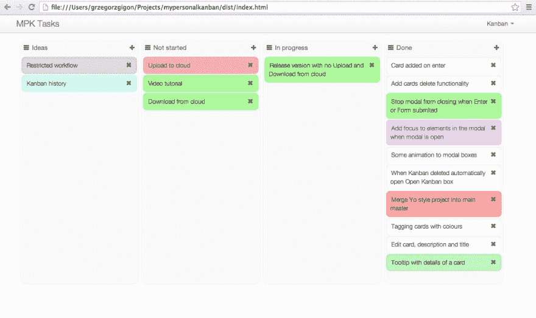

# 我的个人看板——跟踪你的任务

> 原文：<https://dev.to/llotz/my-personal-kanban-keep-track-of-your-tasks-2dk2>

# 斗争

在一些会议中，我发现自己没有完成所有被告知要完成的任务。不是因为我懒或者我没有时间，主要是因为我忘记了。

# 我的尝试

## 没有注释

那是我来的地方。你做梦去吧。随着一天中大量的上下文切换，你很快就会忘记你的大部分任务，我也一样。

## 笔记本

我开始在纸上写下我的个人任务，但很快我就陷入了困境。我忘记看笔记本了，任务和笔记把页面弄得乱七八糟，没有足够的空间来添加额外的笔记。真是一团糟。

## 降价文件

我不知道为什么，但是在尝试了笔记本之后，我开始把我的日常工作安排在一个减价文件中。这不像笔记本那样凌乱，但很快我发现自己在周围剪切和粘贴线条，即兴为不同的状态标记任务。它起作用了，但是我在安排任务上花了很多精力..本来可以更好的。

# 解

## 要求

我管理任务的肮脏尝试没有成功，但我学到了我不需要的东西。因此，基于这一点，我把寻找新工具的需求放在一起，或者自己编写。

*   **离线**，出于公司安全原因
*   可靠(能够创建备份)
*   简单快速的任务管理
*   一览无余
*   黑暗主题会很棒

记住这一点，了解 SCRUM-Board，也了解看板，我在寻找一个简单的看板解决方案。我找到了很多像 Trello 之类的在线应用，但最终找到了解决我所有任务管理问题的方法。

# 我的个人看板

[我在 Github 上的个人看板](https://greggigon.github.io/my-personal-kanban/)

有了这个基于 angular 的软件，你可以在卡片上管理你的任务，快速创建新任务，抓取它们来切换它们的状态，并按颜色排序。还有所有那些**本地**！如果您愿意，您可以创建在线云备份。正是我需要的。

现在，我在这个软件中管理我的个人工作任务已经有一个月了，我意识到我变得越来越可靠，并且完成了我所有的事情(当然，除了缺少时间)。

如果你考虑使用它，一定要做好备份，因为数据存储在浏览器的缓存中。因此，您可以点击导出按钮并存储一个 json 文件。

另外，它是开源的！

这就是我所说的解决方案。