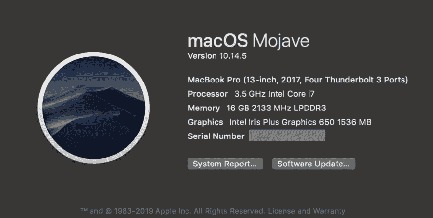
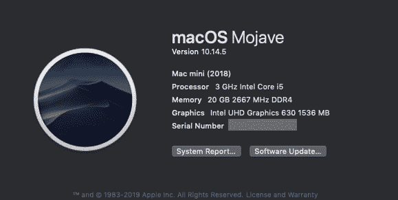
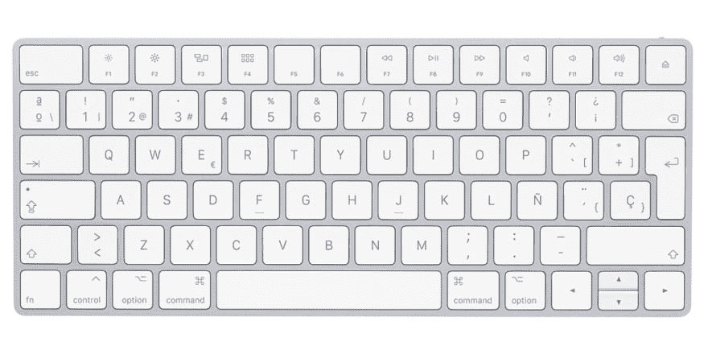
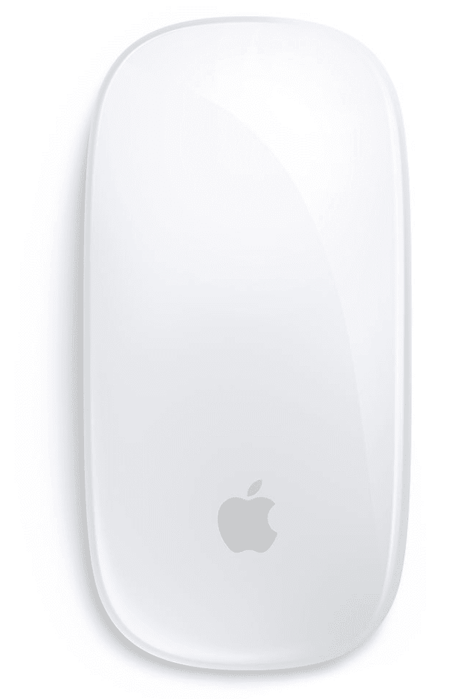
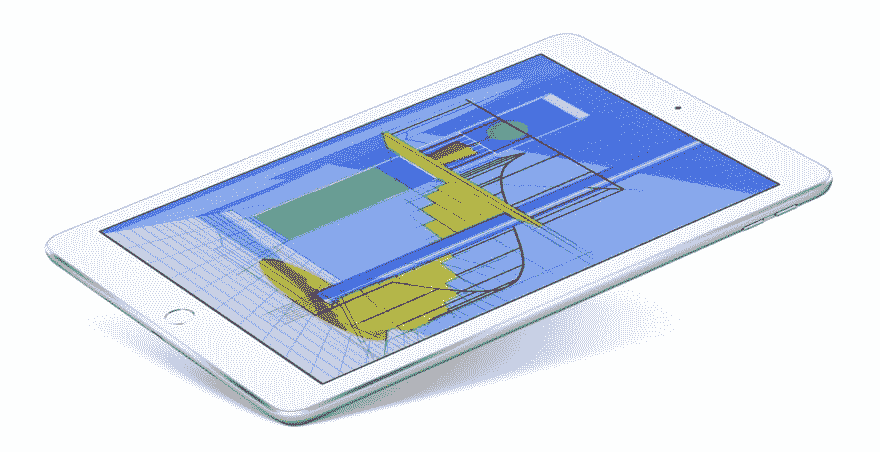
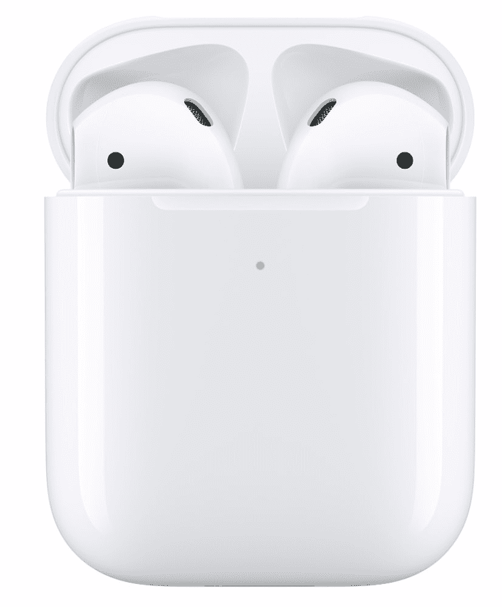
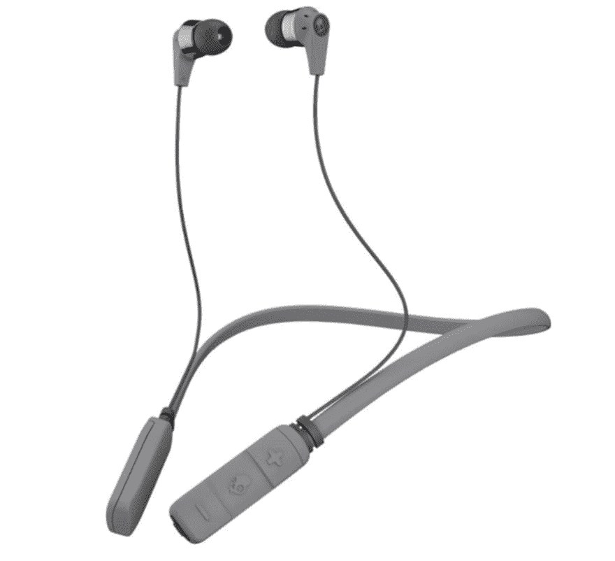
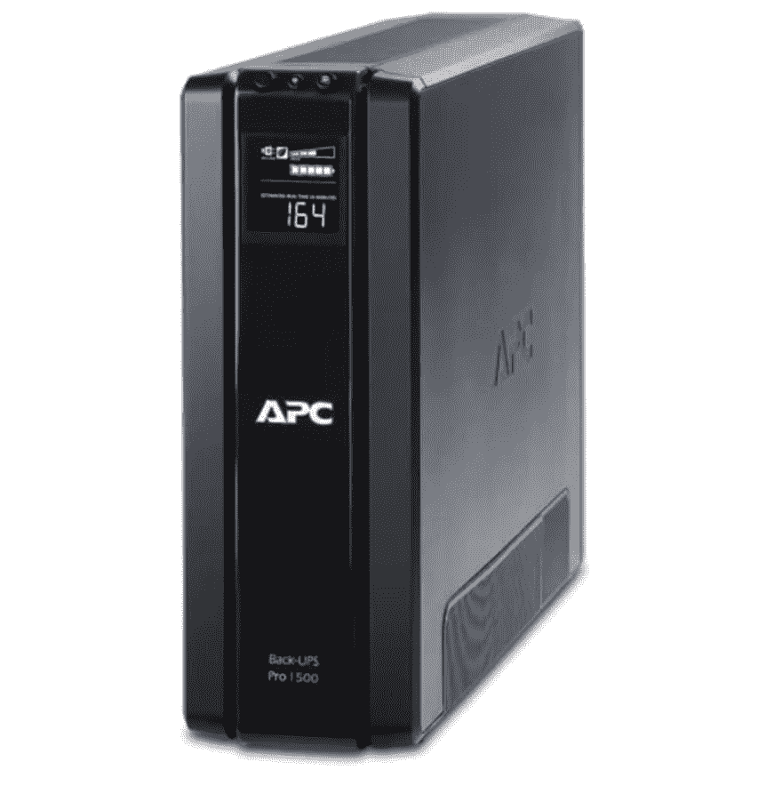
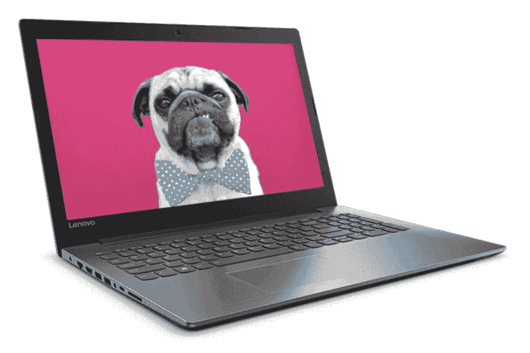

# 我的专业工作区👨‍💻

> 原文：<https://dev.to/victorhazbun/my-pro-workspace-43i>

在这里，我向您展示我的桌面设置，用于 web 开发、截屏录制、指导和博客。

### MacBook Pro

只在我的全职工作中使用它(全栈 Ruby on Rails 开发)。

这是规格。

### Mac Mini

仅适用于截屏、博客和指导。

还有规格。

### 魔法键盘

不仅感觉很棒，而且效果完美。

### 魔法鼠标

嗯，我不太喜欢这个，因为拿在手上感觉怪怪的。我希望将来能得到 Magic Trackpad。

### iPad

我主要用来看科技书籍，看编程视频课程。

### AirPods

电池供电很糟糕，但它们工作起来很舒服。它们也兼容我的三星 Galaxy 10 plus。

### Skullcandy 墨汁无线

我把它们作为备用，它们不太舒服，但看起来电池能坚持更长时间。

### 舒尔 BETA 87A 话筒

我用这个神奇的麦克风记录我的声音，同时记录截屏，它是由 Egghead.io 提供给我的。谢谢各位！

### UPS APC BR1500G 1500 AV 865 W

这东西太神奇了！它保护我的设备、电脑和任何与之相连的东西。如果停电，我会有时间保存我的工作。强烈推荐。

### 监视器

我还有一台普通的电视(40 英寸)，我用它来显示我的 Mac Mini。我知道...它有点大，但是它很好用。

### 联想 Ideapad 320

最后，我的备份电脑:它安装了 Ubuntu，以防我的其他电脑发生问题，这救了我两三次，就像我的旧 2012 MacBook Pro 死了一样。我倾向于把我的备份电脑放在一个安全的地方，没有任何东西可能会损坏它们。我真的很喜欢这台电脑，它可以作为编程的备用电脑，特别是网络开发...太完美了。

### 最后的想法

使用这种设置我感觉很好，但我认为我使用了太多的苹果产品，年复一年，这些产品变得非常昂贵，因此我认为它们不再是我的选择。

如果你买得起苹果，没问题。但是如果你不能，不要担心，因为有许多替代品，其中一些替代品比苹果产品好得多。

同样，我会说你不需要这些设备，但是它们会让你的工作变得更容易，特别是如果你是一个网页开发者。

我很惊讶地看到微软现在是如何采用 Linux 的。我想如果苹果不降低价格，我肯定会在不久的将来转向微软...一旦我的苹果设备过时😂

如果你喜欢这篇文章，想分享你的想法，请放在评论里！