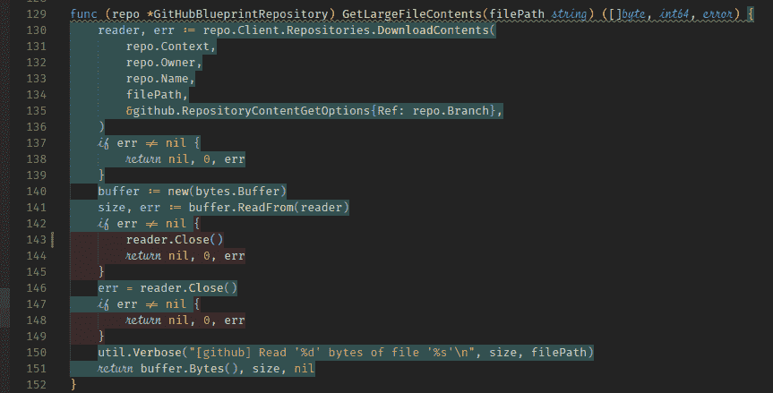
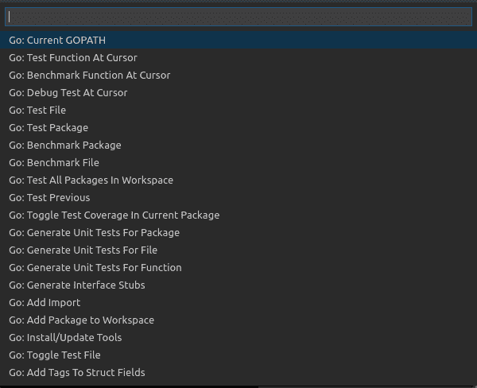

# 我对戈朗的思考

> 原文：<https://dev.to/deepu105/my-reflections-on-golang-38jk>

*最初发布于[deepu . tech](https://deepu.tech/reflection-on-golang/)T3。*

我喜欢 [Go](https://golang.org/) 吗？是的。我会把它用在我所有的用例中吗？肯定不是。

> [@ deep u105](https://dev.to/deepu105)@ siddhantaratah[@ Bruno Borges](https://twitter.com/brunoborges)在研究过这些语言的大部分之后，我不会为了一般目的而选择 Go，至少不是当前版本的 Go，可能 2.0 更有潜力。2019 年 03 月 07 日上午 06:41[](https://twitter.com/intent/tweet?in_reply_to=1103546225851277313)[](https://twitter.com/intent/retweet?tweet_id=1103546225851277313)[](https://twitter.com/intent/like?tweet_id=1103546225851277313)

不要误解我，我喜欢 **Go** 的本来面目，但就像其他编程语言一样，它总是一种爱恨交加的关系。没有一种编程语言是完美的，它们都有自己的优点和使用案例。我讨厌当我看到人们过度使用某样东西的时候，我看到这些天 Go 的模式。公平地说，在我的职业生涯中，我也有过度使用的时候(大部分是用 JavaScript ),我明白为什么人们会这样做。这不是一篇抨击围棋或赞美围棋的博客，这只是我在使用了它 9 个多月后对它的看法。在我开始大谈围棋的好与坏之前，这里有一些背景知识。

在科技行业呆了 10 多年后，我愿意把自己看作一个务实的程序员，或者至少是一个接近务实的程序员——这应该是程序员的[涅槃](https://www.britannica.com/topic/nirvana-religion)。我甚至没有打算成为一名程序员，如果你问 18 岁的我，他会说他想成为一名天体物理学家或机器人工程师(是的，建造太空机器人是我的梦想)。像大多数青少年的梦想一样，它没有实现，我最终选择了科技。

虽然得到一份 IT 工作是个意外，但编程对我来说并不陌生。我在高中的时候学过一些 C/C++，帮助我的女朋友做项目，在大学早期，为了个人项目和博客，我也涉猎了一些 PHP、JavaScript、HTML 和 Flash(ActionScript)。因此，当我在没有 IT 背景的情况下找到一份真正的 IT 工作时，我像许多人一样，开始学习我最初根据给我的任务偶然发现的语言，这种语言碰巧是 Java。作为一个快速的学习者，对 C/C++ Java 的编程概念有所了解并不难，几个月后我就成为了一名相当不错的 Java 程序员。然后，我的任务是构建一些 Web UI，我深深地陷入了 HTML、CSS 和 JavaScript 的世界，并真诚地爱上了 JavaScript，因为它的灵活性和易用性。我掌握了 JQuery，并很快成为了办公室里负责前端工作的人。

当时我一点也不务实，我向每个人宣扬 JavaScript，并激烈地辩论任何认为 JS 是一种糟糕语言的人。

快进到现在，如果我回头看看，我已经用 C/C++、PHP、JavaScript、TypeScript、HTML、CSS、Java、Groovy、Scala、Python 和最近的 Go 做了项目。我认为这种接触可能有助于我变得更加务实，因为我已经开始将编程语言视为工具，并且每种语言都有自己的优点和缺点。这个故事还有更多的内容，但那是另一个时间，重点是为下面的思考设定一个基线，这样我就不会听起来像一个正在尝试 **Go** 并继续咆哮的人。

* * *

Go 是我学习和使用的最新语言，我已经在一个用 Go 构建的 CLI 项目上工作了 9 个多月，与我的团队一起构建了一个强大的脚手架引擎(是的，非常像 [JHipster](https://www.jhipster.tech/) )，它使用 Go 模板，在那里你可以在 [XebiaLabs](https://xebialabs.com/) 创建我们所谓的[蓝图](https://github.com/xebialabs/blueprints)。是的，我用 Go 做的不仅仅是一个 hello world 应用程序。

而不会在不相关的事情上浪费更多时间这里是我喜欢围棋的地方，也是我不喜欢的地方。

## 我喜欢围棋什么

### 简朴

我喜欢 Go 是一种简单的语言这一事实(除非你做练习，否则浏览 [tour](https://tour.golang.org) 页面上的所有语言功能实际上需要 15 分钟),并且与 Scala 不同，Rust 甚至 JavaScript Go 没有很多方法来做同样的事情，这对于希望编写可维护代码的团队和公司工作人员来说非常有价值，即使是新加入的员工也可以在不需要太多帮助的情况下阅读和理解代码。我认为这是推动 Go 普及的最大原因之一。如果你从事过大型项目，你就会知道当代码不可读，每个新的团队成员不得不花费大量的时间去理解一段代码是做什么的时候是多么困难。所以当我看到 Go 没有严重依赖隐式之类的特性时，我真的很开心。这种语言的特点和概念很容易掌握，你很快就可以开始在 Go 中提高效率。唯一看起来有点复杂的概念是并发性部分，尽管与其他语言相比，它还是比较简单的。

### 语言提供代码样式和审核

这真是节省时间。在我看来，每种语言都应该这样做，这样你就不会浪费时间去争论代码风格和设置 lint 规则。Go 提供了自以为是的格式，林挺& vet 工具作为软件包的一部分，Go 编译器甚至强制使用未使用的变量之类的东西。大多数 IDE/编辑器插件也使用这些工具进行格式化和林挺，因此有助于在整个 Go 项目中保持一致的代码风格，这又增加了可读性和可维护性。

### Goroutines &频道

这是围棋最大的优势之一。对并发和并行的本机支持。这使得 Go 成为需要大量并发和/或并行处理、联网等的应用程序的理想候选。Goroutines 使得启动轻量级线程变得非常容易，通道提供了一种在这些线程之间进行通信的方式，就像消息总线一样。

```
func main() {
    messages := make(chan string)
    collected := make([]string, 2)

    go func() { messages <- "ping" }()
    go func() { messages <- "pong" }()

    collected = append(collected, <-messages)
    collected = append(collected, <-messages)
    fmt.Println(collected) // [ pong ping ]
} 
```

Enter fullscreen mode Exit fullscreen mode

### 关闭&回调

如果你使用过 JavaScript，你就会知道闭包和回调是多么有用。Go like JavaScript 将函数视为对象，因此可以赋给变量、存储在映射中、作为函数参数传递以及从函数返回。它还支持创建嵌套闭包和匿名函数，这有助于封装上下文。这种行为非常类似于 JavaScript。所以你也可以在 Go 中应用一些函数式编程的概念。

```
func main() {
    // an unnecessarily complicated example
    type fnType = func(a int, b int) int
    fnMap := map[string]fnType{
        "ADD": func(a int, b int) int {
            return a + b
        },
        "SUB": func(a int, b int) int {
            return a - b
        },
    }

    // this is a closure
    localFn := func(method string) fnType {
        return fnMap[method] // returns a function
    }

    printer := func(fn func(method string) fnType, method string) {
        fmt.Println(fn(method)(10, 5)) // callback
    }
    // function passed as parameter
    printer(localFn, "ADD")
    printer(localFn, "SUB")
} 
```

Enter fullscreen mode Exit fullscreen mode

### 类型断言和开关

Go 提供了一种很好的断言类型的方式，并且可以和一个 [switch 语句](https://tour.golang.org/methods/16)一起使用，这使得反射之类的事情变得更加容易。

### 多次退货

这是一个非常方便的特性，就像在 Python 中一样，我们习惯于在 JavaScript 中解构对象/数组来实现这一点，并在一些语言中使用元组等。还可以对返回进行命名，这样可读性更好。

### 工装

> [【deep u105】](https://dev.to/deepu105)vs code 中的代码内测试覆盖率高亮显示为 [@golang](https://twitter.com/golang) 华而不实。这是确保您拥有良好覆盖率的最佳方式
> [@ code](https://twitter.com/code)2019 年 2 月 14 日上午 10:24[](https://twitter.com/intent/tweet?in_reply_to=1095992144152748033)[](https://twitter.com/intent/retweet?tweet_id=1095992144152748033)[](https://twitter.com/intent/like?tweet_id=1095992144152748033)

如前所述，Go 为格式化、林挺等提供了标准工具，语言设计使得为 Go 构建工具变得容易，因此编辑器/IDE 具有良好的特性，如测试生成、代码覆盖等。例如，VSCode integration for Go 提供了以下选项，这有助于保持一致性，并减少了手动编写的样板文件。

[](https://res.cloudinary.com/practicaldev/image/fetch/s--r0aO2iN4--/c_limit%2Cf_auto%2Cfl_progressive%2Cq_auto%2Cw_880/https://thepracticaldev.s3.amazonaws.com/i/chcyfvlj52k6xgrg5adg.png)

### 不需要运行时

Go 不需要 JVM 或 NodeJS 这样的运行时，Go 应用可以使用[标准 Go 工具](https://golang.org/pkg/go/build/)编译成可执行的跨平台二进制。这使得 Go 应用程序具有可移植性和平台独立性。

## 我不喜欢围棋的什么

### 简朴

这是爱恨情仇的开始，Go 是一种简单的语言，很好，但有时感觉太简单&冗长，来自 Java/JavaScript 生态系统，你被一些好的功能和语法糖宠坏了，IMO 使代码更具表现力，并有助于保持干燥。我最怀念的事情是

*   泛型:在 Go 的下一个主要迭代中，这是目前正在考虑的，但在此之前，这只会让你不必要地重复代码。我已经记不清有多少次我不得不为不同的类型重复相同的代码块，而泛型本可以让代码变得简洁明了。这也是你没有看到 Lodash for Go 这样的库的一个原因。
*   标准错误处理:这似乎也是在下一个主要的 Go 迭代中[即将到来的](https://go.googlesource.com/proposal/+/master/design/go2draft-error-handling-overview.md)，但是在它到来之前，我可以抱怨。任何写 Go 的人都会记得在你的代码中做了无数次`if err != nil`。删除这些代码可能会减少至少 20%的代码量
*   默认值:我希望在 Go 中看到这一点，这非常有用。可能我只是被 JS 宠坏了。

### 样板文件太多(不适合干)

过于简单意味着您将不得不编写大量的代码，因为这种语言不提供像 map、reduce 等等这样的构造，加上缺乏泛型，意味着您将最终编写大量的实用程序代码，并且大量代码将被重复以适应不同的类型。想象一下在 Go 中编写一个地图函数，你必须为每一个可以使用的地图组合编写一个。这些因素使得在 Go 中做干式编程并不容易。

### 依赖关系管理

与其他主流语言相比，Go 生态系统中的依赖管理感觉不成熟，太基础。从 Git 导入包很好，但也让它变得更脆弱。当您依赖生产应用程序上的 Git 分支时，什么会出错呢？没有办法使用相对依赖关系(打不过 NPM 链接！).这些问题类似于节点包管理器中的依赖范围问题。Glide 似乎是一个流行的选择，但仍然没有其他语言的解决方案成熟。在这个项目中，我使用 Gradle 和 [Gogradle](https://github.com/gogradle/gogradle) 一起工作，虽然它工作得很好，但开发人员的体验不如在 Java 项目中使用 Gradle/Maven 或在 NodeJS 项目中使用 NPM。

### GOPATH 中的源代码

Go 建议您在 GOPATH 下创建 Go 项目。也许这只是我，但我讨厌这样，因为我通常喜欢组织我的代码。例如，我有一个`~/workspace/`文件夹，在那里我按照组织来组织我的项目。如果我遵循 Go 的建议，我必须将项目和所有下载的库源代码放在`/home/deepu/go/src`下。如果你不遵循这一点，那么大部分的 Go 工具就不会工作。目前，我有一个特定的 Gradle 任务，将所有的供应商库复制到我在`~/workspace/XL/<project>`中的本地 Gopath 来解决这个问题。

### 令人困惑的指针行为

Go 有很好的指针支持，默认行为是通过值传递对象。如果你想通过引用传递某个东西，你必须明确地标记它。但是这种行为不是很一致，因为默认情况下地图和切片是通过引用传递的，因此对于初学者来说这可能有点令人惊讶。

### 构造地狱

这更像是吹毛求疵。结构是你在 Go 中用来创建数据结构的东西。它可能看起来像一个物体，但它们并不完全是物体。虽然结构在功能上很好，但在许多情况下，您最终会得到看起来像 JSON 的丑陋兄弟的结构。在现实世界的项目中，您总是会最终创建复杂的结构，尤其是如果应用程序正在进行一些通用的 json 或 yaml 解析，并且很快您的代码将会看起来像这样。这没什么大不了的，但是每次我调试或者写测试的时候，我的眼睛都会痛。

```
func main() {
    type MyYamlDoc struct {
        foo []map[interface{}][]map[interface{}]interface{}
        bar interface{}
    }

    ohno := MyYamlDoc{
        []map[interface{}][]map[interface{}]interface{}{
            {
                "Foo": {
                    {"Bar": map[interface{}][]map[interface{}]interface{}{
                        "Foo": {
                            {"Bar": map[interface{}][]map[interface{}]interface{}{
                                "Foo": {
                                    {"Bar": map[interface{}][]map[interface{}]interface{}{
                                        "Foo": {
                                            {"Bar": map[interface{}][]map[interface{}]interface{}{}},
                                        },
                                    }},
                                },
                            }},
                        },
                    }},
                },
            },
            map[interface{}][]map[interface{}]interface{}{
                "Foo": {
                    {"Bar": map[interface{}][]map[interface{}]interface{}{}},
                },
            },
        },
        map[interface{}][]map[interface{}]interface{}{
            "Foo": {
                {"Bar": map[interface{}][]map[interface{}]interface{}{}},
            },
        },
    }
    fmt.Println(ohno)
} 
```

Enter fullscreen mode Exit fullscreen mode

### 怪异的界面构造

围棋中的界面概念很怪异。这些是 Go 中唯一的隐式构造。如果你来自其他有接口的语言，那么这会感觉很奇怪。事实上，它们是隐式的，这意味着很容易把事情搞砸。重构是混乱的，除非你有一个智能的 IDE，而且你可能仅仅通过以某种方式命名你的方法就意外地实现了某人的接口。虽然隐式接口肯定有助于多态和解耦代码，但我个人还是更喜欢显式接口。

另一个接口问题是空值检查，在 Go 中，一个接口由两部分组成，一个类型和一个值，所以只有当类型和值都为空时，接口才是`nil`,这意味着你不能简单地对接口进行空值检查。这太令人困惑了，Go 对此有一个专门的 [FAQ](https://golang.org/doc/faq#nil_error) 。下面的文章对此进行了更详细的解释

[](/pauljlucas) [## 当零的时候！=零

### 保罗 j 卢卡斯 5 月 28 日 187 分钟阅读

#go #pitfall](/pauljlucas/go-tcha-when-nil--nil-hic)

### 单 GC 算法

Go 实现了一个[并发三色标记-清除收集器作为其垃圾收集器](https://deepu.tech/memory-management-in-golang/)。这个特定的 GC 实现针对更好的暂停时间进行了优化，同时忽略了程序吞吐量、暂停频率和 GC 期间考虑的许多其他参数。Go 社区的一些人声称这是有史以来最好的 GC。有一些 Java 背景的我不得不表示不同意，因为大多数 JVM 实现都提供了多种 GC 算法供您选择，其中还包括一个并发的标记-清除收集器，并且这些算法中的大多数都经过了平衡，以处理更多的参数，而不仅仅是暂停时间。[这篇](https://blog.plan99.net/modern-garbage-collection-911ef4f8bd8e)文章对此进行了详细分析。因此，由于频繁的 GC，一些产生大量垃圾的用例在 Go 中实际上可能比另一种语言要慢。

### 开发者体验

这纯粹是基于个人经验，因此会有所不同。作为一个使用过多种语言的多语言开发人员，来自 Go 的开发体验并不是我所经历过的最好的。JavaScript 生态系统的 DX 是我目前为止体验最好的。感觉围棋生态系统好像少了点什么。依赖管理和工具链需要改进。多一点明智的语言特性和一些语法糖也不会有什么坏处。

## 结论

我使用过许多主要的语言，我不能只在每个用例中使用 Go，但是我可以理解为什么人们会在每个用例中使用 Go，如果他们没有使用过其他语言的话。

### 那么我会在哪里使用 Go 呢？

*   当用例需要大量的并行处理和/或并发性时，我肯定会使用 Go，因为你可以利用 Goroutines 来实现这一点，这比在 Java 应用程序中管理线程或在 JavaScript 中使用回调 hell 来解决它要简单和高效得多，因为 JS 实际上是单线程的。这里有一篇很好的文章解释了 Goroutines 的优势。
*   简单的微服务，无需担心样板文件
*   网络应用程序或 web 服务器，尤其是异步工作负载，可以从 Go 中受益匪浅。但是公平地说，你也可以用 Java、Python、JS 等语言来做这些，但是 Go 在最后会提供更好的效率，并且更容易实现。
*   系统编程。虽然 Rust 或 C 是更好的选择，但是如果你没有这些，那么 Go 是下一个最好的选择。由于对指针及其标准库的良好支持，系统程序比其他主流语言更容易。很多流行的系统工具像 Docker，Kubernetes 等确实是用 Go 写的。

### 我哪里不会用围棋？

*   复杂的 web 应用程序:我会选择带有类似于 [Spring](https://spring.io/) 或 [Micronaut](https://micronaut.io/) 的框架的 Java，因为它更易于维护，更经得起考验，而且比起编写样板基础设施代码，你会更关注业务逻辑。反对这种堆栈的一个[常见的论点](https://medium.com/@norwood.john.m/hashbash-a-comparison-of-cpu-and-io-bound-applications-in-go-and-java-across-multiple-metrics-d358df6e03b1)是它的内存占用，但是使用 Spring 和像 Micronaut 和 [Quarkus](https://quarkus.io/) 这样的框架可以获得更低的内存占用，实际上 OOB 承诺。
*   在用 Go 编写了一个高级 CLI 工具后，我讨厌这种体验，我一直在想用 JavaScript 编写会有 10 倍的效率和更好的体验。所以我会选择在 NodeJS 上运行的 JavaScript 或 TypeScript 作为 CLI 工具。这主要是因为生态系统，以及不用花时间写样板代码就能完成工作的快乐和速度。但是，如果问题中的 CLI 是系统工具或网络工具，这就不适用了，在这些情况下，Go 可能是一个好的选择。

我真的希望随着时间的推移，Go 会发展成为一种通用语言，并且这些问题会得到解决。同时，我会试着遵循这个咒语。

液体错误:内部

但是你可以选择用锤子来拧紧螺丝。

液体错误:内部

* * *

如果你喜欢这篇文章，请留下赞或评论。

你可以在 [Twitter](https://twitter.com/deepu105) 和 [LinkedIn](https://www.linkedin.com/in/deepu05/) 上关注我。

封面图片来源:图片来自 [egonelbre/gophers](https://github.com/egonelbre/gophers) 由 [@egonelbre](https://twitter.com/egonelbre) 创作。