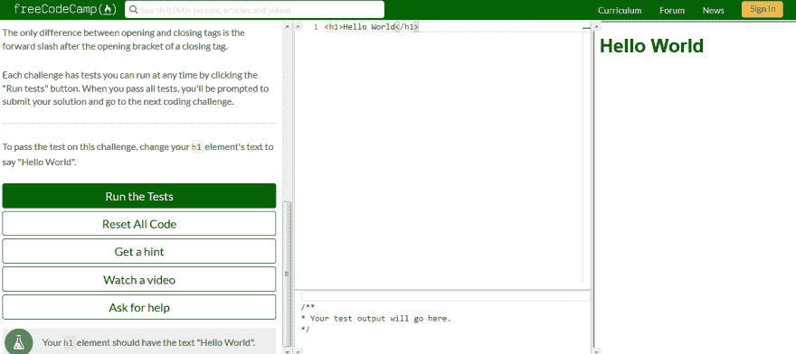

# 我对 freeCodeCamp 课程的评论

> 原文：<https://dev.to/lmolivera/my-review-on-freecodecamp-s-curriculum-3ee5>

你好 DEV 社区！

刚刚完成了 freeCodeCamp 上最后一个证书的每个项目，拿到了想要的[全栈认证](https://www.freecodecamp.org/certification/lucas.olivera/full-stack)。我花了将近一年的时间来完成每一个证书，生活阻碍了我，但我终于成功了！

由于我已经完成了全部课程，我将告诉你我对它的看法。

**注**:我并不隶属于 freeCodeCamp，我只是告诉你我个人对这个平台的看法。

**更新**:由于 FreeCodeCamp 正在发布平台的新版本，这个评论很快就没用了。

# 什么是 freeCodeCamp？

如果你住在岩石下或者是新来的:freeCodeCamp 是一个非营利组织，它有一个在线网络平台，你可以通过做一些小的“挑战”来学习编码，每个挑战都有一小段文字解释一行代码，并要求你在平台上实现它。你运行测试用例，如果你通过了，你就可以继续下一个挑战。

fCC 最好的部分是你可以不用支付任何费用而自己学习，因为它是完全免费的(但如果你愿意，你可以捐款)。也是[开源](https://github.com/freeCodeCamp/freeCodeCamp)，他们总是需要帮助！

# 内容

freeCodeCamp 的课程提供了六种认证，每种认证花费你大约 300 个小时来完成挑战和编写你自己的项目。如果这对你来说还不够，你会得到一个额外的证书:“全栈”，作为完成前六项的奖励。

这还不是全部:你还有最后一节叫做“编码面试准备”，它会教你算法、数据结构，并给你更多的项目来继续练习！

 
*看看所有那些内容！*

每个证书都有五个项目，你必须按照用户故事完成。如果你做到了所有这些，你将获得一份证书，你可以打印或添加到你的 LinkedIn 个人资料中！

如果你发现一个挑战太难，freeCodeCamp 会给你一个提示或者在论坛中寻求帮助的可能性，这真的很方便！

# 认证

现在我将告诉你关于 freeCodeCamp 的每一个认证和我的经验。

### 响应式网页设计认证

这是第一个也是最容易获得的认证，如果你没有编程经验，可以从这里开始。在这里，您将学习 HTML5 和 CSS3，以制作基本但全面响应的网页。

当我开始 fCC 的时候，我有一点 HTML 的经验，因为 CSS 对我来说一直是个谜，所以我从这里开始。该平台以非常简单的方式解释了标签是如何工作的，以及如何将它们与 CSS 结合起来制作基本的网页。在这里，CSS 将是你唯一的挑战，你可能需要一些时间来掌握它，但不会太难。

你要做的项目很简单，但很吸引人。虽然我不得不承认，我发现它们太简单了，以至于我感到无聊，做了最少的努力来继续下一个，但是我有朋友非常喜欢它们:

*   建立一个致敬页面:可以是关于一个名人或者你喜欢的事情。我做了两个版本来解释 [CSS 网格](https://codepen.io/LeWanderer/pen/dwOLdQ)和 [Flexbox](https://codepen.io/LeWanderer/pen/eLdQdO?editors=1100) 的区别，但那是在另一个[帖子](https://dev.to/lmolivera/css-grid-vs-flexbox-1koi)里。
*   **制作一份调查表**:就像你在网站注册时填写的那样。
*   **建立一个产品登陆页面**:一个类似于那些试图向你推销特定产品的页面。
*   **建立一个技术文档页面**:类似于 Wiki。我不知道我可以在这里写什么，所以我只是复制了例子中的主题，后来把它变成了一个[反应教程](https://codepen.io/LeWanderer/pen/LMEjmQ)(我刚刚发现它有一个小错误，抱歉)！
*   **建立个人作品集网页**:这个作品集里装满了你之前做的四个项目，你可以看看自己学到了多少！

我真的很喜欢这个证书的体验，并向任何开始从事 web 开发的人推荐它。

### Javascript 算法和数据结构认证

你喜欢以前的认证吗？你玩得开心吗？希望你有，因为这个证书让每个尝试过的人都做了噩梦。

你开始发现 Javascript，如何声明变量，使用条件和循环等等。突然，你独自一人。我不记得发生在我身上的确切挑战，但我已经想了十分钟，想不出一个简单的方法来完成这个挑战，所以我决定试试这个提示。想象一下，当我看到提示使用了我从未见过的方法时，我有多惊讶！我以为我可能忘记了之前的挑战，但是没有。

fCC 要求你做你以前没见过的事情，你会发现自己做不到。所以，每一个挑战我都在检查提示并从中学习，这是我在这个证书中推荐的。很多人告诉我，如果你读了[你不知道 JS](https://github.com/getify/You-Dont-Know-JS) ，这个证书就更容易了，完全免费。虽然我没有读过，但也许你会觉得有用。

这个证书的难度让新开发者望而却步。如果你不相信我，你可以在 Twitter 上查看第一次分享认证后再也没有发布任何与开发相关的内容的人数。

但是，嘿，这是困难的，不是不可能的。你只需要坚持不懈，阅读书籍，寻找其他资源，提出问题或结对编程。这花了我两个月的时间，我每天都想放弃，但我相信这真的值得。这些项目也有点困难:

*   **回文检查器**:你创建了一个函数，检查它接收的字符串是否可以反向读取。这个项目是可口可乐在一个夏日推出的，我真的很喜欢它。
*   **罗马数字转换器**:将整数转换成罗马数字。老实说，这个对我来说很难。
*   凯撒密码:你输入一个字母，它就会变成另一个字母。一个小的加密项目，很有意思。
*   **电话号码验证器**:你创建一个函数来检查一个电话号码是否有效。这个没什么可评论的，我造了一个巨型 if 句。
*   收银机:这最后一个挑战让你创建一个程序，在这个程序中，客户为一件商品付款，你必须给他们找钱。这花了我几天时间，让我发现了为什么人们讨厌 Javascript: 0.1 + 0.2 不等于 0.3，很神奇吧？

最后，这个证书来之不易，以至于我现在把它当成了战利品。当然，随着以下证书的颁发，我的 Javascript 知识继续增长，所以我不认为今天这些挑战会成为问题。

### 前端库认证

在饱受 Javascript 之苦后，我对这个感到紧张。但我发现的是我最喜欢的认证。

我很惊讶之前的认证没有解释如何使用 JS 做前端，它只教你逻辑(做后端)。但是在这里，您将学习如何使用 jQuery 和 React(在基础水平上)。它还具有 Bootstrap、SASS 和 Redux 功能。

这个证书很大的问题就是你没有深入的学习任何东西。fCC 只向您展示非常高层次的库。你的工作是选择 jQuery 或 React，并在其他地方学习它们，以便能够做这个认证的项目。

在这一点上，在经历了之前的证书和自己学习 jQuery/React 之后，你应该会觉得很舒服的自己去寻找问题的答案。

这些项目非常有趣:

*   **建立一个随机报价机**:点击一个按钮，得到一个你可以在 Twitter 上分享的随机报价。这一次我玩得很开心。你可以在这里查看我的项目[。](https://codepen.io/LeWanderer/pen/aRwyrY)
*   构建一个 markdown 预览器:编写 Markdown，获取文本。这个项目的用户故事表明，你需要一个额外的库，你需要弄清楚为了通过。
*   **造一个鼓机**:你做一个“鼓垫”，按下按钮就能发出声音。另一个非常有趣的项目。这里的[查矿](https://codepen.io/LeWanderer/pen/jegXJP)。
*   **搭建一个 JavaScript 计算器**:一个计算器。有趣的是，你有两种不同的方式来计算价值。这一题非常难，因为我学习了调车场和后缀算法。[这里是](https://codepen.io/LeWanderer/pen/yQNeER)。
*   **建造番茄钟**:在这里你可以了解番茄钟的制作技术。你可以检查我的项目[在这里](https://codepen.io/LeWanderer/pen/wQmGPw)，但它不是很时尚。

即使有我提到的问题，也没有什么能比得上第一次在浏览器上呈现内容。我真的很喜欢这个证书。

### 数据可视化认证

这个花了我太多时间来完成。我想这是因为当时我有很多工作要做，而且我从来没有想到过这些概念，所以我能够完成每个挑战，但我刚刚完成了这个项目。

在这里，您将学习 D3.js(一个图形库)以及如何通过 XML/HTTP 请求使用 API(这对每个前端开发人员来说都是非常重要的能力)。

第四次重温这个证书，得到别人的帮助，我觉得我不懂 D3。说真的。有人告诉我有更多可访问的图形库，所以我没有花足够的时间去学习这个库，因为我知道有更多更简单的选择。

也许你试了一下，发现很容易，谁知道呢？

这些项目是简单的图表，所以我不会进入细节:

*   **用条形图可视化数据**。
*   **用散点图可视化数据**。
*   **用热图**可视化数据。
*   **用 Choropleth 图可视化数据**。
*   **用树形图可视化数据**。

这个项目相当简单。这个证书的复杂程度是理解 D3。至少你获得了一个非常重要的技能:进行 API 调用。

### API 和微服务认证

第五个认证是非常重要的一个:我们停止学习 Frontend，开始使用 Node.js 做 Backend。可悲的是，这个证书是非常错误的，你会花很多时间试图通过一个挑战，因为测试不会验证。

正如我所说，你将在这里学习 Node 和它所拥有的一切:用 NPM 管理包，使用 Express 服务文件和你的第一个 NoSQL 数据库，MongoDB(在 MLAB)。

要学的东西太多了，我不得不承认这个证书的概念对我来说有点复杂，我不得不做几次挑战。但是帮助我理解 Node 的是[这个烧瓶教程](https://blog.miguelgrinberg.com/post/the-flask-mega-tutorial-part-i-hello-world)。Flask 和 Node 非常相似，我能够用 Python 学习概念，并且很容易用 Node 应用这些概念，所以我建议你先检查 Flask (Python)。

这个证书上的项目都是做 API 的:

*   **时间戳微服务**:你发送一个日期，API 以字符串形式发回日期，反之亦然。没什么太刺激的。
*   请求头解析器微服务(Request Header Parser Microservice):一个 API，它向你提供你发送到你访问的网站的信息，比如你正在使用哪个浏览器。这些信息很有趣，但没那么有趣。
*   **URL Shortener 微服务**:你发送一个 URL，你的工作是“缩短”它，当你访问短 URL 时，你应该被发送到原始站点。真正有用的 API。
*   **运动跟踪器**:一个保存你运动时间的跟踪器 API。我认为最有用的项目。
*   **文件元数据微服务**:上传文件，接收其元数据作为响应。我一点也没觉得有用。

一旦你在第一个项目中掌握了制作 API 的概念，其他的就很容易了，所以这个证书一开始很吸引人，但是我逐渐对这个项目失去了热情。

### 信息安全与质量保证认证

最后一个证书也是后端的，但是主题更加广泛。在这里，您将学习如何使用 Helmet.js 保护您的站点，使用 Chai 和 Mocca 进行质量保证和单元测试，使用 Pug 的模板引擎，身份验证，密码散列和套接字。

这最后一个证书和上一个有一样的问题:被窃听，要学的概念太多。你会有点挣扎，但不会太严重。

这些项目提供了一个简单的前端和基本结构，供您填写后端:

*   **公制-英制转换器**:将单位从公制转换为英制，反之亦然。没什么太刺激的。
*   **问题跟踪器**:存储/检索问题(比如 bug)的 API。类似于我们用运动跟踪器做的。
*   个人图书馆(Personal Library):用于存储/检索你所拥有的书籍的 API。我发现这个项目的想法很有趣。
*   **股票价格检查器**:检查股票价格的 API。联邦通信委员会给你做这个项目的网址不起作用，所以你必须弄清楚如何做这个项目。
*   **匿名留言板**:一个板，像 4Chan。

这个证书对我来说有点乏味，因为我迫不及待地想完成它，并回到第四个证书的项目中，最终获得完整的证书。

# 结论

freeCodeCamp 有点问题，在挑战的设计上有一些错误。这可能会被视为一个问题，但在现实中，你将与许多被窃听的程序一起工作，并需要自己解决如何处理事情，所以我认为这是对一份真正工作的培训。卡住了？你要去问某人(写在 fCC 论坛？)求助，你不明白一段代码是做什么的？你肯定会以 StackOverflow 结束，等等。

我向任何想学习如何编程的人推荐 freeCodeCamp，但不是一个人。我真的建议你和一个朋友一起经历这些挑战，因为这个平台鼓励结对编程，所以当一个人有问题时，另一个人可以帮忙。

# 最后的话

我希望这篇评论对你有用。你对 freeCodeCamp 有什么看法？

*感谢您的阅读。别忘了在 dev.to 和 Twitter 上关注我！*