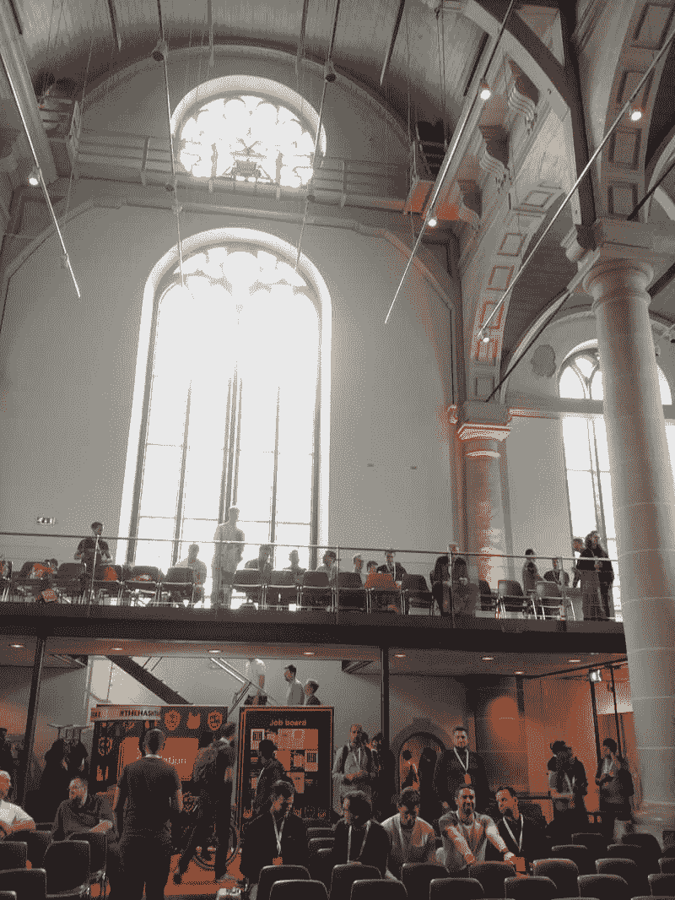
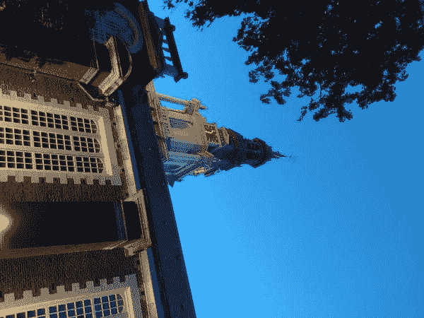

# 我对 JSNation 2019 的看法

> 原文：<https://dev.to/darrenvong/my-takeaways-from-jsnation-2019-4l76>

在我分享了我参加 React Amsterdam 的经历后不久，GitNation 组织者在阅读了我的博文后，邀请我参加他们的姐妹会议 [JSNation](https://jsnation.com/) (以前的 AmsterdamJS)，这是比荷卢经济联盟社区中规模最大、持续时间最长的 JavaScript 会议之一！

鉴于我目前每天都在使用 JavaScript，并且看到来自流行开源项目的大量核心维护者和创始人将出席会议，这是一个提问和获得新灵感的好机会，所以去那里的决定是显而易见的。我很高兴我做到了！

事实上，由于这是一次非常棒的经历，我想分享我从这次活动中获得的记忆，并希望能帮助任何考虑参加下一次活动的人。

如果参加的费用对你来说是一个很大的障碍，特别是如果你像我一样是一个独立的参与者，GitNation 与 GitHub 等赞助商合作，提供[多样性奖学金](https://medium.com/@amsterdamjs/jsnation-conference-2019-now-offers-diversity-scholarships-5454640d0ce)，让你免费参加活动。因此，如果你有资格，我强烈建议去申请，因为它只涉及填写一份简短的表格。

# 入住

主会场是建于 1611 年的前教堂，由荷兰著名画家伦勃朗出席。它位于市中心，就在 Nieuwmarkt 附近的红灯区东部。这座教堂很容易找到，因为它不仅是阿姆斯特丹的标志性建筑，而且当我接近教堂的入口时，这个 JavaScript 怪癖向我打了个招呼:

液体错误:内部

根据我在 React Amsterdam 的经验，我在会议开始登记后几分钟内就到达了会场，所以根本不用排队！此外，由于这是一个稍微舒适的会议，从当时在 Twitter 上看到的一些排队照片来看，我不认为队伍会变得太长，所以总体而言，签到体验相当顺利。

# 前一天

办理完入住手续后，我领取了我的姓名牌，一个 JSNation 品牌的礼品袋，里面装满了礼品(包括一个红色的 JSNation 马克杯)和当天最重要的节目指南。

在我有机会浏览节目单之前，我已经忙着欣赏苏伊德克尔克的美丽了:

<figure>

<figcaption>Okay, I've technically cheated with this one (as it's taken at night)...</figcaption>

</figure>

决定参加哪一场会谈很有挑战性，因为许多高质量的会谈同时在两个轨道上进行。更具挑战性的是，会议的 Node.js 系列讲座在离主会场五分钟路程的前犹太教堂 Uilenburgersjoel 举行，这给了会议这个独特的荣誉:

液体错误:内部

幸运的是，为了让曲目之间的切换更容易，教堂后面设立了一个小房间，播放 Uilenburgersjoel 的 Node.js talks 的直播流。我完全利用了这一点，我试图从两个轨道的谈话中得到味道。

无意中(还是故意的？)，这个房间也变成了一个安静的地方，适合任何想离开人群休息一下的人。不管怎样，感谢组织者安排了这次会议，让我们充分利用了这次会议。

对于所发生的会谈的精彩视觉摘要，请查看由卡佳·布德尼科夫现场绘制的这些精彩的素描笔记，或者玛丽·沃龙佐夫的这篇博客文章。

或者，您可以通过以下链接收听所有讲座:

正厅-[https://youtu.be/Fj4Vm9m95Io](https://youtu.be/Fj4Vm9m95Io)

Node.js 霍尔-[https://youtu.be/-rs-5ZL-f9w](https://youtu.be/-rs-5ZL-f9w)

# 结识新朋友

虽然独自参加像 JSNation 这样的大型会议可能看起来很可怕，但绝对不是这样，主要是因为会议有一个非常活跃的 Slack 频道和社交媒体社区，在那里我可以联系到其他与我处境相同的与会者。此外，虽然听起来很老套，但活动中的大多数人都非常友好，乐于交谈！

但最重要的是，独自去意味着我有时间走出我的舒适区。否则，我可能不会:

*   在凯尔·辛普森令人振奋的主题演讲后不久，我们与他进行了交谈，讨论了会议有多棒，这正是我现在要写的原因。
*   在一次 [stamppot](https://en.wikipedia.org/wiki/Stamppot) 晚宴上，我与[米歇尔](https://twitter.com/mweststrate)、[贾罗德](https://twitter.com/jsoverson)、阿努什里和亨利进行了一系列愉快的交谈；

液体错误:内部

*   与[亨利](https://twitter.com/left_pad)、[托拜厄斯](https://twitter.com/wsokra)和[鲁本](https://github.com/BridgeAR)交谈，他们都和我一起玩了太多[代号](https://en.wikipedia.org/wiki/Codenames_(board_game))的游戏，玩得很开心；

液体错误:内部

*   在会后的派对上，我见到了安娜和 T2，当面告诉他们我有多喜欢他们的谈话，他们的谈话没有幻灯片，只有肉桂面包和宠物的草图；

液体错误:内部

*   第三轮派对后，罗伯特、[奥立弗](https://twitter.com/ob6160)、[亚历山德拉](https://twitter.com/alexandraamoore)和查理一起去卡拉 ok...

…还有更多和我交谈过的人，我很可能已经忘记了。如果我们已经谈过，而你正在读这篇文章，请随意~~叫我出来~~😂在推特上提醒我或者在下面留言评论！

主要的一点是，通过走出我的舒适区，开始与我不认识的人交谈，这种经历变得比我选择只与我认识的人交谈更加难忘和有益。所以，如果你正在考虑参加下一次会议，不要因为不得不单独参加而打消你的念头！如果你和一群同事一起参加，我强烈建议找时间分开，这样你会更倾向于认识新朋友，丰富你的会议经验。

如果 dev.to 允许我在这篇文章中把这个标题做得比任何一级标题都大，我会的，因为这无疑是 JSNation 的主要亮点！

会议对于从伟大的演讲者那里学习和获得新想法来说是很棒的，但是是什么让它们不可替代，仅仅是事后在 YouTube 上观看呢？它是你能见到的人，面对面的互动，以及你在远处看不到的额外的一点人性。

# 个人目标——我做得怎么样？

在我之前的 [React Amsterdam 博客文章](https://dev.to/darrenvong/my-first-react-amsterdam-experience-as-a-solo-attendee-2d14)中，我提到虽然我很喜欢这次会议，但我可能并不像*那样喜欢它*，因为我希望我做了一些事情。总的来说，它们是很好的目标，为我将来的会议(比如这次)增加经验。我表现如何？让我们回顾一下:

*   **与我遇到的人自拍/合影**——不可否认这不全是我自己的努力，但我两者都做到了——见“结识新朋友”部分的推文！
*   演讲后与演讲者交谈 -照片再次有力地证明了这一点，因为与我交谈过的大多数人都是会议的演讲者！这真的显示了每个人是多么的开放和热情，以至于我可以走上前去和某人交谈，而不必考虑他们是否是一个演讲者。毕竟，说话的人也是和我们一样的人类，所以这并不奇怪！
*   **参加一个会前研讨会**——作为一个独立的与会者，这是一个棘手的问题，因为无论从成本还是从休假时间来看，我都负担不起会议之外的一些会议。😞也许这是我可以做的事情，如果将来多元化奖学金可以帮助解决这个问题。

总的来说，我对自上一次会议以来取得的进步感到高兴，我一定会带着这种新发现的勇气参加未来的会议。

# 设想下一个

虽然还没有确定的日期，但 JSNation 将在 2020 年与 [GitNation](https://gitnation.org) 一起回到第 10 个年头，在会议期间听到组织者要求对下一届提出建议。

就个人而言，我有一些想法可以让这次会议变得更加精彩和包容:

## 专用的安静区

这可能是一个像今年用来捕捉 Node.js 演讲的房间。由于会议的很大一部分涉及到与新人交谈，一些人(尤其是我们当中内向的人)可能希望从人群中休息一下，以理清思路，冥想和/或充电。通过满足这些需求，裁谈会无疑将更具包容性。

## 一个博彩场所

根据是否有空闲空间，这样的空间可能会在整个会议期间或至少在会后派对上提供，因此如果像 Henry 这样的演讲者/与会者带着他们，我们可以通过一些纸牌游戏或乒乓球游戏进行社交:

> 亨利朱@ left _ pad[@ MrDarrenV](https://twitter.com/MrDarrenV)[@ wSokra](https://twitter.com/wSokra)[@ BridgeAR](https://twitter.com/BridgeAR)应该多带着这个，就像带着我的🏓21:12PM-08 2019

在预算较高的一端，提供一台装有马里奥赛车(Mario Kart)等知名游戏的游戏主机，或者一台装有大卫·罗塞特(David Rousset)在今年的派对后展示的游戏的交互式虚拟现实耳机:

液体错误:内部

诸如此类……可能性是无穷无尽的。如果这个想法是可行的，我很想看看社区中的其他人和组织者会提出什么想法！

## 直播字幕

换句话说，在谈话过程中有实时字幕播放！这个 ***可能是*** 中最复杂的想法，因为它很可能需要有人(或一个轮流工作的团队)来打出字幕，或实时纠正语音识别软件生成的字幕。根据我在 Twitter 上的简短研究，这似乎在 [ReactJS 的女孩](https://reactjsgirls.com/)中运行良好:

液体错误:内部

与安静区的想法一样，这将极大地增加那些母语不是英语的人、有听力问题的人和/或更好地理解发言者所说的话的人对会议的可访问性。

* * *

就我个人而言，我在 Node.js 中学习了一些不太知名的功能以及如何驾驶无人机，并在整个会议期间与新人进行了社交。不用说，我当然希望下次我会回来庆祝 JSNation 的 10 岁生日，并再次被类似的经历宠坏！