# 我的 VSCode 快捷方式、设置和生产力扩展。

> 原文：<https://dev.to/macmacky/my-vscode-shortcuts-settings-and-extensions-for-productivity-3chd>

## 嗨伙计们日安！

从大学开始编码到第一份工作，我用过很多 IDE 和代码编辑器， **Python 的闲置**， **PyCharm** ， **Notepad++** ， **Visual Studio** 和 **Android Studio** 和 **VS Code** 。但是当我在我的第一份工作中使用 **VS Code** 时，我感到更加满意和高兴，因为它轻便、快速，并且有许多有用的[扩展](https://marketplace.visualstudio.com/vscode)。

点击编辑器，然后在键盘上执行这个命令 **CTRL+P** ，然后输入 **settings.json** 。

[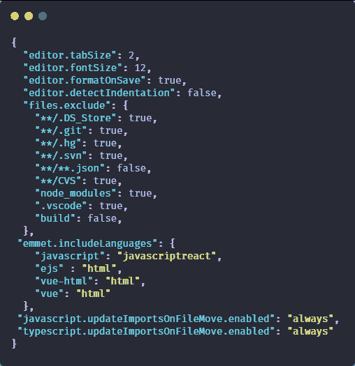](https://res.cloudinary.com/practicaldev/image/fetch/s--k6FkyDqc--/c_limit%2Cf_auto%2Cfl_progressive%2Cq_auto%2Cw_880/https://thepracticaldev.s3.amazonaws.com/i/riwek3zndhs11dbtxwt5.png)

**editor.tabSize** -表示按 tab 键时的空格数。
[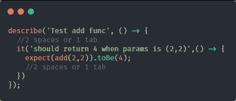](https://res.cloudinary.com/practicaldev/image/fetch/s--nkzFQFQ2--/c_limit%2Cf_auto%2Cfl_progressive%2Cq_auto%2Cw_880/https://thepracticaldev.s3.amazonaws.com/i/cr8hcsq40b544pzhwvur.png)
**——明显字体的大小😄。**

**editor.formatOnSave** -保存文件时格式化文件内容或者快捷键 **CTRL+S** 。

我们必须将它设置为 **false** ，这样它就不会覆盖我们的 **editor.tabSize** 设置。

**files.exclude** -在文件浏览器中包含或排除的文件或文件夹。你可以使用**球形图案**。`true`表示隐藏文件夹或文件，否则`false`表示不隐藏。

*Ex。*
`src: true` - **隐藏当前工作区**中的 src 文件夹。
`src/**.js:true` - **隐藏 src 文件夹**中所有扩展名为 *js* 的文件。
`package*.json:true` - **隐藏所有带有*包名*和扩展名 *json* 的文件。**
`san?.js:True` - **隐藏所有以 *san* 开头，后面有任意单个字符，扩展名为 *js* 的文件。** **匹配*sandy . js*和 *sane.js* 但不匹配 *sandy.js* 。**

**emmet.includeLanguages** -启用默认情况下不支持的语言中的 emmet 缩写。

**JavaScript . updateimportsonfilemove . enabled**-当 *js* 文件的文件名改变时更新导入语句。

**typescript . updateimportsonfilemove . enabled**-当 *ts* 文件的文件名改变时更新导入语句。

## 在 VSCode 中启用字体连字

那么什么是**字形连字**，基本上一个字形连字就是两个或两个以上的符号、字母或字符连在一起形成一个新的字符。

**无字体连字**。
T3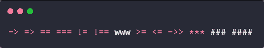T5】

**用字体连字**。
T3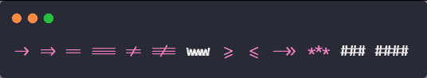T5】

很酷，对吧？。

此处下载 Fira 代码字体[。
提取后再安装字体。](https://www.fontsquirrel.com/fonts/fira-code) [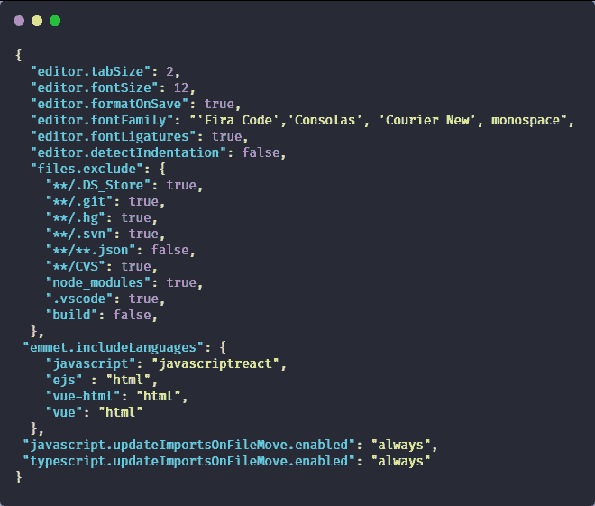T6】](https://res.cloudinary.com/practicaldev/image/fetch/s--Gwg-b7eq--/c_limit%2Cf_auto%2Cfl_progressive%2Cq_auto%2Cw_880/https://thepracticaldev.s3.amazonaws.com/i/sgb8k8figry0az1g1rbv.png)

**editor.fontFamily** -指定编辑器中使用的字体。
**-是否启用字体连写。**

 **### 键盘快捷键

**CTRL+SHIFT+P** -显示命令面板
**CTRL+k CTRL+T** -显示主题列表
**CTRL+T** -在所有文件中查找类、函数或变量。
**CTRL+K Z** -切换 Zen 模式

**-选择光标中的当前行。
**CTRL+R** -重新加载窗口
**CTRL+`** -切换终端窗口
**CTRL+SHIFT+`** -创建新的终端实例
**CTRL+P** -在当前文件夹中查找特定文件
**CTRL+K CTRL+Z** -注释一段代码
[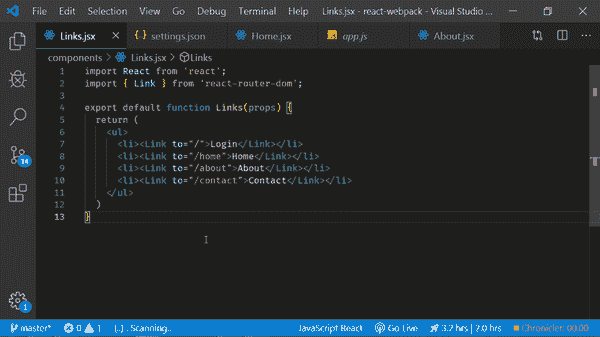](https://res.cloudinary.com/practicaldev/image/fetch/s--4qu7gYGK--/c_limit%2Cf_auto%2Cfl_progressive%2Cq_66%2Cw_880/https://thepracticaldev.s3.amazonaws.com/i/bvv3vr1a4cirh6g3awps.gif)** 

**CTRL+，** -转到用户设置
[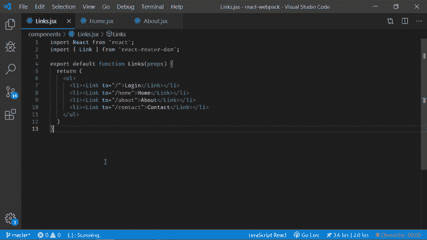](https://res.cloudinary.com/practicaldev/image/fetch/s--TXA0Es6o--/c_limit%2Cf_auto%2Cfl_progressive%2Cq_66%2Cw_880/https://thepracticaldev.s3.amazonaws.com/i/5pgz42l4m3f0bp7eknm5.gif)
**CTRL+K CTRL+S**-转到键盘快捷键

**Ctrl+F** -查找
**Ctrl+H** -替换
[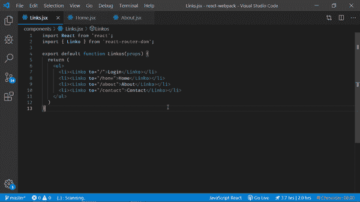](https://res.cloudinary.com/practicaldev/image/fetch/s--0bfOJXJl--/c_limit%2Cf_auto%2Cfl_progressive%2Cq_66%2Cw_880/https://thepracticaldev.s3.amazonaws.com/i/ytbf5srd20chjahk41ca.gif)
**Ctrl+Shift+Enter**-全部替换

**ALT+Enter** -选择所有出现的查找匹配
[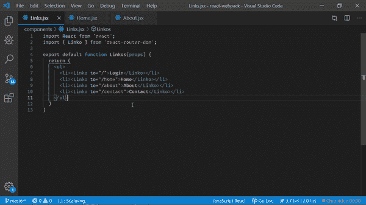](https://res.cloudinary.com/practicaldev/image/fetch/s--dM1SaYUh--/c_limit%2Cf_auto%2Cfl_progressive%2Cq_66%2Cw_880/https://thepracticaldev.s3.amazonaws.com/i/6n1p0lycv2ckw9xuzzc5.gif)

**ALT** -显示定义
[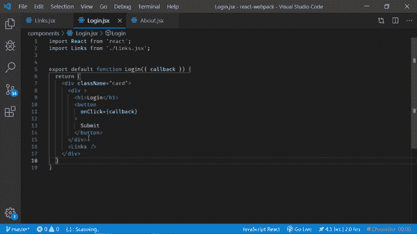](https://res.cloudinary.com/practicaldev/image/fetch/s--aWZ-skjd--/c_limit%2Cf_auto%2Cfl_progressive%2Cq_66%2Cw_880/https://thepracticaldev.s3.amazonaws.com/i/5jnmgxq5f5ne1v047z1c.gif)
**F12**-转到定义

**CTRL+=** -放大
[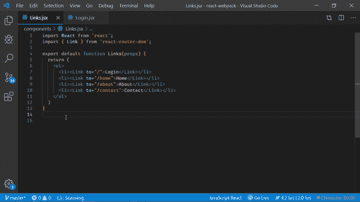](https://res.cloudinary.com/practicaldev/image/fetch/s--TtJ1hcI3--/c_limit%2Cf_auto%2Cfl_progressive%2Cq_66%2Cw_880/https://thepracticaldev.s3.amazonaws.com/i/ztdbuodgy3u9hp4ctvgb.gif)
**CTRL+-**-缩小

**Shift+向上箭头** -向上选择所有代码一行
[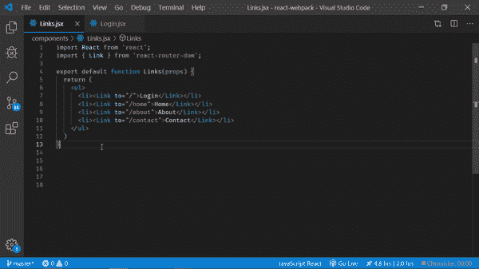](https://res.cloudinary.com/practicaldev/image/fetch/s--9roEjhsZ--/c_limit%2Cf_auto%2Cfl_progressive%2Cq_66%2Cw_880/https://thepracticaldev.s3.amazonaws.com/i/vv4pmy9wu3dnepoahn2z.gif)
**-向下选择所有代码一行**

**ALT+向上箭头** -将所选代码上移一行

**-将所选代码下移一行**

**ALT+SHIFT+向上箭头** -将选中的代码向上复制一行
[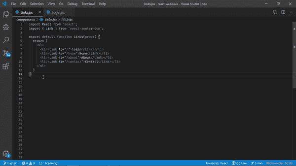](https://res.cloudinary.com/practicaldev/image/fetch/s--ZktHalJM--/c_limit%2Cf_auto%2Cfl_progressive%2Cq_66%2Cw_880/https://thepracticaldev.s3.amazonaws.com/i/vkahsfy3x2w06fm71kki.gif)
**ALT+SHIFT+向下箭头** -将选中的代码向下复制一行

**CTRL+B** -切换工具条
**CTRL+SHIFT+X** -显示扩展
**CTRL+SHIFT+G** -显示源代码控制
**CTRL+SHIFT+E** -显示文件浏览器
**CTRL+SHIFT+D** -显示调试

**CTRL+SHIFT+V** -预览降价
[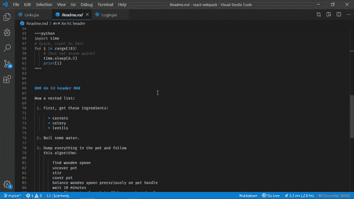](https://res.cloudinary.com/practicaldev/image/fetch/s--JB0E7sfe--/c_limit%2Cf_auto%2Cfl_progressive%2Cq_66%2Cw_880/https://thepracticaldev.s3.amazonaws.com/i/rxxw2lz344h1q2olys45.gif)

## 编辑或添加新的键盘快捷键

好了，我们来编辑添加一些键盘快捷键。

点击编辑器，然后在键盘上执行这个命令 **CTRL+P** ，然后输入 **keybindings.json** 。

[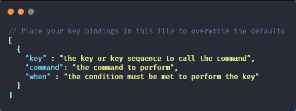](https://res.cloudinary.com/practicaldev/image/fetch/s--Ag2pbanB--/c_limit%2Cf_auto%2Cfl_progressive%2Cq_auto%2Cw_880/https://thepracticaldev.s3.amazonaws.com/i/xx24t6irnqla6jio0lk8.png)

好了，我要把我的**重新加载窗口**命令从 **CTRL+R** 改为**CTRL+E**T6】并且我要添加两个新命令 **Git Commit** 和 **Git Init** 。
T12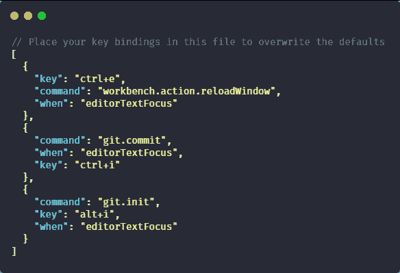T14】

你必须在你的电脑上安装 **git** 来添加最后两个命令。
你可以在这里找到所有时的**可能值[。
在 **VSCode** 中有很多你可以编辑或更改的命令。
编辑器中所有可用的命令。执行此命令
**Ctrl+K CTRL+S** 。但是请注意，如果您使用新的 keybinding 添加或编辑新的命令，那么 keybinding 不能存在于当前的命令中。](https://code.visualstudio.com/docs/getstarted/keybindings#_when-clause-contexts)**

## 我使用的扩展

### 1。[汽车进口](https://marketplace.visualstudio.com/items?itemName=steoates.autoimport)

自动查找、分析并提供所有可用导入的代码操作和代码完成。使用打字稿和 TSX。这个扩展为你找到文件路径是不是很神奇。

### 2。[自动重命名标签](https://marketplace.visualstudio.com/items?itemName=formulahendry.auto-rename-tag)

自动重命名成对的 HTML/XML 标记。这在 JSX 也行得通。
[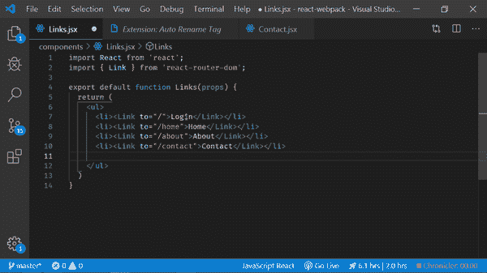T3】](https://res.cloudinary.com/practicaldev/image/fetch/s--Cs5_IEwG--/c_limit%2Cf_auto%2Cfl_progressive%2Cq_66%2Cw_880/https://thepracticaldev.s3.amazonaws.com/i/2cld36flw90u0ez53t40.gif)

### 3。[括号对着色机](https://marketplace.visualstudio.com/items?itemName=CoenraadS.bracket-pair-colorizer)

用于匹配括号着色的可定制扩展。如果你在寻找一个括号或花括号的末尾有问题，那么这个扩展对你来说是完美的。
[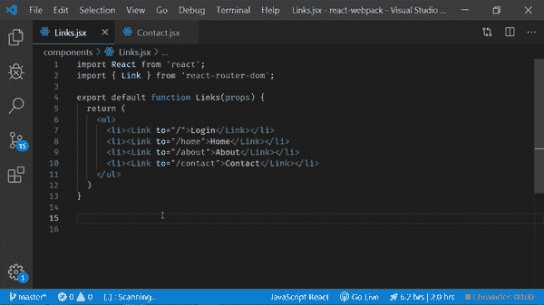T3】](https://res.cloudinary.com/practicaldev/image/fetch/s--3FfUyWWZ--/c_limit%2Cf_auto%2Cfl_progressive%2Cq_66%2Cw_880/https://thepracticaldev.s3.amazonaws.com/i/wivzfqx5adv4twtunxvc.gif)

### 4。[代码时间](https://marketplace.visualstudio.com/items?itemName=softwaredotcom.swdc-vscode)

Code Time 是一个开源插件，在 Visual Studio 代码中提供编程指标。找出你一天和一周花在编码上的时间，以及你花时间最多的语言。
[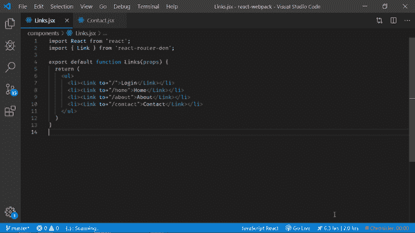T3】](https://res.cloudinary.com/practicaldev/image/fetch/s--2HDd-u-o--/c_limit%2Cf_auto%2Cfl_progressive%2Cq_66%2Cw_880/https://thepracticaldev.s3.amazonaws.com/i/v4wtyj2uep4z1dk4zo8l.gif)

### 5。 [CSS 偷看](https://marketplace.visualstudio.com/items?itemName=pranaygp.vscode-css-peek)

允许窥视 CSS ID 和类字符串作为从 HTML 文件到各自 CSS 的定义。允许查看和转到定义。
[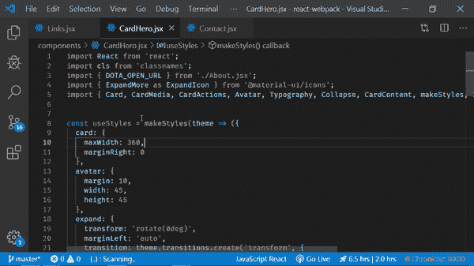T3】](https://res.cloudinary.com/practicaldev/image/fetch/s--p4_ID3XA--/c_limit%2Cf_auto%2Cfl_progressive%2Cq_66%2Cw_880/https://thepracticaldev.s3.amazonaws.com/i/nrye7twdjolwz6dxmnin.gif)

### 6。 [DotENV](https://marketplace.visualstudio.com/items?itemName=mikestead.dotenv)

突出显示**中的键、值对。env** 文件。

### 7。[高亮匹配标记](https://marketplace.visualstudio.com/items?itemName=vincaslt.highlight-matching-tag)

突出显示匹配的结束或开始标记。
[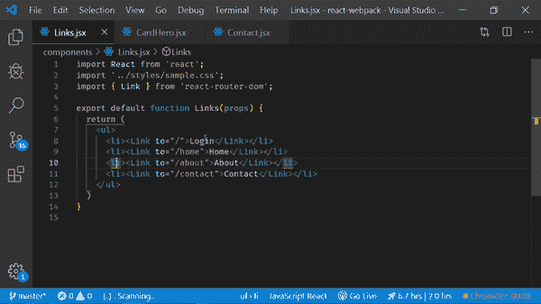T3】](https://res.cloudinary.com/practicaldev/image/fetch/s--7k7RqoYw--/c_limit%2Cf_auto%2Cfl_progressive%2Cq_66%2Cw_880/https://thepracticaldev.s3.amazonaws.com/i/x10i7yphykrlkz1rq385.gif)

### 8。[HTML 中 CSS 类名的智能感知](https://marketplace.visualstudio.com/items?itemName=Zignd.html-css-class-completion)

HTML class 属性的 CSS 类名完成，基于您的工作区中找到的定义。如果你有时忘记了你的 CSS 类，那么这个扩展非常适合你。
[T3】](https://res.cloudinary.com/practicaldev/image/fetch/s--K5lpglkH--/c_limit%2Cf_auto%2Cfl_progressive%2Cq_66%2Cw_880/https://thepracticaldev.s3.amazonaws.com/i/y7d2qfs434roroc9a4cb.gif)

### 9。[直播服务器](https://marketplace.visualstudio.com/items?itemName=ritwickdey.LiveServer)

为静态和动态页面启动具有实时重新加载功能的开发本地服务器。

### 10。[素材图标主题](https://marketplace.visualstudio.com/items?itemName=PKief.material-icon-theme)

Visual Studio 代码的材料设计图标

### 11。[素材主题](https://marketplace.visualstudio.com/items?itemName=Equinusocio.vsc-material-theme)

Visual Studio 代码现在最史诗般的主题

### 12 [一人暗亲](https://marketplace.visualstudio.com/items?itemName=zhuangtongfa.Material-theme)

Atom 的 Visual Studio 代码的标志性黑色主题

### 13 [暗加语法](https://marketplace.visualstudio.com/items?itemName=dunstontc.dark-plus-syntax)

VS Code 的默认黑暗主题，但是稍微好一点。

### 14 [夜啼](https://marketplace.visualstudio.com/items?itemName=liviuschera.noctis)

Noctis 是一个光明和黑暗主题的集合，融合了温暖和寒冷的颜色

### 15 [巨蟒](https://marketplace.visualstudio.com/items?itemName=ms-python.python)

林挺、调试(多线程、远程)、智能感知、代码格式化、重构、单元测试、代码片段等等。

### 16[ES7 React/Redux/graph QL/React-Native 片段](https://marketplace.visualstudio.com/items?itemName=dsznajder.es7-react-js-snippets)

JS/TS 中 React、Redux 和 Graphql 的简单扩展，带有 ES7 语法

### 17 [维特](https://marketplace.visualstudio.com/items?itemName=octref.vetur)

VS 代码的 Vue 工具

### 18 [Polacode-2019](https://marketplace.visualstudio.com/items?itemName=jeff-hykin.polacode-2019)

给你的代码拍张照。

### 19 [编年史](https://marketplace.visualstudio.com/items?itemName=arcsine.chronicler)

拍一个自己边编码边编码的视频。
[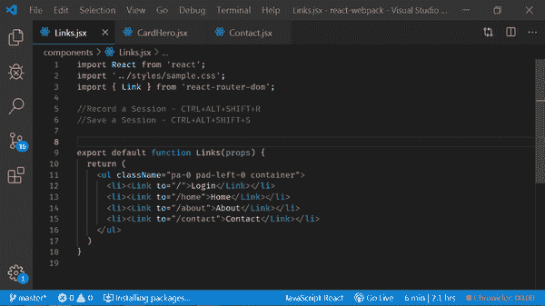T3】](https://res.cloudinary.com/practicaldev/image/fetch/s--6Rrspdsd--/c_limit%2Cf_auto%2Cfl_progressive%2Cq_66%2Cw_880/https://thepracticaldev.s3.amazonaws.com/i/05x1klxxhn1waa51xhgq.gif)

### 20 [功能区](https://marketplace.visualstudio.com/items?itemName=ms-vscode.vscode-typescript-tslint-plugin)

对 Visual Studio 代码的 TSLint 支持

### 21 [GitLens — Git 增压](https://marketplace.visualstudio.com/items?itemName=eamodio.gitlens)

增强 Visual Studio 代码中内置的 Git 功能—通过 Git 责备注释和代码透镜使代码作者一目了然，无缝导航和探索 Git 存储库，通过强大的比较命令获得有价值的见解，等等

### 22 [德拉库拉官方](https://marketplace.visualstudio.com/items?itemName=dracula-theme.theme-dracula)

官方德古拉主题。对于许多编辑器、shells 等来说，这是一个黑暗的主题。如果你喜欢 python。你会喜欢这个的。

### 23 [进口成本](https://marketplace.visualstudio.com/items?itemName=wix.vscode-import-cost)

在编辑器中显示导入/要求包大小

### 24 [日志文件高亮器](https://marketplace.visualstudio.com/items?itemName=emilast.LogFileHighlighter)

如果你想轻松地阅读日志文件，那么你需要这个。
[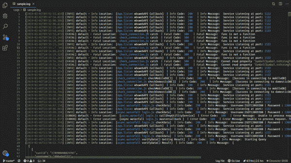T3】](https://res.cloudinary.com/practicaldev/image/fetch/s--jvnkFECz--/c_limit%2Cf_auto%2Cfl_progressive%2Cq_66%2Cw_880/https://thepracticaldev.s3.amazonaws.com/i/91tvftwipccjawo4jj2w.gif)

### 25 [懈怠主题](https://marketplace.visualstudio.com/items?itemName=felipe-mendes.slack-theme)

受 Slack 默认主题启发的配色方案

### 26 [码头工人](//Adds%20syntax%20highlighting,%20commands,%20hover%20tips,%20and%20linting%20for%20Dockerfile%20and%20docker-compose%20files.)

为 Dockerfile 和 docker-compose 文件添加语法高亮显示、命令、悬停提示和林挺。我没有用过 docker，但是我听说它是一项伟大的技术，我希望将来我会使用它。

### 27[Chrome 的调试器](https://marketplace.visualstudio.com/items?itemName=msjsdiag.debugger-for-chrome)

你想在 VSCode 中调试你的 **React** 代码然后得到这个扩展吗？在 Chrome 浏览器或任何其他支持 Chrome 调试器协议的目标中调试您的 JavaScript 代码。

### 28 [代码跑者](https://marketplace.visualstudio.com/items?itemName=formulahendry.code-runner)

用一个命令运行您的代码片段。

## 感谢各位阅读这篇帖子。

# 过得愉快😃！。**