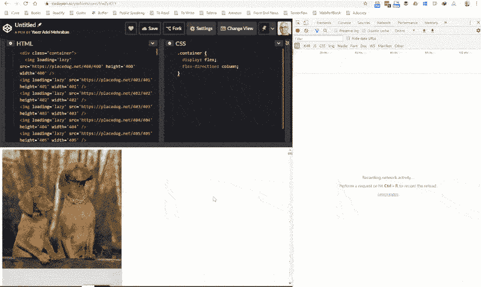

# 原生延迟加载登陆 Chrome🔥😍🔥

> 原文：<https://dev.to/yashints/native-lazy-loading-is-landed-in-chrome-2kli>

延迟加载资源是 web 性能调优的重要部分之一，原因很简单，如果急切地加载，屏幕外资源会给页面增加很多权重。

## [T1】简介](#intro)

我在我的[图像优化文章](https://yashints.dev/blog/2018/11/12/web-perf-4)中讲述了许多技巧和诀窍，这是我在网络性能上所做的系列文章[之一。然而，当谈到延迟加载时，我提到您有两种选择:](https://dev.to/yashints/improve-html-and-css-performance-4o08)

*   使用``标签上的`data-src`属性，并挂钩到`scroll`、`resize`或`orientationChange`中的任一个，以确定何时用`src`替换`data-src`来进行调用。
*   使用`IntersectionObserver` API 异步观察变化，并在项目在视窗中时进行调用。

好消息是，从 [Chrome](https://www.google.com.au/chrome/) 76 开始，你可以使用图片标签的`loading`属性来告诉浏览器如何加载图片。

事实上，这太简单了，你不会相信的🤯:

```
 
```

Enter fullscreen mode Exit fullscreen mode

我已经创建了一个演示来展示它是如何工作的，请仔细查看网络选项卡。

[](https://res.cloudinary.com/practicaldev/image/fetch/s--fGYN14dH--/c_limit%2Cf_auto%2Cfl_progressive%2Cq_66%2Cw_880/https://thepracticaldev.s3.amazonaws.com/i/ejbol2wks361ioxoir2g.gif)

这里有一个包含代码的代码笔👇🏽：

[https://codepen.io/yashints/embed/VwZpKYY/?height=600&default-tab=result&embed-version=2](https://codepen.io/yashints/embed/VwZpKYY/?height=600&default-tab=result&embed-version=2)T1。

我刚刚使用了下面的 bash 脚本来拼凑 HTML🤷🏽‍♂️.

```
for i in {400..499}; 
> do echo ""; 
> done 
```

Enter fullscreen mode Exit fullscreen mode

## 关于属性

目前在 [Chrome](https://www.google.com.au/chrome/) 中以不同的优先级获取图像，不在视窗中的图像优先级较低。但不管怎样，它们会尽快被取出来。

有了这个新的`loading`属性，你可以完全推迟屏幕外图像(和**iframe**)的加载，直到滚动到它们:

```

<iframe src="https://placedog.net" loading="lazy"></iframe> 
```

Enter fullscreen mode Exit fullscreen mode

该属性可以使用三个值:

*   `auto`:浏览器的默认行为，等于不包含该属性。
*   `lazy`:推迟资源的加载，直到它到达距视口的[计算距离](https://web.dev/native-lazy-loading#load-in-distance-threshold)。
*   `eager`:立即加载资源

在我写这篇文章的时候，我的 [Chrome](https://www.google.com.au/chrome/) 版本是`76.0.3809.100`，但是如果你有任何低于 76 的先前版本，你可以使用标志来激活它:

*   对于图像👉🏽`chrome://flags/#enable-lazy-image-loading`
*   对于 iframe

## 特征检测

如果您现在想使用这个属性，您可以使用下面的代码来对其进行特征检测，并在适当的位置设置一个 polyfill，如[loading-attribute-poly fill](https://github.com/mfranzke/loading-attribute-polyfill)。

```
if ('loading' in HTMLImageElement.prototype === true) {
  // use the attribute
} else {
  // use polyfill
} 
```

Enter fullscreen mode Exit fullscreen mode

## 防止内容回流

由于图像是延迟加载的，如果您没有为图像设置`width`和`height`，当图像加载时，内容可能会回流并填充它的位置。为了防止这种情况发生，只需通过`style`或直接使用`width`和`height`属性:
在图像标签上设置所需的值

```


 
```

Enter fullscreen mode Exit fullscreen mode

## iframe 加载

当与`loading`属性一起使用时，同样的行为也适用于`iframe`。但是，有时出于分析目的，iframe 是隐藏的。例如，它们非常小(宽度和高度小于`4px`)，或者应用了`display:none`或`visibility: hidden`，或者只是使用负边距在屏幕之外。

在这些情况下，即使你使用了属性，它也不会被延迟加载。

## 有什么蹊跷

一般来说，使用延迟加载时，有几点需要考虑。另外，到目前为止，您还不能对`loading`属性做一些事情。

**不能做**

*   您现在不能更改装入资源的阈值，因为它已经在源代码中被硬编码了。
*   这暂时不能用于 CSS 的背景图片

**接球**

*   这可能会影响第三方广告，因为它们也会被延迟加载
*   打印时会有副作用😉，因为惰性加载的资源不会被打印。但是，有一个[未解决的问题](https://bugs.chromium.org/p/chromium/issues/detail?id=875403)您可以关注。

## 其他浏览器呢？

目前， [Chrome](https://www.google.com.au/chrome/) 是唯一支持该功能的浏览器。虽然火狐有一个[公开 bug，Edge 和 IE 没有。](https://bugzilla.mozilla.org/show_bug.cgi?id=1542784)

快乐懒加载每个人，并确保不要错过捕捉👋🏽。