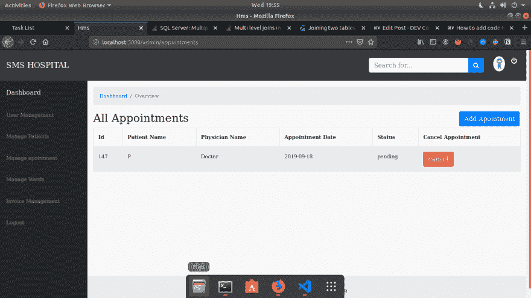

# 需要 sql 的帮助(*_*)！

> 原文：<https://dev.to/mahendrachoudhary/need-help-with-sql--14i5>

[](https://res.cloudinary.com/practicaldev/image/fetch/s--4sojhADE--/c_limit%2Cf_auto%2Cfl_progressive%2Cq_auto%2Cw_880/https://thepracticaldev.s3.amazonaws.com/i/n4os6b57lr6yzipw5d8n.png) 
嗨 dev 的

同时使用 rails 开发一个“医院管理系统”演示项目。我陷入了一个需要从用户表中提取“名字”的场景。下面是详细的场景...

这是我的表格:

```
table1 : appointments has following columns 
         id|patient_id|physician_id| 
```

```
table2: patients table                  table3: physicians table
         id|user_id|...                      id|user_id|... 
```

表 4:用户(注意，用户表分为 4 类用户 admim、患者、医生和护士)

```
 id|firstname|lastname|role|..... 
```

**此处用户标识指用户表主键
**患者标识和医生标识指患者和医生主键

现在，我如何从约会表的用户表中获取“名字”呢？？？？

到目前为止，我使用下面的代码来打印约会，但这是非常昂贵的

```
# frozen_string_literal: true

module Admin
  # Appointment actions
  class AppointmentsController < ApplicationController
    before_action :new_user

    def index
      @appointments = paginate(fetch_records)
      respond_to do |format|
        format.html { @appointments }
      end
    end

   .
   .
   .

    private

    def fetch_records
      @appointments = current_user.admin? ? Appointment.all :    Appointment.current_user(current_user.physician)

      @appointments.collect do |appointment|
        [
          appointment.id, appointment.patient.user.firstname,
          appointment.physician.user.firstname, appointment.status,
          appointment.appointment_date
        ]
      end
    end
  end
end 
```

rails 版本:rails 5.2.3
ruby 版本:2.6.3