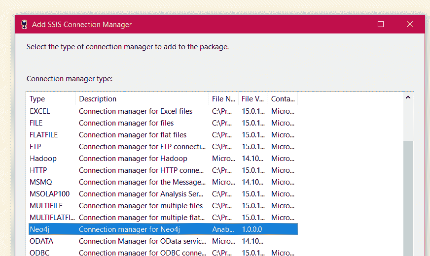
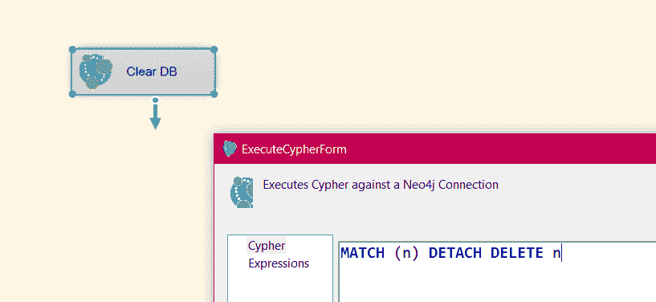
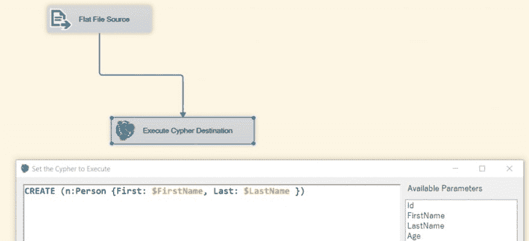

# 尼奥 4j & SSIS

> 原文：<https://dev.to/cskardon/neo4j-ssis-1bpg>

Neo4j 和 SSIS 是一对尴尬的搭档——SSIS 是微软，使用 ODBC、Web 等技术连接了大量的数据库和技术，Neo4j 是用 Java 编写的，提供了 JDBC 连接。然而，SSIS 是否与 JDBC 合作。

# 倒霉的时候

我合作过的一些客户喜欢使用 SSIS(有些不喜欢)，珍视他们使用一项技术 20 多年的经验，并希望在新技术中利用它。没有什么比学习新的数据库*和新的 ETL 工具*更昂贵的了。

因此，今天我想向您介绍 SSIS Neo4j 连接器的测试版(可能是 alpha 版)。它使用 **bolt** 安全地连接到您的 Neo4j 实例，并针对它调用 Cypher。

版本 1 测试版的功能:

*   Neo4j 连接管理器——管理与数据库的连接，并安全地*加密*您的密码(这是*实际的*加密),使其安全存储。

*   执行密码任务——允许您在 Neo4j 实例上执行一段密码，作为控制流的一部分

*   execute Cypher Destination–允许您在数据流中对 Neo4j 实例执行 Cypher

*   上面两张图片也显示了基本的语法突出显示
*   与 SSIS 2016、2017 和 2019 年合作(CTP 3)

你想试试吗？你需要合适的安装程序，有 6 种风格(6！！)，如果您在服务器上安装，您可能需要服务器版本的 x64 版本。什么？我知道——没那么清楚。如果在 SQL Server 2016 实例上安装，请使用 SQL 2016 x64 安装程序。

要在本地设计器(VS 2017 或 2019)上使用，您需要 x86 SQL 2017 版本，因为 VS 2019 的 integration services addin 仍然使用 2017 安装位置。

请到这里:[http://anabranch.co.uk/Projects/Neo4jSsis](http://anabranch.co.uk/Projects/Neo4jSsis)通过电子邮件获得链接！

请给我反馈，我会尽快发布更多关于如何使用其中一些功能的帖子！