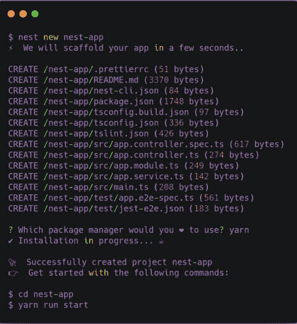

# 带有 Postgres 和 TypeORM 的 NestJS CRUD

> 原文：<https://dev.to/rohanfaiyazkhan/nestjs-crud-with-postgres-cho>

***免责声明:此文最初发布于我的[博客](https://rohanfaiyaz.com)***

NestJS 是一个用于编写健壮的 web 后端的极好的框架。根据文件:

> Nest(或 NestJS)是一个用于构建高效、可伸缩的 Node.js 服务器端应用程序的框架。它使用渐进式 JavaScript，由 TypeScript 构建并完全支持 TypeScript(但仍允许开发人员用纯 JavaScript 编写代码)，并结合了 OOP(面向对象编程)、FP(函数式编程)和 FRP(函数式反应编程)的元素。Nest 使用 Express(默认)等健壮的 HTTP 服务器框架，也可以选择配置为使用 Fastify！

本质上, **Nest** 从企业级框架中获得灵感，例如。NET 框架，同时还提供了使用 **Express** 构建简单的 **Node.js** 服务器的简单性和灵活性。Nest 的灵感很大程度上来自 Angular，并试图为后端提供类似的抽象。

这些都很好，但是**为什么要使用 Nest** ？

首先让我说一下，如果你有另一种语言的首选后端，比如 Django、Laravel 或。NET，Nest 不会提供任何新的工具或技巧。但是，如果您以前一直在构建节点服务器，那么您可能会经历过一次又一次地设置同一个应用程序的挫折。或者，随着规模的扩大，你可能很难维护应用程序。与从头开始一个项目相比，Nest 提供了如此多的优势，我相信它将很快成为 Node CRUD 应用程序和 API 的默认选项。在这篇文章中，我将尽力展示这些优势。

首先，有*类型脚本*支持和开箱即用的应用程序结构。您不必浪费时间来设置您的应用程序，并直接开始创建您的端点。此外，Nest 自带命令行，可以快速搭建应用程序和添加组件。 *Nest* 也是非常平台无关的，你可以使用任何数据库或任何前端，例如，它可以轻松地与 MySQL、Postgres、SQL Server 甚至 MongoDB 数据库建立 TypeORM 集成。

我将介绍如何构建一个支持 CRUD 操作的 REST API，以展示使用 Nest 是多么容易。

## Nest 入门

我们将首先使用 *NPM* 安装 NestJS(如果你还没有安装的话),并建立一个新的 Nest 项目

```
$ npm i -g @nestjs/cli
$ nest new nest-app 
```

Enter fullscreen mode Exit fullscreen mode

这将搭建应用程序，并询问您更喜欢哪个包管理器， *npm* 或 *yarn* 。我在这个例子中使用了*纱线*，但是如果你喜欢，可以随意使用 *npm* 。安装后，我们可以测试服务器。

[](https://res.cloudinary.com/practicaldev/image/fetch/s--vxwNlo1n--/c_limit%2Cf_auto%2Cfl_progressive%2Cq_auto%2Cw_880/https://thepracticaldev.s3.amazonaws.com/i/mpddp0is6slwc76p8wus.png)

我们可以使用`yarn start`来测试安装。这将默认在端口 3000 上启动应用程序。我们可以导航到“Hello world”消息。

## 设置 Postgres

这一部分将假设您已经安装了 Postgres。如果没有，就在 OS 上安装 Postgres，比如你可以在 Windows 上使用[官方安装程序](https://www.postgresql.org/download/windows/)，[在 MacOS 上使用家酿](https://gist.github.com/ibraheem4/ce5ccd3e4d7a65589ce84f2a3b7c23a3)或者在 Ubuntu 上使用[apt](https://wiki.postgresql.org/wiki/Apt)。

一旦我们安装了 Postgres，我们将需要创建一个数据库。我们可以使用一个 GUI 工具，比如 [PGAdmin](https://www.pgadmin.org/) ，或者简单地使用 Postgres CLI。我正在使用 Linux，所以我将使用`sudo`切换到 *postgres* 用户，这是默认的超级用户。我们需要超级用户来调用`createdb`命令。

```
$ sudo -u postgres psql
postgres=# createdb rohan
postgres=# \q 
```

Enter fullscreen mode Exit fullscreen mode

命令`psql`打开 Postgres CLI。`\q`退出 Postgres CLI。我们可以为本地用户设置一个密码，这样我们就可以安全地访问本地数据库。

```
$ psql
rohan=# \password
rohan=# Enter new password:
rohan=# Retype new password 
```

Enter fullscreen mode Exit fullscreen mode

## 将我们的应用程序连接到数据库

首先，我们将安装必要的依赖项。TypeORM 是推荐的 ORM，非常适合与 Postgres 连接。

```
yarn add pg typeorm @nestjs/typeorm @nestjsx/crud 
```

Enter fullscreen mode Exit fullscreen mode

接下来，我们将在项目的根目录下创建一个配置文件，并将其命名为 **ormconfig.json** 。

```
{  "type":  "postgres",  "host":  "localhost",  "port":  5432,  "username":  "rohan",  "password":  "password",  "database":  "rohan",  "entities":  ["dist/**/*.entity.js"],  "synchronize":  true,  "logging":  true  } 
```

Enter fullscreen mode Exit fullscreen mode

Nest 使用类似 Angular 的应用程序结构，每个组件都有控制器、模块和提供者(或服务)。项目的根包含一个 app.module 和一个 app.controller。为了包含我们的 TypeORM 模块，我们必须在我们的 app.module 中导入。这样做可以使该模块在我们的应用程序中可用，而无需将其导入到其他任何地方。在 src 目录下的 **app.module.ts** 文件中，键入:

```
import { Module } from '@nestjs/common'
import { AppController } from './app.controller'
import { AppService } from './app.service'
import { TypeOrmModule } from '@nestjs/typeorm'
import { PokemonModule } from './pokemon/pokemon.module'

@Module({
    imports: [ TypeOrmModule.forRoot(), PokemonModule],
    controllers: [ AppController ],
    providers: [ AppService ]
})
export class AppModule {} 
```

Enter fullscreen mode Exit fullscreen mode

不要担心口袋妖怪模块，我们将很快创建它。您可能会注意到，模块是连接组件不同部分的东西。我们将包含带有空参数的根模块的**类型模块**的*。默认情况下，它会将我们 **ormconfig.json** 中的配置作为它的参数。*

## 创建实体

接下来让我们创建一个实体。我们会为口袋妖怪做一个实体！创建一个名为 **pokemon** 的新目录，并在其中创建一个名为 **pokemon.entity.ts** 的文件。

```
 import { Entity, Column, PrimaryGeneratedColumn} from 'typeorm'

@Entity('pokemon')
export class PokemonEntity {
    @PrimaryGeneratedColumn('uuid') id: string

    @Column('varchar', { length: 500, unique: true})
    name: string

    @Column('varchar', { length: 500 })
    type: string

    @Column('numeric')
    pokedex: number
} 
```

Enter fullscreen mode Exit fullscreen mode

## 设置 CRUD

在设置我们的 CRUD 操作之前，我们必须导入在我们的模型中创建的实体。我们可以使用 Nest CLI 生成一个模型。

```
nest generate module pokemon 
```

Enter fullscreen mode Exit fullscreen mode

这将为我们自动生成一个名为 **pokemon.module.ts** 的模块。

```
import { Module } from '@nestjs/common'
import { PokemonService } from './pokemon.service'
import { PokemonController } from './pokemon.controller'
import { PokemonEntity } from './pokemon.entity'
import { TypeOrmModule } from '@nestjs/typeorm'

@Module({
    imports: [ TypeOrmModule.forFeature([ PokemonEntity ]) ],
    controllers: [ PokemonController ],
    providers: [ PokemonService ]
})
export class PokemonModule {} 
```

Enter fullscreen mode Exit fullscreen mode

接下来是服务。

```
nest generate service pokemon 
```

Enter fullscreen mode Exit fullscreen mode

在新创建的 **pokemon.service.ts** 文件中，我们将注入我们的 CRUD 服务。

```
import { Injectable } from '@nestjs/common'
import { InjectRepository } from '@nestjs/typeorm'
import { TypeOrmCrudService } from '@nestjsx/crud-typeorm'
import { PokemonEntity } from './pokemon.entity'

@Injectable()
export class PokemonService extends TypeOrmCrudService<PokemonEntity> {
    constructor (@InjectRepository(PokemonEntity) repo) {
        super(repo)
    }
} 
```

Enter fullscreen mode Exit fullscreen mode

最后，在我们的口袋妖怪控制器中，我们将使用`@nestjsx/crud`包设置 CRUD 端点。这确实展示了 NestJS 的一个亮点。虽然可以手动创建我们所有的端点(在我们的控制器中使用@Get、 [@post](https://dev.to/post) 、@Put、@Patch 和@Delete 装饰器)，CRUD 包允许我们在几行代码中毫不费力地设置所有这些。

```
import { Controller} from '@nestjs/common'
import { Crud } from '@nestjsx/crud'
import { PokemonService } from './pokemon.service'
import { PokemonEntity } from './pokemon.entity'
@Crud({
    model: {
        type: PokemonEntity
    },
    params: {
        id: {
            field: 'id',
            type: 'uuid',
            primary: true
        }
    }
})
@Controller('pokemon')
export class PokemonController {
    constructor (public service: PokemonService) {}
} 
```

Enter fullscreen mode Exit fullscreen mode

CRUD 会自动设置以下端点:

*   `GET`/口袋妖怪 Get all
*   `GET` /pokemon/:id 按 id 拿一个
*   `POST`/口袋妖怪加一个
*   `POST`/口袋妖怪/批量添加许多
*   `PUT`/口袋妖怪/:id 换一个
*   `PATCH`/口袋妖怪/:id 更新一

您可以在 Postman 或 curl 中测试新的端点。

## 就是这样！

我不知道你是怎么想的，但是当我第一次学习制作 REST API 时，有很多样板代码需要解决。Nest 提供了适量的高级抽象，使构建 API 再次成为一个有趣的过程，因为您将专注于真正重要的东西——端点和实体，此外，NestJS 的[官方文档](https://docs.nestjs.com/)有关于与 GraphQL ( *即将发布的一篇文章*)和其他文档集成的全面方法。如果您是 NodeJS 开发人员，NestJS 是一个非常值得关注的东西。