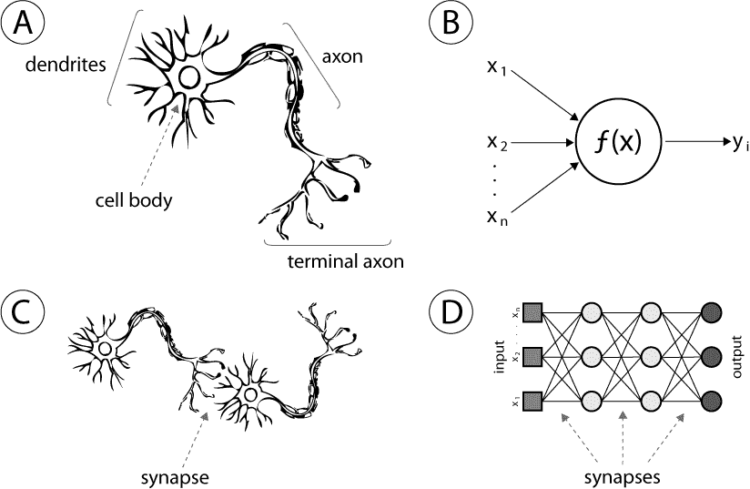
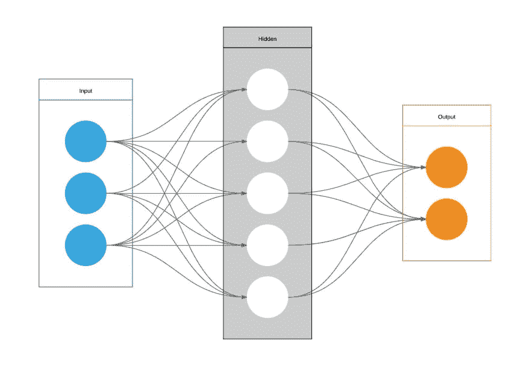
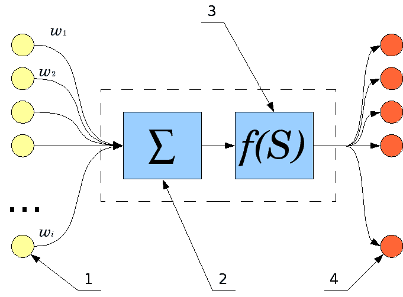

# 神经网络 101

> 原文：<https://dev.to/lautarolobo/neural-networks-101-1oo>

> 这篇文章是关于人工神经网络的。计算机科学！=生物。

## 总结

*   什么是神经网络？
*   神经网络是用来做什么的？
*   神经网络的结构
*   神经网络如何工作
*   如何改进学习过程

## 什么是神经网络？

神经网络是一种受生物神经网络启发的计算模型，就像你我一样。

这里的一个关键概念是，这些模型从示例(输入)中学习，而没有用任何特定于任务的规则进行编程。

## 它们是做什么用的？

*   图像和语音识别。
*   文本生成。
*   遗传分析。
*   语言翻译。
*   自动驾驶。
*   欺诈防范。

## 神经网络的结构

### 不同层

*   投入
*   隐藏(互连)
*   输出

每一层都有特定数量的神经元。并且每个神经元与来自不同层的另一个神经元连接，它不能连接到来自同一层的神经元，除非你使用[递归神经网络。](https://towardsdatascience.com/recurrent-neural-networks-d4642c9bc7ce)。

## 神经网络如何工作

解释这一点并不简单。

首先，你的神经网络必须“学习”。换句话说，你必须训练他们。

你如何训练一个神经网络？

好吧，你把已经处理过的信息传递给输入层。这个比较容易通过一个例子。

假设你向输入层传递 500 张猫图片，标签为“猫图片”，那么神经网络就知道那些是猫图片。然后，你开始传一些没有标记的猫图片，网络会自己标记 git。此外，你可以传递一些汽车图片，鸟类图片，一个无意义的图片，无论什么，你的网络不应该标签与'猫图片'。

如果它将一些图像标记为错误，你可以警告网络它的错误，它会从中学习。

你可以重复这个过程很多次，直到你对你的神经网络的工作方式感到满意，你就有了它。一个训练有素的神经网络，随时可以工作。

现在使用它！传递一些无标签的图片到输入层，看看它做得如何。

如果输出不是你所期望的，你应该多训练它，或者改进学习过程。我将在接下来的几行中详细讨论这一点。

但是现在，让我们变得书呆子。

你的神经网络工作是因为在“猫图片”图像上识别出一个模式。然后开始“记忆”这种模式…不知何故知道这种特定的像素集(一串 1 和 0)进入“猫图片”标签，然后它可以在没有我们帮助的情况下标记猫的图像。

每个神经元得到这些输入，将所有这些权重相加，然后输出出来。在进入下一层之前，这个输出经过一个激活函数。这个函数给输出增加了一个“激活率”，告诉下一个神经元这个数据非常重要。这里有更深入的数学知识。

|  |
| --- |
| 输入输入，求和，激活函数，输出输出。 |

这就是神经元处理数据的方式，但是等等，还有更多！

这些输出可以转到下一层，也可以转到上一层。

当数据进入前一层时，这个过程称为反向传播。多亏了它，数据被处理了好几次。这可能对你有帮助，也可能没有，取决于你愿意用你的网络解决的问题。

还有，一个友好的建议，*大小事*。如果您的网络规模太小或太大，它将无法对数据进行分组，输出将总是错误的，因此您需要找到网络的最佳规模。

在大多数情况下，你会通过反复试验发现这一点，直到你建立起自己的直觉。

## 如何改善学习过程

通过正规化。

这是一个宽泛的概念，包括一系列技术。比较常见的有权重正则化、[、提前停止](https://en.wikipedia.org/wiki/Early_stopping)、学习率衰减、[、数据扩充、](https://www.quora.com/What-is-data-augmentation-in-deep-learning)和辍学。

这些都是防止[过度配合](https://youtu.be/DEMmkFC6IGM)和。

* * *

你有什么问题吗？你觉得我可能遗漏了什么吗？写在评论里吧！

再见！