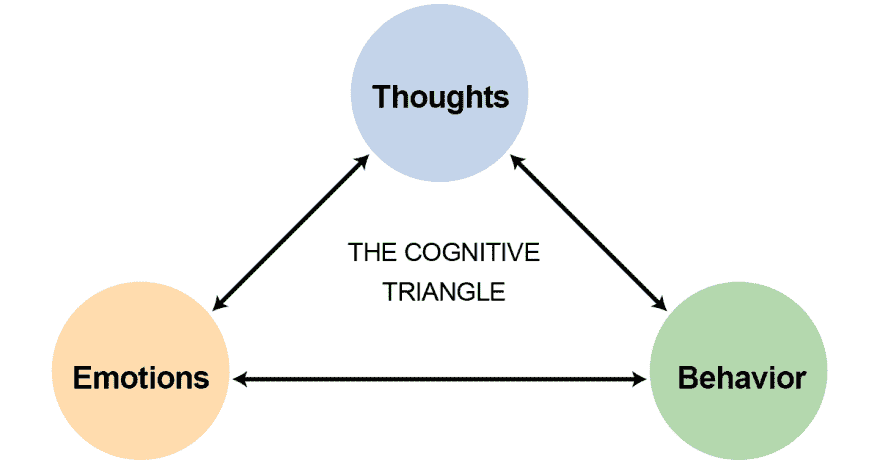

# 新工作冒名顶替综合症

> 原文：<https://dev.to/nprimak/new-job-imposter-syndrome-4hc2>

我刚从一份新工作的第一周幸存下来，这份新工作给了我最严重的冒名顶替综合症，这是我第一次作为软件工程师工作以来最严重的一次。澄清一下，这与工作本身或任何人如何对待我都没有关系。事实上，我对自己有被强加综合症的感觉感到非常惊讶，因为在过去的四年里，我做过很多不同的工作，并且非常擅长转换。在我深入探究是什么帮助我克服了这种综合症之前，让我提供一些背景。

在第一周，我的逻辑部分知道我的感觉是愚蠢的，因为我已经多次证明了自己，并在多种具有挑战性的环境中工作。尽管如此，我的情感部分还没有跟上。我的第一份真正的编码工作是在一家发展迅速的初创公司，但从那以后，我在更多的公司环境中工作，那里的工作节奏较慢，堆栈也不太现代。这让我的新环境看起来更吓人，这引发了不安全感。当然，我的冒名顶替综合症的另一个重要原因是我自己缺乏自信，这源于我过去的一些负面经历。

在我的第一份技术工作中，我学习了 AngularJS，并且有很多其他的工作可以使用这个框架，我可以申请。很自然，我就这么做了——并以连续几年的纯角度体验而告终。回想起来，这可能是一个更有问题的决定，我在另一篇博客文章中讨论过。在过去的几年里，我安定下来，成为一名前端开发人员。这并不是因为我对后端或其他技术领域不感兴趣，而是因为考虑到我的非传统背景(最初是一名视觉艺术学士学位的设计师)，这在当时是有意义的。

我的非传统背景加上作为一名科技女性，是我过去消极经历的两个原因，这些经历导致了我的冒名顶替综合症。我常常觉得，当我走进门的那一刻，这些事情就对我不利。这也是我多年来申请 AngularJS 公司工作的另一个原因。这感觉像是最安全和最可靠的途径，因为我已经知道了那个框架，并且在没有额外负担的情况下证明自己是足够困难的。我相信这是很多女性和非传统程序员都经历过的事情，也是阻碍我们很多人前进的原因。

基本上，当我们进入科技行业时，我们会学习一套技术并坚持下去，因为对于每一份新工作，我们已经感觉到要证明自己有一场艰苦的战斗。有时这意味着要进行额外的编码测试，因为招聘经理“只是想确定”你能处理好。其他时候，这可能意味着当你申请高级职位时，接受一个中级职位。当感觉情况已经对你不利时，为什么还要增加更多的压力和失败的风险呢？这也是一个很大的风险，尤其是如果你是家中养家糊口的人(我丈夫在法学院读书的三年里，我也是如此)。

决定接受一份新工作有很多因素，包括工作环境、同事、地点和其他因素。我认为，对于在技术领域代表性不足的人来说，当我们从事一份让我们害怕的工作时，我们经常会感到最糟糕的冒名顶替综合症，这很糟糕，因为这也是我们成长最快的一份工作。即使我们从同事那里收到了积极的信号，我们仍然会感到不安全和不满足。也许我现在决定冒这个险，因为我的潜意识意识到我的丈夫很快就要开始工作了，因此我可以接受一份更可怕的工作，因为即使我失败了，我仍然有一个以前不存在的财务安全网。我能确定的是我现在在这里，我很高兴我没有逃避挑战。

我希望其他女性和代表性不足的人以及非传统技术人员也愿意无所畏惧地接受令人生畏的工作，所以我希望我能提供一些有用的建议。有一件事对我的冒名顶替综合症很有帮助，那就是提醒自己我所完成的一切。这可能看起来很俗气，但是把你做过的每一件很酷的事情列一个清单是一个很好的自信助推器。我也认为这是一件很好的事情，因为虽然你可以试图淡化你的成就，但你不能说你没有做你做过的事情。这些项目已经完成，它们在你的文件夹里，它们是你历史的一部分。

<figure> 

<figcaption>我们的思想触发我们的行为和情绪这一观点是认知行为疗法的重要组成部分，可以应用于冒名顶替综合征。</figcaption>

</figure>

我们的思想触发了我们的行为和情绪，这一观点是认知行为疗法的重要组成部分，可以应用于冒名顶替综合征。你可以尝试的另一个有用的方法是认知行为疗法中常用的一种技术。首先制作一个两栏图表。然后在左边列出你对自己所有的负面想法。特别是和工作有关的。一个例子可能是“我的同事在我的最后一次代码审查中给了我大量的负面反馈，所以他们可能认为我是一个白痴。”

在你列出你最消极的想法后，试着在右边挑战它们。如果你在想“嗯，它们都是合理的想法，所以我不能挑战它们”，那么我建议你看一看常见思想扭曲的列表。在上面列出的例子中，一种被称为“读心术”的思想扭曲正在被使用。这是因为在这个例子中，这个人假设他们所有的同事都认为他们是白痴。这种思路的问题是，这个人不可能知道他们的同事在想什么，因为那会让人读心术。所以，这个人可以写在右边一栏。

<figure> 

<figcaption>更多一些读心术的例子，许多思想扭曲现象之一</figcaption>

</figure>

更多读心术的例子。
我推荐的最后一件事是[在推特上搜索“冒名顶替综合症”](https://twitter.com/search?q=imposter%20syndrome&src=typeahead_click&f=live)。如果你不在 Twitter 上，我建议你注册一个账号，即使只是为了关注其他开发者。这是技术新闻、快速提示和专家建议的快捷来源。如果你搜索“冒名顶替综合症”，你会看到有成千上万的人一直在推特上谈论冒名顶替综合症以及他们的经历。许多经历过冒名顶替综合症的人都是有成就且令人印象深刻的专业人士。他们没有理由有这样的感觉。希望这能帮助你明白，冒名顶替综合症并不能反映你是谁，或者你的工作有多出色。

我知道这只是三条建议，关于这个话题我还有很多可以说的，但是现在我要结束这篇文章了。如果你喜欢这篇文章，可以考虑在 twitter 上关注我。如果你觉得图表练习有帮助的话，我想给你推荐一本书。它有许多有用的练习和评估，尽管它更侧重于焦虑和抑郁，而不是具体的骗子综合症。大卫·D·伯恩斯写的《感觉良好的 T2》是我读过的最好的自助书籍之一。

如果你喜欢这篇文章，可以考虑在 Twitter 上关注我 [@nadyaprimak](https://www.twitter.com/nprimak) 或者如果你需要更多进入科技行业的技巧，你可以现在就阅读我的书[平装本或 Kindle 版本的《踏入 T4》。](https://www.amazon.com/Foot-Door-Getting-Industry-Programmer-ebook/dp/B0813XNFNF)

帖子[新工作骗子综合症](https://www.nadyaprimak.com/blog/career/new-job-imposter-syndrome/)最早出现在 www.nadyaprimak.com/blog[的](https://www.nadyaprimak.com)上。