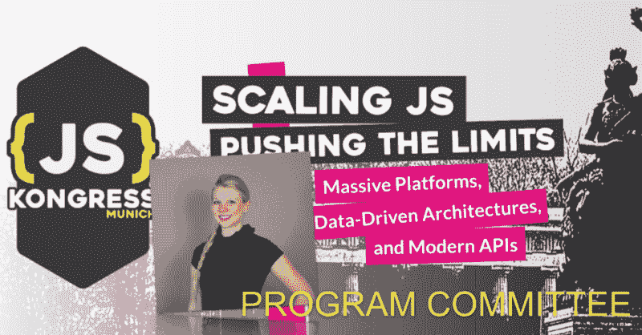

# 保时捷中心新成员:瓦妮莎·博纳

> 原文：<https://dev.to/jskongress/new-member-for-the-pc-vanessa-bohner-5bg2>

<figure> 

<figcaption>Vanessa 是一名 Web 开发人员，SinnerSchrader 的产品工程师，Vue Vixens Munich 的城市协调员和发言人。她在十岁时创建了自己的第一个网站，从那以后她就一直对 web 开发充满热情。她研究媒体信息学，重点是人机交互。现在，Vanessa 正在努力为客户提供最佳体验，同时创建现代 web 应用程序。</figcaption>

</figure>

请欢迎瓦内萨成为 JS Kongress 2020 计划委员会(PC)的成员。【jskongress】是她的第一次发布会，现在她将参与节目的创作和设计，因为我们是社区为社区做的发布会。

首先，我们问了她几个问题:

*   **你为什么期待#jskongress？**

JS Kongress 是我作为开发者参加的第一个会议。有人告诉我，这是一个专注于 JavaScript 而非框架的深度技术会议。超出了我的期望。我突然被一群了不起的人包围了，他们知识渊博，精力充沛。因此我每年都去那里。这一次我期待着有和以往一样的经历。

*   你如何看待或联想到 2020 年的格言“扩展 JS——挑战极限:大规模平台、数据驱动架构和现代 API”？

如今，Web 开发似乎更加复杂了。它从 HTML、CSS 和 JavaScript/AJAX 开始，用于监听事件和获取数据。今天，我们有客户端繁重的应用程序，想想移动和桌面屏幕，支持 PWAs，跨站点脚本…我们想为用户提供的是一个稳定和安全的应用程序。与此同时，每个人都应该获得良好的体验，尽管是用哪种设备或互联网连接。在开发功能时，开发人员必须重新考虑他们的工作流程，例如，切换到微服务/前端。试图同时考虑所有的事情会让人筋疲力尽，所以我们应该在一个能让我们的日常生活尽可能简单的生态系统中工作。

*   你对这个项目的愿景是什么？

我希望尽可能多地获得各种主题的信息。只有当我们倾听许多人不同的故事时，我们才能进步和变得更好。我期待着忘记我的日常工作和小问题。相反，我会被来自不同人的许多想法所激励。我相信之后我会迫不及待地再次把手放在键盘上，开始实现没有 JS Kongress 我永远不会想到的新想法。

*   你还记得你第一次接触 JSK 的时候吗？原因是什么，或者是谁？

当然，那是 2016 年，最开始的时候。我的生活从打工学生变成了全职员工，对参观会议越来越感兴趣。问题是:哪一个？我没有任何经验。但是:我爱 JavaScript。我喜欢并生活在慕尼黑。简单的选择:JS Kongress！太神奇了。

*   你对所有演讲者和所有想提交演讲想法的人有什么激励吗？

如果我没有在会议上遇到这么多伟大的人，如果我没有把自己推入冷水中开始在会议上发言，今天我就不会是那个人。JavaScript 是一种社区驱动的语言。这既是一个很好的机会，也是一个很大的责任。JavaScript 社区也很感激。很多人问我聊什么。我的回答总是:你对什么有激情？告诉我你的故事。外面有太多的东西要学，我们需要每个人的帮助来贡献知识。

*   你在慕尼黑生活和工作。你有什么秘密建议给每个参加 JS Kongress 的人吗，他们需要看什么，去哪里吃饭，或者散步的美丽景点(或其他)？

清晨或傍晚散步/跑步的好去处取决于奥林匹亚山**。如果你想再欣赏一下这座城市，你应该去 [**咖啡馆。它在慕尼黑大饭店的屋顶平台上，包括一个了不起的咖啡师。说到咖啡:**](https://www.tripadvisor.com/Restaurant_Review-g187309-d4746178-Reviews-Vorhoelzer_Forum_at_the_Department_of_Architecture_TUM-Munich_Upper_Bavaria_Bavar.html) **[**人机**](https://mvsm.coffee/) 就是要去的地方。纯素食者会在慕尼黑玩得很开心， [**Max Pett**](https://www.yelp.com/biz/max-pett-m%C3%BCnchen) 度过一个非常美好的夜晚，或者 [**Katzentempel**](https://katzentempel.de/cafe-katzentempel-first-catcafe-in-germany-vegetarian-vegan/) 【猫庙】——是的，有真正的猫。 [**Viktualien 市场**](https://www.muenchen.de/int/en/shopping/markets/viktualienmarkt.html) 要么是慕尼黑最具游客量的地方，要么就是最具慕尼黑特色的地方。我现在还没决定，但是我喜欢去那里参观“[**der verrückte EIS macher**](https://www.tripadvisor.com/Restaurant_Review-g187309-d3805135-Reviews-Der_Verruckte_Eismacher-Munich_Upper_Bavaria_Bavaria.html)”。当然，你不想错过文化，也许你会喜欢 [**啤酒和啤酒节博物馆**](https://www.bier-und-oktoberfestmuseum.de/en) 。最后但同样重要的是:艾斯巴赫波浪，不管天气有多冷，至少会有一个冲浪者在那里。****

 *** * *

2020 # jskongress 的**论文征集**截止到 10 月 15 日——我们期待在 https://sessionize.com/js-kongress-2020[上读到你的想法](https://sessionize.com/js-kongress-2020)

在[https://medium . com/@ jskongress/CFP-FAQ-first-members-join-program-Committee-8 FEC 626 a1 ce 0](https://medium.com/@jskongress/cfp-faq-first-members-join-program-committee-8fec626a1ce0)上找到我们征文的 **FAQ**

此外，我们也在寻找您对#DeepTrack 的想法。每一个有票的人都可以参与，所有与会者一起创造节目:【https://github.com/JSKongress/JS-Kongress-Munich-Deep-Track

后[个人电脑的新成员:瓦妮莎博纳](https://js-kongress.com/2019/09/16/new-member-for-the-pc-vanessa-bohner/)首次出现在 [JS KONGRESS 2020:扩展 JS-推动极限:大规模平台、数据驱动架构和现代 API。](https://js-kongress.com)。**