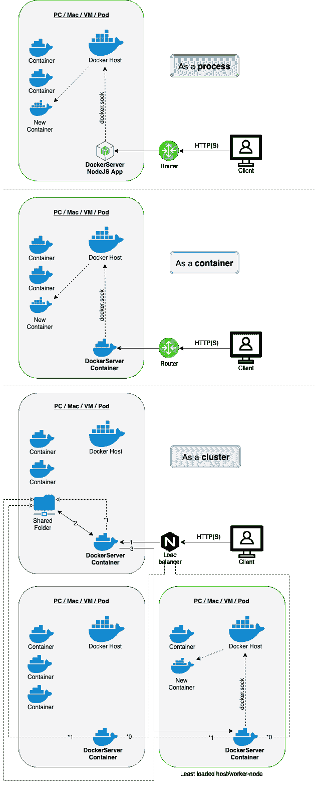

# docker server——以简单安全的方式从远程机器上运行 docker 容器。

> 原文：<https://dev.to/freaker2k7/new-super-lightweight-simple-restful-stateless-server-for-running-docker-containers-on-a-remote-machine-s-in-a-secure-way-40f1>

# 坞站服务器

超级轻量级&简单的 RESTFul 无状态服务器，用于以安全的方式在远程机器上运行 [docker](https://docker.com/) 容器。

  

## 安装

`npm i -g docker-server`

或者

`docker run -d -p 1717:1717 --restart=always --name=docker-server -v /var/run/docker.sock:/var/run/docker.sock -e "DS_TOKEN=my_secret_token" evgy/dockerserver`

## 背景

我需要在一台远程机器上运行几个容器，并得出以下结论:

*   忽必烈是个过客！
*   docker-machine 也很复杂！
*   我只想在远程机器上运行几个容器。

## 接近

使用`express`和`docker-cli-js`包作为基础，用 NodeJS 构建了一个小型 REST 服务器。

### 设计原则

*   保持业务逻辑**简单**！
*   肯定是**无状态**！
*   Docker 在场。

### 当前架构

The cluster diagram demonstrates a PUT request.

#### 集群模式注意事项:

**0 -负载平衡器和 docker-server 之间的连接。*

**1 -将机器负载保存到共享文件夹中的 [JSON](https://json.org) 文件中(在所有机器中)。*

**摆放方法**

*1 -请求来到任何空闲的(根据负载均衡器)节点来回答。*

*2 -获取最空闲(根据实际 cpu-mem 比率)的节点(从共享存储中)。*

将当前请求重新发送到该节点(如果是当前节点，则发送进程)并返回答案。

**对于其余的方法**

向所有节点重新发送当前请求，并返回合并结果。

## 用法

在您希望运行容器的机器上安装 DockerServer。

DockerServer 可以通过以下方式为单个会话运行:

`$ docker-server`

或者作为使用 [PM2](https://pm2.keymetrics.io/) 的服务:

`$ pm2 start /usr/lib/node_modules/docker-server/pm2.config.js`

如果您想在启动时启动它，只需运行:

`$ pm2 startup`

当然，如前所述，通过 docker 本身使用参数:

`$ docker run -d -p 1717:1717 --restart=always --name=docker-server -v /var/run/docker.sock:/var/run/docker.sock evgy/dockerserver docker-server --token my_secret_token`

或者您可以在 **HTTPS** 模式下运行:

(注意，在这个例子中，我使用了[来加密](https://letsencrypt.org/)，我使用了`readlink`，因为这些文件是符号链接)

`$ docker run -d -p 443:1717 --privileged --restart=always --name=docker-server -v /var/run/docker.sock:/var/run/docker.sock
-v $(readlink -f /home/user/letsencrypt/config/live/your-domain.com/cert.pem):/certs/cert.pem:ro
-v $(readlink -f /home/user/letsencrypt/config/live/your-domain.com/chain.pem):/certs/chain.pem:ro
-v $(readlink -f /home/user/letsencrypt/config/live/your-domain.com/privkey.pem):/certs/privkey.pem:ro
evgy/dockerserver docker-server --token my_secret_token --https`

注意:只有在使用 443 端口时才需要 **-特权**参数，因为 1024 以下的所有端口都被 root 保留。

此外，当您有几台机器要使用时，您可以在**集群模式**下运行:

`$ docker run -d -p 1717:1717 --privileged --restart=always --name=docker-server -v /var/run/docker.sock:/var/run/docker.sock
-v /some/shared/folder:/my/somewhy/custom/path evgy/dockerserver docker-server --token my_secret_token --cluster --folder /my/somewhy/custom/path`

或者简单地说:

`$ docker run -d -p 1717:1717 --privileged --restart=always --name=docker-server -v /var/run/docker.sock:/var/run/docker.sock
-v /some/shared/folder:/tmp/docker-server evgy/dockerserver docker-server --token my_secret_token --cluster`

注意:`/tmp/docker-server`是默认文件夹，所以即使没有 docker，你也可以轻松安全地运行它。

现在，您可以使用简单的 HTTP 请求进行“远程”docker 操作:

| HTTP 方法 | 端点 | Desc。 | Docker 命令 |
| 得到 | / | 列出所有容器 | docker ps -a |
| 得到 | /:id | 显示特定容器的日志 | docker 日志:id |
| 放 | / | 运行集装箱 | 码头运行... |
| 邮政 | /:id | 在容器中执行命令 | 坞站 exec-我...。 |
| 删除 | /:id | 删除具有此类名称或 ID 的容器 | docker rm -f :id |

## 选项

### 环境

您可以设置以下环境变量来配置 DockerServer:

| 环境变量。 | Desc。 | 默认 |
| `DS_PORT` | DockerServer 运行的端口 | One thousand seven hundred and seventeen |
| `DS_TOKEN` | 授权的秘密令牌 | xxxxxx |

### 参数

此外，您可以使用这些参数启动 DockerServerwith:

| 参数 | Desc。 | 默认 |
| `--port [num]` | DockerServer 运行的端口 | One thousand seven hundred and seventeen |
| `--token [string]` | 授权的秘密令牌 | xxxxxx |
| `--low_burst [num]` | 低突发的每分钟最大请求数。 | Sixty |
| `--mid_burst [num]` | 中间突发的每分钟最大请求数。 | one hundred and eighty  |
| `--high_burst [num]` | 高突发的每分钟最大请求数。 | Three hundred |
| `--https` | 启用 **HTTPS** 模式。
为此，您必须拥有以下文件:
a ./certs/cert . PEM
b ./certs/privkey . PEM
c ./certs/chain . PEM(可选，支持自签名证书) | 错误的 |
| `--cluster` | 启用**集群**模式。 | 错误的 |
| `--folder [path]` | 所有 docker 服务器之间的共享文件夹。(仅在集群模式下使用) | /tmp/docker-server |
| `--cache_interval [num]` | (所有机器的)读取间隔毫秒 | Three thousand |
| `--log_lovel [option]` | 日志级别[跟踪&#124;调试&#124;信息&#124;警告&#124;错误&#124;致命] | 信息 |
| `--log_expiry [num]` | 日志的生存时间以天为单位。 | Fourteen |
| `--log_max_size [num]` | 最大日志大小(MB) | Twenty-five |
| `--help` | 给他看 |   |
| `--version` | 显示当前版本 |   |

### 放数据

发送 PUT 请求时，支持以下参数:

| 参数 | Desc。 | 默认 | Docker 命令 |
| 图像 | 跑步的图像。(**必选** | 空 |   |
| 名字 | 容器的名称。 | uuid4() | `--name` |
| 去除 | 完成时移除容器的标志`--rm` | 错误的 | `--rm` |
| 派遣 | 分离容器的标志`-d` | 错误的 | `-d` |
| 港口 | **映射**要发布的端口。 | 空 | `-p` |
| 卷 | **映射要装载的卷的**。 | 空 | `-v` |
| 数据 | CMD 在容器内部运行。 | 空 |   |

### 发布数据

发送 POST 请求时，支持以下参数:

| 参数 | Desc。 | 默认 | Docker 命令 |
| 数据 | CMD 在容器内部运行 | 空 |   |
| 电传打字机 | 启用 TTY 模式的标志 | 错误的 | `-t` |
| 相互作用的 | 启用交互模式的标志 | 错误的 | `-i` |

## 例子

注意:在示例中，我假设您使用的是默认端口。

1.  获取所有容器的列表:

`$ curl -X GET http://1.2.3.4:1717/ -H 'Authorization: Basic base64EncodedToken'`

1.  在远程机器上运行 redis:

`$ curl -X PUT http://1.2.3.4:1717/ -H 'Authorization: Basic base64EncodedToken' --data 'name=p-redis&image=redis&ports[1234]=6379'`

和/或

`$ curl -X PUT http://1.2.3.4:1717/ -H 'Authorization: Basic base64EncodedToken' --data 'name=v-redis&image=redis&volumes[/tmp/data]=/data'`

1.  删除我们创建的容器:

`$ curl -X DELETE http://1.2.3.4:1717/p-redis -H 'Authorization: Basic base64EncodedToken'`

和/或

`$ curl -X DELETE http://1.2.3.4:1717/v-redis -H 'Authorization: Basic base64EncodedToken'`

## 变更日志

1.8.4 -编辑了一些文档。

1.8.2 -添加了记录器。

1.8.1 -兑现读数(在集群模式下)和修复结果中的主机问题(也在集群模式下)。

1.8.0 - **稳定集群模式！**

[查看完整变更日志](https://github.com/freaker2k7/dockerserver/blob/master/CHANGELOG.md)

## 路线图

*   队列(用于重载)
*   自动缩放

## 执照

APACHE-2.0(参见存储库中的许可文件)。

## 捐赠

跑码头是免费的，但是**啤酒**永远受欢迎  
或者直接捐给我们的事业 