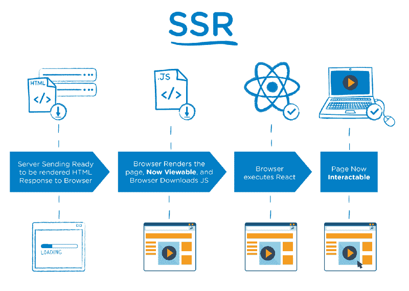
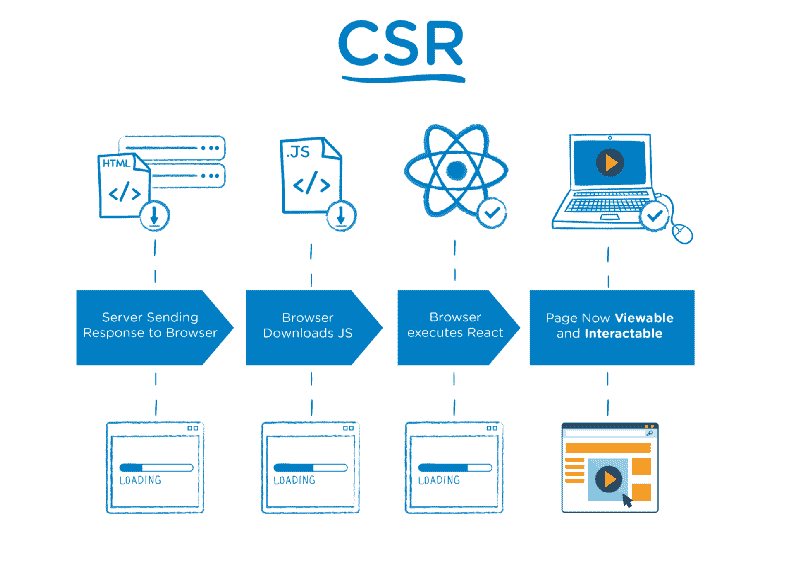
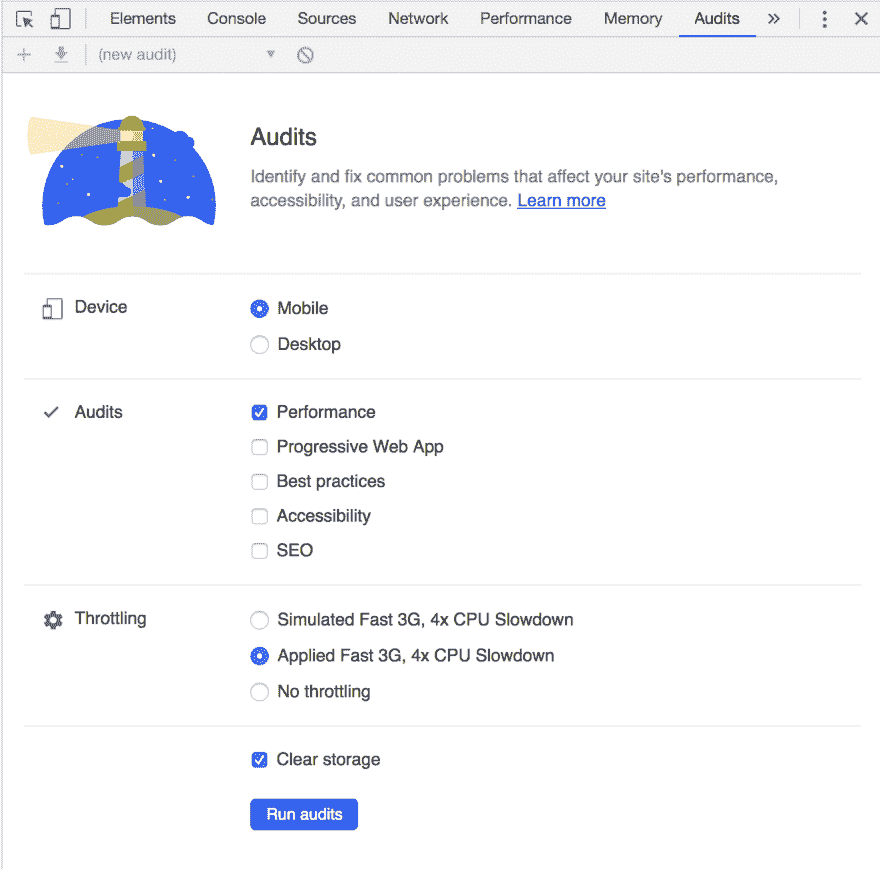
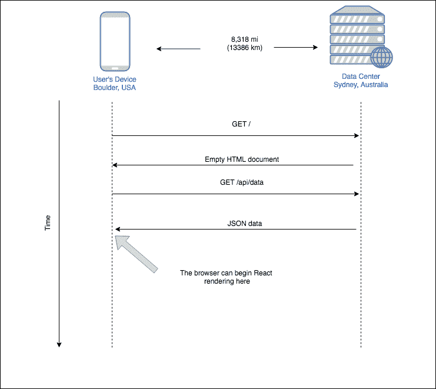
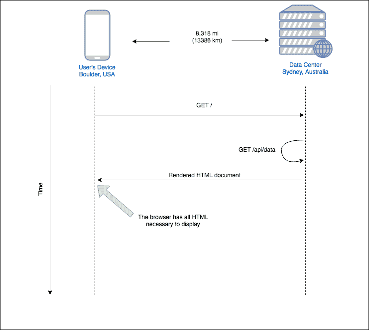
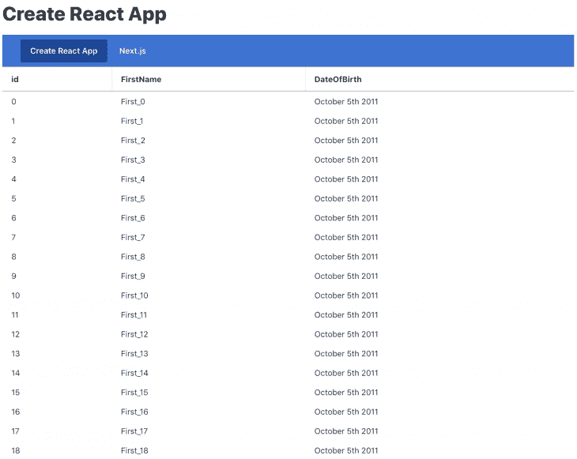
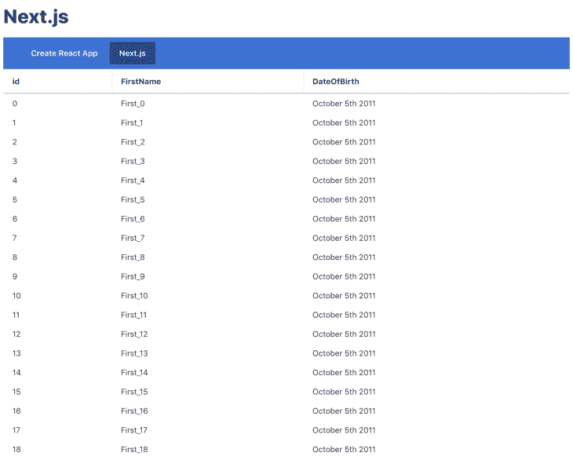
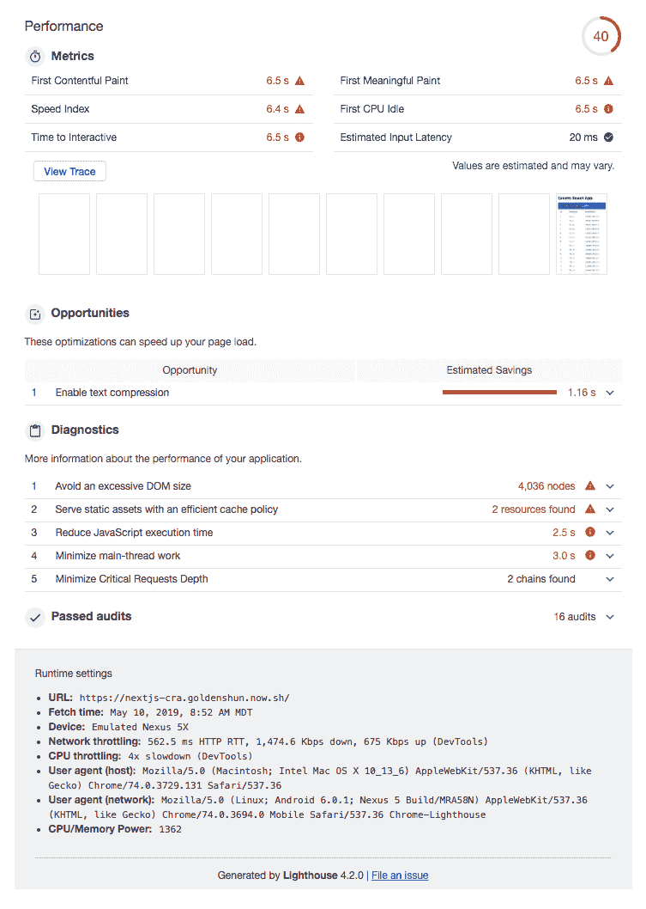
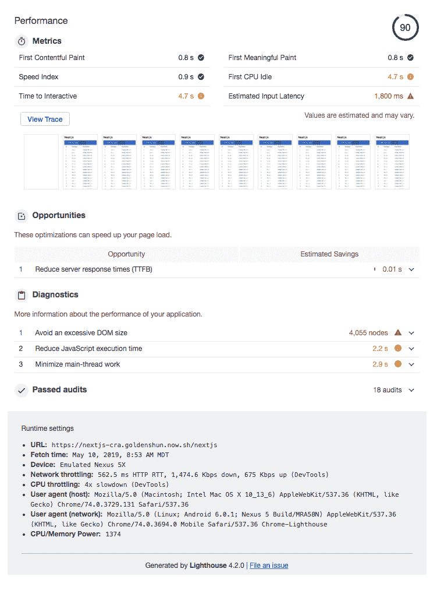
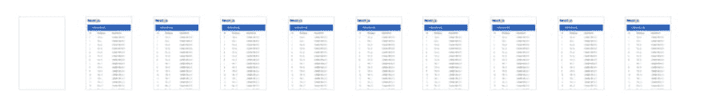

# Next.js vs. Create React App:谁的 App 性能更好？

> 原文：<https://dev.to/bnevilleoneill/next-js-vs-create-react-app-whose-apps-are-more-performant-2dom>

[](https://res.cloudinary.com/practicaldev/image/fetch/s--oeZ-W4OY--/c_limit%2Cf_auto%2Cfl_progressive%2Cq_auto%2Cw_880/https://thepracticaldev.s3.amazonaws.com/i/ek6mz3tdc0m7prtctmt2.jpg)

## 简介

Next.js 和 Create React App 在性能上有什么区别？让我们用一些数据来解开这个问题，但是首先，我们需要明白我们到底在比较什么。

### next . js 是什么？

Next.js 是由 [Zeit](https://zeit.co) 搭建的 React 框架，根据[nextjs.org](https://nextjs.org/)的说法:

> 有了 Next.js，React 应用的服务器渲染变得前所未有的简单，无论你的数据来自何方。

Next.js 也支持静态导出，但是出于本文的目的，我们主要关注上面提到的“服务器渲染”功能。

### [T4】](https://logrocket.com/signup/)

### 什么是 Create React App？

根据其[入门](https://facebook.github.io/create-react-app/docs/getting-started)页面:

> Create React App 是一种官方支持的创建单页 React 应用程序的方式。

同样，出于本文的目的，我们关注术语“单页”

### SSR 与 CSR

Next.js 是利用 React 支持服务器端呈现(SSR)的一种方式。同样，创建 React 应用程序是利用 React 支持客户端渲染(CSR)的一种方式。

对于这两种选择，还有其他的框架，但是我们在这篇文章中真正比较的是每种渲染策略如何影响 web 应用程序的性能。我们只是碰巧使用了两个比较流行的框架来进行比较。

## 实验

让我们以一个问题开始我们的实验:**SSR 是否提高了应用程序性能？**

### 假设

沃尔玛实验室发表了一篇名为“[服务器端渲染优于客户端渲染的优势](https://medium.com/walmartlabs/the-benefits-of-server-side-rendering-over-client-side-rendering-5d07ff2cefe8)”的文章他们还提供了一些优秀的图表，展示 SSR 与 CSR 性能之间的根本差异。

[](https://res.cloudinary.com/practicaldev/image/fetch/s--1P4sAv7L--/c_limit%2Cf_auto%2Cfl_progressive%2Cq_auto%2Cw_880/https://i0.wp.com/blog.logrocket.com/wp-content/uploads/2019/06/ssr-explanation.png%3Fresize%3D800%252C570%26ssl%3D1)

[](https://res.cloudinary.com/practicaldev/image/fetch/s--gkv4xpk3--/c_limit%2Cf_auto%2Cfl_progressive%2Cq_auto%2Cw_880/https://i1.wp.com/blog.logrocket.com/wp-content/uploads/2019/06/csr-explanation.png%3Fresize%3D800%252C564%26ssl%3D1)

这些图表假设 SSR 可以比 CSR 更快地向浏览器交付 HTML，所以让我们假设:用 SSR 构建的 web 应用程序比用 CSR 构建的 web 应用程序性能更好。

### 测试参数

测试我们假设的最好方法是构建两个具有相同功能和 UI 的应用程序。我们希望它尽可能模拟真实世界的应用程序，因此我们将设置一些参数。

应用程序必须:

*   从 API 获取数据
*   呈现大量的内容
*   承载一些 JavaScript 重量

### 移动事项

软件开发人员通常被高性能的计算机和速度惊人的办公网络惯坏了；我们并不总是像用户一样体验我们的应用程序。

记住这一点，在优化性能时，考虑网络和 CPU 限制是很重要的。移动设备通常处理能力较低，因此繁重的 JavaScript 文件解析和昂贵的渲染会降低性能。

幸运的是，Chrome 提供了一个名为 Lighthouse 的开发工具，这使得我们可以很容易地站在用户的角度，了解他们的体验。你可以在 Chrome DevTools 的**审计**标签下找到这个。

[](https://res.cloudinary.com/practicaldev/image/fetch/s--ETUYgxkM--/c_limit%2Cf_auto%2Cfl_progressive%2Cq_auto%2Cw_880/https://i0.wp.com/blog.logrocket.com/wp-content/uploads/2019/06/audits-tab-chrome-devtools.png%3Fresize%3D1322%252C1306%26ssl%3D1)

我们将使用上面显示的精确设置:

*   移动装置
*   应用快速 3G，4 倍 CPU 减速
*   清理存储

### 地理要紧

如果您住在北加州，并且整天使用 AWS us-west-1(北加州)的服务器，那么您的应用程序体验与美国其他地方或世界其他地方的用户不同。

因此，为了测试的目的，演示应用和 API 被部署到澳大利亚的悉尼(具体来说， [Zeit 的 syd1 地区](https://zeit.co/docs/v2/platform/regions-and-providers/))。客户端的浏览器将访问来自美国科罗拉多州博尔德的应用程序。

博尔德和悉尼之间的距离是 8318 英里(13386 公里)。

[](https://res.cloudinary.com/practicaldev/image/fetch/s--ABgjupaO--/c_limit%2Cf_auto%2Cfl_progressive%2Cq_auto%2Cw_880/https://i1.wp.com/blog.logrocket.com/wp-content/uploads/2019/06/boulder-sydney-difference.png%3Fresize%3D730%252C725%26ssl%3D1)

看看这对于这两个应用程序之间的数据获取意味着什么。

[](https://res.cloudinary.com/practicaldev/image/fetch/s--9x8Uc4uO--/c_limit%2Cf_auto%2Cfl_progressive%2Cq_auto%2Cw_880/https://i0.wp.com/blog.logrocket.com/wp-content/uploads/2019/06/csr-data-fetching.png%3Fresize%3D741%252C661%26ssl%3D1) 

<figcaption>南车</figcaption>

[](https://res.cloudinary.com/practicaldev/image/fetch/s--_LxKrQQ---/c_limit%2Cf_auto%2Cfl_progressive%2Cq_auto%2Cw_880/https://i1.wp.com/blog.logrocket.com/wp-content/uploads/2019/06/ssr-data-fretching.png%3Fresize%3D741%252C661%26ssl%3D1) 

<figcaption>SSR</figcaption>

### 两个应用程序，一个 API

这两个应用的代码可以在我的 GitHub 中找到。

以下是应用程序:

*   [创建 React 应用](https://nextjs-cra.goldenshun.now.sh/)
*   [Next.js](https://nextjs-cra.goldenshun.now.sh/nextjs)

所有代码都在 monorepo 中:

*   `/cra`包含应用程序的 Create React App 版本
*   `/nextjs`包含 Next.js 版本
*   包含两个应用程序都使用的模拟 API

用户界面看起来完全相同:

[](https://res.cloudinary.com/practicaldev/image/fetch/s--K_PC7lKq--/c_limit%2Cf_auto%2Cfl_progressive%2Cq_auto%2Cw_880/https://i1.wp.com/blog.logrocket.com/wp-content/uploads/2019/06/cra-ui.png%3Fresize%3D730%252C581%26ssl%3D1) 

<figcaption>南车</figcaption>

[](https://res.cloudinary.com/practicaldev/image/fetch/s--jtrfOzcY--/c_limit%2Cf_auto%2Cfl_progressive%2Cq_auto%2Cw_880/https://i0.wp.com/blog.logrocket.com/wp-content/uploads/2019/06/nextjs-ui.png%3Fresize%3D730%252C586%26ssl%3D1) 

<figcaption>SSR</figcaption>

和 JSX 几乎一模一样:

```
// Create React App
<ThemeProvider>
  <div>
    <Text as="h1">Create React App</Text>
    <PrimaryNav align="left" maxItemWidth="20rem">
      <NavItem href="/" selected>Create React App</NavItem>
      <NavItem href="/nextjs">Next.js</NavItem>
    </PrimaryNav>
    <Table
      data={users}
      rowKey="id"
      title="Users"
      hideTitle />
  </div>
</ThemeProvider> 
```

```
// Next.js
<ThemeProvider>
  <div>
    <Text as="h1">Next.js</Text>
    <PrimaryNav align="left" maxItemWidth="20rem">
      <NavItem href="/">Create React App</NavItem>
      <NavItem href="/nextjs" selected>Next.js</NavItem>
    </PrimaryNav>
    <Table
      data={users}
      rowKey="id"
      title="Users"
      hideTitle />
  </div>
</ThemeProvider> 
```

我们一会儿会谈到`ThemeProvider`和其他组件是什么。

然而，代码的不同之处在于如何从 API 获取数据:

```
// Create React App
// This all executes in the browser
const  = useState([]);
useEffect(() => {
  const fetchData = async () => {
    const resp = await axios.get('/api/data');
    const users = resp.data.map(user => {
      return {
        id: user.id,
        FirstName: user.FirstName,
        DateOfBirth: moment(user.DateOfBirth).format('MMMM Do YYYY'),
      }
    });
    setUsers(users);
  };
  fetchData();
}, []); 
```

```
// Next.js
// This all executes on the server on first load
Index.getInitialProps = async({ req }) => {
  const resp = await axios.get(`http://${req.headers.host}/api/data`);
  const users = resp.data.map(user => {
    return {
      id: user.id,
      FirstName: user.FirstName,
      DateOfBirth: moment(user.DateOfBirth).format('MMMM Do YYYY'),
    }
  });
  return { users };
} 
```

`getInitialProps`是一个特殊的函数，Next.js 使用它来填充 Next.js 中页面的初始数据。你可以在他们的[文档](https://nextjs.org/docs#fetching-data-and-component-lifecycle)中了解更多关于使用 Next.js 获取数据的信息。

### 那么所有这些组件是怎么回事，你为什么使用 Moment.js？

回到我们最初的测试参数，我们试图用一个至少有点类似于我们将交付生产的应用程序进行测试。`ThemeProvider`、`PrimaryNav`等。都来自于一个叫做[矿物 UI](https://mineral-ui.com/) 的 UI 组件库。

我们还引入了 [Moment.js](https://momentjs.com/) ,因为它是一个更大的依赖项，增加了一些 JavaScript 权重，以及在呈现组件树时需要进行的一些额外处理。

我们使用的实际库并不重要；重点是更接近普通应用程序的重量，而不需要花费时间来构建所有这些。

## 结果

下面是 Lighthouse 对每个应用程序的全页面加载的结果。

[](https://res.cloudinary.com/practicaldev/image/fetch/s--SMxFJ-EG--/c_limit%2Cf_auto%2Cfl_progressive%2Cq_auto%2Cw_880/https://i0.wp.com/blog.logrocket.com/wp-content/uploads/2019/06/cra-lighthouse-results.png%3Fresize%3D753%252C1058%26ssl%3D1) 

<figcaption>创建 React App (CSR)结果</figcaption>

[](https://res.cloudinary.com/practicaldev/image/fetch/s--PRo0vOyB--/c_limit%2Cf_auto%2Cfl_progressive%2Cq_auto%2Cw_880/https://i0.wp.com/blog.logrocket.com/wp-content/uploads/2019/06/nextjs-lighthouse-results.png%3Fresize%3D751%252C1012%26ssl%3D1)T3】next . js(SSR)结果

要了解这些指标的细节，请阅读 [Lighthouse 评分指南](https://developers.google.com/web/tools/lighthouse/v3/scoring)。

对我们的目的来说，最显著的区别之一是第一次有意义的绘画。

*   CRA: 6.5s
*   **Next.js:** 0.8s

根据谷歌的[首个有意义的描绘](https://developers.google.com/web/tools/lighthouse/audits/first-meaningful-paint)文档:

> 这个审核确定了用户认为页面的主要内容可见的时间。

Lighthouse 还帮助我们将这些差异形象化:

[](https://res.cloudinary.com/practicaldev/image/fetch/s---pyQM2L3--/c_limit%2Cf_auto%2Cfl_progressive%2Cq_auto%2Cw_880/https://i0.wp.com/blog.logrocket.com/wp-content/uploads/2019/06/cra-first-meaningful-paint.png%3Fresize%3D891%252C141%26ssl%3D1) 

<figcaption>创建 React App (CSR)</figcaption>

[](https://res.cloudinary.com/practicaldev/image/fetch/s--9Mkdn6jN--/c_limit%2Cf_auto%2Cfl_progressive%2Cq_auto%2Cw_880/https://i1.wp.com/blog.logrocket.com/wp-content/uploads/2019/06/nextjs-first-meaningful-paint.png%3Fresize%3D905%252C143%26ssl%3D1) 

<figcaption>Next.js (SSR)</figcaption>

上面的画面看起来熟悉吗？他们应该这样做，因为他们模仿了**假设**部分中的图表，在那里我们假设 SSR 可以比 CSR 更快地将 HTML 传送到浏览器。基于这些结果，它可以！

要亲自查看 Lighthouse 结果:

1.  下载 [CRA](https://www.dropbox.com/s/g6ezatrz1iushgo/lighthouse-cra?dl=0) 和 [Next.js](https://www.dropbox.com/s/i71x8in664eb95t/lighthouse-nextjs?dl=0) 的文件
2.  在 Chrome 浏览器中打开 https://googlechrome.github.io/lighthouse/viewer/
3.  将下载的文件拖入 Chrome 中的 Lighthouse Viewer

## 结论

我们以一个问题开始了我们的实验:**SSR 能提高应用程序性能吗？**

我们构建了两个几乎相同的应用程序，一个通过 Create React App 使用客户端渲染，另一个通过 Next.js 使用服务器端渲染。

我们模拟的灯塔结果显示，Next.js 应用程序在所有重要类别中都有更好的指标，特别是首次有意义的绘画(减少 87.69%)、首次有内容的绘画(减少 87.69%)和交互时间(减少 27.69%)。

* * *

## Plug: [LogRocket](https://logrocket.com/signup/) ，一款适用于网络应用的 DVR

[](https://logrocket.com/signup/)

LogRocket 是一个前端日志工具，可以让你回放问题，就像它们发生在你自己的浏览器中一样。LogRocket 不需要猜测错误发生的原因，也不需要向用户询问截图和日志转储，而是让您重放会话以快速了解哪里出错了。它可以与任何应用程序完美配合，不管是什么框架，并且有插件可以记录来自 Redux、Vuex 和@ngrx/store 的额外上下文。

除了记录 Redux 操作和状态，LogRocket 还记录控制台日志、JavaScript 错误、堆栈跟踪、带有头+正文的网络请求/响应、浏览器元数据和自定义日志。它还使用 DOM 来记录页面上的 HTML 和 CSS，甚至为最复杂的单页面应用程序重新创建像素级完美视频。

[免费试用](https://logrocket.com/signup/)。

* * *

Next.js vs. Create React 应用:谁的应用性能更好？最早出现在 [LogRocket 博客](https://blog.logrocket.com)上。