# 使用 ExploreTrees 的下一级可视化。副检察长

> 原文：<https://dev.to/cheeaun/next-level-visualizations-with-exploretrees-sg-4i86>

去年，我写了一篇关于我有史以来最雄心勃勃的副业之一《T2 探险者树》。SG 。简直是令人惊叹的**。**

 **[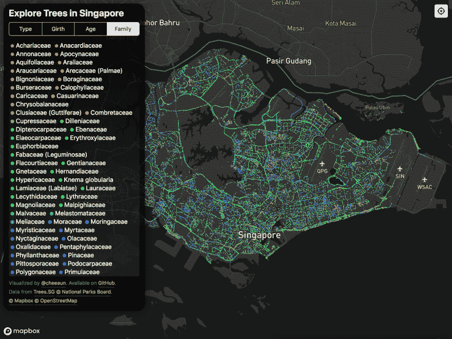](https://res.cloudinary.com/practicaldev/image/fetch/s---6rD9iYG--/c_limit%2Cf_auto%2Cfl_progressive%2Cq_auto%2Cw_880/https://cheeaun.com/blimg/screenshots/web/tree-families-legend-layers-panel-exploretrees-sg%402x.png)

## 重访杰作

从那以后我再也没碰过它。今年三月，我*突然*渴望更新数据集，看看是否有什么变化。我运行脚本来获取最新的数据，[得到了这个](https://twitter.com/cheeaun/status/1108010887984472069):

[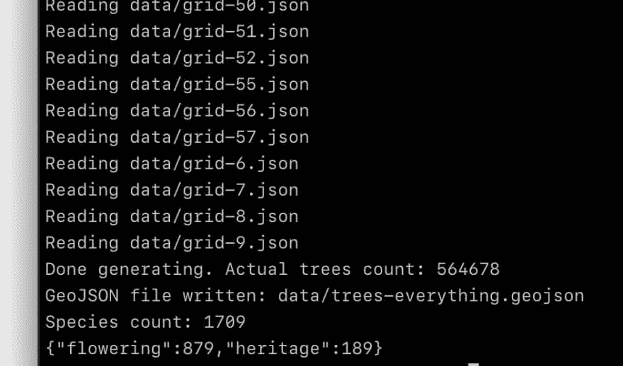](https://res.cloudinary.com/practicaldev/image/fetch/s--HAFb0Ukr--/c_limit%2Cf_auto%2Cfl_progressive%2Cq_auto%2Cw_880/https://cheeaun.com/blimg/screenshots/software/terminal-script-generating-trees-data%402x.jpg)

这是一个脚本，它从[国家公园委员会](https://www.nparks.gov.sg/)的 [Trees.sg](http://trees.sg/) 中抓取数据，显示树木和物种的总数，并生成 GeoJSON 文件。通过计算，我可以比较去年和今年的树的数量。

去年三月， **564，266** 棵树。今年三月，**564678 棵**。它增加了几百！

回想之前，我试图在网络浏览器中渲染**地图*上的所有***棵树，但由于过大的文件大小和缓慢的性能而失败。我最终将数据上传到 [Mapbox 工作室](https://www.mapbox.com/mapbox-studio/)作为[矢量 tileset](https://docs.mapbox.com/help/glossary/vector-tiles/) ，并返回到地图上。它不是一个纯粹的客户端解决方案，而是一个后端支持的解决方案，这使得它与 Trees.sg *没有什么不同，除了*它更快🤷‍♂️.

最终，我仍然希望实现这种纯粹的客户端解决方案，因为我喜欢挑战极限😉。

一年过去了，技术进步了，对吧？

我仔细查看了包含所有 T2 树木数据的 T0 图。它的大小为 **197.6 MB** ，这对任何网站来说都是疯狂的*。*

 *我想到了两个主意:

1.  放弃 GeoJSON 格式。拥抱普通的 JSON，去掉所有的键，只存储值。将例如`{"id": "123", "height": 200}`转换成`["123", 200]`。密钥将被硬编码在代码中的其他地方。
2.  将*树的所有*坐标组成一个数组，技术上像一条线，并转换成[编码的折线算法格式](https://developers.google.com/maps/documentation/utilities/polylinealgorithm)。这是一种有损压缩算法，允许您将一系列坐标存储为单个字符串。它是有损耗的，精确到小数点后 5 位，赤道附近距离大约[1m](https://en.wikipedia.org/wiki/Decimal_degrees#Precision)。比如`[[1.27612,103.84744], [1.28333,103.85945]]`会被编码成一个更短的字符串:`wfxFouyxRal@ajA`。

下面是代码:

```
const data = JSON.parse(fs.readFileSync('data/trees-everything.geojson'));

const props = data.features.map(f => Object.values(f.properties).map(v => v === null ? '' : v));

const points = data.features.map(f => f.geometry.coordinates);
const line = polyline.encode(points);

const finalData = { props, line }; 
```

一个是存储所有值的`props`变量，另一个是编码折线字符串的`line`变量。

最终结果是一个 **37.7 MB** 的 JSON 文件。那就是**比 GeoJSON 文件小 524%**！😱我用 [gzip](https://en.wikipedia.org/wiki/Gzip) 压缩文件后，变成了[**5.7 MB**](https://twitter.com/cheeaun/status/1108020569251827712)**3466%小**！😱😱

[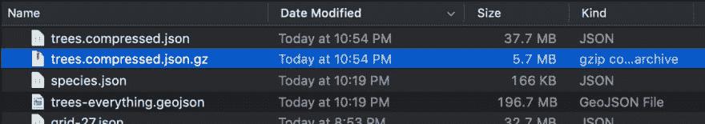](https://res.cloudinary.com/practicaldev/image/fetch/s--YNnOI7ND--/c_limit%2Cf_auto%2Cfl_progressive%2Cq_auto%2Cw_880/https://cheeaun.com/blimg/screenshots/software/finder-trees-data-files%402x.jpg)

我觉得 5.7 MB 还不错。根据这篇关于 SpeedCurve 的 [2017 年文章，平均网页大小为 3 MB，预计到 2019 年将为 4 MB。](https://speedcurve.com/blog/web-performance-page-bloat/)

> 根据 HTTP Archive 的数据，**今天几乎 16%的页面——换句话说，大约六分之一的页面——大小为 4 MB 或更大**。

那个“今天”是 2017 年。

与那些加载 4 MB 垃圾数据和少量真实内容的网站相比，我正在建设一个拥有 5 MB 有用数据和几百千字节地图和 JavaScript 文件的*网站。*

显然在这一点上，我真的很努力地为自己的行为辩护😅。我很高兴我设法从数据集中挤出了字节，但它仍然不够小，比平均网页大小低，所以我试图欺骗自己，我这样做是有原因的😂。

当我查看数据集时，我注意到一些变化。我调查发现:

*   一些开花的树不见了，我到现在都不知道发生了什么。
*   API URL 已从`https://imaven.nparks.gov.sg/arcgis/rest/services/maven/PTMap/FeatureServer/2/query`更改为`https://imaven.nparks.gov.sg/arcgis/rest/services/maven/Hashing_UAT/FeatureServer/0/query`。

返回的响应也发生了变化。最重要的一个是**树围**数据。以前是 1.1 米这样的精确测量，后来变成了`0.0 - 0.5`和`> 1.5`这样的范围。我不知道确切的原因，但我猜树围是相当复杂的东西。

在从头开始重新获取数据时，我决定重新构建网格。获取的工作原理是构造一个网格列表，作为 API 调用的边界。换句话说，每个盒子相当于一个 API 请求。前一个是这样的:

[](https://res.cloudinary.com/practicaldev/image/fetch/s--_egtzTLY--/c_limit%2Cf_auto%2Cfl_progressive%2Cq_auto%2Cw_880/https://cheeaun.com/blimg/screenshots/web/square-grid-singapore-boundary.png)

60 个盒子，60 个 API 请求。右侧和底部被忽略了，幸运的是在这些区域没有树木数据。

新网格如下所示:

[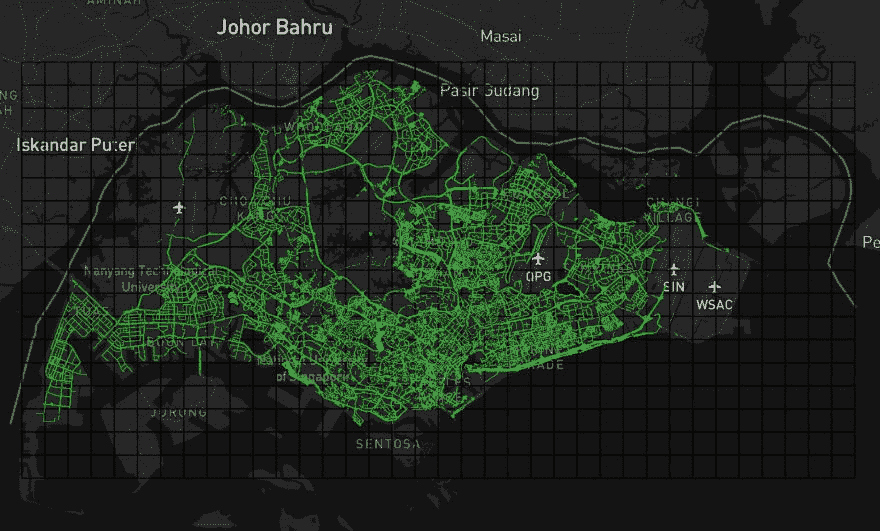](https://res.cloudinary.com/practicaldev/image/fetch/s--NC4iYrxm--/c_limit%2Cf_auto%2Cfl_progressive%2Cq_auto%2Cw_880/https://cheeaun.com/blimg/screenshots/web/new-square-grid-singapore-boundary%402x.jpg)

630 个盒子，630 个 API 请求。覆盖整个新加坡*但*不是更远的南部地区。幸运的是，大多数树木都被覆盖了，因为其他地区的树木还没有被国家公园*记录下来*。

所以，我得到了**所有**的新数据。我用优步的大型 WebGL 数据可视化库 [Deck.gl](https://deck.gl/#/) 在地图上绘制了它们。当涉及到大量地图功能时，它有更好的性能，正如我在[我以前的兼职项目](https://cheeaun.com/blog/2019/02/building-busrouter-sg/)中所尝试的那样。

时间过得很慢。😰

不，这不是图书馆或地图箱的错。是 Chrome。我的 Chrome 桌面浏览器花了很长时间解码 JSON 响应。事实证明，对于超大文件，JSON 解析非常慢。这也是一个同步阻塞操作。我的 Macbook Air (2019)用了**10 多秒**。😰

当我开始从我自己开发的构建脚本切换到[包](https://parceljs.org/)时，甚至包构建步骤也失败了，出现“分配失败——JavaScript 堆内存不足”的错误。我猜它试图读取 JSON 文件，可能对它做了些什么，Node 一直在耗尽内存😅。我*可以*修复建造步骤，但我们不要在这里分心。

也许我需要一个更快的`JSON.parse`。也许我可以在一个 [web worker](https://developer.mozilla.org/en-US/docs/Web/API/Web_Workers_API/Using_web_workers) 中运行它，但是由于巨大的消息传递负载，它可能会更慢。

我有一个不同的想法，那就是使用不同的数据格式。Mapbox 将[协议缓冲区](https://developers.google.com/protocol-buffers/)用于地图拼图。Deck.gl 支持[某种形式的二进制数据](https://deck.gl/#/documentation/developer-guide/performance-optimization?section=on-using-binary-data)以及即将到来的 [RFC](https://github.com/uber/deck.gl/blob/master/dev-docs/RFCs/v7.x-binary/binary-data-rfc.md) ，这对我来说看起来……相当复杂。

我最终使用了 [MessagePack](https://msgpack.org/) ,因为:

1.  协议缓冲区需要类型(`double`、`int64`等)，从 JSON 快速转换相当麻烦。我试着用 [`Geobuf`](https://github.com/mapbox/geobuf) 转换 GeoJSON 文件，文件大小似乎仍然比 MessagePack 的大(用我上面提到的组合压缩思想)。
2.  Deck.gl 的二进制数据的东西看起来还没有*稳定*需要对数据进行手动操作。
3.  MessagePack 只是工作。

有两个库可以对 MessagePack 格式进行编码和解码:

*   [msgpack-lite](https://www.npmjs.com/package/msgpack-lite) (在官方网站上列出)
*   [@ ygoe/msgid pack](https://www.npmjs.com/package/@ygoe/msgpack)

根据 Bundlephobia 的说法，我尝试了两种方法，选择了后者，因为它的捆绑尺寸更小。我不会根据性能来选择，因为我已经确认两者都是比`JSON.parse`快得多。数据在大约 3 秒或更少的时间内被解码，而不是超过 10 秒。文件大小也变小了，大约为 **30 MB** ，但是在 gzipped 之后，它变得和 gzipped JSON 文件一样，大约为 **5 MB** 。太糟糕了，我希望它会更小😅。

在之前的数据集中，我注意到一些差异，比如两个或更多的树，具有不同的 id，位于*精确的*相同的坐标。这一次，我试图清理它，并删除重复的，部分是希望减少文件的大小。

这听起来可能很傻，但我实际上是在执行*严格的*与*精确的*坐标的比较。我不是在开玩笑，有些树的*和*坐标完全相同，精确到小数点后的每一位。想象两棵树，坐标分别为经度 103.702059 和纬度 1.406719，小数点没有一点差别。😅

以前有人告诉我，可能有一棵树长在另一棵树上，但我很…怀疑。🤨

[https://www.youtube.com/embed/0WLrI2djC3g](https://www.youtube.com/embed/0WLrI2djC3g)

我查了资料，能找到名字和物种名称的其他相似点。好吧，我可能是错的，但我[决定删除潜在的重复](https://twitter.com/cheeaun/status/1110175312225030144)，因为这会影响地图用户界面。地图上两个重叠的树点带来了相当大的挑战，特别是对于可视化和用户交互。我高度怀疑原始数据集实际上来自不同机构的多个数据集，这可以解释这一现象。

最终的 gzipped 文件大小保持不变😅。

## 再次挑战极限

随着数据集以体面的加载和解码性能完成，我继续使用 [Mapbox GL JS](https://docs.mapbox.com/mapbox-gl-js/api/) 重新实现我在第一个版本中所做的大部分工作，用 Deck.gl 代替。

在使用 Mapbox GL JS 的原始实现中:

*   每个树点通过 [`circle`](https://docs.mapbox.com/mapbox-gl-js/style-spec/#layers-circle) 图层进行样式化。
*   如果有[超过 500，000 个数据点](https://docs.mapbox.com/help/troubleshooting/working-with-large-geojson-data/#even-bigger-data)，纯客户端解决方案是不可能的，因此通过 Mapbox Studio 的服务器端解决方案。
*   并非所有 500，000+棵树都以较高的缩放级别呈现在地图上，因为这是矢量切片的工作方式；如果超出了图块的限制，则在每个缩放级别上删除或合并功能。

下面是一个代码示例:

```
map.addLayer({
  id: 'trees',
  type: 'circle',
  source: 'trees-source',
  'source-layer': 'trees',
  paint: {
    'circle-color': [
      'case',
      ['all', ['to-boolean', ['get', 'flowering']], ['to-boolean', ['get', 'heritage']]], 'magenta',
      ['to-boolean', ['get', 'flowering']], 'orangered',
      ['to-boolean', ['get', 'heritage']], 'aqua',
      'limegreen'
    ],
    'circle-opacity': [
      'case',
      ['to-boolean', ['get', 'flowering']], 1,
      ['to-boolean', ['get', 'heritage']], 1,
      .5
    ],
    'circle-radius': [
      'interpolate', ['linear'], ['zoom'],
      8, .75,
      14, ['case',
        ['to-boolean', ['get', 'flowering']], 3,
        ['to-boolean', ['get', 'heritage']], 3,
        1.25
      ],
      20, ['case',
        ['to-boolean', ['get', 'flowering']], 10,
        ['to-boolean', ['get', 'heritage']], 10,
        6
      ]
    ],
    'circle-stroke-width': [
      'interpolate', ['linear'], ['zoom'],
      11, 0,
      14, 1,
    ],
    'circle-stroke-color': 'rgba(0,0,0,.25)',
  },
}); 
```

对于 Deck.gl 的新实现:

*   圆点用 [`ScatterPlotLayer`](https://deck.gl/#/documentation/deckgl-api-reference/layers/scatterplot-layer) 渲染。可能看起来和前者一样，但风格不同。

*   纯客户端解决方案成为可能。[文档](https://deck.gl/#/documentation/developer-guide/performance-optimization?section=general-performance-expectations)引用:

> 在配有双显卡的 2015 MacBook Pros 上，大多数基本层(如`ScatterplotLayer`)在平移和缩放操作期间以 60 FPS 的速度流畅地渲染高达约 1M(一百万)的数据项，当数据集接近 1000 万项时，帧率降至低两位数(10-20FPS)。

*   **所有的**树都以**所有的**缩放级别渲染。

新代码示例:

```
new MapboxLayer({
  id: 'trees',
  type: ScatterplotLayer,
  opacity: 1,
  radiusMinPixels: .1,
  radiusMaxPixels: 5,
  lineWidthUnits: 'pixels',
  getLineWidth: 1,
  getLineColor: [0,0,0,200],
  getRadius: (d) => (d.flowering || d.heritage) ? 100 : 3,
  getFillColor: (d) => {
    if (d.flowering && d.heritage) return colorName2RGB('magenta');
    if (d.flowering) return colorName2RGB('orangered');
    if (d.heritage) return colorName2RGB('aqua');
    return colorName2RGB('green');
  },
}); 
```

是的，短一点。

我必须创建一个名为`colorName2RGB`的新函数来将颜色名称(`orangered`、`aqua`等)转换为数组形式的 RGB 值(`[R,G,B]`，因为 Deck.gl 不支持它们。这个函数出奇的简单，因为它使用了`canvas`的神奇 [`fillStyle`](https://developer.mozilla.org/en-US/docs/Web/API/CanvasRenderingContext2D/fillStyle) 属性来转换一种`CSS`颜色，而不是一个查找表，感谢这个 [StackOverflow 由 *JayB*](https://stackoverflow.com/a/47355187/20838) 提供的答案。

一切都变得[疯狂*平稳*](https://twitter.com/cheeaun/status/1114532995799478272) 。

[https://www.youtube.com/embed/1F2qgbvRwpQ](https://www.youtube.com/embed/1F2qgbvRwpQ)

重新实现并没有花很长时间。对于不同的缩放级别，圆圈的缩放比例有一些微小的差异，但没有显著到足以让任何人注意到。

Deck.gl 的强大功能和性能再次让我感到惊讶。老实说，每次我都会被这个库所能实现的成就所震撼！我没有就此止步😉。

这是我上一次**失败的**尝试:

[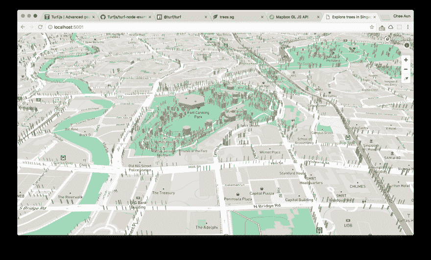](https://res.cloudinary.com/practicaldev/image/fetch/s--B5FGyRVN--/c_limit%2Cf_auto%2Cfl_progressive%2Cq_auto%2Cw_880/https://cheeaun.com/blimg/screenshots/software/3d-trees-girth-height-map-singapore%402x.png)

这是一次失败的尝试，主要是因为性能。这是**太织补滞后**渲染*所有*的三维树干！我还怀疑一些周长测量是错误的，你可以在上面的图片中看到一个巨大的六边形，在坎宁堡公园。这是通过 Mapbox GL JS 的 3D 拉伸功能完成的。

这是我[第二次尝试](https://twitter.com/cheeaun/status/1114696975515963398)，用 Deck.gl:

[](https://res.cloudinary.com/practicaldev/image/fetch/s--1BK3zUOz--/c_limit%2Cf_auto%2Cfl_progressive%2Cq_auto%2Cw_880/https://cheeaun.com/blimg/screenshots/web/exploretrees-sg-3d-tree-trunks-1.jpg)

那些橙色的点是 3D 的树干。让我们放大。

[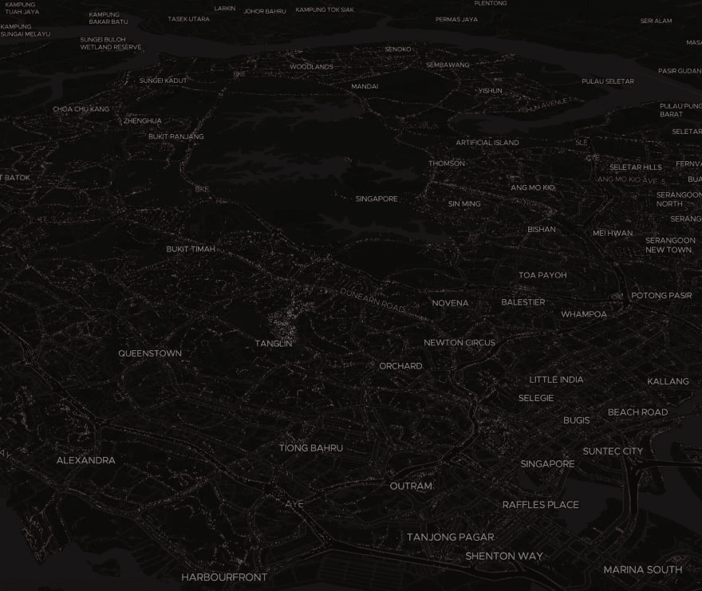](https://res.cloudinary.com/practicaldev/image/fetch/s--jqRaN2_h--/c_limit%2Cf_auto%2Cfl_progressive%2Cq_auto%2Cw_880/https://cheeaun.com/blimg/screenshots/web/exploretrees-sg-3d-tree-trunks-2.jpg)

[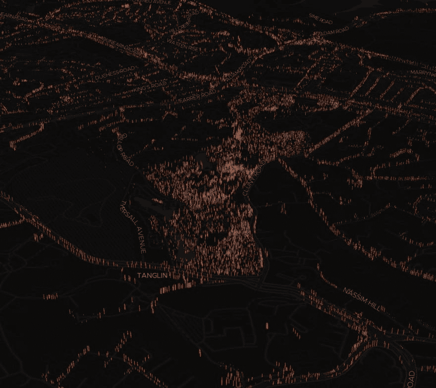](https://res.cloudinary.com/practicaldev/image/fetch/s--KV3dqc1J--/c_limit%2Cf_auto%2Cfl_progressive%2Cq_auto%2Cw_880/https://cheeaun.com/blimg/screenshots/web/exploretrees-sg-3d-tree-trunks-3.jpg)

[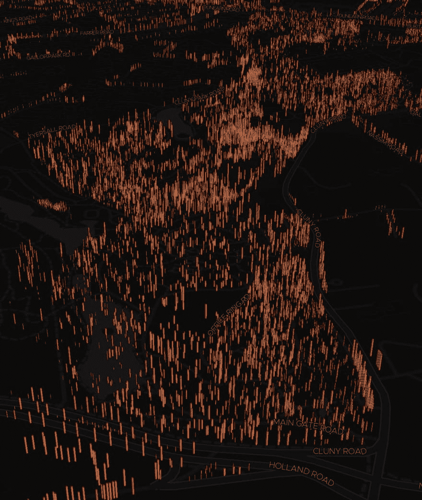](https://res.cloudinary.com/practicaldev/image/fetch/s--NOGZa7lj--/c_limit%2Cf_auto%2Cfl_progressive%2Cq_auto%2Cw_880/https://cheeaun.com/blimg/screenshots/web/exploretrees-sg-3d-tree-trunks-4.jpg)

这一尝试在渲染*一切*方面比快了大约 **3 到 4 倍😱(根据我的感知)。**但是**，当在更高的级别平移时，它仍然滞后😢。**

唉，当事情变得很快，超快，然后又慢，然后又快，然后又慢时，我感觉就像在坐过山车😖。严格来说是我自己的错。我反复尝试让它快一点，然后*又故意让它慢一点。我不知道为什么我一直这样做😂*

不管怎样，我有一个快速解决的办法😏。我将这种 3D 模式限制在更高的缩放级别，然后根据地图的地理界限过滤树的列表。像这样:

```
const bounds = map.getBounds();

const results = ... // magically filter the list of trees based on bounds

trees3DLayer.setProps({
  data: trees3Dify(results),
}); 
```

`map.getBounds()`的返回值是包含地图可见区域的最小边界。可以只渲染几千棵树，而不是渲染 500，000+棵树。

基本上这不仅解决了性能问题，而且很有意义。无论如何，在较低的缩放级别上渲染 3D 树是没有意义的，因为它们看起来都像小点。用户仍然需要放大才能看到 3D 树干的细节，这与 3D 建筑只有在谷歌地图和苹果地图等地图上的更高缩放级别才能看到的原因相同。

多亏了这个，它又[快了](https://twitter.com/cheeaun/status/1114833009289469952)😬。

[https://www.youtube.com/embed/KPMsFXVsC20](https://www.youtube.com/embed/KPMsFXVsC20)

右侧是开发者工具控制台，记录每次缩放、平移或旋转地图时渲染的 3D 树的数量。很明显，平移时完全没有延迟。边界外的 3D 树将仅在平移、缩放或旋转结束后开始渲染。

**完美**。留给我的是完成剩余的重新实现，删除所有的旧代码，为这些树干选择一个更好的颜色，然后结束！

[](https://res.cloudinary.com/practicaldev/image/fetch/s--qDJTVnGq--/c_limit%2Cf_auto%2Cfl_progressive%2Cq_auto%2Cw_880/https://cheeaun.com/blimg/figures/diagram/thinking-3d-tree-trunks%402x.jpg)

起初，我想把树干涂成棕色，但它太暗了，与深色的地图拼贴对比不佳。这解释了为什么我选择亮棕色或橙色作为我的第一次尝试。然后我把颜色改成了白色，因为它还是感觉不太对劲…

是的… 3D 树干看起来有点奇怪，对吧？

我心想，我又想做什么了？3D 效果图的用途是什么？2D 还不足以实现这种可视化吗？我猜在地图上画 3D 树会很酷，但之后就没怎么想了。

但是是什么让它们看起来很奇怪呢？

哦！树[冠](https://en.wikipedia.org/wiki/Crown_(botany))！它看起来很奇怪，因为它是不完整的 T2。等等，问题是我没有树冠数据，那我要怎么画树冠呢？根据树种或家系的不同，我可能需要绘制不同形状的树冠，这可能会是*很多*的工作😅。

所以我开始思考，最简单的树冠形式是什么？当然，**另一缸**。

我在空闲时间画了一些速写:

[](https://res.cloudinary.com/practicaldev/image/fetch/s--E0P0QMRU--/c_limit%2Cf_auto%2Cfl_progressive%2Cq_auto%2Cw_880/https://cheeaun.com/blimg/photos/objects/exploretrees-sg-logo-tree-trunk-crown-sketches.jpg)

我有树的高度信息，但不一定意味着树干本身的高度。我可以把树干“砍掉”大约 75%，剩下的留给树冠。树冠可以占据 50%的高度，这样看起来就像是覆盖了树干。至于皇冠的半径，我也可以根据高度大致测算一下。根据我的试验和错误，我发现半径的最佳点大约是高度的 40%。

听起来像是*复杂的*数学，但是……**[瞧！](https://twitter.com/cheeaun/status/1114866910682681344)**

[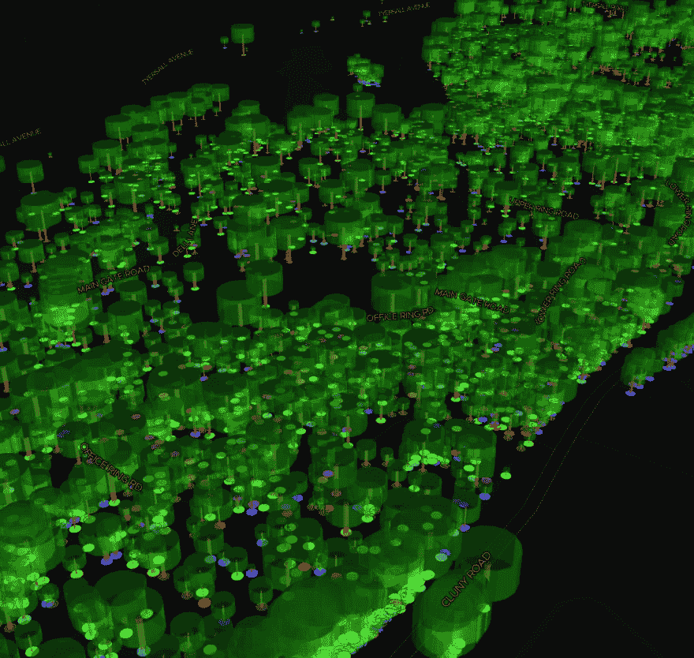](https://res.cloudinary.com/practicaldev/image/fetch/s--gZ60tYhx--/c_limit%2Cf_auto%2Cfl_progressive%2Cq_auto%2Cw_880/https://cheeaun.com/blimg/screenshots/web/exploretrees-sg-faux-3d-trees-1.jpg)

[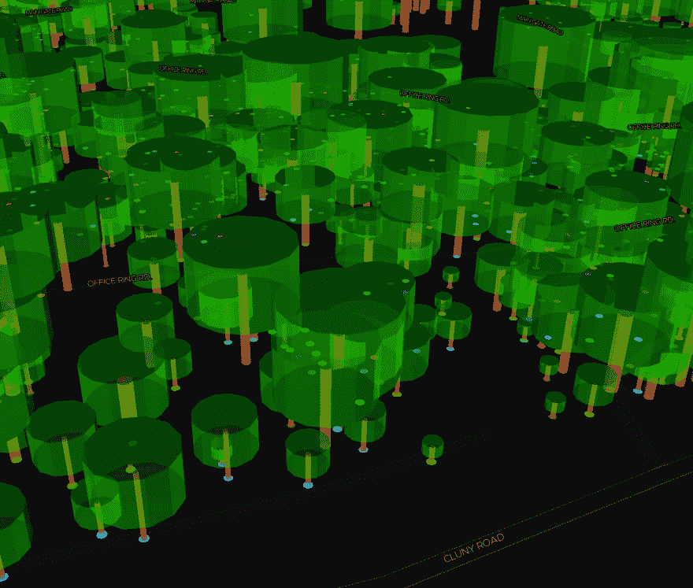](https://res.cloudinary.com/practicaldev/image/fetch/s--ne5QGsjf--/c_limit%2Cf_auto%2Cfl_progressive%2Cq_auto%2Cw_880/https://cheeaun.com/blimg/screenshots/web/exploretrees-sg-faux-3d-trees-2.png)

[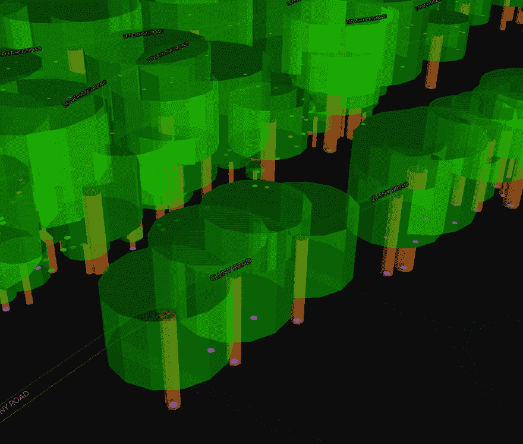](https://res.cloudinary.com/practicaldev/image/fetch/s--V0sdKK33--/c_limit%2Cf_auto%2Cfl_progressive%2Cq_auto%2Cw_880/https://cheeaun.com/blimg/screenshots/web/exploretrees-sg-faux-3d-trees-3.png)

这一刻，我觉得我的努力终于有了成果。我一点也不知道皇冠实际上能产生如此巨大的影响！

老实说，当这真的起作用时，我非常兴奋。我试图完成这项工作，并确保与旧的实现功能对等。事情发展到了这个地步 [*差不多*完成](https://twitter.com/cheeaun/status/1114919843541573632)。

[https://www.youtube.com/embed/gA213scyW_s](https://www.youtube.com/embed/gA213scyW_s)

我还启用了 [3D 建筑](https://twitter.com/cheeaun/status/1115060661401182208)，一个更加*完整的*画面。

[https://www.youtube.com/embed/Sbh8vS_DKYg](https://www.youtube.com/embed/Sbh8vS_DKYg)

…和[更多照片](https://twitter.com/cheeaun/status/1115630822764105728)！

[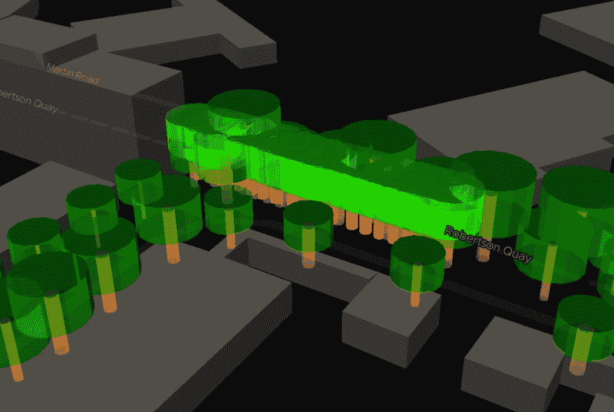](https://res.cloudinary.com/practicaldev/image/fetch/s--g3Rd-n5i--/c_limit%2Cf_auto%2Cfl_progressive%2Cq_auto%2Cw_880/https://cheeaun.com/blimg/screenshots/web/exploretrees-sg-faux-3d-trees-4.png)

[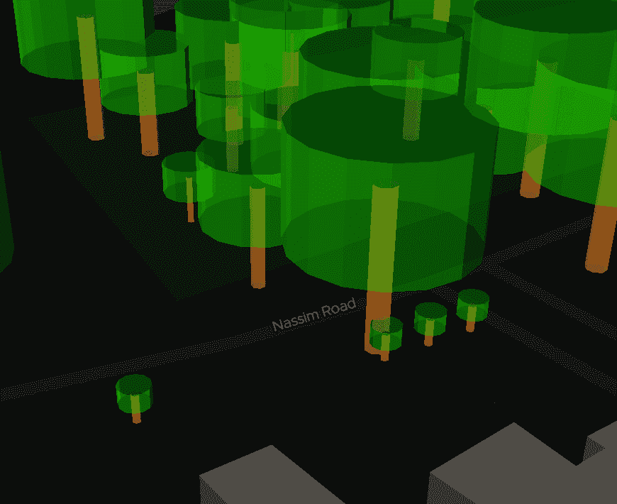](https://res.cloudinary.com/practicaldev/image/fetch/s--JyngD5Js--/c_limit%2Cf_auto%2Cfl_progressive%2Cq_auto%2Cw_880/https://cheeaun.com/blimg/screenshots/web/exploretrees-sg-faux-3d-trees-5.png)

[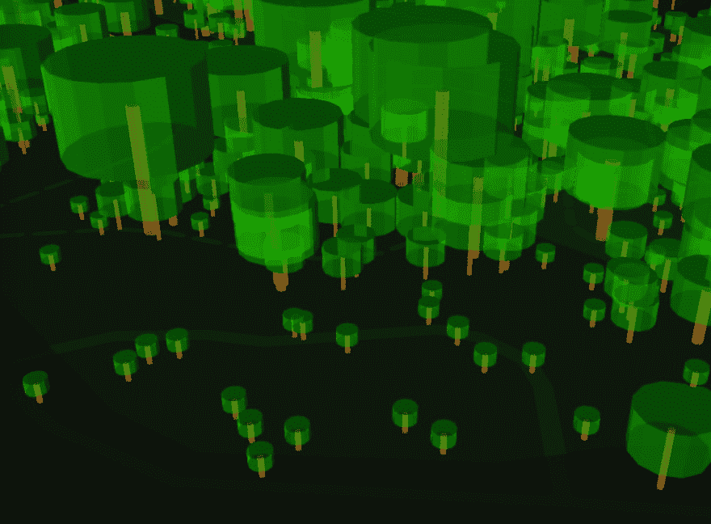](https://res.cloudinary.com/practicaldev/image/fetch/s--xJMW9oEh--/c_limit%2Cf_auto%2Cfl_progressive%2Cq_auto%2Cw_880/https://cheeaun.com/blimg/screenshots/web/exploretrees-sg-faux-3d-trees-6.png)

看那些可爱的小树！😍

[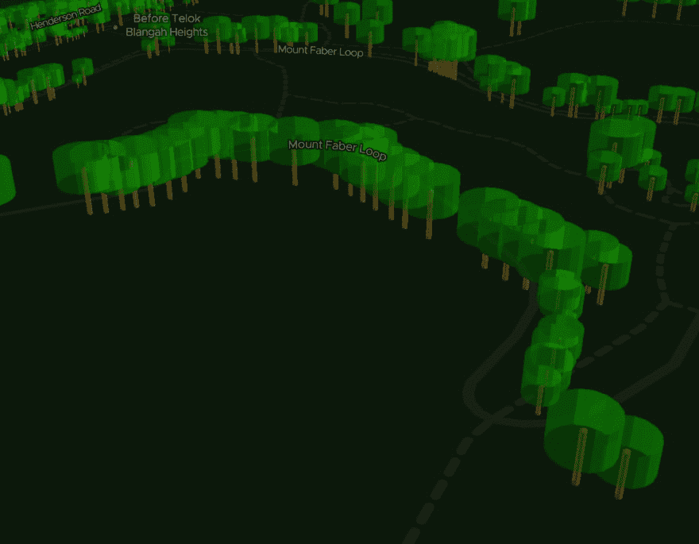](https://res.cloudinary.com/practicaldev/image/fetch/s--xy46v2BT--/c_limit%2Cf_auto%2Cfl_progressive%2Cq_auto%2Cw_880/https://cheeaun.com/blimg/screenshots/web/exploretrees-sg-faux-3d-trees-7.png)

[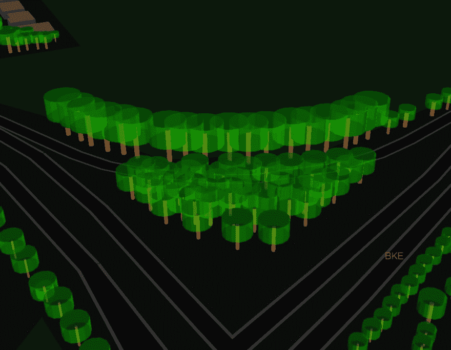](https://res.cloudinary.com/practicaldev/image/fetch/s--3u7mc3vb--/c_limit%2Cf_auto%2Cfl_progressive%2Cq_auto%2Cw_880/https://cheeaun.com/blimg/screenshots/web/exploretrees-sg-faux-3d-trees-8.png)

[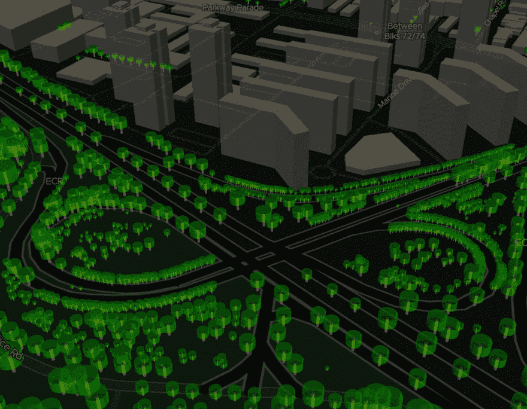](https://res.cloudinary.com/practicaldev/image/fetch/s--_LPIRRhh--/c_limit%2Cf_auto%2Cfl_progressive%2Cq_auto%2Cw_880/https://cheeaun.com/blimg/screenshots/web/exploretrees-sg-faux-3d-trees-9.png)

附近的 3D 建筑倾向于给它们周围的 3D 树一个非常真实的背景。在某种程度上，这些树的种植方式似乎是基于周围的地理环境🤔。

[](https://res.cloudinary.com/practicaldev/image/fetch/s--KkF3Bz27--/c_limit%2Cf_auto%2Cfl_progressive%2Cq_auto%2Cw_880/https://cheeaun.com/blimg/screenshots/web/exploretrees-sg-faux-3d-trees-10.png)

[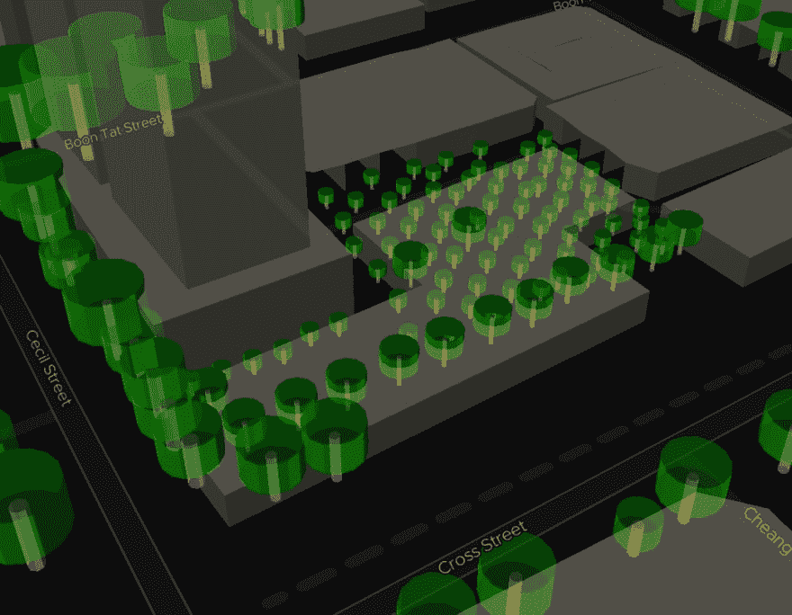](https://res.cloudinary.com/practicaldev/image/fetch/s--zsKiyfzD--/c_limit%2Cf_auto%2Cfl_progressive%2Cq_auto%2Cw_880/https://cheeaun.com/blimg/screenshots/web/exploretrees-sg-faux-3d-trees-11.png)

上图显示的是 Cecil 街附近的一个数据不匹配案例，那里的树已经不在了，一个临时食物中心建在了这个区域。

好了，我快好了。2D 树标记起作用了。可视化过滤器起作用。3D 树表现真的很好。

只剩下*一个*东西了:**拖沓**蓝色*记号笔荧光笔*和树木信息*悬浮卡片*，如上面视频中呈现的。在桌面浏览器上，当鼠标光标悬停在一棵树上时，蓝色标记荧光笔会出现在树的周围，悬停卡会从页面的右下角弹出。当用户界面试图跟上时，光标在地图上的多棵树上移动会有明显的滞后。

[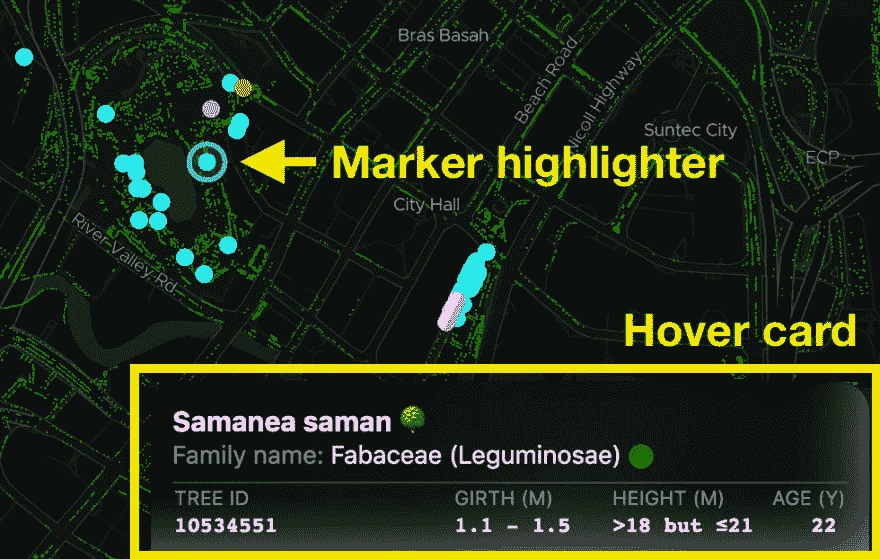](https://res.cloudinary.com/practicaldev/image/fetch/s--Wm1TmS3t--/c_limit%2Cf_auto%2Cfl_progressive%2Cq_auto%2Cw_880/https://cheeaun.com/blimg/figures/diagram/exploretrees-sg-marker-highlighter-hover-card%402x.png)

我试了三次。

我的**第一段**代码使用了来自 Mapbox GL JS 的 [`mousemove`事件](https://docs.mapbox.com/mapbox-gl-js/api/#map.event:mouseover)。当事件触发时，可以查询地图中的特定图层，并提取标记或要素信息以显示为悬停卡的一部分。查询是通过将光标的像素坐标转换为纬度&经度的实际地图坐标，然后从坐标中找到最近的地图要素。这个操作非常繁琐——`mousemove`事件触发太频繁，光标下有太多的功能，每个调用都阻塞了 UI 线程，从而影响了标记荧光笔和悬停卡的渲染速度。

我的第二次尝试是使用 Deck.gl 强大的[挑选引擎](https://deck.gl/#/documentation/developer-guide/adding-interactivity)，它使用了一种叫做[的颜色挑选技术](https://deck.gl/#/documentation/developer-guide/writing-custom-layers/picking):

> deck.gl 使用我们称为“颜色拾取”的技术在 GPU 上实现拾取，而不是用 JavaScript 进行传统的光线投射或构建八叉树等。当 deck.gl 需要确定鼠标下面是什么时(例如，当用户在 deck.gl 画布上移动或单击指针时)，所有可拾取的层都被渲染到屏幕外的缓冲区中，但处于由 GLSL 制服激活的特殊模式中。在此模式下，核心层的着色器渲染拾取颜色，而不是它们的正常视觉颜色。

老实说，我不知道这是怎么回事。我大概知道，引擎试图选择光标下的颜色，并设法找到与颜色匹配的相关特征？！？但是怎么做呢？

反正我试过了这个方法也不行。一切都很缓慢😭。

所以，你瞧，我的第三个**尝试用一个名为 [`geokdbush`](https://github.com/mourner/geokdbush) 的库为点使用空间索引:**

 **> [kdbush](https://github.com/mourner/kdbush) 的地理扩展，是 JavaScript 中最快的点静态空间索引。
> 
> 它实现了对地球上位置的快速[最近邻](https://en.wikipedia.org/wiki/Nearest_neighbor_search)查询，考虑了地球曲率和日期回绕。受[的启发，sphere-knn](https://github.com/darkskyapp/sphere-knn) ，但是使用不同的算法。

我认为它很酷，因为它是由《T2》传单的作者[弗拉基米尔·阿加丰金](https://github.com/mourner)写的。

下面是一段粗略的代码:

```
const index = new KDBush(data, (p) => p.position[0], (p) => p.position[1]);
...
const nearestPoints = geokdbush.around(index, point.lng, point.lat, 1, radius); 
```

`geokdbush.around`方法按照距离增加的顺序返回从给定位置最近的点的数组。它有可选参数来设置自定义的最大结果，以公里为单位的最大搜索距离，甚至还有一个额外的功能来进一步过滤结果！🤯

事实上，这些方法非常有用，我还用它来过滤基于地图边界的 3D 树的渲染(在开始时，用于`trees3Dify`调用)。

结果是 [**快得吓人**](https://twitter.com/cheeaun/status/1116960702118318082) 。⚡️

[https://www.youtube.com/embed/SxsmT9trxaM](https://www.youtube.com/embed/SxsmT9trxaM)

甚至在 [3D 模式下工作](https://twitter.com/cheeaun/status/1116960752122777601):

[https://www.youtube.com/embed/4YmBeA35fD0](https://www.youtube.com/embed/4YmBeA35fD0)

这个我挺满意的。

但是我想我可以做得更多。💪

## 加超

最初，我有一个想法，让所有树种映射到自己的树冠形状模式列表。不幸的是，我找不到这样的列表😭。

我的研究让我接触到了一些主题，比如[树冠等级](https://openoregon.pressbooks.pub/forestmeasurements/chapter/5-3-crown-classes/)，我尤其喜欢这张来自[森林结构](https://www.toppr.com/guides/science/forest-our-lifeline/structure-of-forest/)的图表:

[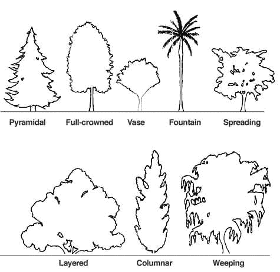](https://res.cloudinary.com/practicaldev/image/fetch/s--R5QxwJ7X--/c_limit%2Cf_auto%2Cfl_progressive%2Cq_auto%2Cw_880/https://cheeaun.com/blimg/figures/diagram/crown-of-tree.jpg)

这些是各种树冠形状的树，我想我只涵盖了“全冠”类型，块状圆柱体。其他牙冠在 3D 模型中会有点困难…

与树干的渲染方式类似，树冠是用 deck.gl 的 [SolidPolygonLayer](https://deck.gl/#/documentation/deckgl-api-reference/layers/solid-polygon-layer) 渲染的，它的工作方式类似于[的多边形层](https://deck.gl/#/documentation/deckgl-api-reference/layers/polygon-layer)，但没有笔划。从与坐标的 z 索引结合的`extruded`选项启用挤压。圆形由 [@turf/circle](https://turfjs.org/docs/#circle) 组成。提升是通过`getElevation`访问器执行的。

[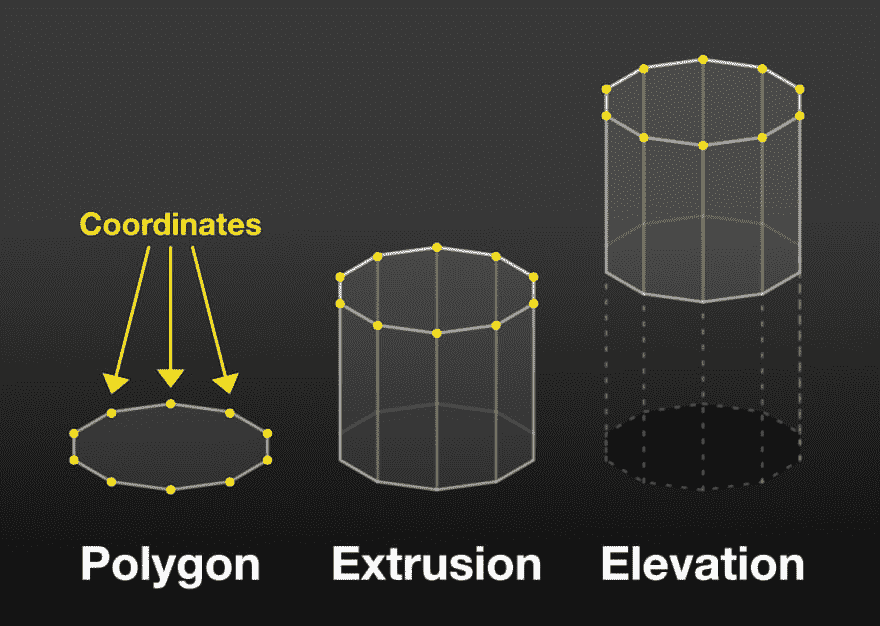](https://res.cloudinary.com/practicaldev/image/fetch/s--CIV7IM5j--/c_limit%2Cf_auto%2Cfl_progressive%2Cq_auto%2Cw_880/https://cheeaun.com/blimg/figures/diagram/exploretrees-sg-polygon-extrusion-elevation%402x.png)

这是**最基本的**。

为所有不同的树冠创建复杂的多边形对我来说太复杂了，无论是计算上的*还是数学上的*😵。

在开发这个项目的过程中，我一直在关注 Deck.g l 的[7.0 版本的更新。引起我注意的变化是](https://github.com/uber/deck.gl/blob/master/CHANGELOG.md#deckgl-v70) [`SimpleMeshLayer`](https://github.com/uber/deck.gl/issues/2890) 和 [`ScenegraphLayer`](https://github.com/uber/deck.gl/issues/2871) 的(重新)引入，它允许以 [OBJ](https://en.wikipedia.org/wiki/Wavefront_.obj_file) 、 [PLY](https://en.wikipedia.org/wiki/PLY_(file_format)) 和 [glTF](https://en.wikipedia.org/wiki/GlTF) 等格式渲染实际的 3D 模型。这意味着…我可以在地图上放置真正的树模型了！😱

等等，我还没有一个物种到树冠类型的映射，所以为每一棵树渲染一个超级真实的全冠树会有点奇怪，尤其是对那些小树。即使我有了地图，对我来说，为所有 500，000+棵树的物种特定的树冠编码，管理所有的 3D 模型文件，*和*同时调整资产加载&地图渲染性能也将需要巨大的努力！

这里*必须*做出一些妥协。我想用更真实的**来代替圆柱形的树冠，但是**不可能*太过*真实。所以应该是**半写实**吧？

我通读了[文档](https://deck.gl/#/documentation/deckgl-api-reference/layers/simple-mesh-layer),注意到示例中这段有趣的代码:

```
import {CubeGeometry} from 'luma.gl' 
```

那是 [luma.gl](https://luma.gl/#/) 提供的场景图模型节点之一。相当整洁。

它们就像预制的 3D 对象，可以像它所描述的 WebGL 组件一样使用。我找到的几何图形之一是[球面几何图形](https://luma.gl/#/documentation/api-reference/geometry-nodes/sphere)，它看起来像是我所需要的。或者，我认为球体是比圆柱体更好的选择，对吗？🤔

我不仅可以用它创建一个球体对象，还可以用`SimpleMeshLayer`的`texture`属性对它应用纹理。

下面是一段代码:

```
const treesCrownLayer = new MapboxLayer({
  id: 'trees-crown',
  type: SimpleMeshLayer,
  texture: document.getElementById('leaves'),
  mesh: new SphereGeometry(),
  ...
}); 
```

`texture`属性接受以下三种类型的值之一:

*   luma.gl `Texture2D`实例
*   一个`HTMLImageElement`
*   纹理图像的 URL 字符串

所以上面的`document.getElementById('leaves')`代码是对 HTML 页面中的`img`元素的引用。我使用这个方法来*预加载*图像，而不是在运行时延迟加载。

至于图像，我*谷歌了*并设法筛选了*数百张*图像，从 [Dim 的环境和建筑纹理](https://opengameart.org/content/dims-enviromental-and-architectural-textures)中找到了**的一张**“树叶”纹理图像。老实说，要找到一张*好的*纹理图像一点都不容易😂，但幸运的是现有的可用资源主要用于游戏开发😀。

关键时刻到了🤞：

[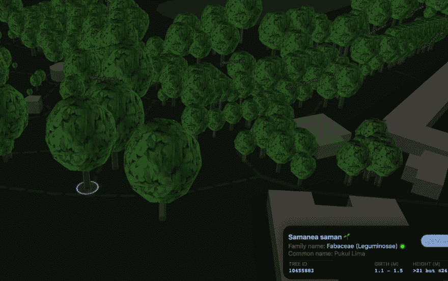](https://res.cloudinary.com/practicaldev/image/fetch/s--9acuHgha--/c_limit%2Cf_auto%2Cfl_progressive%2Cq_auto%2Cw_880/https://cheeaun.com/blimg/screenshots/web/exploretrees-sg-3d-realistic-trees-1.jpg)

哦，我的上帝，它起作用了！！😱😱😱

[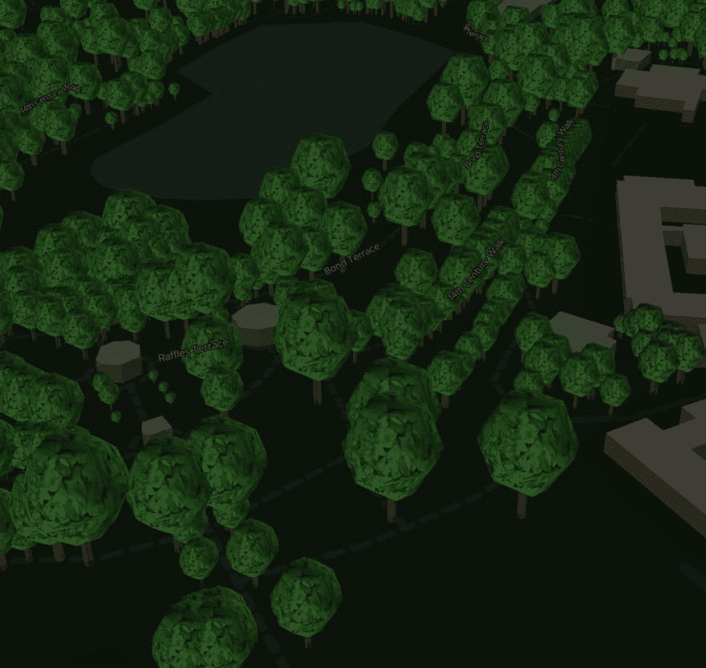](https://res.cloudinary.com/practicaldev/image/fetch/s--bf35ESvL--/c_limit%2Cf_auto%2Cfl_progressive%2Cq_auto%2Cw_880/https://cheeaun.com/blimg/screenshots/web/exploretrees-sg-3d-realistic-trees-2.jpg)

对于这张图片，我试着调整顶点的数量。如果缩小，球体的三角形面会减少，看起来也不像球形。我有点怀疑减少顶点数量可能会提高性能，但似乎影响不大。

无论如何，在我对这个结果太满意之前，有几个问题:

*   这些树看起来有点太暗，所以可能需要一些照明。或许也可以使用更明亮的颜色。
*   树冠需要“透明”，以模拟树叶之间的空白空间。
*   树冠上的叶子太大了，特别是放大的时候。我需要把它们变小。

使用[亲和照片](https://affinity.serif.com/en-gb/photo/)和[亲和设计师](https://affinity.serif.com/en-gb/designer/)，我对原始纹理图像(左上)做了一些调整:

[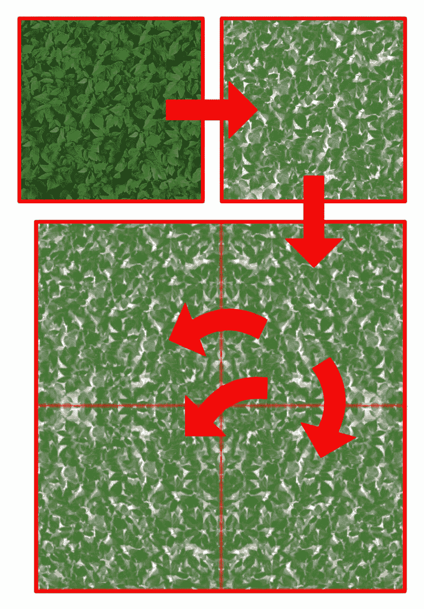](https://res.cloudinary.com/practicaldev/image/fetch/s--PxgXWxpO--/c_limit%2Cf_auto%2Cfl_progressive%2Cq_auto%2Cw_880/https://cheeaun.com/blimg/figures/diagram/tree-leaves-texture-image-masked-flipped-repeated-pattern%402x.jpg)

首先，我选择树叶之间的黑暗区域，并使它们透明。为了减小叶子的大小，我把图像放大，翻转 3 次，创建一个可重复的叶子图像图案。

结果是:

[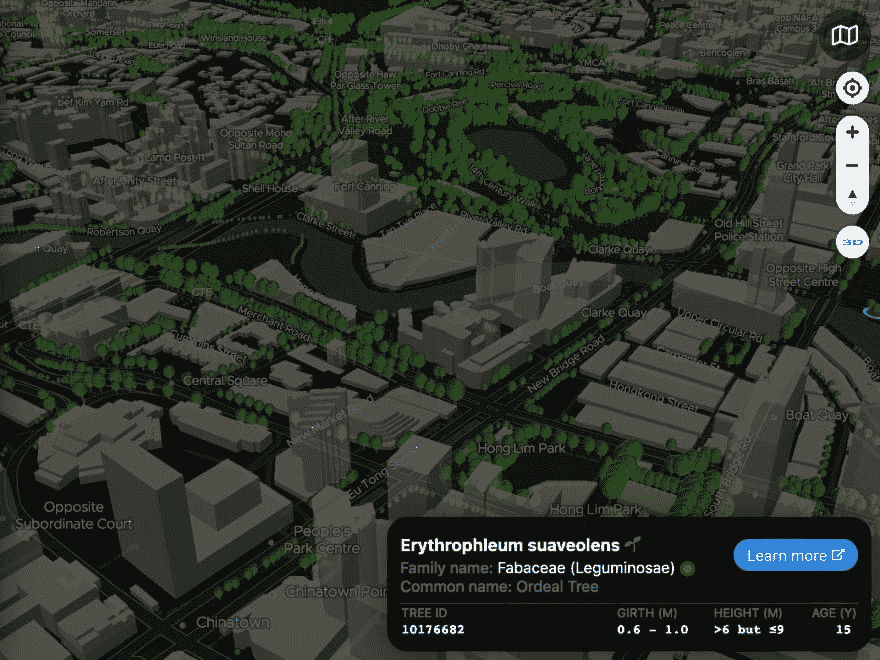](https://res.cloudinary.com/practicaldev/image/fetch/s--FV3vvhxB--/c_limit%2Cf_auto%2Cfl_progressive%2Cq_auto%2Cw_880/https://cheeaun.com/blimg/screenshots/web/exploretrees-sg-3d-realistic-trees-3.jpg)

[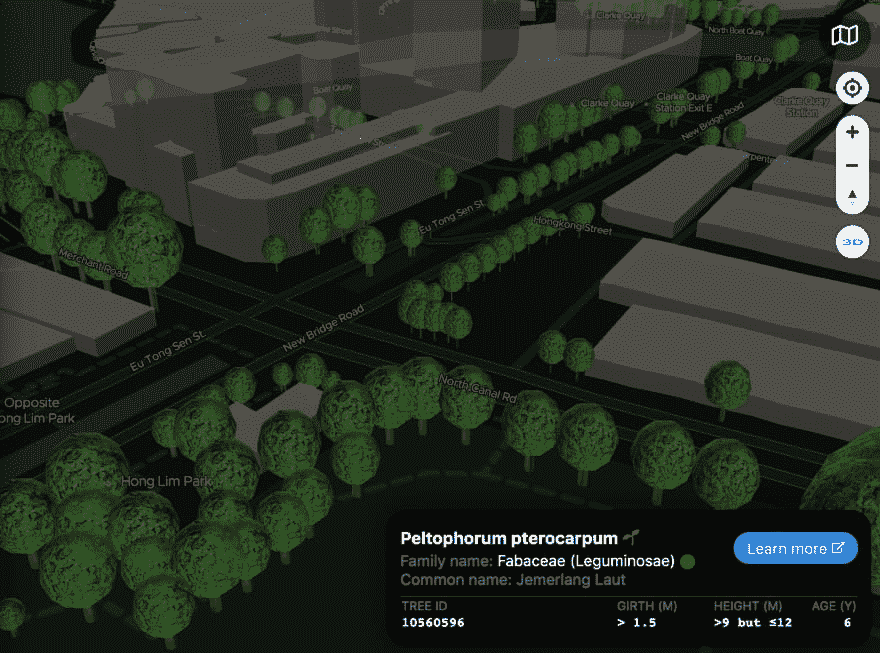](https://res.cloudinary.com/practicaldev/image/fetch/s--SllrkZP---/c_limit%2Cf_auto%2Cfl_progressive%2Cq_auto%2Cw_880/https://cheeaun.com/blimg/screenshots/web/exploretrees-sg-3d-realistic-trees-4.jpg)

[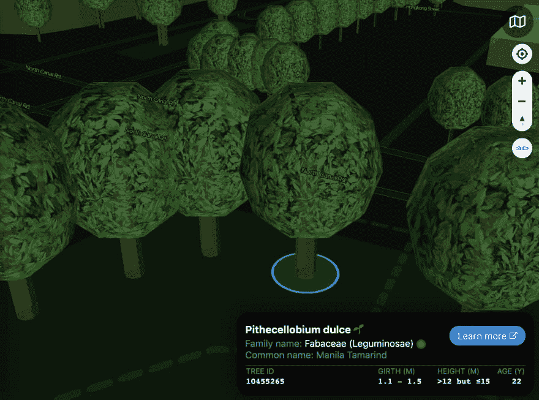](https://res.cloudinary.com/practicaldev/image/fetch/s--4ltpwpMj--/c_limit%2Cf_auto%2Cfl_progressive%2Cq_auto%2Cw_880/https://cheeaun.com/blimg/screenshots/web/exploretrees-sg-3d-realistic-trees-5.jpg)

还不错。树叶变小了，可以看到藏在树冠里的树干。👀

至于灯光，我使用了 deck.gl v7.0 中引入的新灯光效果系统[，尤其是](https://medium.com/vis-gl/introducing-deck-gl-v7-0-c18bcb717457) [`AmbientLight`](https://deck.gl/#/documentation/deckgl-api-reference/lights/ambient-light) 光源和新的实验性 [`SunLight`](https://deck.gl/#/documentation/deckgl-api-reference/lights/sun-light) 光源。`SunLight`是`DirectionalLight`的变体，根据 UTC 时间和当前视窗自动设置。换句话说，它**通过一个名为 [SunCalc](https://github.com/mourner/suncalc) 的 JavaScript 库计算太阳的位置来模拟太阳**(同样是由传单的创作者 Vladimir Agafonkin 创建的🤩).

巧合的是，当我正在[研究代码和公式是如何工作的](https://www.aa.quae.nl/en/reken/zonpositie.html)时，我看到弗拉基米尔[在推特](https://twitter.com/mourner/status/1120748294190141440)上发布了他的微型 [900 字节函数来计算太阳的位置](https://observablehq.com/@mourner/sun-position-in-900-bytes)！😱如果我没看错的话，这就像是简化版的 SunCalc。

事不宜迟，我全部实现了它们，方法是:

```
const phaseColor = getPhaseColor(timestamp);
const ambientLight = new AmbientLight({
  intensity: phaseColor === 'dark' ? 1 : 1.5,
});
const sunLight = new SunLight({
  timestamp,
  intensity: phaseColor === 'dark' ? .5 : 2,
});;
const lightingEffect = new LightingEffect({
  ambientLight,
  sunLight,
});
treesCrownLayer.deck.setProps({
  effects: [lightingEffect],
}); 
```

当太阳相位“黑暗”以模拟夜晚时间时，光线强度会降低。

以前🔅：

[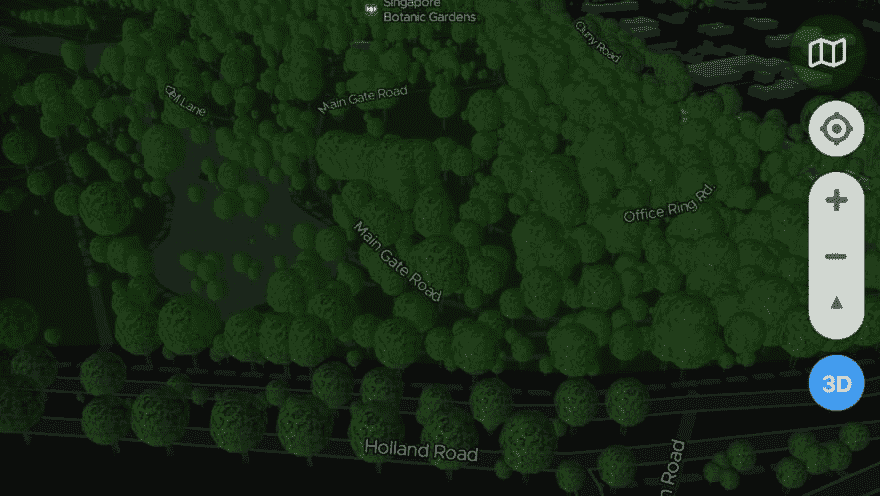](https://res.cloudinary.com/practicaldev/image/fetch/s--LC4yyiIQ--/c_limit%2Cf_auto%2Cfl_progressive%2Cq_auto%2Cw_880/https://cheeaun.com/blimg/screenshots/web/exploretrees-sg-3d-realistic-trees-lighting-before.jpg)

在...之后🔆：

[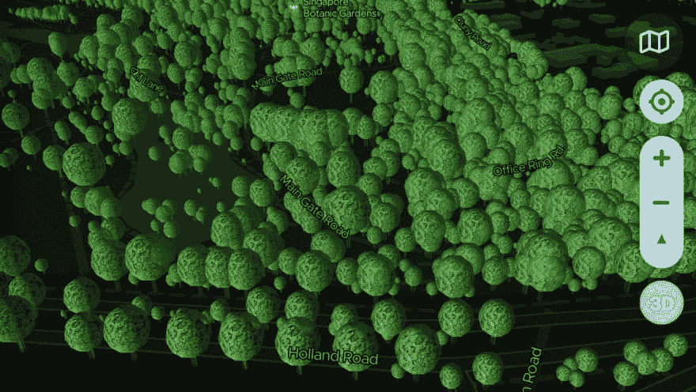](https://res.cloudinary.com/practicaldev/image/fetch/s--gFngZnDB--/c_limit%2Cf_auto%2Cfl_progressive%2Cq_auto%2Cw_880/https://cheeaun.com/blimg/screenshots/web/exploretrees-sg-3d-realistic-trees-lighting-after.jpg)

看起来好多了！

这里是[阳光照射在树上](https://twitter.com/cheeaun/status/1124981208427810816)的延时，展示(阳光)方向如何随时间变化。此外，它不受用户当地时间的影响，将始终是实际的新加坡时间，因为公式取决于位置坐标而不是时间。

[https://www.youtube.com/embed/n21C4BcQ7l8](https://www.youtube.com/embed/n21C4BcQ7l8)

不幸的是，从夜晚到白天，从白天到夜晚的灯光转换现在有点突然。为了防止有人在网站上停留太久，我还增加了一个时间间隔，每 10 分钟更新一次灯光。

在这个过程中，我添加了一些有用的兴趣点(poi ),这些兴趣点列在 NParks 上的[,包括以下几类地点:](https://www.nparks.gov.sg/gardens-parks-and-nature)

*   公园
*   社区花园
*   传统道路
*   摩天绿地

在他们的[网站](https://www.nparks.gov.sg/gardens-parks-and-nature)上，看起来是这样的:

[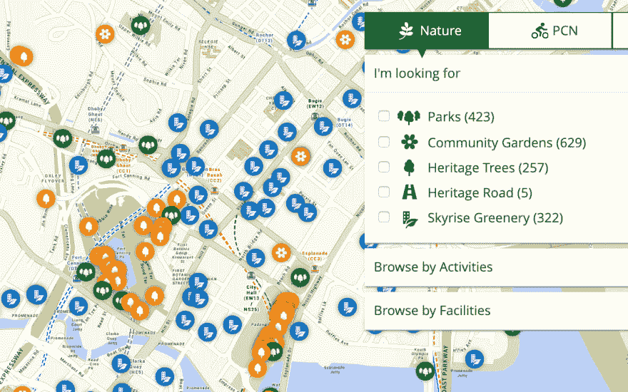](https://res.cloudinary.com/practicaldev/image/fetch/s--J2Adzkst--/c_limit%2Cf_auto%2Cfl_progressive%2Cq_auto%2Cw_880/https://cheeaun.com/blimg/screenshots/web/nparks-site-parks-community-gardens-heritage-trees-heritage-road-skyrise-greenery%402x.png)

在探索树上。SG:

[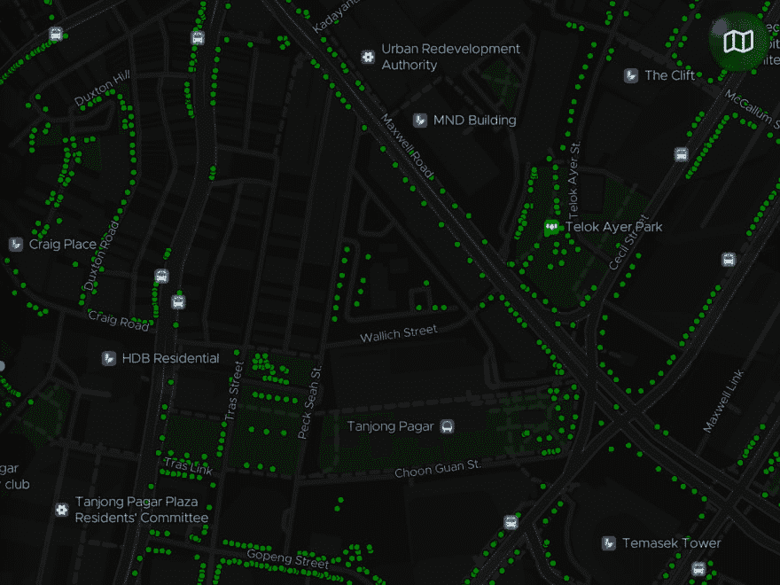](https://res.cloudinary.com/practicaldev/image/fetch/s--vmoV2l4Q--/c_limit%2Cf_auto%2Cfl_progressive%2Cq_auto%2Cw_880/https://cheeaun.com/blimg/screenshots/web/exploretrees-sg-parks-community-gardens-skyrise-greenery%402x.png)

除了兴趣点之外，我还把火车站和公交车站做得更显眼，以引导导航和探索。这些标记只出现在较高的缩放级别上，因为它们只在这些级别上有用，并防止地图上出现混乱。

作为一个附带任务，我借此机会尝试了悬停卡的 [lit-html](https://lit-html.polymer-project.org/) ，取代了持续的`innerHTML`布局垃圾化(破坏和重建每个悬停事件的内容)。

## 最后的 boss

尽管我已经为这个项目勾选了待办事项中的所有复选框，但有一个问题我从这个练习开始就忽略了。

它在手机上不太好用。😞

有几个问题:

*   移动 Safari 上的 MessagePack 解码崩溃。当我试着把它转换成 JSON 格式时，浏览器没有崩溃，但是它需要很长时间来加载。不管怎样，这都是非常糟糕的用户体验。
*   即使所有内容都已成功加载，Mobile Safari 在地图上平移和缩放几分钟后也会随机崩溃。我试着让一个朋友在 iPad 上尝试这个网站，我怀疑 iPad 比 iPhone 有更大的内存和处理能力，但网站仍然崩溃😭。
*   该网站在 Chrome Android 上没有崩溃，但仍然有点滞后。🐌

最有可能的怀疑是**内存压力**，正如 Deck.gl 关于性能的[文档所强调的:](https://deck.gl/#/documentation/developer-guide/performance-optimization)

> 现代手机(最近的 iPhones 和更高端的 Android 手机)在渲染性能方面的能力令人惊讶，但比笔记本电脑对内存压力更敏感，导致浏览器重启或页面重载。它们加载数据的速度也往往比台式电脑慢得多，因此通常需要进行一些调整，以确保移动设备上良好的整体用户体验。

我想加载一个 5MB 的压缩文件，再解压缩成一个 30MB 的文件，在一个基于 WebGL 的 3D 渲染地图上加载 500，000 多棵树，是不是太多了？😝

我尝试了很多方法来解决这个问题，比如:

*   减少地图上的图层数量。
*   减少地图上多边形的数量。
*   删除一些可能会占用大量内存的功能和代码。
*   应用我认为会有帮助的微优化。
*   通过使用 [`supercluster`](https://github.com/mapbox/supercluster) 的集群模式来减少树的数量，这有点违背了我最初构建它的目的。

什么都不管用。这相当令人生畏😩。

这是唯一阻止我推出新版本 ExploreTrees 的东西。SG 和我必须打电话。

[](https://res.cloudinary.com/practicaldev/image/fetch/s--Wu6wvFaP--/c_limit%2Cf_auto%2Cfl_progressive%2Cq_auto%2Cw_880/https://cheeaun.com/blimg/photos/objects/exploretrees-sg-visitor-v1-v2.jpg)

经过几天的思考，我决定*而不是*替换 ExploreTrees 的 1.0 版本。SG 和相反，插槽在版本 2.0 **一起**与它。旧版本 1.0 运行良好，在移动浏览器上似乎更稳定。新版本在桌面浏览器上运行良好，但在 iPad 上*就不行了。我不确定 Android 平板电脑，所以我会假设它们比 iPad 稍微好一点或差一点。🤷‍♂️*

在 1.0 版本中，所有的树数据都来自于 [Mapbox Studio](https://www.mapbox.com/mapbox-studio/) ，作为矢量 [tilesets](https://docs.mapbox.com/studio-manual/reference/tilesets/) 。基于缩放级别，它们被*部分*加载，所以不是所有的东西都一次显示出来。这可能有助于减少内存压力，使用更少的带宽，并具有更好的性能。

在 2.0 版本中，我一直在挑战极限，**所有的**树数据都被加载到网络浏览器中，因此不再需要往返服务器。从技术上讲，它是纯客户端的，使用大量的带宽和用户机器的所有能力来很好地渲染一切。

我需要一种基于特定设备功能的版本切换方法。

我无法检测设备或浏览器处理大内存压力的能力。也没有办法在网络应用程序崩溃之前检测到它可能的崩溃。用户代理字符串检测在这里也不起作用。

由于没有可靠的方法来检测这些情况，我应用了触摸检测来代替:

```
const isTouch = 'ontouchstart' in window || navigator.msMaxTouchPoints;
const hqHash = /#hq/.test(location.hash);
const renderingMode = !hqHash && isTouch ? 'low' : 'high'; 
```

我做了一些假设:

*   大多数现代手机都有触摸屏。
*   旧手机将无法加载网站，因为它使用 WebGL(对不起🙇‍♂️).
*   尽管 iPad 非常强大，但它也有触摸屏，因此这种检测将排除它。
*   唯一的例外是带触摸屏的台式电脑。

我将版本 2 称为“高质量模式”，并为路由到版本 1 的用户提供了一个切换到该模式的选项。

[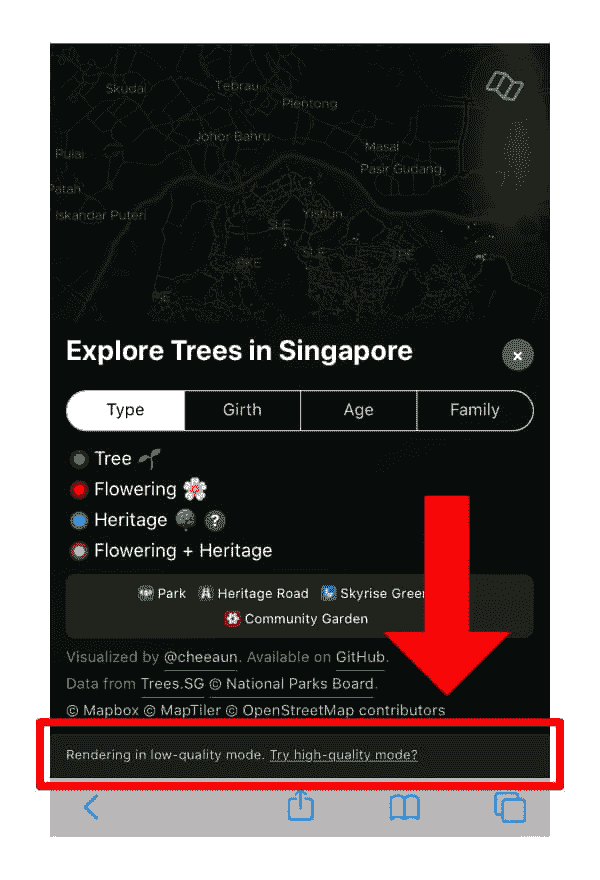](https://res.cloudinary.com/practicaldev/image/fetch/s--a-1WGQb6--/c_limit%2Cf_auto%2Cfl_progressive%2Cq_auto%2Cw_880/https://cheeaun.com/blimg/screenshots/web/exploretrees-sg-try-high-quality-mode%402x.jpg)

该选项将通过在 URL 后面追加`#hq`来重新加载页面并切换到版本 2。之后，如果网站崩溃，用户仍然可以回到版本 1。

为了进一步优化网站的性能，我很好地利用了`renderingMode`变量来有条件地启用或禁用地图上的某些功能。我向前迈了一步，将[代码分割](https://parceljs.org/code_splitting.html)应用于动态导入。我将所有版本 2 相关的依赖项提取到一个单独的包中，并将其异步加载到页面上。

```
const {
  MapboxLayer,
  AmbientLight,
  SunLight,
  LightingEffect,
  ScatterplotLayer,
  SolidPolygonLayer,
  SimpleMeshLayer,
  SphereGeometry,
  msgpack,
  polyline,
  KDBush,
  geokdbush,
  circle,
  throttle,
} = await import('./hq.bundle'); 
```

除此之外，我为 MessagePack 数据文件做了一个有趣的小把戏。我意识到 MessagePack 没有官方的哑剧类型。即使我开始使用 package 捆绑文件，该网站仍然通过 [GitHub Pages 部署动作](https://github.com/JamesIves/github-pages-deploy-action)部署到 GitHub Pages。这意味着 gzip 压缩只能用于某些文件扩展名。

例如，`.js`文件将使用 gzip 压缩，而`.png`文件则不会。我试着对 MessagePack 文件使用`.mp`扩展名，不幸的是，它没有被压缩😟。由于网站流量也是由 Cloudflare 处理的，我浏览了一下[cloud flare 将压缩的内容类型列表](https://support.cloudflare.com/hc/en-us/articles/200168396)。

我需要一种文件格式…

*   从 GitHub 页面或 Cloudflare 被列入服务器的内容类型压缩列表中。我知道 [Netlify 允许自定义标题](https://www.netlify.com/docs/headers-and-basic-auth/)，它可能能够设置 gzip 标题，但我现在不打算把网站移到那里。
*   绕过包裹的[智能资产处理](https://parceljs.org/assets.html)。例如，如果使用了`.json`，package 会将文件内容*包含到 JavaScript 包*中。
*   对我来说并不困惑。如果我使用`.png`，这是可行的，未来的我会感到困惑，不知道为什么它被用于非图像文件😅。

我试着将文件预压缩到`.gz`中，但是当试图读取 JS 中的文件时，奇怪的事情发生了。😅

最后，我选择了`.ico`，因为它是一种(图像)二进制格式*和*可以同时被 gzip 压缩。它也很少使用，不像普通的图像格式，可以防止与其他文件冲突。我也可以使用`.ttf`或`.otf`扩展名，但它可能会与实际的字体文件混淆。

我把这个文件命名为`trees.min.mp.ico`，测试了它，它工作了。🤩

## 发射和余波

2019 年 4 月 30 日，我终于重启了[探索之树。SG V2](https://exploretrees.sg) 。

[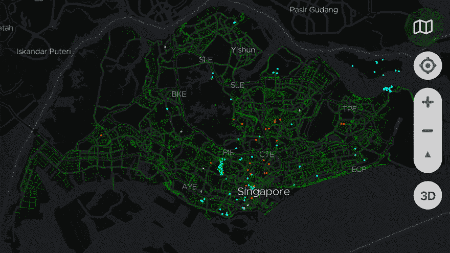](https://res.cloudinary.com/practicaldev/image/fetch/s--NtaDP27c--/c_limit%2Cf_auto%2Cfl_progressive%2Cq_66%2Cw_880/https://cheeaun.com/blimg/screenshots/web/exploretrees-sg-screenshot.gif)

尽管我尽了最大努力重写代码并突破了极限，我还是为 3D 树感到特别自豪。对我来说，这感觉像是一个没有成就的时刻。🤩

[](https://res.cloudinary.com/practicaldev/image/fetch/s--ODIQjxvs--/c_limit%2Cf_auto%2Cfl_progressive%2Cq_auto%2Cw_880/https://cheeaun.com/blimg/screenshots/web/exploretrees-sg-3d-trees-overview%402x.jpg)

多亏了一个朋友，它在 Reddit /r/singapore 上出现了😉。

[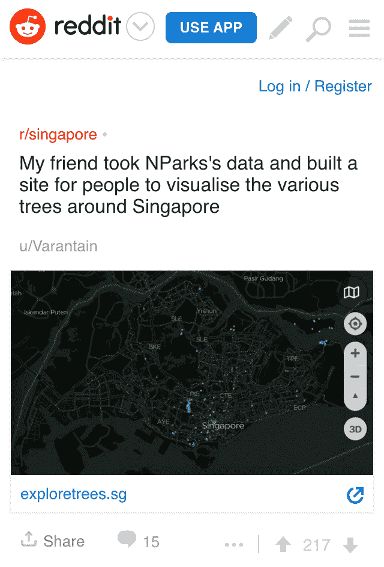](https://res.cloudinary.com/practicaldev/image/fetch/s--zDSnpvuc--/c_limit%2Cf_auto%2Cfl_progressive%2Cq_auto%2Cw_880/https://cheeaun.com/blimg/screenshots/web/reddit-friend-took-nparks-data-built-site-visualise-trees-singapore%402x.png)

到目前为止，反馈是积极的。我很惊讶，版本 1 和版本 2 的条件路由似乎足够平滑，以至于没有人注意到它。😝

发布一天后，我在凌晨 2 点收到了一封非常有趣的电子邮件。

[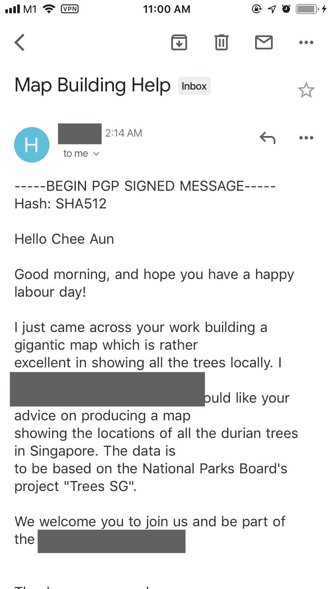](https://res.cloudinary.com/practicaldev/image/fetch/s--Adx-FaRW--/c_limit%2Cf_auto%2Cfl_progressive%2Cq_auto%2Cw_880/https://cheeaun.com/blimg/screenshots/software/email-map-building-help%402x.jpg)

所以这个人问我关于为新加坡所有的**榴莲树创建一张地图的*建议*！我早上在看这个，大笑了一场，然后忽略了它。😂**

那天是劳动节，没有工作。下午，我有一种预感，这个人可能**不是**在开玩笑。

于是，我对榴莲做了一些研究，找到了一个关于*榴莲*品种的[列表的维基百科页面，翻遍了数据集，找到了 **286 个榴莲品种**！😱](https://en.wikipedia.org/wiki/List_of_Durio_species)

[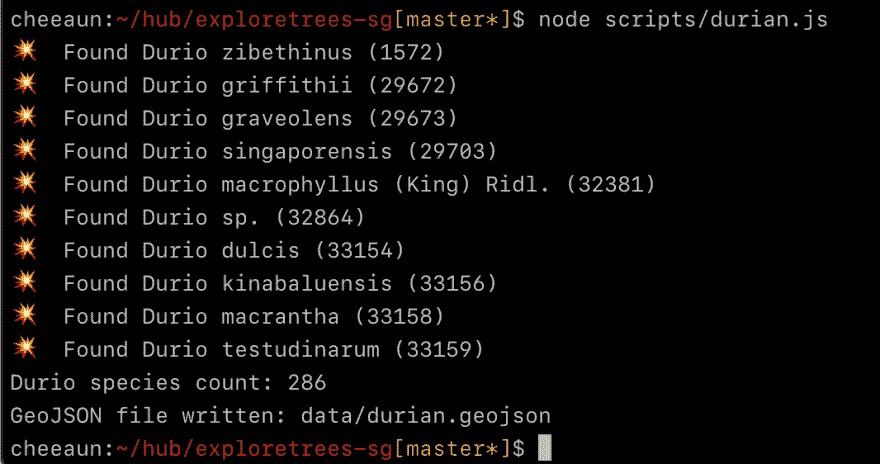](https://res.cloudinary.com/practicaldev/image/fetch/s--1Z5GnvPz--/c_limit%2Cf_auto%2Cfl_progressive%2Cq_auto%2Cw_880/https://cheeaun.com/blimg/screenshots/software/terminal-node-script-durian-durio-species%402x.png)

我不知道新加坡还有榴莲树！更令人惊讶的是，[榴莲](https://en.wikipedia.org/wiki/Durian)树有[花](http://www.wildsingapore.com/wildfacts/plants/fruittrees/durio/zibethinus.htm)！😱

下一个合乎逻辑的步骤是在地图上快速加载它们[。](https://gist.github.com/cheeaun/1d68f6acb589a30335e1c7c927153d18)

[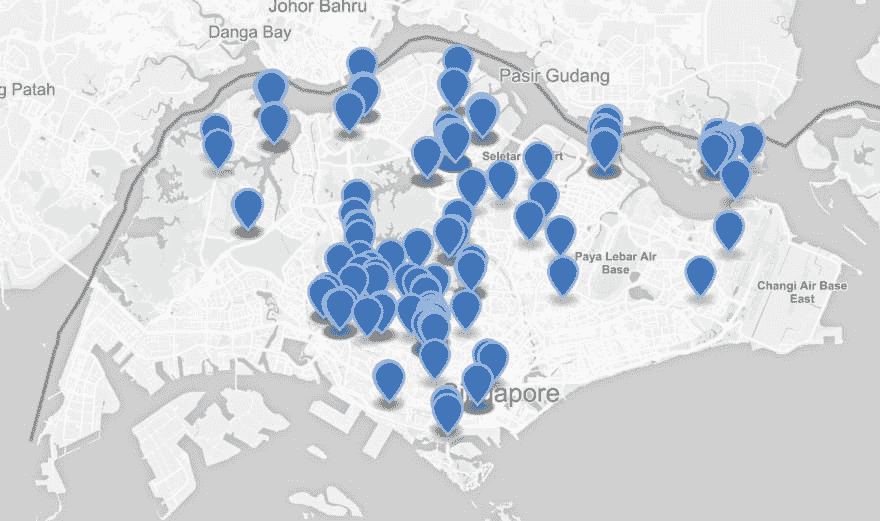](https://res.cloudinary.com/practicaldev/image/fetch/s--LbGNtq2U--/c_limit%2Cf_auto%2Cfl_progressive%2Cq_auto%2Cw_880/https://cheeaun.com/blimg/screenshots/web/durio-species-trees-map%402x.png)

看着这个，我心里想。新加坡还有其他的果树吗？我在网上搜了一下，找到了一个果树品种名称的列表。我在想如何在地图上显示水果，也许是彩色的圆圈或水果图标？可能有太多的异国水果要展示，所以可能需要筛选出那些“受欢迎”的水果？

嗯，是的……很多想法，时间却这么少。

从我在[建立辅助项目](https://cheeaun.com/blog/2016/01/building-side-projects/)的经验来看，在执行一个想法之前坚持一段时间总是好的。这一次，我已经有了**这么多的乐趣**重建一切，压榨表演的每一寸，甚至在地图上建模 3D 树木。最重要的是，在我厌倦之前，我设法向公众发布了我的[开源](https://github.com/cheeaun/exploretrees-sg)作品。😆

这很有趣，我也学到了很多。

那么，下次见。😉*****