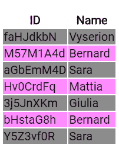
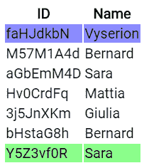

# 做对了

> 原文：<https://dev.to/daudr/ngfor-done-right-1ede>

**这篇文章之前已经发表在我的[主博客](https://blog.daudr.me/ngfor-done-right)** 上

当处理模板中的列表时，ngFor 节省了我们很多时间，但如果使用不当，它可能会是一个真正的痛苦，请阅读本文以了解如何正确使用它。

[](https://res.cloudinary.com/practicaldev/image/fetch/s--Srq1ie5g--/c_limit%2Cf_auto%2Cfl_progressive%2Cq_auto%2Cw_880/https://images.unsplash.com/photo-1489976908522-aabacf277f49%3Fixlib%3Drb-1.2.1%26ixid%3DeyJhcHBfaWQiOjEyMDd9%26auto%3Dformat%26fit%3Dcrop%26w%3D1950%26q%3D80)

> Kolleen Gladden 在 [Unsplash](https://unsplash.com) 上拍摄的照片

关于这篇文章的所有信息也可以在官方[文档](https://angular.io/api/common/NgForOf)中找到

## 先决条件

在本指南中，我们将使用一个接口来表示我们的列表对象，让我们称之为`Item`，看起来像这样:

```
export interface Item {
  _id: string
  name: string
} 
```

我们将使用一些`utils`模拟和函数，稍后会对我们有所帮助:

```
export const items: Item[] = [{ _id: "a2fHdS8P", name: "Mike" }]

export const makeRandomId = (): string => {
  let result = ""
  const characters =
    "ABCDEFGHIJKLMNOPQRSTUVWXYZabcdefghijklmnopqrstuvwxyz0123456789"
  const charactersLength: number = characters.length
  for (let i = 0; i < 8; i++) {
    result += characters.charAt(Math.floor(Math.random() * charactersLength))
  }
  return result
}

export const makeRandomName = (): string => {
  const names = [
    "Sara",
    "Mattia",
    ...
  ]

  return names[Math.floor(Math.random() * names.length)]
}

export const itemsLong: Item[] = [
  {
    _id: makeRandomId(),
    name: makeRandomName(),
  },
  {
    _id: makeRandomId(),
    name: makeRandomName(),
  },
  ...
] 
```

## 首先跟踪 By

`trackBy`是一个定义如何跟踪 iterable 中项的变化的函数。这意味着，在网络调用之后，我们可以用它来准确地知道列表中的哪个元素被改变了。
我们通过在我们的`.ts`文件中定义一个函数来实现它:

```
trackByFunction (index, item) {
  return item._id;
} 
```

然后在你的`.html`中添加你的新函数

```
<div *ngFor="let item of items; trackBy: trackByFunction"></div> 
```

这样做可以让你的应用程序更有性能，因为它不需要重新加载你的所有视图，而只需要重新加载被改变的元素。

## 接下来是偶数和奇数

变量`even`和`odd`主要用于设计组件的样式。
例如，当我们有一个表格，我们想让它更易读，我们可以使用这些变量来改变行的背景颜色。

在你的`html`

```
<table>
  <thead>
    <tr>
      <th>ID</th>
      <th>Name</th>
    </tr>
  </thead>
  <tbody>
    <tr
      *ngFor="let item of items; trackBy: trackBy; odd as odd; even as even"
      [ngClass]="{ 'odd': odd, 'even': even }"
    >
      <td>{{ item._id }}</td>
      <td>{{ item.name }}</td>
    </tr>
  </tbody>
</table> 
```

并且在你的`css` / `scss`文件

```
.odd {
  background-color: rgba(255, 0, 255, 0.45);
}

.even {
  background-color: rgba(0, 0, 0, 0.45);
} 
```

结果会是类似
[](https://res.cloudinary.com/practicaldev/image/fetch/s--ku3RrCgF--/c_limit%2Cf_auto%2Cfl_progressive%2Cq_auto%2Cw_880/https://thepracticaldev.s3.amazonaws.com/i/xw840y3l4ud1lqtz81f0.png) 的东西

## 说说最初和最后

就像`even`和`odd`，`first`和`last`变量也用于样式目的。
让我们使用已经创建的表，只为第一行和最后一行设置类:

```
<table>
  <thead>
    <tr>
      <th>ID</th>
      <th>Name</th>
    </tr>
  </thead>
  <tbody>
    <tr
      *ngFor="let item of items; trackBy: trackBy; first as first; last as last"
      [ngClass]="{ 'first': first, 'last': last }"
    >
      <td>{{ item._id }}</td>
      <td>{{ item.name }}</td>
    </tr>
  </tbody>
</table> 
```

```
.first {
  background-color: rgba(0, 0, 255, 0.45);
}

.last {
  background-color: rgba(0, 255, 0, 0.45);
} 
```

那就长这样
[](https://res.cloudinary.com/practicaldev/image/fetch/s--dXKmLQSt--/c_limit%2Cf_auto%2Cfl_progressive%2Cq_auto%2Cw_880/https://thepracticaldev.s3.amazonaws.com/i/t9tkh02ynxj1l1hmg2j0.png)

## 别忘了指数

属性做的和你想的完全一样，它告诉你列表中元素的索引。
也许这是我们处理列表时使用最多的属性，想想看，如果你想使用`css`将列表元素放在定义的行中。

```
<mat-list>
  <mat-list-item *ngFor="let item of items; trackBy: trackByFunction; index as index">{{ item.name }} index is {{ index }}</mat-list-item>
</mat-list> 
```

[](https://res.cloudinary.com/practicaldev/image/fetch/s--0GQguHp4--/c_limit%2Cf_auto%2Cfl_progressive%2Cq_auto%2Cw_880/https://thepracticaldev.s3.amazonaws.com/i/eruw3qir167islc8l5xv.png)

本指南中使用的所有代码都可以在 [Stackblitz](https://stackblitz.com/edit/ngfor-done-right) 和 [GitHub](https://github.com/Daudr/ngfor-done-right) 上找到