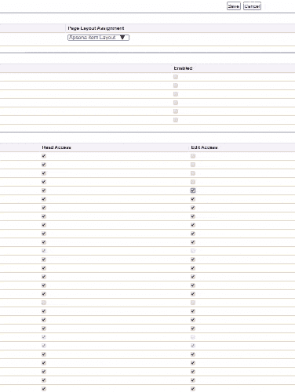

# 用于无权限 Salesforce 简档的 Python 和 Selenium

> 原文：<https://dev.to/katiekodes/no-permissions-salesforce-profile-w-python-and-selenium-2fc7>

我需要一个成熟组织中的新的“无权限”Salesforce 配置文件。

我无法让元数据 API 足够快地工作到我喜欢的速度，所以我放弃了，用 Python 和 Selenium 构建了一个“机器人版”的自己，劫持了自己的浏览器，看着 fake-me 以计算机速度点击数千个按钮。

(这是不是让我的电脑成为了#AwesomeAdmin？)

我是这样做的。

## 背景

我即将测试一个全新的 [Pardot 培训环境](http://help.pardot.com/customer/portal/articles/2128159-training-environment-faq)，我想将它连接到一个 Salesforce 沙盒，其理念是[最小特权](https://en.wikipedia.org/wiki/Principle_of_least_privilege)。

这意味着创建具有*无*对象级 CRUD 访问权限和*无*字段级读/写访问权限的 Salesforce 配置文件。

如果需要的话，我会把东西放回上的*。*

不幸的是，我们没有任何这样的配置文件来克隆。

*   我克隆了我能找到的最接近的一个——一个“只读”的——但是它已经积累了很多它不需要的读/编辑*(是的，编辑，尽管它的名字是)*访问。
*   为了让它达到我想要的“无权限”状态，我需要做大量的编辑工作。

请继续阅读，看看我尝试了什么。

* * *

## 取 1:韦尔金组曲

我认为 Welkin 套件的[对象权限编辑器](https://welkinsuite.com/blog/salesforce-objects-permissions-editor-in-the-welkin-suite-bloom-r25/)和[字段级安全工具](https://docs.welkinsuite.com/?id=windows:how_does_it_work:declarative_development:sobjects_editor:fls_tab)可以帮助我。

*   事实上，对象权限编辑器很快就关闭了对象级的 CRUD 访问。
*   然而，在 Welkin 的字段级安全选项卡中一次调出数百个对象，然后逐个关闭，这需要太多的点击和太多的等待。
    *   该编辑器非常适合放下锤子，将 5 个对象上的一个或多个配置文件的权限清零。然而，对于 150 个对象来说，这仍然是太多的工作。

* * *

## 取 2:元数据 API

我想:

> " Welkin 以及 Salesforce 设置页面作者都构建了工具，用于查询 Salesforce 对象的所有安全可设置字段，以便将它们呈现给用户。
> 
> “我只需查询他们正在查询的任何内容，然后遍历它，在 [XML](https://katiekodes.com/tags#xml) 中构建一个庞大的`Pardot Data Sync.profile`，压缩它，然后[将它部署到我在工作台](https://workbench.developerforce.com/metadataDeploy.php)中的沙箱中。”

`Pardot Data Sync.profile`的内容应该是这样的:

```
<?xml version="1.0" encoding="UTF-8"?>
<Profile xmlns="http://soap.sforce.com/2006/04/metadata">
    <fieldPermissions>
        <allowCreate>false</allowCreate>
        <editable>false</editable>
        <field>SomeObjectAPIName.SomeFieldAPIName</field>
        <hidden>true</hidden>
        <readable>false</readable>
    </fieldPermissions>
    ...
    <fieldPermissions>
        <allowCreate>false</allowCreate>
        <editable>false</editable>
        <field>SomeObjectAPIName.SomeFieldAPIName</field>
        <hidden>true</hidden>
        <readable>false</readable>
    </fieldPermissions>
</Profile> 
```

该文件将位于。ZIP 名为“个人资料”

在的顶层。ZIP 是一个名为`package.xml`的文件，包含以下内容:

```
<?xml version="1.0" encoding="UTF-8"?>
<Package xmlns="http://soap.sforce.com/2006/04/metadata">
    <fullName>MiscLazyStuff</fullName>
    <types>
        <members>Pardot Data Sync</members>
        <name>Profile</name>
    </types>
    <version>46.0</version>
</Package> 
```

我不知道如何获取一系列的`SomeObjectAPIName.SomeFieldAPIName`值来构建我的`<fieldPermissions>...</fieldPermissions>`包装器，所以我开始编写一个 Python 脚本来循环遍历我用 Welkin 下载到我电脑上的每个`*.object` XML 文件。

不幸的是，我遇到了无数的**元数据部署**错误——每个错误我一次只能看到一个。

1.  首先，我必须编辑我的脚本来忽略公式字段
2.  然后我必须编辑它来忽略主从字段
3.  然后我不得不编辑它以忽略强制查找字段。在`.object`文件中的标准对象的标准字段上不存在`required`属性，所以为了安全起见，我忽略了所有没有`required`标志的查找字段。\
4.  当然，我必须忽略属性为`true`的字段。
5.  但是仍然有更多的标准对象的标准字段是必需的，在它们的`*.object` XML 定义中没有告诉我。当错误消息告诉我需要`AuthorizationFormConsent.ConsentCapturedDateTime`时，我失去了耐心，但是它在`AuthorizationFormConsent.object`中的代码看起来像这样:

```
<fields>
    <fullName>ConsentCapturedDateTime</fullName>
    <trackHistory>false</trackHistory>
</fields> 
```

> 等待...我怎么会知道那件事？！
> 
> ***这是哪里记载/提取的？？！！*** **

我又花了 3 个小时用我的头撞墙玩工具 API 和 Apex，试图找到一种可靠的方法来获得相同类型的“不要为这个字段费心”黑名单*(或“为这些字段费心”白名单)*，这显然是 Welkin Suite 和 Salesforce 的基于网络的设置页面的作者在我退出之前设法提出的。

我的意思是，我是不是应该在“描述”段落的开头或者其他地方截屏[文档](https://developer.salesforce.com/docs/atlas.en-us.220.0.api.meta/api/sforce_api_objects_authorizationformconsent.htm)中的单词“required ”?

在某一时刻，我被 ***搞定了*** 。

> **注意** : *会带输入！*
> 
> Welkin 乡亲，Salesforce 员工，或其他开发人员-我很想听听你们用什么算法**计算出*哪些*字段作为可编辑权限呈现给用户**。

直到那时...我没有自己造汽车，而是决定“在那里修理”一辆已有汽车的车轮。带我去...

[](https://res.cloudinary.com/practicaldev/image/fetch/s--XGNwtYQS--/c_limit%2Cf_auto%2Cfl_progressive%2Cq_auto%2Cw_880/https://i.chzbgr.com/full/3215767040/hA7AE392D/)

* * *

## 取 3:设置菜单+硒*(还有一点数据加载器)*

Selenium 是一套可编程的软件，在你的网络浏览器和你选择的编程语言之间充当中间件。

通常，开发人员使用它来模仿用户点击网页上的按钮，以便他们可以确保他们的网页按预期工作。

*   电脑化省事——每次都是一样的东西，谁真的愿意去点击所有需要点击的按钮？
*   计算机化的规模很大——这是一种模拟数百万人同时点击你的网页的可靠方式*(就像你是一个大型电子零售商，在主要的购物假期期间)*。

我安装了它，因为我知道我需要在几十到几百个 Salesforce 设置页面上的每个屏幕上“取消点击”几个和**几百个**复选框之间的某个地方，这些复选框彼此完全相同。

听起来像是自动化我的工作的完美用例！

当我点击前几个按钮时，我可以探索我的 web 浏览器代表我做了什么，然后教计算机为我做这些，并教计算机当从一个 Salesforce“对象”切换到另一个时，要考虑哪些细微变化。

### 第一步:登录

首先，我运行了下面的 Python 代码

```
from selenium.webdriver import Chrome
browser = Chrome(executable_path='C:\\exampleprograms\\ChromeDriver\\chromedriver.exe')
browser.get('https://test.salesforce.com') 
```

这导致 Chrome 的一个特殊实例在我的电脑上弹出。

我照常使用我的用户名和密码登录 Salesforce。

### 第二步:获取我的对象链接

然后我注释掉上面的代码，没有让[我的 Python IDE](https://katiekodes.com/setup-python-windows-anaconda/#write-your-first-python-program) 清除`browser`变量*的值(这是我的 IDE 从一个“运行”按钮点击到下一个*的正常行为)，我运行了下面的代码:

```
editableLinksToVisit = []
browser.get('https://cs99.salesforce.com/00eX00000000XXX?s=ObjectsAndTabs')
objtable = browser.find_element_by_css_selector("[id$='table_objects_and_tabs:tb']")
rows = objtable.find_elements_by_xpath('.//*')
for row in rows:
    tds = row.find_elements_by_tag_name("td")
    if len(tds) > 2:
        td1 = tds[0]
        td2 = tds[1]
        td2span = td2.find_element_by_tag_name("span")
        if td2span is not None and td2span.text != '--':
            td1span = td1.find_element_by_tag_name("span")
            if td1span is not None:
                td1a = td1span.find_element_by_tag_name("a")
                if td1a is not None:
                    td1aText = td1a.text
                    td1aLink = td1a.get_attribute('href')
                    td1aEditableLink = td1aLink.replace('?s=ObjectsAndTabs','/e?s=ObjectsAndTabs')
                    editableLinksToVisit.append({'text':td1aText, 'editLink':td1aEditableLink}) 
```

上面的代码是这样做的:

1.  `browser.get()`命令让我访问了 Chrome 中的一个新网站——就好像我自己在浏览器栏中输入了那个 URL 并点击了“回车”
    *   这是非常令人神魂颠倒的 -你真的看着你的电脑在没有你的情况下做事情，就像有人接管了控制权一样。
2.  我告诉`browser.get()`的 URL 是我试图编辑*(我在这里写为具有对象 ID`00eX00000000XXX`)*的配置文件的设置的“对象和标签”屏幕的 URL。
3.  当我运行`browser.get()`时，存储在我的程序的`browser`变量中的内容发生了变化。
4.  然后，我使用各种各样的[方法](https://en.wikipedia.org/wiki/Method_(computer_programming))构建到我已经存储在`browser` *(我忘记它到底是什么)*中的[数据类型](https://en.wikipedia.org/wiki/Data_type)中，比如`.find_element_by_css_selector()`和`.find_element_by_tag_name()`来[抓取](https://en.wikipedia.org/wiki/Web_scraping)这个特定网页的内容。
    *   从技术上来说，我是在抓取 DOM，或者你使用 Firefox 或 Chrome 开发者控制台“inspect element”工具时看到的东西，而不是抓取 HTML 源代码。它们的内容非常细微的不同。过去，你可以通过查看 HTML 的源代码来判断它是由什么组成的。如今，JavaScript 可以在最后一刻将 HTML“注入”到“DOM”中，而您的浏览器*实际上是*基于 DOM 呈现网页，所以如果您想要解析网页背后的代码，您必须知道如何检查 DOM 中真正的内容。
5.  我的大`for`循环和嵌套的`if`语句在页面上的特定表格中查找文本“-”旁边的 ***而不是*** 的链接
    *   “-”表示链接指向选项卡的设置，而不是对象的设置，所以我想跳过这些。
6.  然后我获取对象的名称*(根据链接的文本)*和它的 URL。
7.  最后，我通过在`?s=`前粘贴一个`/e`来编辑链接，这样当我访问我的链接时，我可以直接进入该对象的特定于配置文件的配置页面的可编辑版本。

我的对象名称及其链接的大列表是我存储为`editableLinksToVisit`的内容。

### 第三步:点击所有按钮

我再次注释掉了上面的代码，没有让我的 Python IDE 清除任何变量的值*(这是我的 IDE 从一个“运行”按钮点击到下一个按钮的正常行为)*，拿了一杯水，运行了下面的代码*(大约花费了 **15-25 分钟** )* :

```
for linkDict in editableLinksToVisit:
    print(linkDict.get('text'))
    browser.get(linkDict.get('editLink'))

    submitbutton = browser.find_element_by_css_selector("input[type='submit'][value='Save'][id$='button_pc_save']")
    editinputs = browser.find_elements_by_css_selector("input:enabled:checked[id$=':fls_edit_ck']")
    readinputs = browser.find_elements_by_css_selector("input:enabled:checked[id$=':fls_read_ck']")

    if submitbutton is not None and (len(editinputs) + len(readinputs) > 0):
        print('submit ' + str(submitbutton is not None))
        print('edits ' + str(len(editinputs)))
        print('reads ' + str(len(readinputs)))
        for ipt in editinputs:
            ipt.send_keys(" ")
        for ipt in readinputs:
            ipt.send_keys(" ")
        submitbutton.send_keys("\n")
        print('done')
    else:
        print('oops')
        print('submit ' + str(submitbutton is not None))
        print('edits ' + str(len(editinputs)))
        print('reads ' + str(len(readinputs))) 
```

这段代码是我保存到`editableLinksToVisit`中的所有描述-URL 链接对 *( [【元组】](https://www.w3schools.com/python/python_tuples.asp) )* 的一个大循环。

下面是它对列表中每个链接的作用:

1.  它会写下一个我能读懂的纸条，告诉我它将要劫持我的浏览器来访问哪个对象的 URL
2.  它劫持了我的浏览器并访问了那个网址。
3.  它读取页面的 DOM 代码，找到所有当前选中的和不可选中的**字段级安全**框。
    *   它将此分为单独的“编辑”和“读取”复选框列表。
4.  它读取页面的 DOM 代码来找到 Save 按钮。
5.  如果它发现任何“可以取消选中”的内容，它将遍历列表并取消选中复选框。
    *   我先循环“编辑”，然后是“读取”，因为取消选中“读取”复选框会有取消选中“编辑”边框的副作用，我想让事情简单些，不用担心副作用。
    *   我用键盘模仿在“跳”到复选框后按空格键，而不是 Selenium 的`.click()`命令，因为`.click()`工作不可靠，StackOverflow 上有人说这可能，他们是对的。ðŸ
6.  它点击保存按钮*(同样，我通过虚拟敲击键盘上的“enter”来模拟，而不是点击，因为出于某种原因，这样更可靠)*。

看着*(注——以下动画)*有点让人心醉:

[](https://res.cloudinary.com/practicaldev/image/fetch/s--RWH2hhxi--/c_limit%2Cf_auto%2Cfl_progressive%2Cq_66%2Cw_880/https://katiekodes.cimg/screenvid-selenium-uncheck.gif)

反正就几分钟。

专业建议:当你已经在办公室呆到很晚，真的只想关掉电脑，享受一个美丽的夜晚时，不要启动它。🌅

### 第四步:用数据加载器清理

**CampaignMember** 和其他一些对象有可编辑的权限，但是没有通过 web 面板显示为可编辑，所以我通过使用 Salesforce [数据加载器](https://login.salesforce.com/ui/setup/sforce/DataLoaderSetupPage?setupid=DataLoader) :
提取该查询找到了它们

```
SELECT Id, Field, SObjectType, PermissionsRead, PermissionsEdit
FROM FieldPermissions 
WHERE parentId IN ( SELECT id 
                    FROM permissionset 
                    WHERE PermissionSet.Profile.Name = 'Pardot Data Sync')
AND (PermissionsRead = true or PermissionsEdit = true) 
```

我使用 Excel 将两列中的“PermissionsRead”和“PermissionsEdit”翻转为 FALSE。

然后，在两次传递中——再次，首先执行“编辑”,然后执行“读取”*(也就是说，我两次都映射了“Id ”,但一次只映射了我想要编辑的一列)*，通过我的设置，一次只加载一条记录*(因此一个错误不会关闭一个批处理)*，我将这个电子表格传递给数据加载器中的更新操作。

那也花了几分钟*(还是那句话，记住，一次一条记录)*，但最终还是通过了。

* * *

## 不是生产解决方案

作为创建“零”配置文件的长期解决方案，这是不可持续的。

通过元数据 API 加载要简单得多**而且很可能一步就能完成，而不必为了“清理”而使用数据加载器**

此外，我甚至不确定我*是否得到了我本可以关闭的所有现场级安全设置。*

我希望将来能做得更彻底，真正像我应该做的那样批量编辑权限。

*   问:谁有什么技巧来构建一个*完美的*对象和字段列表，以便将权限写入到`.profile`文件中？