# Node、TypeScript、Azure Web 应用——什么可能出错。经验教训指南

> 原文：<https://dev.to/whiteanvil/node-typescript-azure-web-apps-what-could-go-wrong-lessons-learnt-guide-1g92>

我已经是一名 Typescript 的转换者——它是通过 Angular 介绍给我的，现在我正在将它介绍给我在 Node.js 世界中的工作流。

最近我一直在建立一个节点。JS 项目，并将其部署到 Azure Web 应用程序——为什么是 Azure Web 应用程序，我有一个 MSDN，我有一些信用，所以我想为什么不呢。

在这篇文章中，我将使用 TypeScript 构建一个基本的 express 应用程序，我们将构建几个控制器(带有一些基本的 auth ),然后我们将使用微软的 DevOps 工具来构建我们的服务器并进行部署。

那么，我为什么要这样做呢——一路上，我遇到了阻碍和烦恼，这样其他人就不会陷入同样的困境，我想我应该指出这一路上痛苦的因素。

**警告**:这是一篇很长的帖子。简而言之，有一个 TLDR。

### TLDR

我将从头到尾介绍这个项目的基本设置，我不会让你感到厌烦，所以这里是高层次的要点

*   使用 TypeScript 太棒了😍
*   如果您要部署到 Azure Web 应用程序，请使用端口 1377🤔
*   在这个项目中，我使用 bcrypt 进行密码加盐和散列。因为构建工具将使用 64 位节点构建，所以您的项目在部署时将无法工作，因为它不是 32 位应用程序。而 Azure Web App 只支持 32 位节点。在这种情况下，您需要提供自己的 node 版本😤
*   您的 typescript 将构建到一个 dist 文件夹中，web.config 需要作为 DevOps 构建的一部分放在那里😃
*   使用发布管道工件会可靠地将您的工作上传到 WebApp(它不会像 FTP 上传那样超时)✨
*   Git repo 在这里[https://github . com/anvilation/azure-web app-typescript-express](https://github.com/anvilation/azure-webapp-typescript-express)

* * *

### 设置

## 节点版本

对于这个项目，我使用的是节点版本 10.14.1。虽然它对这个项目来说不是非常关键，但我知道它会匹配我将在 Azure 上部署的版本(因为我根据项目玩的版本不同，我倾向于使用 [NVS](https://github.com/jasongin/nvs) 来切换我的节点版本)。

## 布局

我们将为此使用的文件夹结构非常简单

[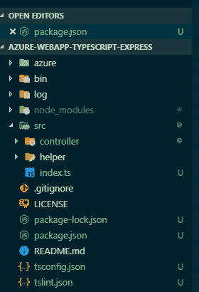](https://res.cloudinary.com/practicaldev/image/fetch/s--VtQ-glvg--/c_limit%2Cf_auto%2Cfl_progressive%2Cq_auto%2Cw_880/https://cdn-images-1.medium.com/max/720/1%2AwkFNBcGhITgfl2Cd9SNebQ.png)

### 套餐

让我们从安装下面的包开始。第一个是我们将要用来构建这个应用的包:

```
npm install express helmet body-parser bcrypt reflect-metadata routing-controllers jsonwebtoken --save 
```

接下来，安装类型脚本依赖项

```
npm install typescript tslint ts-node -save-dev 
```

最后是类型

```
npm install @types/body-parser @types/express @types/helmet @types/bcrypt @types/jsonwebtoken --save-dev 
```

### 打字稿

接下来我们设置 TypeScript——现在有很多方法来设置它——但对我来说，我倾向于使用与前面项目相同的方法，不过你可以简单地使用

```
tslint --init 
```

这将在项目的根目录下创建一个 tslint.json。最后，我们将在这个项目的根目录下添加一个 tsconfig.json 文件

```
{
  "compilerOptions": {
    "module": "commonjs",
    "esModuleInterop": true,
    "target": "es6",
    "noImplicitAny": true,
    "moduleResolution": "node",
    "sourceMap": true,
    "outDir": "dist",
    "baseUrl": ".",
    "paths": {
      "*": ["node_modules/*"]
    },
    "emitDecoratorMetadata": true,
    "experimentalDecorators": true
  },
  "include": ["src/**/*"]
} 
```

同样，你可能需要添加很多选项，我只是从以前的项目中引入了配置。

### package.json

为了完成设置，我们想在包中添加一些额外的脚本

```
"prebuild": "tslint -c tslint.json -p tsconfig.json --fix",
"build": "tsc",
"dev": "nodemon --watch './src/**/*.ts' --exec ts-node ./src/index.ts", 
```

* * *

## 让我们建造

让我们从 index.ts 开始，现在在下面的代码中有一串正在进行的操作。考虑到这更多的样板文件，我们将继续添加细节。

```
 import 'reflect-metadata'; // this shim is required
import { useExpressServer, Action } from 'routing-controllers';
import express from 'express';
import helmet from 'helmet';
import * as bodyParser from 'body-parser';
import jwt = require('jsonwebtoken');
// TODO: Controllers 
// Express Server
const loglevel = process.env.LOGLEVEL || 'info';
const port = process.env.PORT || 1337;
const app = express();
// Setup for Production Environment
if (process.env.ENV !== 'development') {
  app.set('trust proxy', true);
  app.use(helmet());
  app.disabled('x-powered-by');
}
app.use(bodyParser.urlencoded({extended: true}));
app.use(bodyParser.json());
// Start Server using useExpressServer
useExpressServer(app, {
  errorOverridingMap: {
   ForbiddenError: {
     message: 'Access is denied'
   }
  },
  controllers: []
});
app.listen(port, () => {
  logger.log(
    {
     level: 'info', 
     message: `SERVER: Server running on: ${port}`
    }
   );
}); 
```

从上面的代码来看，关键点有:

*   端口设置为 1337
*   我们正在使用(路由器-控制器)[[https://github.com/typestack/routing-controllers](https://github.com/typestack/routing-controllers)]模块，并将其与 ExpressJS 结合使用
*   当前没有配置控制器，因此该服务器不会返回任何数据

### 第一个控制器

让我们通过创建第一个控制器来返回一些数据。

*src/controller/index . controller . ts*T2】

```
import { Controller, Get, Req, Res } from 'routing-controllers';
@Controller()
export class IndexController {
@Get('/')
  getApi(@Req() request: any, @Res() response: any) {
    return response.send('<h1>Oh hai world</h1>');
  }
} 
```

因为我们可能会构建许多控制器，所以我们将在控制器上创建一个索引文件。

*src/controller/index . ts*T2】

```
import 'reflect-metadata'; // this shim is required
import { useExpressServer, Action } from 'routing-controllers';
import express from 'express';
import helmet from 'helmet';
import * as bodyParser from 'body-parser';
import jwt = require('jsonwebtoken');
// TODO: Controllers
import { IndexController } from './controller';
// Express Server
const loglevel = process.env.LOGLEVEL || 'info';
const port = process.env.PORT || 1337;
const app = express();
// Setup for Production Environment
if (process.env.ENV !== 'development') {
  app.set('trust proxy', true);
  app.use(helmet());
  app.disabled('x-powered-by');
}
app.use(bodyParser.urlencoded({extended: true}));
app.use(bodyParser.json());
// Start Server using useExpressServer
useExpressServer(app, {
  errorOverridingMap: {
   ForbiddenError: {
     message: 'Access is denied'
   }
  },
  controllers: [ IndexController ]
});
app.listen(port, () => {
  logger.log(
    {
     level: 'info', 
     message: `SERVER: Server running on: ${port}`
    }
   );
}); 
```

要运行，从控制台键入 npm 运行 dev 并确认浏览器返回响应。

[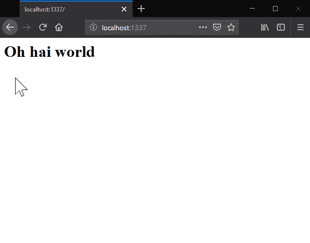](https://res.cloudinary.com/practicaldev/image/fetch/s--3mhJWLzG--/c_limit%2Cf_auto%2Cfl_progressive%2Cq_auto%2Cw_880/https://cdn-images-1.medium.com/max/720/1%2AXTpjBWiM3nTyObzJRonDUQ.png)

### 授权控制人

接下来，我们将创建一个授权用户的控制器。该控制器有三种方法:

*   登录(使人们能够登录)
*   routewithauth(允许授权用户访问的路由)
*   routhwithcurrentuser(当前用户可访问的路线)

*src/controller/auth . controller . ts*

```
import { JsonController, Post, BodyParam, NotAcceptableError, Authorized, CurrentUser, Req, Res, UnauthorizedError, Get } from 'routing-controllers';
import jwt = require('jsonwebtoken');
import bcrypt from 'bcrypt';
/*
  BIG FAT WARNING
  I am using static usernames and passwords here for illustrative purposes only
*/
@JsonController()
export class LoginController {
  private user = { name: 'user', password: 'muchcomplex' };
  jwtKey = process.env.JWTKEY || 'complexKey';
  private saltRounds = 10;
  constructor() {
    bcrypt.genSalt(this.saltRounds, (err: Error, salt: string) => {
    bcrypt.hash(this.user.password, salt, (hashErr: Error, hash: string) => {
      this.user.password = hash;
    });
  });
}
@Post('/login')
login(@BodyParam('user') user: string, @BodyParam('pass') pass: string) {
  if (!user || !pass) {
    // No data supplied
    throw new NotAcceptableError('No Email or Password provided');
  } else if (user !== this.user.name) {
    // No data supplied
    throw new NotAcceptableError('Username Incorrect');
  } else {
    return new Promise<any>((ok, fail) => {
      bcrypt.compare(pass, this.user.password, (err: Error, result: boolean) => {
        if (result) {
          const token = jwt.sign({exp: Math.floor(Date.now() / 1000) + 60 * 60, data: { username: this.user.name }
        }, this.jwtKey);
          ok({ token: token }); // Resolve Promise
        } else {
          fail(new UnauthorizedError('Password do not match'));
        }
      });
    });
  }
}
@Authorized()
@Get('/routewauth')
authrequired(@Req() request: any, @Res() response: any) {
  return response.send('<h1>Oh hai authorised world</h1>');
}
@Authorized()
@Get('/routewacurrentuser')
updatepass( @CurrentUser({ required: true }) currentuser: any, @Res() response: any ) {
  return response.send(`<h1>Oh hai ${currentuser.user} world</h1>`);
}} 
```

与 index.controller 一样，我们添加了额外的控制器:

*src/controller/index . ts*T2】

```
export * from './index.controller';
export * from './auth.controller'; 
```

我们将控制器添加到索引中

*src/controller/index . ts*T2】

```
import 'reflect-metadata'; // this shim is required
import { useExpressServer, Action } from 'routing-controllers';
import express from 'express';
import helmet from 'helmet';
import * as bodyParser from 'body-parser';
import jwt = require('jsonwebtoken');
// TODO: Controllers
import { IndexController, LoginController } from './controller';
// Express Server
const loglevel = process.env.LOGLEVEL || 'info';
const port = process.env.PORT || 1337;
const app = express();
// Setup for Production Environment
if (process.env.ENV !== 'development') {
  app.set('trust proxy', true);
  app.use(helmet());
  app.disabled('x-powered-by');
}
app.use(bodyParser.urlencoded({extended: true}));
app.use(bodyParser.json());
// Start Server using useExpressServer
useExpressServer(app, {
  errorOverridingMap: {
   ForbiddenError: {
     message: 'Access is denied'
   }
  },
  controllers: [ IndexController, LoginController ]
});
app.listen(port, () => {
  logger.log(
    {
     level: 'info', 
     message: `SERVER: Server running on: ${port}`
    }
   );
}); 
```

重启服务器，让我们检查一下新的控制器是否工作(为此我使用了 postman)。

[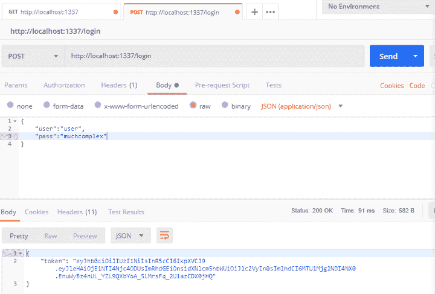](https://res.cloudinary.com/practicaldev/image/fetch/s--zCtzn4Za--/c_limit%2Cf_auto%2Cfl_progressive%2Cq_auto%2Cw_880/https://cdn-images-1.medium.com/max/720/1%2AFbP0HjlWx3ioBEh4ZN9PeQ.png)

然而，我们的授权路线失败了。

[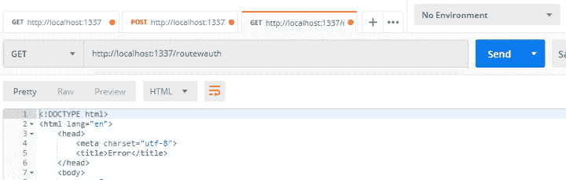](https://res.cloudinary.com/practicaldev/image/fetch/s--qPHZfH1e--/c_limit%2Cf_auto%2Cfl_progressive%2Cq_auto%2Cw_880/https://cdn-images-1.medium.com/max/720/1%2A5C1qzI2nMP45otA0ak1wCw.png)

所以让我们解决这个问题。为此，我们需要对我们的主程序进行一些调整:

我们将添加 JWT 键:

*const jwtKey = process . env . jwtKey | | ' complex key '；*

我们将在 useExpressServer 命令
中添加一个授权检查参数

```
authorizationChecker: async (action: Action) => {
  const token = action.request.headers['authorization'];
  let check: boolean;
  jwt.verify(token, process.env.JWTKEY, (error: any, sucess: any) => 
  {
    if (error) {
      check = false;
    } else {
      check = true;
    }
   });
   return check;
} 
```

我们将添加一个 currentUserCheck。这将检查令牌并返回一些当前用户信息。这由两部分组成 useExpressServer 命令中的 param 和返回用户信息的异步函数。我之所以将这些分开，是因为如果您向外扩展以使用一个 DB 实例，可能需要进行额外的检查。

```
currentUserChecker: async (action: Action) => {
  const token = action.request.headers['authorization'];
  const check = confirmUser(token);
  return check;
}, 
```

确认用户方法

```
async function confirmUser(token: any) {
  return await new Promise((ok, fail) => {
   jwt.verify(token, process.env.JWTKEY, (error: any, success: any) => {
     if (error) {
       fail({ user: null, currentuser: false });
     } else {
       ok({ user: success.data.username, currentuser: true });
     }
    });
  });
}
import 'reflect-metadata'; // this shim is required
import { useExpressServer, Action } from 'routing-controllers';
import express from 'express';
import helmet from 'helmet';
import * as bodyParser from 'body-parser';
import jwt = require('jsonwebtoken');
// TODO: Controllers
import { IndexController, LoginController } from './controller';
// Express Server
const loglevel = process.env.LOGLEVEL || 'info';
const port = process.env.PORT || 1337;
const jwtKey = process.env.JWTKEY || 'complexKey';
const app = express();
// Setup for Production Environment
if (process.env.ENV !== 'development') {
  app.set('trust proxy', true);
  app.use(helmet());
  app.disabled('x-powered-by');
}
app.use(bodyParser.urlencoded({extended: true}));
app.use(bodyParser.json());
// Start Server using useExpressServer
useExpressServer(app, {
  errorOverridingMap: {
   ForbiddenError: {
     message: 'Access is denied'
   }
  },
  authorizationChecker: async (action: Action) => {
    const token = action.request.headers['authorization'];
    let check: boolean;
    jwt.verify(token, jwtKey, (error: any, sucess: any) =>  {
      if (error) { check = false; } else {  check = true;  }
    });
    return check;
  },
  currentUserChecker: async (action: Action) => {
    const token = action.request.headers['authorization'];
    const check = confirmUser(token);
    return check;
  },
  controllers: [ IndexController, LoginController ]
});
app.listen(port, () => {
  logger.log(
    {
     level: 'info', 
     message: `SERVER: Server running on: ${port}`
    }
   );
});
async function confirmUser(token: any) {
  return await new Promise((ok, fail) => {
   jwt.verify(token, jwtKey, (error: any, success: any) => {
     if (error) {
       fail({ user: null, currentuser: false });
     } else {
       ok({ user: success.data.username, currentuser: true });
     }
    });
  });
} 
```

现在让我们再次测试

[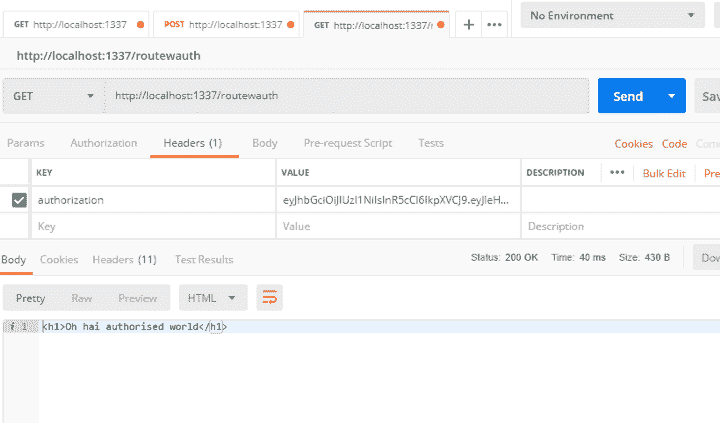](https://res.cloudinary.com/practicaldev/image/fetch/s--dSldIT2y--/c_limit%2Cf_auto%2Cfl_progressive%2Cq_auto%2Cw_880/https://cdn-images-1.medium.com/max/720/1%2A76RigQfelIoXomziZSm6Ww.png)

并检查当前用户路由

[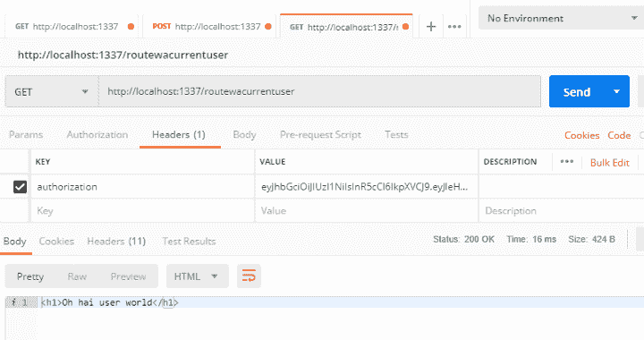](https://res.cloudinary.com/practicaldev/image/fetch/s--CpleUSrH--/c_limit%2Cf_auto%2Cfl_progressive%2Cq_auto%2Cw_880/https://cdn-images-1.medium.com/max/720/1%2ApCXDAW0E_ZcyiWw_AADPxw.png)

完成所有这些之后，让我们准备将它部署到 Azure Web App

* * *

## 部署到 Azure Web App

### 创建 Web App

因此，让我们设置 Azure Web 应用程序。这样做是添加新 WebApp 的直接过程。对于本演练，我已将计划更改为免费服务计划。

[](https://res.cloudinary.com/practicaldev/image/fetch/s--bvxX8zPK--/c_limit%2Cf_auto%2Cfl_progressive%2Cq_auto%2Cw_880/https://cdn-images-1.medium.com/max/720/1%2AjopkSB1CzybQNCBtTNHESQ.png)

设置完成后，您可以浏览到该资源并确认它已启动并正在运行。

[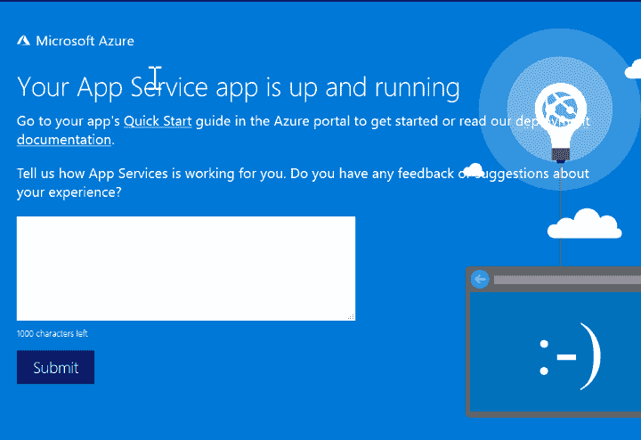](https://res.cloudinary.com/practicaldev/image/fetch/s--3mcNmePH--/c_limit%2Cf_auto%2Cfl_progressive%2Cq_auto%2Cw_880/https://cdn-images-1.medium.com/max/720/1%2Ad9fZDiwCmSJthqsTCvQRrg.png)

在我们开始之前，让我们快速更改一下这里的环境变量。浏览到应用程序设置并更新节点版本；为此，请浏览应用程序设置，并将新设置*网站 _ 节点 _ 默认 _ 版本*添加到 *10.14.1*

[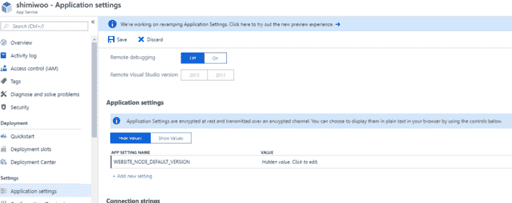](https://res.cloudinary.com/practicaldev/image/fetch/s--Vdv-Zd_c--/c_limit%2Cf_auto%2Cfl_progressive%2Cq_auto%2Cw_880/https://cdn-images-1.medium.com/max/720/1%2Akuu1n3Skg_JsjkcVqRl25w.png)

接下来，我们将更新服务器将查找的根目录:

[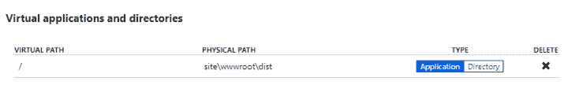](https://res.cloudinary.com/practicaldev/image/fetch/s--A3I1_eOE--/c_limit%2Cf_auto%2Cfl_progressive%2Cq_auto%2Cw_880/https://cdn-images-1.medium.com/max/720/1%2AUiNJAIEyiN2Il3oYNG2OQw.png)

* * *

## 为 Azure 部署准备好节点项目

回到我们的项目，我们将在设置中添加两个新文件:

*   网页配置

### Web.config

这是基于 IIS node([https://github.com/tjanczuk/iisnode](https://github.com/tjanczuk/iisnode))项目。这允许您在 IIS(Azure Web App 上的应用服务器)上运行 NodeJS 项目。

```
<?xml version="1.0" encoding="utf-8"?>
<configuration>
    <system.webServer>
        <webSocket enabled="false" />
        <handlers>
            <add name="iisnode" path="index.js" verb="*" modules="iisnode" />
        </handlers>
        <iisnode />
        <rewrite>
          <rules>
            <rule name="NodeInspector" patternSyntax="ECMAScript" stopProcessing="true">
              <match url="^index.js\/debug[\/]?" />
            </rule>
            <rule name="StaticContent">
              <action type="Rewrite" url="public{REQUEST_URI}"/>
            </rule>
            <rule name="DynamicContent">
              <conditions>
                <add input="{REQUEST_FILENAME}" matchType="IsFile" negate="True"/>
              </conditions>
              <action type="Rewrite" url="index.js"/>
            </rule>
          </rules>
        </rewrite>
        <security>
          <requestFiltering>
            <hiddenSegments>
               <remove segment="bin"/>
            </hiddenSegments>
         </requestFiltering>
        </security>
        <httpErrors existingResponse="PassThrough" />
    </system.webServer>
</configuration> 
```

随着所有信息的提交，我们已经准备好构建 Azure DevOps 管道。

### 天蓝色 DevOps

有很多方法可以部署到 Azure Web 应用程序——但对于这个练习，我们将使用 Azure devo PS([https://azure.microsoft.com/en-au/services/devops/](https://azure.microsoft.com/en-au/services/devops/))，它是包含在内的，并且设置起来非常简单，我们可以利用一些构建 Azure 友好的功能。

现在，这个服务有很多选项，包括像 repo 一样将其用作 g it 的选项，但我们只需要它来构建这个项目，所以这就是我们将使用它的原因。

在高层次上，我们构建将:

*   使用正确版本的节点
*   安装全局依赖项(类型脚本等)
*   安装项目依赖项
*   构建服务器
*   打包文件以部署到 Azure Web 服务
*   将文件部署到 Azure Web 服务

要创建内部版本，请选择“管道”>“内部版本”,然后创建新的内部版本

[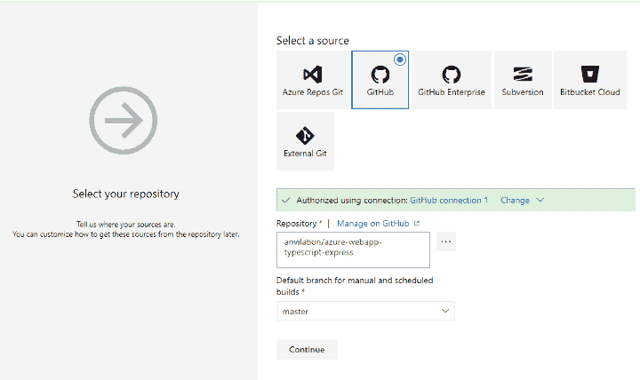](https://res.cloudinary.com/practicaldev/image/fetch/s---_vAASkB--/c_limit%2Cf_auto%2Cfl_progressive%2Cq_auto%2Cw_880/https://cdn-images-1.medium.com/max/720/1%2AKF-oe0OmVG-fZO_v-2NvqQ.png)

选择您的回购，然后单击“继续”继续。要添加的第一个任务是添加节点的正确版本。

[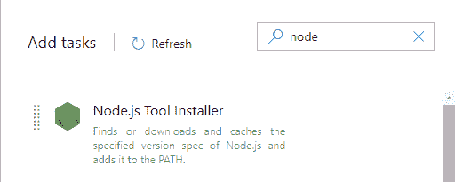](https://res.cloudinary.com/practicaldev/image/fetch/s--v-7ElQCo--/c_limit%2Cf_auto%2Cfl_progressive%2Cq_auto%2Cw_880/https://cdn-images-1.medium.com/max/720/1%2ARB-UKIvbXFgUQHeltbTmkA.png)

更新选项以选择 10.14.1

[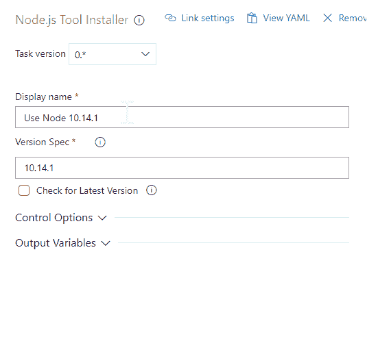](https://res.cloudinary.com/practicaldev/image/fetch/s--d0NzK6WV--/c_limit%2Cf_auto%2Cfl_progressive%2Cq_auto%2Cw_880/https://cdn-images-1.medium.com/max/720/1%2A7QzS7fGlo55UNnjqtwh5pQ.png)

接下来，我们需要添加基于 npm 的任务。添加新任务，选择 npm 并使用以下选项。

[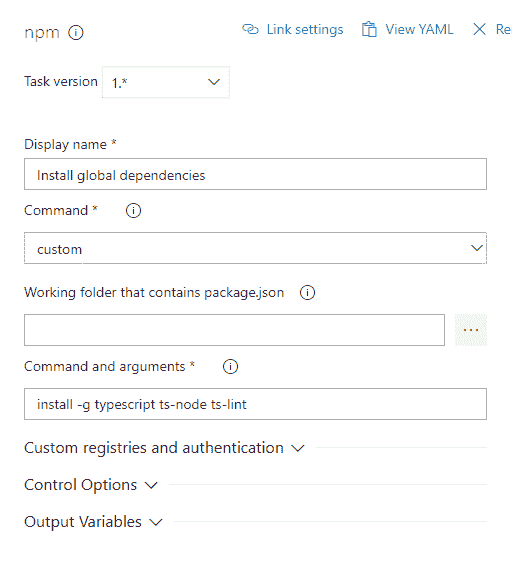](https://res.cloudinary.com/practicaldev/image/fetch/s--OCmQ7rkE--/c_limit%2Cf_auto%2Cfl_progressive%2Cq_auto%2Cw_880/https://cdn-images-1.medium.com/max/720/1%2A9uVcpq7nJmol7cOBCcOsMw.png)

[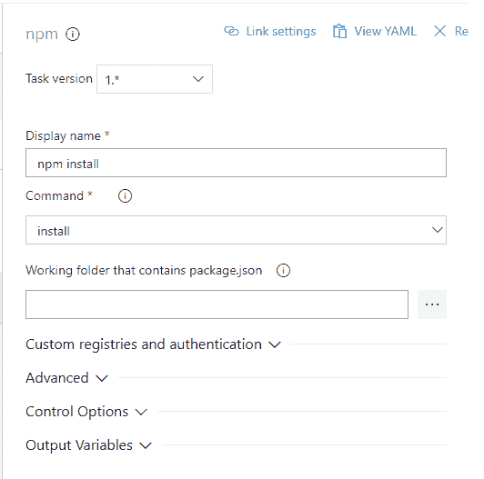](https://res.cloudinary.com/practicaldev/image/fetch/s--6iOVtlDq--/c_limit%2Cf_auto%2Cfl_progressive%2Cq_auto%2Cw_880/https://cdn-images-1.medium.com/max/720/1%2AkbbieS0bcHrfONuRwjl-3g.png)

[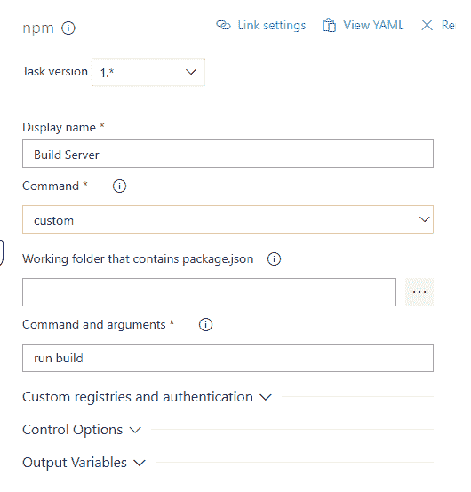](https://res.cloudinary.com/practicaldev/image/fetch/s--siTKCMHI--/c_limit%2Cf_auto%2Cfl_progressive%2Cq_auto%2Cw_880/https://cdn-images-1.medium.com/max/720/1%2AwcvzhAKqPpNp8s2_MJQi6g.png)

接下来，我们需要将 web.config 文件和我们的应用程序打包在一起。我选择分两步来做——这是为了让我创建包含 web 客户端的更大的 mono 项目，我将在最终版本中构建 web 客户端。

所以继续进行两个新任务(复制文件)

[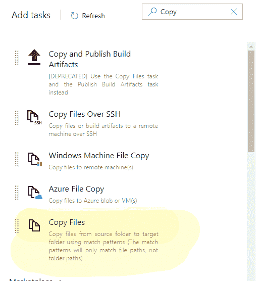](https://res.cloudinary.com/practicaldev/image/fetch/s--Ujh-4UmZ--/c_limit%2Cf_auto%2Cfl_progressive%2Cq_auto%2Cw_880/https://cdn-images-1.medium.com/max/720/1%2AanAYuIWVmebouNO_SRSFeQ.png)

[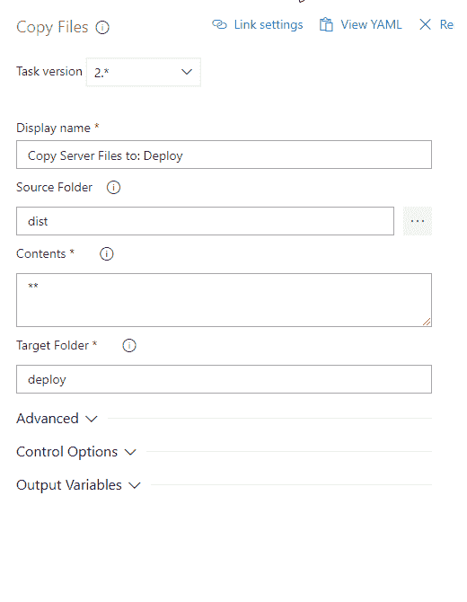](https://res.cloudinary.com/practicaldev/image/fetch/s--Hzz-hrKI--/c_limit%2Cf_auto%2Cfl_progressive%2Cq_auto%2Cw_880/https://cdn-images-1.medium.com/max/720/1%2Am68DOtmdtj29N1Rq9n1GnQ.png)

[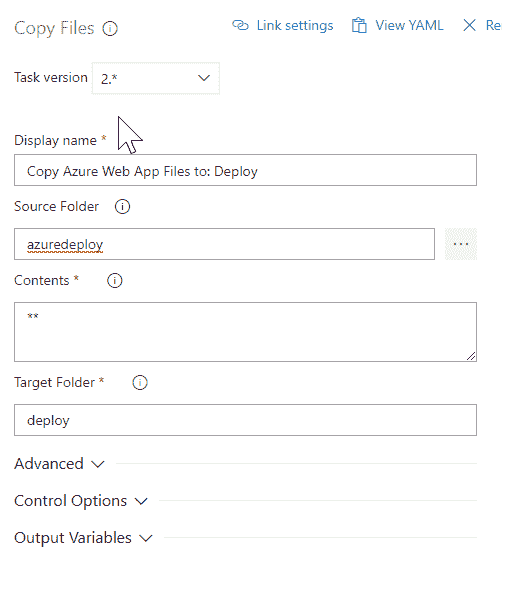](https://res.cloudinary.com/practicaldev/image/fetch/s--q8rC5mQn--/c_limit%2Cf_auto%2Cfl_progressive%2Cq_auto%2Cw_880/https://cdn-images-1.medium.com/max/720/1%2AXui1LVvyXcieTSRiC5YxJA.png)

接下来，我们发布管道人工制品

[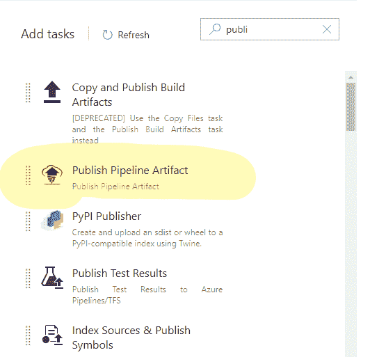](https://res.cloudinary.com/practicaldev/image/fetch/s--2Y463LSo--/c_limit%2Cf_auto%2Cfl_progressive%2Cq_auto%2Cw_880/https://cdn-images-1.medium.com/max/720/1%2APmCninoYMXyPCksUKHgR2w.png)

[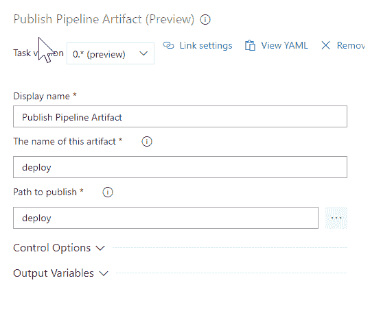](https://res.cloudinary.com/practicaldev/image/fetch/s--woKycTxK--/c_limit%2Cf_auto%2Cfl_progressive%2Cq_auto%2Cw_880/https://cdn-images-1.medium.com/max/720/1%2AYB618oVXL87EWB0mhHHbmA.png)

最后，我们将管道制品部署到 Azure Web 应用程序中

[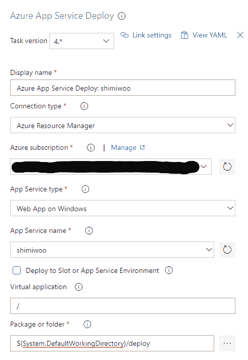](https://res.cloudinary.com/practicaldev/image/fetch/s--FerbeTN7--/c_limit%2Cf_auto%2Cfl_progressive%2Cq_auto%2Cw_880/https://cdn-images-1.medium.com/max/720/1%2AEejHAy2wxKMML38WGZl59w.png)

完成所有这些之后，我们就可以对构建进行排队，并确认一切正常。

* * *

## 故障排除

我们已经成功地构建了项目，并转到我们的 Azure Web 应用程序，浏览并看到以下内容

[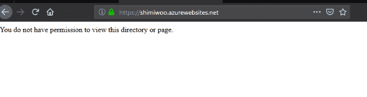](https://res.cloudinary.com/practicaldev/image/fetch/s--tZvE4VX_--/c_limit%2Cf_auto%2Cfl_progressive%2Cq_auto%2Cw_880/https://cdn-images-1.medium.com/max/720/1%2AY5NzhuG3_cSzR_9Gm5rqEA.png)

转到控制台上的 browse，我尝试手动运行节点项目，并看到以下错误消息:

[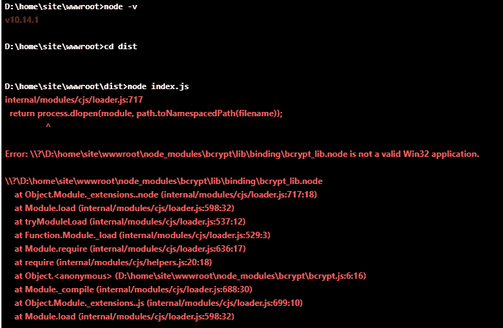](https://res.cloudinary.com/practicaldev/image/fetch/s--iaHj9NXu--/c_limit%2Cf_auto%2Cfl_progressive%2Cq_auto%2Cw_880/https://cdn-images-1.medium.com/max/720/1%2AOuRPypxEGu-XeeusdZ5xKQ.png)

原来 Azure web apps 不支持 64 而是 node。这里有变通办法——你可以部署一个容器，或者你可以按照 MSDN 论坛上的建议，部署你自己版本的节点。

在我们的项目中，创建一个名为 bin 的新文件夹，并将 node.exe 复制到那里

[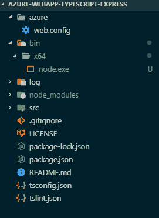](https://res.cloudinary.com/practicaldev/image/fetch/s--Eogo9VBp--/c_limit%2Cf_auto%2Cfl_progressive%2Cq_auto%2Cw_880/https://cdn-images-1.medium.com/max/720/1%2A7ifeBrJ0uxjzCctvh5LpAA.png)

接下来，我们需要确保项目将使用正确版本的 node 运行。为此，我们需要更新 web.config

```
 <?xml version="1.0" encoding="utf-8"?>
<configuration>
    <system.webServer>
        <webSocket enabled="false" />
        <handlers>
            <add name="iisnode" path="index.js" verb="*" modules="iisnode" />
        </handlers>
        <iisnode nodeProcessCommandLine="d:\home\site\wwwroot\bin\x64\node.exe"/>
<rewrite>
          <rules>
            <rule name="NodeInspector" patternSyntax="ECMAScript" stopProcessing="true">
              <match url="^index.js\/debug[\/]?" />
            </rule>
            <rule name="StaticContent">
              <action type="Rewrite" url="public{REQUEST_URI}"/>
            </rule>
            <rule name="DynamicContent">
              <conditions>
                <add input="{REQUEST_FILENAME}" matchType="IsFile" negate="True"/>
              </conditions>
              <action type="Rewrite" url="index.js"/>
            </rule>
          </rules>
        </rewrite>
        <security>
          <requestFiltering>
            <hiddenSegments>
               <remove segment="bin"/>
            </hiddenSegments>
         </requestFiltering>
        </security>
        <httpErrors existingResponse="PassThrough" />
    </system.webServer>
</configuration> 
```

提交这些更改，然后重新运行 DevOps 构建管道。

[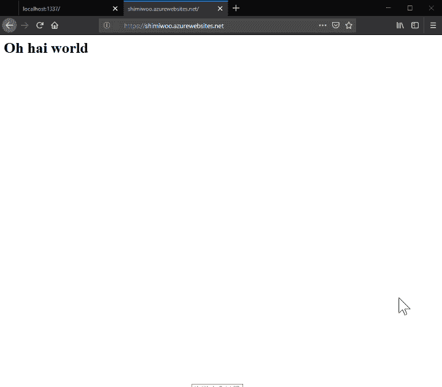](https://res.cloudinary.com/practicaldev/image/fetch/s--rWu2ASbK--/c_limit%2Cf_auto%2Cfl_progressive%2Cq_auto%2Cw_880/https://cdn-images-1.medium.com/max/720/1%2AoRTygjezVqjADf-w07x4Hw.png)

* * *

第一次玩——哦，我的天，真是一派胡言。问题主要在于，在很多地方，答案并不只有一个位置，而是有四个或固定的位置。最后，如果 Azure Web App 支持 64 位节点，那么许多 faff 将被删除——肯定会有人要求这样做:

[https://github . com/Azure/app-service-announcements/issues/22](https://github.com/Azure/app-service-announcements/issues/22)

[https://social . msdn . Microsoft . com/Forums/SQL server/en-US/871 cc7c 7-2917-4c 96-b98d-f1e 488937 b43/azure-website-nodejs-donts-run-64 位？forum = windowsazurewebsitespreview](https://social.msdn.microsoft.com/Forums/sqlserver/en-US/871cc7c7-2917-4c96-b98d-f1e488937b43/azure-website-nodejs-doesnt-run-64-bit?forum=windowsazurewebsitespreview)

最后，我希望这能帮助下一个寻找答案的人。

* * *

在 Twitter([https://twitter.com/driverlane_au](https://twitter.com/driverlane_au))和 LinkedIn([https://www.linkedin.com/company/driver-lane/](https://www.linkedin.com/company/driver-lane/))上与 Driver Lane 联系，或者直接在我们的网站([https://www.driverlane.com.au/](https://www.driverlane.com.au/))上联系。