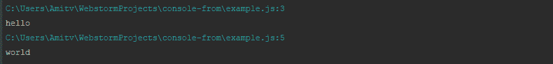

# NodeJS-使用控制台表单查找您的控制台日志

> 原文：<https://dev.to/amit221/nodejs-finding-your-console-logs-with-console-form-2j2i>

作为一名 javascript 开发人员，您可能会经常使用 console.log 或 console.error，这是调试速度最快的方法，也是您开始使用 javascript 时首先要学习的事情之一。

但是，当你为了调试而不得不在不同的地方做许多控制台，或者你有一个包含许多控制台的大应用程序，而你想删除其中一些控制台时，会发生什么呢？

这就是[控制台——来自](https://www.npmjs.com/package/console-from)的设计目的。你只需要在你的应用程序开始时使用它，从现在开始你所有的控制台都会显示你的位置

