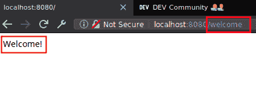

# node.js 如何向我们的 express 服务器添加路由

> 原文：<https://dev.to/miku86/nodejs-how-to-add-routes-to-our-express-server-5fbd>

## [T1】简介](#intro)

所以我们[在我们的机器上安装了 NodeJS](https://dev.to/miku86/what-is-nodejs-how-to-install-it-1900) 。

我们还学习了如何使用 express 创建一个简单的服务器。

现在，我们想了解如何向我们的 express 服务器添加路线。

## 重用我们简单的服务器来自[上一篇文章](https://dev.to/miku86/nodejs-how-to-create-a-simple-server-using-express-1n9d)

*   打开你的终端
*   创建一个名为`index.js`的文件:

```
touch index.js 
```

Enter fullscreen mode Exit fullscreen mode

*   将这段 JavaScript 代码添加到其中:

```
const express = require('express');
const app = express();

const PORT = 8080;

app.get('/', (request, response) => {
  response.send('Hello World');
});

app.listen(PORT, () => {
  console.log(`Server running at: http://localhost:${PORT}/`);
}); 
```

Enter fullscreen mode Exit fullscreen mode

**注**:这是我们的起点，我们有一条工作路线。
我更新了`req`到`request` & `res`到`response`以增加可读性。

* * *

## 基本路由

什么是路由？

每次客户端(例如用户的浏览器)请求应用程序的端点时，服务器都必须做出响应。

客户端发送特定的 [HTTP 请求方法](https://developer.mozilla.org/en-US/docs/Web/HTTP/Methods)，例如`GET`，以及路径，例如`/`。

为了响应这个请求，我们的 express 应用程序需要知道如何响应。

上面的例子:

```
app.get('/', (request, response) => {
  response.send('Hello World');
}); 
```

Enter fullscreen mode Exit fullscreen mode

当我们的快递 app 得到一个`get` - `request`到`/`的时候，`send`就是一个`Hello World`的`response`。

我们可以立即看到所有相关的单词。

express 中的每个路由都有相同的语法:

```
app.METHOD(PATH, HANDLER) 
```

Enter fullscreen mode Exit fullscreen mode

*   方法:客户端发送了哪个 [HTTP 请求方法](https://developer.mozilla.org/en-US/docs/Web/HTTP/Methods)？(如`GET`)
*   路径:客户端请求哪条路径？(如`/`、`/account`、`/dashboard`)
*   处理程序:应用程序应该如何响应请求？(例如，发回数据、重定向、记录某些内容)

## 添加新路线

*   为`get`请求添加到`/welcome`的新路线:

```
const express = require('express');
const app = express();

const PORT = 8080;

app.get('/', (request, response) => {
  response.send('Hello World');
});

app.get('/welcome', (request, response) => {
  response.send('Welcome!');
});

app.listen(PORT, () => {
  console.log(`Server running at: http://localhost:${PORT}/`);
}); 
```

Enter fullscreen mode Exit fullscreen mode

## 从终端运行它

*   运行它:

```
node index.js 
```

Enter fullscreen mode Exit fullscreen mode

*   控制台结果:

```
Server running at: http://localhost:8080/ 
```

Enter fullscreen mode Exit fullscreen mode

访问:[http://localhost:8080/welcome](http://localhost:8080/welcome)

*   客户端结果:

[](https://res.cloudinary.com/practicaldev/image/fetch/s--Q_SRFgYN--/c_limit%2Cf_auto%2Cfl_progressive%2Cq_auto%2Cw_880/https://thepracticaldev.s3.amazonaws.com/i/b289efi4ujff75tzdbb5.png)

* * *

## 进一步阅读

*   [快递](https://www.npmjs.com/package/express)
*   [基本路由](https://expressjs.com/en/starter/basic-routing.html)
*   [高级路由](https://expressjs.com/en/guide/routing.html)
*   [HTTP 请求方法](https://developer.mozilla.org/en-US/docs/Web/HTTP/Methods)

* * *

## 你的任务

*   创建一个基本路由，处理对`/dashboard`、`responds`和`This is your dashboard`的`GET`请求
*   如果你想得到一些反馈，我邀请你在评论(初学者)或 Github(高级)上分享你的代码