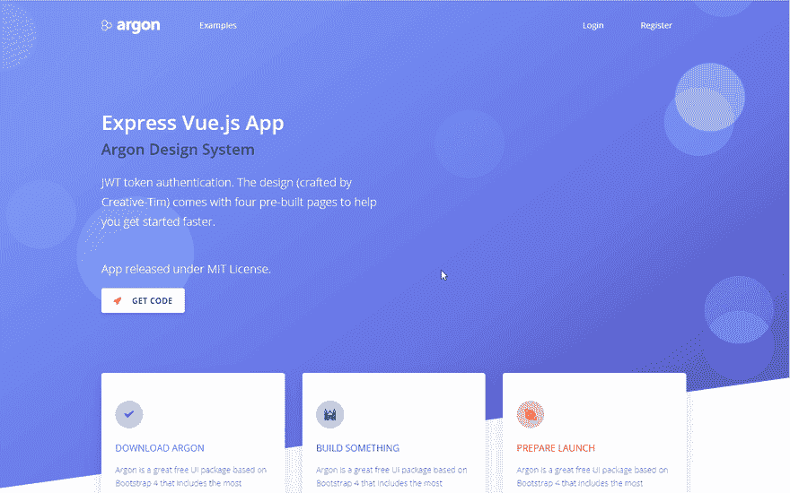

# Nodejs 启动器-全堆叠 Vue 氩气设计

> 原文：<https://dev.to/sm0ke/nodejs-starter-full-stack-vue-argon-design-13bj>

各位编码员好，

在本文中，我将展示我用来交付简单应用程序的 **[Nodejs starter](https://appseed.us/boilerplate-code/nodejs-starter)** ，大部分是单页的，用 **Vue** 编码。这里描述的 Javascript **[样板代码](https://appseed.us/boilerplate-code)** 并不复杂，但它帮助我几次实现了新项目设置阶段的自动化。

> *感谢阅读！* -内容由 **[App 生成器](https://appseed.us/)** 提供。

* * *

## 从源代码构建

**[Nodejs Starter](https://appseed.us/boilerplate-code/nodejs-starter)** 使用解耦架构构建，其中 **Vue Argon Design** 前端通过安全 ajax 调用与 **Nodejs** / Express 后端通信。

要使用和启动该启动器，必须遵循几个简单的步骤:

*   克隆、构建并启动 **[Nodejs Starter](https://appseed.us/boilerplate-code/nodejs-starter)** 后端
*   克隆、构建并启动 **[Vue 氩设计](https://appseed.us/apps/vuejs/express/argon-design-system-creative-tim)** 前端

```
$ #############################
$ # clone and build the backend

$ git clone https://github.com/app-generator/nodejs-starter.git
$ cd nodejs-starter
$ yarn
$ yarn start # backend runs on port 3000

$ #############################
$ # clone and build the Vue Frontend

$ git clone https://github.com/app-generator/vuejs-argon-design-system.git
$ cd vuejs-argon-design-system
$ yarn
$ yarn start # Frontend runs on port 8080 
```

Enter fullscreen mode Exit fullscreen mode

* * *

## [Nodejs 起动机](https://appseed.us/boilerplate-code/nodejs-starter)特点

为了提供一些有用的东西，starter 有一个最小的特性集，比如身份验证、干净的设计和许可的许可证。

*   [Nodejs](https://nodejs.org/en/) /快递后端
*   [SQLite](https://www.sqlite.org/index.html) 数据库，由 [Sequelize](http://docs.sequelizejs.com/) ORM 管理。提供了一个简单的用户选项卡。
*   [JWT](https://jwt.io/introduction/) 令牌认证
*   [Vue Argon 设计](https://github.com/app-generator/vuejs-argon-design-system)由著名创意机构 Tim 制作。
*   登录和注册功能

* * *

## [视图氩气设计](https://appseed.us/apps/vuejs/express/argon-design-system-creative-tim)前端

这个入门是一个简单的登录页面，增强了登录和注册功能。使用 [Argon 设计系统](https://www.creative-tim.com/product/vue-argon-design-system?ref=appseed)提供的 UI 元素，app 可以轻松扩展和定制。

[](https://res.cloudinary.com/practicaldev/image/fetch/s--Cy3bLmqF--/c_limit%2Cf_auto%2Cfl_progressive%2Cq_66%2Cw_880/https://github.com/app-generator/static/blob/master/starters/nodejs-starter-full-stack-vue-argon-design-intro.gif%3Fraw%3Dtrue)

* * *

## 启动器链接

*   [Nodejs 后端](https://appseed.us/boilerplate-code/nodejs-starter)来源
*   [Vue 氩气设计](https://appseed.us/apps/vuejs/express/argon-design-system-creative-tim)来源
*   [nodejs/vista 氩气设计演示](https://express-vuejs-argon-design.appseed.us/#/)
*   [Express Vuejs - Argon 设计](https://github.com/app-generator/fullstack-express-vuejs-argon-design) -如何从源代码构建(完整信息)

* * *

我将根据大家的反应和评论，用新的信息更新这篇文章。有时，使用来自可信来源的样板文件可以帮助您节省一些宝贵的时间，并加快一点开发速度。

* * *

## 其他节点启动器

*   [Nodejs 启动黑客马拉松](https://github.com/sahat/hackathon-starter)
*   nodejs starter API kit
*   [Nodejs 无服务器启动器](https://github.com/AnomalyInnovations/serverless-nodejs-starter)
*   [Nodejs 启动器-反应材料包](https://dev.to/sm0ke/nodejs-starter-full-stack-material-kit-react-3i17)

* * *

## 相关文章

*   [样板代码-开源启动器](https://blog.appseed.us/boilerplate-code-open-source-starters/)
*   [Nodejs Starter -开源样板代码](https://blog.appseed.us/nodejs-starter-open-source-boilerplate-code/)
*   [Nodejs 启动器](https://appseed.us/boilerplate-code/nodejs-starter)—**app seed**提供
*   启动器和[样板代码](https://appseed.us/boilerplate-code) -由 **AppSeed** 提供

* * *

> 谢谢大家！