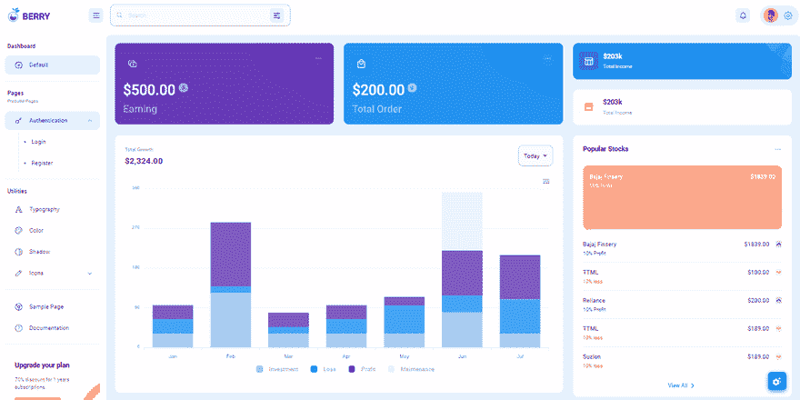

# Node JS Starter -快速启动的 Javascript 样板

> 原文：<https://dev.to/sm0ke/nodejs-starter-javascript-boilerplates-to-start-fast-1024>

各位编码员好，

通常，当我们开始一个新项目时，代码库往往会在不同的项目中一遍又一遍地重复。不要重新发明轮子，一直使用一个初学者工具包可能是一个好的解决方案，已经配备了一些基本的工具和功能。本文根据一些必要的特征，提出了一份适合生产使用的**节点 JS 启动器**的候选名单:

*   遵循适当编码标准的✅干净代码结构
*   ✅记录并积极支持
*   ✅最低验证(Github 星级，下载数量)
*   在许可许可下发布的✅开源软件(麻省理工学院，LGPL)

* * *

## [反应柔和的仪表盘](https://appseed.us/product/soft-ui-dashboard/api-server-nodejs/react/) `fullstack`

用一个创新的管理模板为 **Material-UI** 和 **React** 开始你的开发。[软 UI Dashboard React](https://appseed.us/product/soft-ui-dashboard/api-server-nodejs/react/) 由 70 多个前端独立元素组成，如按钮、输入、导航条、导航标签、卡片或提醒，让您自由选择和组合。该产品附带了一个简单的 JWT 认证流程:登录/注册/注销。

> 🚀内置有 **[React App 生成器](https://appseed.us/generator/react/)**

*   ✅创新**软 UI 设计** -由[创意制作-Tim](https://bit.ly/3fKQZaL)
*   ✅反应，还原，还原-坚持
*   ✅认证:`JWT Tokens`，
*   ✅ `OAuth` via GitHub
*   ✅全栈就绪使用:
    *   [节点 API](https://github.com/app-generator/api-server-nodejs) `free product`
    *   [节点 API Mongo](https://github.com/app-generator/api-server-nodejs) `free product`

[](https://res.cloudinary.com/practicaldev/image/fetch/s--uyL8oAFp--/c_limit%2Cf_auto%2Cfl_progressive%2Cq_auto%2Cw_880/https://user-images.githubusercontent.com/51070104/176936814-74386559-4e05-43d5-b9a4-8f70ce96a610.png)

* * *

## [反应纯度仪表盘](https://appseed.us/product/purity-dashboard/api-server-nodejs/react/) `fullstack`

从一个创新的管理模板开始你的开发，该模板用于 **Chakra UI** 和 **React** 。 [Purity UI Dashboard](https://appseed.us/product/purity-dashboard/api-server-nodejs/react/) 内置超过 70 个前端独立元素，如按钮、输入、导航条、导航标签、卡片或提醒，让你自由选择和组合。

> 🚀内置有 **[React App 生成器](https://appseed.us/generator/react/)**

*   ✅创新脉轮用户界面设计-由[创意-蒂姆](https://bit.ly/3fKQZaL)创造
*   ✅反应，还原，还原-坚持
*   ✅认证:JWT 登录/注册/注销
*   ✅全栈准备使用 **[节点 JS API 服务器](https://github.com/app-generator/api-server-nodejs)** (开源项目)
    *   功能:Typescript / SQLite / TypeORM / Joy(验证)/ Passport 库- `passport-jwt`策略。

[](https://res.cloudinary.com/practicaldev/image/fetch/s--fa7TGsgs--/c_limit%2Cf_auto%2Cfl_progressive%2Cq_auto%2Cw_880/https://user-images.githubusercontent.com/51070104/205427640-007904ec-9cd5-4060-86c6-47675b36cda1.png)

* * *

## [反应节点数据表](https://appseed.us/product/datta-able/api-server-nodejs/react/)

**达塔·艾伯**是一个开源的 **[反应仪表盘](https://dev.to/sm0ke/react-dashboards-open-source-apps-1c7j)** 提供了丰富多彩的现代设计。达塔能够反应免费是最具风格的反应免费管理模板，在市场上所有其他管理模板。它带有功能丰富的页面和组件，代码完全以开发人员为中心。该产品附带了一个简单的 JWT 认证流程:登录/注册/注销。

*   👉[反应节点 JS 达塔表](https://appseed.us/product/datta-able/api-server-nodejs/react/) -产品页面
*   👉[反应节点 JS 达塔能力](https://react-node-js-datta-able.appseed-srv1.com/) -现场演示

* * *

[](https://res.cloudinary.com/practicaldev/image/fetch/s--QyeZW4ky--/c_limit%2Cf_auto%2Cfl_progressive%2Cq_auto%2Cw_880/https://dev-to-uploads.s3.amazonaws.com/uploads/articles/jm2f5yz98wjkunki5nud.png)

* * *

## ✨ [做出反应节点 JS 贝里](https://appseed.us/product/berry-dashboard/api-server-nodejs/react/)

**Berry** 是一款有创意的免费 **[React 仪表盘](https://dev.to/sm0ke/react-dashboards-open-source-apps-1c7j)** 由 **CodedThemes** agency 使用 Material-UI 打造。它旨在通过高度可定制的功能丰富的页面提供最佳用户体验。它是一个完全改变游戏规则的 React 仪表盘模板，具有简单直观的响应设计，就像在 retina 屏幕或笔记本电脑上一样。该产品附带了一个简单的 JWT 认证流程:登录/注册/注销。

*   👉 [React Node JS Berry](https://appseed.us/product/berry-dashboard/api-server-nodejs/react/) -产品页面
*   👉 [React Node JS Berry](https://react-node-js-berry-dashboard.appseed-srv1.com/) -现场演示

[](https://res.cloudinary.com/practicaldev/image/fetch/s--Mgt4r6cn--/c_limit%2Cf_auto%2Cfl_progressive%2Cq_66%2Cw_880/https://dev-to-uploads.s3.amazonaws.com/uploads/articles/q5yln9ldi2amwtyzc1il.gif)

* * *

## [nodejs API server](https://appseed.us/boilerplate-code/nodejs-starter/)

使用 JWT 认证和 MongoDB 构建的简单 Express/Nodejs Starter。身份验证基于 json web 令牌。`passport-jwt`策略用于处理电子邮件/密码认证。成功登录后，生成的令牌被发送给请求者。

* * *

> **[Nodejs API 服务器](https://appseed.us/boilerplate-code/nodejs-starter/) -产品页面**(包含文档&来源)

* * *

[](https://res.cloudinary.com/practicaldev/image/fetch/s--ImXDFuzu--/c_limit%2Cf_auto%2Cfl_progressive%2Cq_auto%2Cw_880/https://dev-to-uploads.s3.amazonaws.com/uploads/articles/0huc4fqm6hnpovu8z9g9.png)

* * *

## ✨ [Nodejs](https://nodejs.org/en/) 首发黑客马拉松

[Nodejs Starter Hackathon](https://github.com/sahat/hackathon-starter) 是一个在 Github 上拥有 26k+星级的项目，配备了许多有用的功能，例如:

*   MVC 结构
*   身份验证:本地(用户/通过)，OAuth (1.0，2.0)
*   SaaS 样式表，Bootstrap4 集成
*   由 Mailgun 和 Sendgrid 支持的表单
*   Paypal、Twitter 和 LinkedIn 的集成

对于初学者来说，这种入门可能会让人不知所措，但是通过阅读文档和与项目社区互动，这一事实可以很容易地得到补偿。

[](https://res.cloudinary.com/practicaldev/image/fetch/s--gmqgmcLa--/c_limit%2Cf_auto%2Cfl_progressive%2Cq_auto%2Cw_880/https://github.com/app-generator/static/blob/master/starters/nodejs-starter-hackathon.jpg%3Fraw%3Dtrue)

*   [Nodejs Starter 黑客马拉松](https://github.com/sahat/hackathon-starter) -源代码
*   [Nodejs Starter 黑客马拉松演示](https://hackathon-starter-2018.herokuapp.com/)

* * *

## [nodejs](https://nodejs.org/en/)starter API kit

[Nodejs Starter API Kit](https://github.com/kriasoft/nodejs-api-starter) 是用 Node.js 和 GraphQL 创作数据 API 后端的样板文件。Github starts 超过 2.8k，如果您未来的项目用 GraphQL 替换旧的 school REST API，那么这个样板文件肯定是赢家。特点:

*   Common Node.js 堆栈:Express、Passport、Session、Cors
*   PostgresSQL 作为 DMBS，随着 Redis
*   本地化和翻译
*   节点邮件程序，手柄模板
*   部署:通过 Docker

> 启动链接

*   [Nodejs Starter API 工具包来源](https://github.com/kriasoft/nodejs-api-starter)
*   麻省理工的执照。由 **Kriasoft** 支持

* * *

## ✨ RESTful API 节点服务器

一个样板/入门项目，用于使用 Node.js、Express 和 Mongoose 快速构建 RESTful APIs。

*   ES9:最新的 ECMAScript 功能
*   NoSQL 数据库:使用 Mongoose 的 MongoDB 对象数据建模
*   身份验证和授权:使用 passport
*   验证:使用 Joi 请求数据验证

* * *

*   [RESTful API 节点服务器样板文件](https://github.com/hagopj13/node-express-boilerplate)

* * *

## ✨ [Nodejs](https://nodejs.org/en/) 启动器无服务器

[Nodejs Starter 无服务器](https://github.com/AnomalyInnovations/serverless-nodejs-starter)是一个 Node.js **启动器**用于无服务器框架，支持异步/等待和单元测试。该项目得到了拥有 450 位 Github 明星的 [Frank Wang](https://twitter.com/fanjiewang) 的积极支持。这个 starter 引起我的注意主要是因为无服务器的概念，这是当今 web 开发中的一个新兴概念。特点:

*   集成无服务器 webpack 插件
*   处理程序函数中的 ES7 语法
*   支持单元测试(通过 Jtest)

[Nodejs Starter server less Live sample](https://z6pv80ao4l.execute-api.us-east-1.amazonaws.com/dev/hello)托管在 AWS 上，当我们点击链接时执行的代码示例:

```
export const hello = async (event, context) => {
  return {
    statusCode: 200,
    body: JSON.stringify({
      message: `Go Serverless v1.0! ${(await message({ time: 1, copy: 'Your function executed successfully!'}))}`,
      input: event,
    }),
  };
};

const message = ({ time, ...rest }) => new Promise((resolve, reject) =>
  setTimeout(() => {
    resolve(`${rest.copy} (with a delay)`);
  }, time * 1000)
); 
```

Enter fullscreen mode Exit fullscreen mode

要用这个 **Nodejs 启动器**开始玩，下面是有要求的列表:

*   [无服务器框架](https://serverless.com/framework/docs/providers/aws/guide/installation/)
*   [AWS CLI](https://serverless.com/framework/docs/providers/aws/guide/credentials/)

* * *

## ✨[nodejs](https://nodejs.org/en/)starter express 引导程序

[Nodejs Starter Express Bootstrap](https://github.com/hengkiardo/express4-bootstrap-starter)是一个轻量级的 Bootstrap NodeJS 样板文件，使用 ExpressJS 4、MongoDB/mongose 构建，使用 Passport.js、Jade 和 GruntJS 作为任务自动化进行认证。

该应用程序组织良好，并由一名自由职业者积极支持。Heroku 上托管的演示链接似乎已经死了。该应用可以(至少)在 Windows10 和 Ubuntu 18.04 上成功构建。

> 不是这里生产就绪 **Nodejs 首发**你知道吗？请在评论中建议。

* * *

> **感谢阅读！**如需更多资源，请随时访问:

*   ✨更多[免费仪表盘](https://appseed.us/admin-dashboards/open-source)在 Django 制作，Flask 和 [React](https://appseed.us/apps/react)
*   ✨更多[管理仪表板](https://www.admin-dashboards.com/) -一个巨大的产品索引