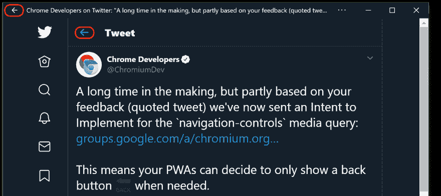

# 并非一切都是虚无——了解浏览器是否支持给定的媒体查询

> 原文：<https://dev.to/tomayac/not-all-is-nothing-finding-out-if-the-browser-supports-a-given-media-query-3an>

在谷歌 Chrome 团队，我们正在努力解决一个有趣的问题，即当用户导航到独立或全屏渐进式网络应用程序(PWA)时，Windows 10 等一些平台会在应用程序窗口的标题栏中显示一个原生 *←后退*按钮。这可能会导致 PWAs 无意中显示两种应用内导航方式:一种来自操作系统，一种来自应用本身。下面来自 Twitter 的 PWA 的截图很好地说明了这个问题。两个后退按钮以红色突出显示，窗口生成的按钮在标题栏中。

[](https://res.cloudinary.com/practicaldev/image/fetch/s--ybYvZvdN--/c_limit%2Cf_auto%2Cfl_progressive%2Cq_auto%2Cw_880/https://blog.tomayac.cimg/twitter-double-back-button.png)

为了让 PWAs 能够检测系统级导航控件的存在与否，我们提出了一个新的、名副其实的 CSS 媒体查询`navigation-controls`。[讲解者](https://github.com/fallaciousreasoning/backbutton-mediaquery/blob/master/explainer.md#css)详细介绍了这个媒体查询是如何工作的，但是最基本的使用方法可以在下面的代码示例中看到。

```
/**
 * Hide the app's own back button if the browser or the OS
 * provides any navigation controls.
 */
@media (navigation-controls) {
  #back-button {
    display: none;
  }
} 
```

这就引出了一个有趣的问题:开发人员如何通过 JavaScript 发现浏览器是否支持和理解媒体查询。请注意， [`@supports` CSS at-rule](https://developer.mozilla.org/en-US/docs/Web/CSS/@supports) 不能用于检测媒体查询支持。在我们深入这个问题之前，让我们先定义一些东西。

#### 媒体类型

[媒体类型](https://developer.mozilla.org/en-US/docs/Web/CSS/Media_Queries/Using_media_queries#Media_types)描述了设备的一般类别。一些例子是`print`、`screen`、`speech`，或者只是默认的媒体类型`all`。

#### 媒体特性

[媒体特征](https://developer.mozilla.org/en-US/docs/Web/CSS/Media_Queries/Using_media_queries#Media_features)描述用户代理、输出设备或环境的具体特征。媒体特征表达式测试它们的存在或价值。例子有`prefers-color-scheme`、`hover`等等。媒体功能表达式必须始终用括号括起来。

我们举一个类似`(max-width: 600px)`的媒体特征表达。从 JavaScript 上下文中，您可以测试它是否匹配，如下所示。

```
window.matchMedia('(max-width: 600px)').matches;
// Returns either `true` or `false`. 
```

一些媒体特征在[布尔上下文](https://drafts.csswg.org/mediaqueries-5/#boolean-context)中进行评估。这意味着，如果特征对于除了数字`0`、具有值`0`的`<dimension>`、关键字`none`或者由该媒体特征明确定义的在布尔上下文中评估为假的值之外的任何值为真，则媒体特征评估为真。这通常是像接受两个值`none`和`hover`的`hover`这样的特性的一个方便的简写。通常你并不介意`none`的值，而是想确保你只使用悬停事件，如果用户代理有某种类似鼠标的可悬停设备的话。在这种情况下，您可以简单地测试一下`@media (hover) { … }`。

#### 测试浏览器是否理解媒体查询

[`window.matchMedia()`](https://developer.mozilla.org/en-US/docs/Web/API/Window/matchMedia) 方法返回一个 [`MediaQueryList`](https://developer.mozilla.org/en-US/docs/Web/API/MediaQueryList) ，其 [`media`](https://developer.mozilla.org/en-US/docs/Web/API/MediaQueryList/media) 只读属性是一个表示序列化媒体查询的`DOMString`。这实际上意味着我们可以用它来规范化媒体查询表达式字符串。

```
// Note the superfluous spaces and the '+' before the width
window.matchMedia('( max-width: +600px)').media;
// Returns `"(max-width: 600px)"`. 
```

新提议的媒体特征`navigation-controls`——除了`back`——将`none`作为其允许的关键词之一，并在布尔上下文中进行评估。综上所述，我们可以通过查看`media`属性来检查浏览器是否理解它。

```
window.matchMedia('(navigation-controls)').media;
// Returns `"not all"` when the browser doesn't understand
// the media query, or `"(navigation-controls)"` else. 
```

这里有趣的值是`"not all"`，意思是浏览器不理解媒体特性。如果浏览器没有丝毫线索`navigation-controls`是关于什么的，它会告诉你这个(未知)媒体特征的系列化是永远不会匹配的:媒体*类型* `@media not all`。因为`not all`是[没什么](https://en.wikipedia.org/wiki/Nothing)。