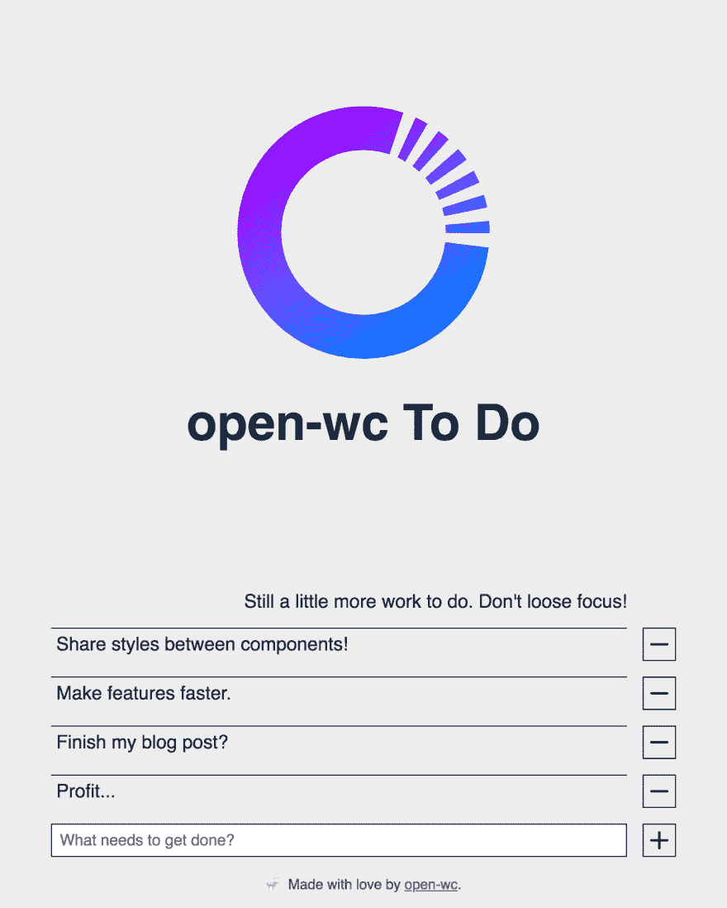

# 不是另一个待办事项应用程序:第 8 部分

> 原文：<https://dev.to/westbrook/not-another-to-do-app-part-8-3lic>

#### 用 Open Web 组件推荐弄脏你的手和脚...算是吧。

> *这是 2019 年 2 月 26 日来自 [Medium](https://medium.com/@westbrook/not-another-to-do-app-169c14bb7ef9) 的一篇文章的交叉帖子，利用了我最近决定在我的写作中使用语法的优势(因此，在这里和那里做了一些小编辑)，如果你在那里看到它，感谢再次查看🙇🏽‍♂️:如果这是你第一次阅读，欢迎！*

*欢迎来到“不要再做一个应用程序”，这是一篇冗长的综述，讲述了每个开发人员在某个时候都会编写的最小的应用程序之一。如果你是来学习编写应用程序的特定技术的，或者是从以前的安装中走出来的，那么你可能来对地方了，应该继续读下去！如果没有，你可能想[从头开始](https://dev.to/westbrook/not-another-to-do-app-2kj9)，这样你也可以知道[我们所有角色的背景故事...](https://github.com/Westbrook/to-do-app)*

如果你已经做到了这一步，为什么现在就放弃呢？

* * *

# 尽早、经常、只在需要时把事情分开

<figure>

[](https://res.cloudinary.com/practicaldev/image/fetch/s--XbS9o68d--/c_limit%2Cf_auto%2Cfl_progressive%2Cq_auto%2Cw_880/https://thepracticaldev.s3.amazonaws.com/i/eqad0vgbanljkz4r0s2c.jpeg)

<figcaption>Photo by [Simon Rae](https://unsplash.com/@simonrae) on [Unsplash](https://unsplash.com/)</figcaption>

</figure>

有时候一点点距离是件好事。

多亏了 ES 模块，很容易在你的代码库中增加额外的距离，以至于你也很容易在你的代码库中增加过多的距离。当你的代码中有太多的距离时，很难理解事情是如何、在哪里或为什么发生的，但是当你有足够的距离时，你可以不受手头任务无关紧要的问题的影响。这个故事最好在我的待办应用程序代码中讲述，通过我在组件中包含样式的两个主要方法。

对于上下文，让我们确保每个人对`LitElement`的 [`static styles`属性](https://lit-element.polymer-project.org/guide/styles#static-styles)都是最新的。在这里，我们能够将一个数组`CSSResults`传递给我们的元素，该元素将被准备为[可构造样式表对象](https://developers.google.com/web/updates/2019/02/constructable-stylesheets)，以便在可用时被我们的自定义元素采用，或者在该 API 不可用的上下文中作为`<style/>`元素传递给 shadow DOM，或者甚至根据需要通过 ShadyCSSS polyfill 传递。这意味着，您不是让自定义元素的每个实例接收自己的 CSS 规则副本，然后依靠浏览器尝试并决定何时在内部对它们进行重复数据删除，而是明确地告诉浏览器这组规则将应用于多个实例；跳过试探法，更快地了解重复数据删除的优势。这些好处包括最终用户的启动时间更快，不仅仅是因为页面上需要解析的 CSS 更少，开发人员的调试过程更容易，因为用开发工具编辑一个元素的样式会影响它的所有实例，等等。由于可构造样式表是一个相当新的 API，许多好处仍在积极研究中。

为了利用这些功能，并关注直接包含在自定义元素的类中的代码，我通常直接从将我的样式与我的函数/模板代码分开开始。这将类似于:

```
// custom-element-styles.js

import { css } from 'lit-element';

export const styles = css`
    :host {
        /* Styles for my custom element... */
    }
    /* Styles for the remaining content of its Shadow DOM... */
`;

// custom-element.js

import { styles } from './custom-element-styles.js';

// ...

static get styles() {
    return [
        styles,
    ];
} 
```

Enter fullscreen mode Exit fullscreen mode

open-wc 的 Starter 应用程序生成的代码没有做到这一点。默认情况下，它是直接生成`static styles` getter 轮廓样式，一个 la:

```
static get styles() {
    return [
        css`
            :host {
                /* Styles for my custom element... */
            }

            /* Styles for the remaining content of its Shadow DOM */
        `,
    ];
} 
```

Enter fullscreen mode Exit fullscreen mode

这确实意味着当我在一个组件中有大量的样式时，我要做一些手工工作来分离这些样式，如上所述。然而，这也意味着在只有几行 CSS 代码的情况下，我的组件占用的文件空间更小。(没有添加文件来确保`:host { display: block; }`成为一个元素。)更重要的是，在某些情况下，我可能没有完全考虑过我的风格的构成可能性，但我得到了一个额外的接触点来这样做。这件事发生在 [`src/to-do.js`](https://github.com/Westbrook/to-do-app/blob/master/src/to-do.js) 谁的`static styles`消气长得像下面:

```
import { toDoButton } from './shared-styles.js';

// ...

static get styles() {
    return [
        css`
            :host {
                display: block;
            }
            div {
                border-top: 1px solid;
                padding-left: 5px;
                white-space: pre-wrap;
            }
        `,
        toDoButton,
    ];
} 
```

Enter fullscreen mode Exit fullscreen mode

是的， [`toDoButton`](https://github.com/Westbrook/to-do-app/blob/master/src/shared-styles.js#L24) 导入是在多个组件之间共享的样式表。我最终选择不将特定于`to-do`元素的样式分离到它们自己的文件中，但是将`toDoButton`样式这样分离允许它们在`to-do`和`to-do-write`元素之间共享，其效果可以在下面看到:

<figure>

[](https://res.cloudinary.com/practicaldev/image/fetch/s--yIxQSGxt--/c_limit%2Cf_auto%2Cfl_progressive%2Cq_auto%2Cw_880/https://thepracticaldev.s3.amazonaws.com/i/w8mrx0kt5tgeplosa1fn.png)

<figcaption>Those buttons certainly look the same, right?</figcaption>

</figure>

同样的概念可以更进一步，不仅共享整个表，还共享单个元素的特定规则列表。 [`src/shared-styles.js`](https://github.com/Westbrook/to-do-app/blob/master/src/shared-styles.js) 列表中包含的出口有[`formElementFocus`](https://github.com/Westbrook/to-do-app/blob/master/src/shared-styles.js#L3)[`formElementHover`](https://github.com/Westbrook/to-do-app/blob/master/src/shared-styles.js#L14):

```
export const formElementFocus = css`
  outline: none;
  background-image:
    linear-gradient(
      to top,
      #0077FF 0px,
      #0077FF 2px,
      transparent 2px,
      transparent 100%
    );
`;

export const formElementHover = css`
  background-image:
    linear-gradient(
      to top,
      currentColor 0px,
      currentColor 2px,
      transparent 2px,
      transparent 100%
    );
`; 
```

Enter fullscreen mode Exit fullscreen mode

这些风格被混合到包含在`toDoButton`中的`button`规则中，也应用到`to-do-write`中的`textarea`中。`LitElement`和`lit-html`为这些技术以及更多有待充分探索的技术打开了大门。请在下面留下你是如何分离、共享和组合功能/风格/等的评论。有利于您的应用。明智地利用上面的机会和下面的评论中分享的机会来分离(或不分离)您的代码，可以在为新的目标组合功能时为您提供广泛的选择。

**专业提示:*在使用`LitElement`的`static styles` getter 时，你将依赖于浏览器(如 Chrome)中支持它的`adoptedStyleSheets` API。在 Chrome 中，有一个 bug ，以这种方式添加到自定义元素中的样式将不能在 Chrome DevTools 中直接编辑。虽然这在生产中可能被视为一个额外的好处(一般来说，在可构造样式表的一般性能好处之上)，但在开发过程中它可能是一个痛苦。如果您想在开发生命周期的任何部分获得编辑这些样式的能力，下面的代码片段会有所帮助！*T9】

```
<script>
    // @TODO: Remove this after user agent stylesheet bug is fixed
    // https://bugs.chromium.org/p/chromium/issues/detail?id=946975
    delete Document.prototype.adoptedStyleSheets;
</script> 
```

Enter fullscreen mode Exit fullscreen mode

* * *

# 短游戏

正如许多对此类话题有意见的人所投票的那样，一篇 9000 多字的文章是不行的。

> WestbrookJ@ WestbrookJ所以，我在写博文...我注意到，当我不看的时候，它变得相当长，一次完成可能有 7000 个单词。我想说我会很幸运地把它编辑下来，但是一些技巧我还在提高...我该怎么办？2019 年 2 月 20 日 12 点 22 分[](https://twitter.com/intent/tweet?in_reply_to=1098196160613896192)[](https://twitter.com/intent/retweet?tweet_id=1098196160613896192)[](https://twitter.com/intent/like?tweet_id=1098196160613896192)

所以，怀着对你最深的敬意，我亲爱的读者，我把即将到来的对话分成了微不足道的十个部分。恭喜你，你已经接近第一场比赛的尾声了！如果你到目前为止还很享受，或者是那种会给一部新的情景喜剧加几集就能让它大放异彩的人，这里有一份其他人的名单，你可以把它们放在你的网飞名单上:

*   [不是另一个待办应用](https://dev.to/westbrook/not-another-to-do-app-2kj9)
*   [入门](https://dev.to/westbrook/not-another-to-do-app-3jem)
*   [早考，常考](https://dev.to/westbrook/not-another-to-do-app-2m9a)
*   [测量两次，皮棉一次](https://dev.to/westbrook/not-another-to-do-app-part-4-58cd)
*   [使其成为组件](https://dev.to/westbrook/not-another-to-do-app-part-5-5d7o)
*   [使其成为可重复使用的零件](https://dev.to/westbrook/not-another-to-do-app-part-6-an)
*   你的组件真的需要知道这些吗？
*   尽早、经常、只在需要的时候把事情分开(你在这里)
*   [有些抽象并不(仅仅)适用于你的应用](https://dev.to/westbrook/not-another-to-do-app-part-9-10j3)
*   可重复使用和可扩展的数据管理/最终...(你现在可以开始看到结局了...不行吗？)(即将推出[开发到](https://dev.to))
*   [查看运行中的应用](https://gifted-lamport-70b774.netlify.com/)

* * *

特别感谢 [Open Web Components](https://open-wc.org/) 的团队，他们提供了大量的工具和建议，以支持不断增长的工程师和公司社区，将高质量的 Web 组件带入行业。[在 GitHub](https://github.com/open-wc/open-wc) 上访问他们，并创建一个问题，提交一份 PR，或签署一份回购协议来参与行动！