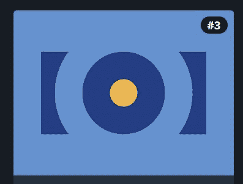

# 不完全是失败

> 原文：<https://dev.to/tuxhedoh/not-quite-a-fail-3mc2>

所以昨天我开始完成两个模块，但是没有完成第一个。不是我没有做任何工作，而是我没有时间实际完成它，尤其是因为 FCC 在中午有一次停机。在停机期间，我致力于 CSS-战。我完成了 2 和 3，并通读了 [Olzhas 的](https://dev.to/pheeria) - [CSS 战斗解决方案](https://dev.to/pheeria/css-battle-1-simply-square-c19)以了解其他人做了什么。我对如何完成一些有了新的想法，以后可能会解决它们。

没什么大不了的，连胜就在原地。今天的尝试完成了应用的可访问性，完成了响应式 Web 设计原则，并通过了 CSS Flexbox 的大部分。我想我可以得到 CSS Flexbox，但我认为与前面的部分相比，它可能有点多余。

接下来几天我担心的是这是一个长周末。我在一天的工作中，大部分任务都是在缓慢的时间里完成的。

你如何在假期和周末保持专注于你的目标？