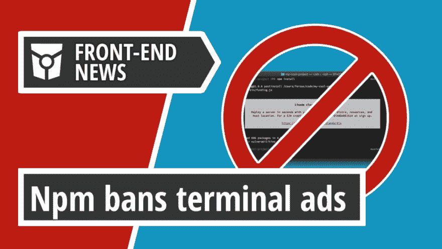
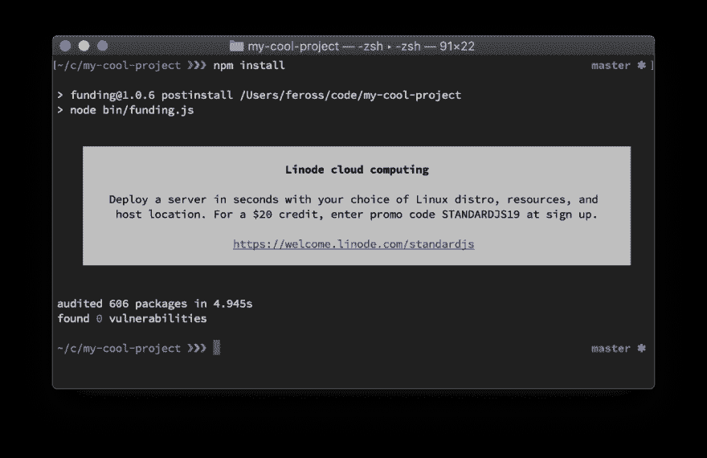
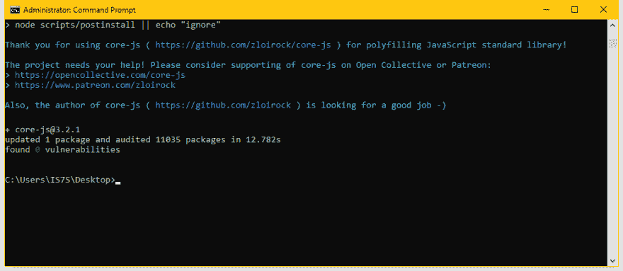

# Npm 禁止终端广告，Mozilla CEO 将于年底离职|前端新闻#16

> 原文：<https://dev.to/adriansandu/npm-bans-terminal-ads-and-mozilla-ceo-will-step-down-at-the-end-of-the-year-front-end-news-16-46mm>

大家好，欢迎收看新一轮的前端新闻。

*   主要标题是关于使用终端广告资助开源维护者的争议。
*   Mozilla CEO 将于 2019 年底卸任
*   微软宣布推出 TypeScript 3.6
*   Dojo 6 现已推出

接下来是一个比通常更大的软件更新部分，以及一个特殊的开发者周。所以请陪我到最后，找出所有的细节。

一如既往，我也为那些喜欢听而不是读的人准备了视频版本。如果你喜欢这种格式，如果你也能订阅 YouTube 频道，我将不胜感激。

[https://www.youtube.com/embed/T2E8if0umXo](https://www.youtube.com/embed/T2E8if0umXo)

### 利用终端广告资助开源维护者的争议

上周我提到了 StandardJS v14 如何包含了一个“帮助维护者获得报酬的开源实验”。这是由于 StandardJS 维护者之一 Feross 创建的一个项目`funding`。资助背后的想法是，公司购买人们终端中的广告空间，然后资助项目与签约展示广告的开源项目分享其利润。

<figure> 

<figcaption>资助后装横幅广告</figcaption>

</figure>

毫不奇怪，这一举动引起了激烈的辩论，双方都有强有力的论据。虽然绝大多数人同意开源软件和维护者需要更好的资金，但许多开发人员对这些广告并不满意，他们进入了安装日志。

从表面上看，Funding 类似于 OpenCollective，这是另一个通过 npm 终端安装后消息显示捐赠请求的项目。这在当时也引起了很多愤怒，但大多数开发人员最终接受了这种做法。

<figure>

<figcaption>open collective 后装募捐</figcaption>

</figure>

对许多人来说，在终端中拥有成熟的附加功能似乎是一个遥不可及的步骤。因此，第一个针对 npm 软件包的广告拦截器诞生了。此外，由于网上的压力，Linode，两家资助购买广告的公司之一，决定退出该项目并收回他们的广告。另一家公司 LogRocket 也默默退出。尽管两家公司都表示支持探索新的方法来帮助开源维护者。

> 利诺德@利诺德[@ vox pelli](https://twitter.com/voxpelli)[@ Daw nerd](https://twitter.com/dawnerd)我们反思了开发者社区的反应后重新考虑。我们仍然热情地支持开源软件以及 [@feross](https://twitter.com/feross) ，但是在继续创新的同时，我们会更加小心地进行未来的实验。关于那张纸条:
> 2019 年 8 月 26 日 21 点 08 分211

事情升级到 npm 公司，维护 npm 仓库的公司，决定介入的地步。在线杂志 ZDNet 报道，npm 首席技术官 Ahmad Nassri 通过电子邮件发表声明:

> 我们一直在努力改进我们的政策，并扩大我们对社区的承诺。[……]为此，我们正在更新我们的政策，更加明确地说明我们认为不可接受的商业内容类型。

根据这些即将到来的更新，国家预防机制将禁止:

*   在运行时、安装时或软件开发生命周期的其他阶段显示广告的包，例如通过 npm 脚本。
*   带有可用于显示广告的代码的包是可以的。本身显示广告的包装不是。
*   本身主要起广告作用的包，只有占位符或可忽略的代码、数据和其他技术内容。

在 Feross 宣布他将结束他的实验后，这个声明就发布了。他在博客上发表了一篇非常详细的文章，描述了整件事的起因，这些天来事件是如何展开的，以及他未来的计划。

<figure>

<figcaption></figcaption>

</figure>

Npm 还在他们的博客上发表了一篇文章，表达了他们对开源维护者的支持，以及他们在 2019 年底之前创建和推出开源资助平台的意图。他们邀请任何有兴趣参与这个过程的人与他们联系。

总的来说，不可否认的是，Feross 和 Funding experiment 设法打破了现状，并进一步提高了人们对开源维护者这种费力不讨好的工作的认识。我期待看到最终会出现什么样的解决方案。

来源和参考资料:

*   [https://www . zdnet . com/article/popular-JavaScript-library-starts-showing-ads-in-its-terminal/](https://www.zdnet.com/article/popular-javascript-library-starts-showing-ads-in-its-terminal/)
*   [https://www.zdnet.com/article/npm-bans-terminal-ads/](https://www.zdnet.com/article/npm-bans-terminal-ads/)
*   [https://twitter.com/npmjs/status/1167558875521966080](https://twitter.com/npmjs/status/1167558875521966080)
*   [https://blog . npmjs . org/post/187382017885/supporting-开源-维护者](https://blog.npmjs.org/post/187382017885/supporting-open-source-maintainers)
*   [https://feross.org/funding-experiment-recap/](https://feross.org/funding-experiment-recap/)

### Mozilla CEO 将于年底卸任

<figure> 

<figcaption>Chris Beard 在 Mozilla All-Hands 2018 奥兰多。照片由贾斯汀·多尔斯克 [拍摄 https://www . Flickr . com/photos/多尔斯克/32309792328/in/photostream/](https://www.flickr.com/photos/dolske/32309792328/in/photostream/)</figcaption>

</figure>

Mozilla CEO 克里斯·比尔德(Chris Beard)宣布辞去公司掌舵人职务。在过去的 5 年半时间里，他一直领导着 Mozilla 公司，在任命新的首席执行官之前，他将继续这样做。

Chris 宣称自己对公司的现状感到满意，并认为现在是更换领导层的好时机。

> 正是在这种背景下，我决定是时候后退一步，开始我自己的下一章了。这是一个招聘我们下一任 CEO 的好地方，对我来说，在考虑我的下一步之前，可以进行一次有意义的休息和充电。这可能是老生常谈——但我会欣然接受——因为我也期待着在一次特别紧张但令人满意的服役期后，花更多的时间与家人在一起。

Mozilla 基金会的执行主席 Mitchell Baker 也发表了公开的感谢信。她宣布 Chris Bear 将继续担任董事会的顾问，并向所有人保证 Mozilla 将继续目前的道路。

来源和参考资料:

*   [https://blog.mozilla.org/blog/2019/08/29/my-next-chapter/](https://blog.mozilla.org/blog/2019/08/29/my-next-chapter/)
*   [https://blog.mozilla.org/blog/2019/08/29/thank-you-chris/](https://blog.mozilla.org/blog/2019/08/29/thank-you-chris/)

### 微软宣布推出 TypeScript 3.6

微软开发人员宣布发布 TypeScript v3.6。该更新带来了许多功能，如更严格的生成器、更准确的数组分布、改进的 UX 和许多其他变化。

TypeScript playground 也得到了改进，增加了许多新选项，比如所有的严格标志或对普通 JavaScript 文件的支持。自动导入过程也变得更加智能，它现在可以更好地决定如何基于现有代码导入其他模块。

在更新现有代码之前，请确保考虑到所有重大更改。

来源:

*   [https://dev blogs . Microsoft . com/typescript/announcing-typescript-3-6/](https://devblogs.microsoft.com/typescript/announcing-typescript-3-6/)

### 欢迎来到道场 6

Dojo 是一个使用 TypeScript 和现代 web APIs 的现代 web 应用程序的渐进框架，开发团队刚刚宣布了其第 6 个主要版本的发布。

这个里程碑带来了许多重要的更新。除了现有的基于类的小部件 API 之外，还添加了一个新的基于函数的 API。还有一个新概念`middleware`，它被设计用来替换所有现有的补充小部件模式、混合、元和装饰器。有关更多信息，您可以查看 Dojo 中间件参考指南或一些可用的中间件示例。

其他变化包括更快的开发构建、构建小部件库、对代码拆分的 glob 支持或将最低 TypeScript 要求更新到 3.4。

该团队也一直在吃他们自己的狗粮。Dojo 网站是使用最新的模式静态生成的，而文档内容是自动从存储库中导入并静态呈现的。

如果您已经在使用 Dojo 或者想要开始使用它，请阅读发行说明和迁移指南，以便利用所有的新特性。

来源:

*   [https://dojo.io/blog/version-6-dojo](https://dojo.io/blog/version-6-dojo)

### 软件更新和发布

**标准 JS 14.1.0**

在`funding`实验结束后，StandardJS 发布了另一个更新，到版本 14.1.0，其中不再包含该包。这也将`eslint`升级到 v.6.2.2，并增加了对最新版本 ECMAScript 规范 ES2020 的支持。

*   [https://standardjs.com/changelog.html#1410-2019-08-28](https://standardjs.com/changelog.html#1410---2019-08-28)

**react-native 0.61.0-rc.0**

我们可以看到 React Native 的下一个版本 0.61.0-rc.0。此次更新中的主要功能是集成 React v16.9。更多细节将很快在另一篇博客文章中发布，完整的变更说明将在稳定版本发布之前提供。

*   [https://github . com/Facebook/react-native/releases/tag/v 0 . 61 . 0-RC . 0](https://github.com/facebook/react-native/releases/tag/v0.61.0-rc.0)

**羽毛 4.0 版**

Feathers 是一个使用 JavaScript 或 TypeScript with Node 创建实时应用程序和 REST APIs 的 web 框架。JS，React Native 和浏览器。它可以与任何支持许多现成数据库的后端以及任何前端技术(如 React、VueJS、Angular、Android 或 iOS)配合使用。

本周，我们发布了代号为 Crow 的第四个主要版本。主要变化的亮点可以在博客文章中找到，同时还有现场发布的录音和与框架创建者的问答环节。

*   [https://blog . feathers js . com/introduction-feathers-4-a-framework-for-real-time-apps-and-rest-APIs-AFFF 3819055 b](https://blog.feathersjs.com/introducing-feathers-4-a-framework-for-real-time-apps-and-rest-apis-afff3819055b)
*   [https://feathersjs.com/](https://feathersjs.com/)

### 一周的开发者

<figure> 

<figcaption>杰弗里·泽尔德曼的形象</figcaption>

</figure>

本集的本周开发者是 Val Head。Val 是一名设计师和网络动画顾问，他有让设计师和开发人员对动画的力量感到兴奋的天赋。

她就这个话题写了两本书。第一个是名为“CSS 动画袖珍指南”的免费电子书，它是为那些不熟悉 CSS 动画并希望在自己的工作或实验中开始使用它们的网页设计者或开发者准备的。

第二个题目是“设计界面动画”，是一个运动设计理论和实践的速成课程，面向网页设计师、UX 专业人士和前端开发人员。

瓦尔也写文章，既在她自己的网站上，也在其他知名平台上，如 Smashing Magazine 或 List Apart。她是“UI 动画时事通讯”的策展人，她主持“所有正确的动作”的截屏，并且是“动作和意义”播客的共同主持人。

你还可以看到瓦尔在世界各地的会议上演讲和举办研讨会。如果你有一个活动需要一个设计讲座或者网络动画讲座，不要犹豫和她联系。

*   [https://valhead.com/](https://valhead.com/)
*   [https://twitter.com/vlh](https://twitter.com/vlh)
*   [https://cssanimationspocketguide.com/](https://cssanimationspocketguide.com/)
*   [https://rosenfeldmedia . com/books/designing-interface-animation/](https://rosenfeldmedia.com/books/designing-interface-animation/)

### 今日问题

你对帮助金融开源维护者有什么想法？请在评论区留下你的答案，或者发送到[https://twitter.com/frontendnexus](https://twitter.com/frontendnexus.)

这一版就这么多了。在 https://twitter.com/frontendnexus[的 Twitter 上关注 Front End Nexus](https://twitter.com/frontendnexus)，一旦有新的更新，我们将立即通知您。我还想鼓励你在 https://www.youtube.com/channel/UCgACtqiDmnSaskDIBsK54ww[的](https://www.youtube.com/channel/UCgACtqiDmnSaskDIBsK54ww)订阅 YouTube 频道。一旦该频道达到 100 名订户，我可以解锁更多的选项，因此非常感谢您的支持。

祝您度过愉快而富有成效的一周，我们下次再见！

* * *