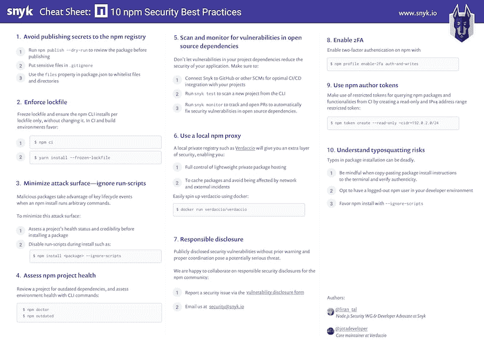

# npm 安全提示，让您远离恶意模块

> 原文：<https://dev.to/lirantal/npm-security-tips-to-keep-you-safe-of-malicious-modules-25bp>

技巧 3:通过忽略运行脚本来最小化攻击面(来自 [10 个 npm 安全最佳实践](https://snyk.io/blog/ten-npm-security-best-practices/)

npm CLI 使用程序包运行脚本。如果你曾经运行过`npm start`或`npm test`，那么你也使用过包运行脚本。

npm CLI 建立在程序包可以声明的脚本基础上，允许程序包定义在项目中安装程序包期间在特定入口点运行的脚本。

例如，这些[脚本钩子](https://docs.npmjs.com/misc/scripts)条目中的一些可能是正在被安装的包将执行的`postinstall`脚本，以便执行内务处理。

有了这种能力，不良行为者可以创建或修改软件包，在安装软件包时通过运行任意命令来执行恶意行为。

我们已经看到这种情况发生的几个案例是收集 npm 令牌的流行的 [eslint-scope](https://snyk.io/vuln/npm:eslint-scope:20180712) 事件，以及 [crossenv](https://snyk.io/vuln/npm:crossenv:20170802) 事件，以及其他 36 个滥用对 npm 注册表的域名仿冒攻击的包。

应用这些最佳实践以最大限度地减少恶意模块攻击面:

*   始终对您安装的第三方模块进行审查和尽职调查，以确认它们的健康和可靠性。

*   推迟盲目升级到新版本；在试用之前，让新的软件包版本有一段时间来传播。

*   在升级之前，请确保查看升级版本的 changelog 和发行说明。

*   安装软件包时，确保添加`--ignore-scripts`后缀以禁止第三方软件包执行任何脚本。

*   考虑将`ignore-scripts`添加到您的`.npmrc`项目文件或您的全局 npm 配置中。

-

我还在博客中介绍了一个完整的 [10 npm 安全最佳实践](https://snyk.io/blog/ten-npm-security-best-practices/),你应该在帖子中采用，其中包括一个高分辨率的可打印 PDF，如下图所示。

感谢阅读，也感谢 Verdaccio 团队的 Juan Picado 和我一起工作。

