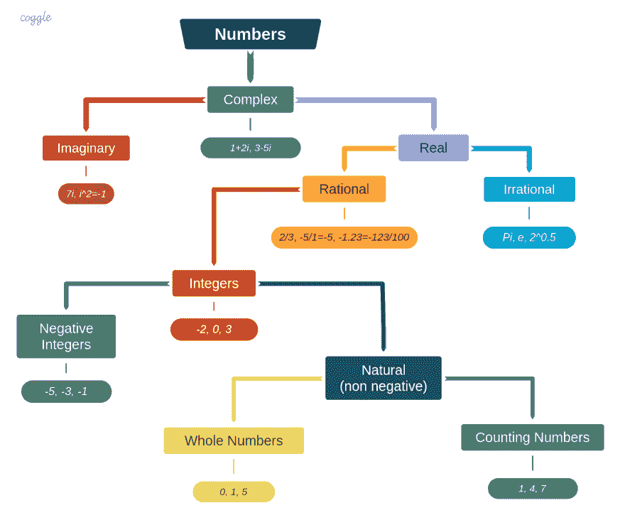

# 数字分类

> 原文：<https://dev.to/vorakl/number-classification-im6>

数学是独特的。独特的科学如果每个人都能同意它是一门科学。但是，也很难说它不是艺术。数学是绝对确定的，除了不确定的情况("[)就数学定律涉及现实而言，它们是不确定的；而且就他们确定的来说，他们指的不是现实](https://en.wikipedia.org/wiki/Mathematics#cite_note-certain-39))。仍然没有一个通用的定义，数学甚至懒得对像[数](https://www.mathsisfun.com/numbers/evolution-of-numbers.html)这样的数学基本构件发表意见。然而，数学是科学、工程和人类生活的几乎每个领域的重要组成部分。

下面是最常见且广为接受的数字分类树:

在*数学*和*计算机科学* (CS)中发现相同本质的细微差别也不奇怪:

*   **自然数**。在数学中，它们应该是*正整数* (1，2，3，...)，但在 CS 中它们是*非负整数*，其中包括零(0，1，2，3...)
*   **尾数**。在数学上，它是对数的一个*小数部分*。在 CS 中，它是浮点数的*有效数字*(因此，经常使用其他定义，如[有效数字](https://en.wikipedia.org/wiki/Significand)和系数)

就变量的取值而言，有一个非常相关的话题。在数学中，一个变量可能有两种不同的类型:[连续和离散](https://en.wikipedia.org/wiki/Continuous_or_discrete_variable):

*   当一个变量可以取无穷多个不可数的值时，它就是连续的。在非空范围内的两个值之间总是有另一个值，不管它们有多接近。
*   当非空范围内的两个值之间总是存在正的最小距离时，变量是**离散的**。数的集合是有限的或可数无限的(例如自然数)

对离散性的理解在计算机科学中至关重要，因为所有真实世界的计算机内部都只处理离散数据(这使得表示无理数变得很困难)。现有的所有可计算性理论(如[图灵论题，丘奇论题](https://en.wikipedia.org/wiki/Church%E2%80%93Turing_thesis))都是定义在离散值上的，定义域是自然数的集合。